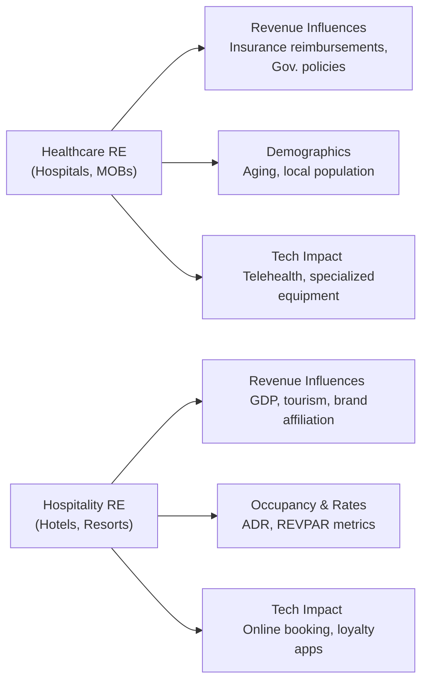

## Overview

Real estate sectors such as healthcare and hospitality come with a unique set of complexities. Sure, they’re still “real estate,” but factors like regulatory policy, demographics, brand affiliation, and reimbursement structures play outsized roles in shaping returns. I remember having a chat once with an investor who was new to healthcare real estate—they were stunned by how differently a hospital lease behaves compared to, say, a traditional office or retail lease. For better or worse, specialized sectors require specialized expertise.

This section provides a comprehensive look at healthcare and hospitality real estate, emphasizing key operating metrics, demographic and technological trends, and the unique risk-and-return characteristics that should be evaluated by both investors and analysts.

## Healthcare Real Estate

Healthcare real estate includes medical office buildings (MOBs), hospitals, outpatient centers, and senior living facilities. Demand for these properties tends to be influenced by demographic trends—let’s face it, an aging population generally means more facility usage. It’s also influenced by insurance reimbursements, government policy, and the rise of new medical technologies like telehealth.

### Market Drivers and Demographics

Perhaps the most obvious driver of healthcare real estate demand is population aging. On average, older populations need more frequent and specialized medical care, thus more dedicated medical facilities. Apart from the aging demographic, you also have to factor in evolving methods of care delivery: Some treatments have shifted from inpatient to outpatient settings, prompting more demand for specialized outpatient facilities instead of sprawling hospital campuses.

Insurance reimbursement policies, such as Medicare, Medicaid, and various private insurers, shape the revenues for healthcare providers. These policies determine how much the government or private insurer pays for each service. If reimbursements are reduced, facility operators might see lower revenues—potentially affecting their ability to pay rent or lease renewal rates.

### Medical Office Buildings (MOBs)

Medical Office Buildings (MOBs) are typically located near major hospital campuses or in close proximity to physician networks. They often boast specialized layouts designed to meet healthcare providers’ needs—imaging equipment, specialized ventilation, or integrated diagnostic labs. Lease structures for MOBs can be similar to standard office leases but may incorporate triple-net features (NNN), drawing from the idea that tenants cover operating expenses like property taxes, insurance, and maintenance. 

Because MOB tenants tend to be essential services providers, long-term occupancy rates can be stable. The big question, if you’re analyzing an MOB as an investment, is tenant credit quality: large hospital systems or established physician groups can provide strong covenants, reducing default risk.

### Hospitals

Hospitals are more capital-intensive, typically requiring large footprints and advanced infrastructure—operating rooms, emergency departments, specialized ventilation, and so forth. One tricky aspect is that many hospitals rely heavily on government reimbursements (e.g., Medicare, Medicaid). Changes in federal policy or reimbursement schedules can dramatically affect hospital margins and, by extension, rental income.

Hospitals often sign long leases—some can stretch 15 to 20 years or more—but you’ll frequently see variations of triple-net or absolute-net leases. In some cases, the hospital system may own the property outright. Investors who take positions via sale-leaseback arrangements must pay particular attention to the health system’s credit quality and any operational covenants that might affect the building’s long-term viability.

### Senior Living Facilities

Senior living properties include assisted living, independent living, and skilled nursing facilities. They can often involve 24/7 care, so operational metrics—patient volume, average length of stay (ALOS), reimbursements—take on huge importance. Because these facilities can be labor-intensive (staffing costs, specialized care, etc.), real estate operational efficiency and local demographics are critical. And yep, those triple-net lease structures aren’t uncommon, but watch for reimbursements from Medicare, Medicaid, or private sources—if they tighten, the operator can feel a squeeze that trickles down to property owners.

### Financial and Operational Metrics

Healthcare real estate valuation typically incorporates both traditional real estate metrics (like cap rates and net operating income) and healthcare-specific metrics, such as:

• Patient volume or occupancy rates (how many beds or rooms are filled).  
• Average length of stay (ALOS)—longer stays can mean more rental stability, but also higher staffing or regulatory overhead.  
• Payer mix—what percentage of a facility’s reimbursements comes from government sources vs. private insurers vs. direct patient pay?  

When analyzing a healthcare property, many investors model operational risk: if the operator can’t maintain consistent patient volumes, they might be unable to meet leasing obligations.  

### Lease Structures in Healthcare

While office space typically uses standard lease terms, healthcare real estate often embraces the triple-net lease (NNN) or full-service gross lease. With NNN, tenants pay property taxes, insurance, maintenance, utilities—basically all day-to-day operating expenses. This structure can reduce surprises for landlords but can also raise questions about how well the tenant can manage building maintenance (e.g., imagine a hospital unexpectedly skimping on building upkeep if times get tough).

In certain situations, you’ll see “master leases” spread across multiple properties, enabling a single operator to pay rent across multiple facilities. It’s convenient but can create cross-default risk—if the operator goes under, multiple properties might be affected.  

## Hospitality Real Estate

Hospitality real estate spans hotels, resorts, extended-stay properties, and other lodging facilities. If you’ve ever tried to figure out how hotel occupancy rates respond to economic trends or travel patterns, you know this can get complicated fast. Hospitality performance tends to be more cyclical than healthcare, strongly influenced by business travel, tourism, conferences, and consumer discretionary spending.

### Key Demand Drivers

Hospitality demand often tracks GDP growth and consumer confidence. In times of economic boom, business travel picks up, families feel more comfortable booking vacations, and hotels see higher occupancy. In recessions, discretionary travel is one of the first expenditures consumers cut. Also, global events—like pandemics or major sporting events—can drastically affect demand.  

In addition, brand affiliation plays a huge role in occupancy rates and pricing power. Some travelers are loyal to specific brands, whether because of loyalty programs or perceived quality. Being Marriott- or Hilton-branded might support consistent occupancy and premium room rates compared to an unknown independent property around the corner.

### Common Performance Metrics

Hospitality real estate uses a few specialized metrics:

• Occupancy Rate: The percentage of rooms occupied over a set period.  
• ADR (Average Daily Rate): Average nightly rate charged for occupied rooms.  
• REVPAR (Revenue per Available Room): Total room revenue divided by the number of available rooms.  

For instance, if a 200-room hotel generated $60,000 in room revenue on a given night, and all rooms are physically available, you’d get:  
REVPAR = $60,000 ÷ 200 rooms = $300

Some operators also track TRevPAR (Total Revenue per Available Room), factoring in ancillary income like restaurant, spa, or event revenues. Monitoring these metrics helps reveal operational efficiency, brand strength, and overall market demand.

### Cyclical Nature and Brand Affiliation

Hospitality is notoriously cyclical. Market conditions can swing from robust growth to a severe decline in less than a year if the economy sours. I recall analyzing a resort property whose REVPAR soared during a local festival, only to plummet afterward. The key for long-term investors is understanding these seasonal, cyclical factors and how to mitigate them through capital management and strategic brand partnerships.

A solid brand partnership can reduce occupancy volatility. Big labels like Marriott or Accor have established reservation systems, loyalty programs, and marketing budgets that drive traffic. Independent hotels might see higher yields when demand is strong (lower franchise fees, more personalized experiences) but can struggle during downturns because they can’t rely on brand recognition or loyalty networks.

### Operating Structures

Hotels can be owned and operated by the same entity, franchised, or managed under a management contract with a brand—the dreaded “owner-operator-manager-franchise” complexities that can produce loads of legal documents. Investors often evaluate not just the real estate asset but also the management expertise: an experienced hotel operator can make a significant difference in cost control, marketing, and brand positioning.

## Technology’s Influence on Healthcare and Hospitality

Technology is reshaping how these specialized sectors operate. In healthcare, telehealth services enable doctors to consult remotely. This could reduce patient visits to traditional medical facilities—or shift them—impacting space usage in hospitals and medical office buildings. Data analytics tools help operators run more efficiently, detect revenue opportunities, and manage supply chains.  

In hospitality, digital booking platforms—like online travel agencies or direct brand apps—have revolutionized how travelers find and book lodging. The emergence of peer-to-peer rental platforms (e.g., Airbnb) introduced new competition, forcing hotels to up their game in revenue management and guest experience. Properties with strong technology adoption (automating check-ins, offering contactless services, using advanced CRM systems) are often more resilient during turbulent times.  

## Risk Considerations and Best Practices

• Regulatory Risk: Changes in healthcare reimbursement or new travel regulations can quickly alter profitability.  
• Operator Dependence: In both healthcare and hospitality, success depends on specialized operators. Due diligence on operator track record and financial stability is critical.  
• Community Perception: Both hospitals and hotels must maintain good community relationships. A reputational hit on a hospital for poor patient care can hurt real estate valuations.  
• Economic Cycles: Hospitality is particularly vulnerable to recessions. Healthcare is more recession-resistant, but still subject to regulatory shifts.  
• Demographic Analysis: For senior housing, local demographics and supply-demand gaps matter immensely. If the region’s senior population is stable or growing, that often translates into stable demand.  
• Technological Shifts: Telehealth might reduce the need for large hospital footprints, while new booking platforms keep the hospitality industry on its toes.

A best practice is to maintain robust contingency plans. For instance, investing in a broad range of senior living property types can moderate risk, or diversifying across multiple geographies can reduce region-specific shocks.

## Putting It All Together (Mermaid Diagram)

Below is a simple overview of healthcare vs. hospitality real estate drivers:

## Conclusion

Healthcare and hospitality real estate are undeniably interesting, each with significant potential rewards—and plenty of risks. From the stability of medical office buildings to the high beta of resort hotels, these property classes offer robust avenues for portfolio diversification. Investors willing to navigate reimbursement regulations or brand partnerships can often reap the benefits of strong demand and niche expertise.  

As you dive deeper, never forget the intangible elements like community reputation (for a hospital) or guest experience (for a hotel). These specialized markets require you to step beyond typical real estate fundamentals and into the world of patient volumes, REVPAR calculations, trifling with triple-net lease structures, and everything in between.

## References

• “Healthcare Real Estate Insights” by BOMA International.  
• STR (Smith Travel Research) for hospitality data:  
  (https://str.com/)  
• National Investment Center for Seniors Housing & Care (NIC):  
  (https://info.nic.org/)  

• For further reading on mixed-use healthcare property developments, see articles in the Journal of Healthcare Real Estate.  
• For hospitality valuations, check out HVS’s research and articles on hotel feasibility analyses, brand affiliation, and REVPAR forecasting.  

---

## Test Your Knowledge: Healthcare and Hospitality Real Estate Essentials



### Which major driver distinguishes healthcare real estate from traditional office real estate?

- [ ] Economic cycles
- [x] Insurance reimbursement policies
- [ ] Corporate tax incentives
- [ ] Consumer price index (CPI) fluctuations

> **Explanation:** Healthcare real estate demand and rent payments can be significantly influenced by reimbursement policies from insurers and government healthcare programs.

### What does the term “REVPAR” represent in the hospitality industry?

- [ ] Real Estate Value Per Asset Rate
- [ ] Rent Escalation Value Per Annual Rate
- [x] Revenue per Available Room
- [ ] Room Expense Variable Allocation Rate

> **Explanation:** REVPAR stands for revenue per available room and is calculated by dividing total room revenue by the number of available rooms (over a certain period).

### Which lease structure commonly shifts property tax, insurance, and maintenance responsibilities to the healthcare tenant?

- [x] Triple-net lease (NNN)
- [ ] Double-net lease (NN)
- [ ] Gross lease
- [ ] Percentage lease

> **Explanation:** Under a triple-net lease, the tenant typically covers all operating expenses, including taxes, insurance, and maintenance, which is especially common in healthcare.

### Why is brand affiliation important for hotels?

- [ ] It always guarantees higher room rates.
- [x] It can drive occupancy and pricing power through loyalty programs and brand recognition.
- [ ] It eliminates the need for reservation systems.
- [ ] It removes the cyclical exposure active in hospitality.

> **Explanation:** A strong hospitality brand usually has robust marketing networks and loyalty programs that help capture stable demand and allow for premium pricing in competitive markets.

### What is “patient volume,” and why does it matter in healthcare real estate?

- [ ] The number of beds in a facility
- [x] The number of patients served over a period, impacting the facility’s operational revenue
- [ ] The average length of hospital stays
- [ ] The ratio of hospital staff to patient intake

> **Explanation:** Patient volume reflects the utilization of medical services. Higher patient volume can improve a facility’s revenue and capacity to maintain rent obligations.

### Which of the following statements accurately identifies a unique risk in hospitality real estate?

- [x] Hospitality revenue tends to be highly sensitive to broader economic conditions and tourism trends.
- [ ] Brand affiliations completely eliminate occupancy risk.
- [ ] Demand for hospitality real estate is independent of consumer confidence.
- [ ] Franchising agreements always guarantee stable income for property owners.

> **Explanation:** Hospitality demand and revenue are closely connected to macroeconomic conditions, tourism, and consumer confidence, making them more volatile than many other real estate sectors.

### Which factor is a critical performance metric in a senior living facility?

- [ ] REIT dividends
- [x] Average length of stay (ALOS)
- [ ] REVPAR
- [ ] Mortgage interest rates

> **Explanation:** Senior housing often tracks ALOS to understand patient turnover and revenue sustainability, which is essential for valuation and operations.

### How does telehealth potentially impact healthcare real estate demand?

- [x] It may reduce the need for certain in-person office visits, shifting usage patterns for medical facilities.
- [ ] It completely replaces the need for all hospital facilities.
- [ ] It removes the importance of healthcare operator creditworthiness.
- [ ] It standardizes all healthcare reimbursements globally.

> **Explanation:** Telehealth can reduce in-person patient visits and the required square footage for certain types of medical appointments, altering the demand for traditional medical facilities.

### Which hospitality real estate metric indicates short-term profitability and occupancy conditions in a single measure?

- [ ] ADR (Average Daily Rate)
- [x] REVPAR (Revenue per Available Room)
- [ ] CAPEX ratio
- [ ] Loan-to-value (LTV)

> **Explanation:** REVPAR captures both occupancy and average daily rate in one number, offering a quick, powerful snapshot of a hotel’s performance.

### True or False: One advantage of a triple-net lease is that it limits the landlord’s exposure to operating expense fluctuations.

- [x] True
- [ ] False

> **Explanation:** Under a triple-net lease, the tenant covers property taxes, insurance, and maintenance, reducing the landlord’s exposure to those operating expenses.


