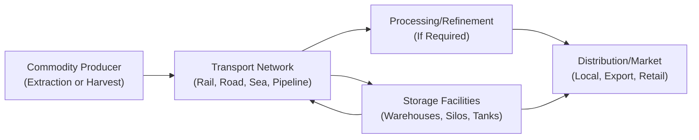

## Overview and Context

Storage and transport economics might sound like dry logistics, but, believe me, they're anything but. If you’re an investor in commodities—or even just curious about how raw materials get from “Point A” to “Point B”—you’ll quickly see how these factors can make or break the profitability of a trade. I remember one time I was chatting with a friend who manages a small grain operation in the Midwest. She told me that the biggest shock for her new employees wasn’t the unpredictable weather or even the commodity price swings, but the costs of storing harvested grain safely. Spoilage, insurance, and fumigation—yikes!—they all add up fast. The difference between a tidy profit and a disappointing net return often pivots on the economics of storage and transport.

In commodity markets, understanding these logistics is crucial. Storage and transport costs shape the term structure of futures (contango vs. backwardation), influence demand patterns, and, yep, can create opportunities for arbitrage. So let’s dive in.

## The Costs of Storage

### The Impact on Profitability

Storage is never free. Whether you’re storing barrels of crude oil or bales of hay, costs such as warehousing fees, electricity for temperature control, and insurance premiums can quietly erode margins. For financial professionals, a deeper look at these storage expenses can reveal how they affect futures pricing. In commodity markets, a common pricing model for futures is:


F_0 = S_0 \times e^{(r + u - c)T}


• \\( F_0 \\) is the futures price at time 0.  
• \\( S_0 \\) is the current spot price.  
• \\( r \\) is the risk-free rate.  
• \\( u \\) represents storage and other carrying costs.  
• \\( c \\) could capture convenience yield or any beneficial aspect of immediate ownership.  
• \\( T \\) is time to maturity.

When \\( u \\) (storage and carrying costs) goes up, futures prices often rise relative to spot prices, potentially producing a contango market. Contango is simply a fancy term for when the futures price is higher than the spot price, suggesting that it’s more expensive to buy commodity exposure in the future than it is now—at least partially because of these added costs.

Backwardation, on the other hand, occurs when the futures price is below the spot price. This condition often hints that holders of the physical commodity receive some benefit—or “convenience yield”—that offsets storage.

### Warehousing, Insurance, and Spoilage

• Warehousing: Think about renting a massive, climate-controlled building. For some commodities like cocoa beans or coffee, controlling temperature and humidity is key to maintaining quality.  
• Insurance: Commodities can be stolen, damaged, or spoiled, so insurance is typically mandatory. Premiums vary by location and risk profile.  
• Spoilage: Perishability is a real risk. Grains might get moldy, fruits rot, and metals can corrode (though typically slower). Spoilage can exert sudden downward pressure on returns if you’re not careful, especially for large positions held too long.

#### Example: A Coffee Bean Dilemma

Imagine a coffee merchant who has just harvested beans in a tropical climate. If these beans are not dried and stored properly, they can develop mold (which is a big no-no for coffee quality). Insurance might not even cover mold if it’s caused by negligence. When the merchant invests in top-tier, climate-controlled facilities, higher storage costs eat into margin. But those costs may pay off if premium-quality beans command a better price in the market.

## Transportation Logistics

### Modes of Transport

Rail, truck, ship, pipeline—each has its own cost structure and speed:

• Trucking is flexible but can be pricey for long hauls.  
• Rail can move large volumes more cheaply over land if the infrastructure is in place.  
• Maritime shipping is cost-effective for massive bulk shipments but is slower and has port fees.  
• Pipelines, primarily used for liquids or gases (like oil or natural gas), feature high fixed costs but can be very efficient once established.

#### Delivery Schedules and Time-to-Market

Guess what? If you’re shipping fresh produce overseas, speed is your best friend. Delays can make the product unsellable upon arrival. Demurrage charges (fees for exceeding agreed-upon loading/unloading times) and scheduling mishaps can quickly add up. This is why many agribusinesses rely on Just-in-Time (JIT) inventory strategies: they don’t want to pay for big warehouses or let fresh goods spoil while waiting for trucks that never show up on time.

### Geographic Considerations and Arbitrage

Transportation infrastructure isn’t the same everywhere. Some regions have stellar roads and well-connected railways, while others do not. If you can ship your product cheaply from a location with favorable infrastructure to a region that lacks local supply, you might find an arbitrage opportunity—buying low in one place and selling high in another.

Occasionally, though, extreme weather or political conflicts can disrupt these routes. In these scenarios, the cost of shipping might spike, or shipments could be delayed. Timing is everything. Miss a narrow demand window (like a seasonal event), and you lose out on premium prices.

## Supply Chain Bottlenecks

Supply chain bottlenecks are dreaded by commodity traders and producers alike. A bottleneck occurs whenever a stage in the production or distribution chain can’t process materials fast enough to meet demand. I recall how a labor strike at a major port once disrupted the flow of imported metals so severely that manufacturers had to pay a premium for materials from alternate suppliers.

### Potential Losses and Missed Opportunities

• Rising Costs: Steep backlog fees or overtime costs to catch up.  
• Perishable Commodities: Wasted goods if shipping is delayed too long.  
• Market Windows: In some industries, any hold-up can mean you miss the peak selling season altogether.

## Environmental and Regulatory Components

### Hazardous Materials and Strategic Reserves

Storing hazards—like crude oil, chemicals, or nuclear materials—comes with stringent regulations. Facilities must meet safety standards, including leak-proof containment and ventilation to prevent disasters. Meanwhile, governments often hold strategic reserves of critical commodities (such as oil) to stabilize markets in times of crisis. The processes for storing these reserves also require specialized facilities that comply with environmental laws.

### Sustainability and Community Impact

As environmental, social, and governance (ESG) guidelines become more influential, storage facilities must also consider their environmental footprint. Whether it’s carbon emissions from cooling systems or potential soil contamination, companies face mounting pressure—and sometimes regulatory requirements—to implement greener, more transparent practices.

## Seasonality and Storage Decisions

Commodities like grains, fruits, and vegetables obviously have harvest cycles. When output peaks, prices might drop unless there’s sufficient storage to spread supply over months. Alternatively, in the energy sector, winter heating demand can elevate natural gas prices, making off-season storage a potential profit center for those prepared to store gas during warmer months and sell when winter demand spikes.

Timing is everything here: store too long and watch quality degrade; sell too soon, and you might not capture peak seasonal pricing. A balanced approach, especially using dynamic hedging with futures or options, often works best.

## Risk Management Strategies

### Options, Insurance, and Hedging

• Purchasing Options: If storage durations are uncertain or you’re worried about price collapses, options can provide downside protection.  
• Insurance Coverage: Insuring stored commodities against fire, burglary, or spoilage can protect your bottom line.  
• Hedging with Futures: Many producers hedge expected storage durations by entering futures contracts to lock in selling prices.

### Operational Safety Nets

With certain commodities—like livestock feed—stockouts can have ripple effects (livestock might starve if feed doesn’t arrive on time). So, these operators often keep a minimum safety stock in firm storage, ensuring no catastrophic disruption.

## Technological Innovations

### IoT Sensors, GPS Tracking, and Real-Time Data

Think about a fleet of trucks with IoT sensors that continuously track temperature, humidity, and location. This used to be somewhat futuristic, but now it’s fairly common. Real-time communication helps managers optimize routes, minimize energy use, and reduce the risk of spoilage during transit. As a result, you can significantly streamline the entire supply chain.

### Automation and Robotics

Automated warehouse systems can stack or retrieve goods more efficiently than manual labor, reducing errors in large-scale storage operations. Some pioneering facilities even use drones for inventory checks—quickly scanning barcodes or RFID tags in massive warehouses.

## Best Practices and Pitfalls

• Diversify Storage Facilities: Don’t rely on a single location. Geography matters, and splitting shipments can mitigate regional disruptions.  
• Monitor Local Infrastructure: Costs and time delays can skyrocket without well-maintained roads or rails.  
• Factor in Seasonality: Use futures or options to manage price volatility around harvest or demand cycles.  
• Invest in Tech: Real-time data tracking pays off in reduced spoilage, fewer route mistakes, and simpler compliance.  
• Manage Environmental Risks: Adhere to local regulations for hazardous materials and ensure robust contingency plans.  

## Diagrams: A Look at the Commodity Journey

Below is a simple visual representation of a commodity’s path from production to market, highlighting storage and transport steps:

Notice how storage (C) may occur multiple times in the chain, allowing producers to choose the best moment to sell.

## Putting It All Together

Personally, I’ve seen that the best commodity traders always keep an eye on logistics. They know exactly how many days it takes for a freight train to move a given volume of crops from a remote farm to a shipping port. They’ll pay for an upgrade in storage facilities if it means preserving quality and capturing higher prices. And you know what? That’s the difference between an amateur guess and a well-strategized approach.

For exam purposes—especially in the context of Alternative Investments—storage and transport economics can appear in scenario-based questions about futures pricing, risk management, or supply chain disruptions. Practically, it’s about connecting the dots: from the physical realities of bulky commodities to spreadsheet line-items that show up in cost of carry or net margin.

## Exam Tips

• Be prepared to discuss how high storage costs lead to contango or vice versa.  
• Understand the operational side of commodity trading—especially how demurrage fees or shipping delays affect net returns.  
• Keep in mind how macroeconomic forces (like oil supply shocks) can change the transportation routes or infrastructure viability.  
• Expect potential questions linking environmental regulations to facility planning and strategic reserves.  
• Practice scenario-based calculations: “If the local warehouse is at capacity, how does that change the feasible delivery timeline and total cost?”

## Glossary

• **Contango:** A market condition where futures prices are higher than the spot price.  
• **Backwardation:** A market condition where futures prices are lower than the spot price.  
• **Demurrage:** Charges incurred when a shipment is delayed beyond the agreed time for loading or unloading.  
• **Just-in-Time (JIT) Inventory:** A strategy where raw materials and goods arrive exactly when needed, reducing storage costs.  
• **Supply Chain Bottleneck:** A point of congestion in production or distribution that can delay processes.

## References and Further Reading

- Geman, H. (2005). Commodities and Commodity Derivatives: Modeling and Pricing for Agriculturals, Metals and Energy. Wiley.  
- Pirrong, C. (2018). “The Economics of Commodity Trading and Transport.” Journal of Commodity Markets.  
- CFA Institute. (2023). “Reading on Commodities and Commodity Derivatives.” CFA Program Curriculum.  

---

## Test Your Knowledge of Commodity Storage and Transport Economics



### Which factor most directly raises the futures price in a cost-of-carry model?

- [ ] Lower risk-free interest rate.
- [x] Higher storage costs.
- [ ] Improved technology in transportation.
- [ ] Decreased convenience yield.

> **Explanation:** In a cost-of-carry model, higher storage costs (u) contribute directly to a higher futures price compared to the spot price.  

### What is a primary reason that perishable goods require rapid transport?

- [x] Delays could lead to product spoilage and losses.
- [ ] Just-in-Time inventory carries no additional cost.
- [ ] Insurance does not cover damaged goods.
- [ ] They do not require climate-controlled storage.

> **Explanation:** Perishable goods spoil easily, so quick transport is crucial to preserve product value.  

### Which term describes when the futures price is lower than the spot price?

- [ ] Contango
- [x] Backwardation
- [ ] Demurrage
- [ ] Arbitrage

> **Explanation:** Backwardation occurs when the futures price is below the current spot price, often implying a convenience yield or higher short-term demand.  

### How do supply chain bottlenecks generally impact commodity investors?

- [ ] They eliminate the need for storage.
- [ ] They always create potential for arbitrage profits.
- [x] They can increase costs and create potential missed opportunities.
- [ ] They only affect physical producers, not financial investors.

> **Explanation:** Bottlenecks can drive up transportation costs, spoil perishable goods, and cause investors to miss optimal market windows.  

### Which of the following is an example of a risk management strategy to handle storage costs?

- [x] Purchasing options on commodities to protect against price volatility.
- [ ] Eliminating all delivery checkpoints in the supply chain.
- [x] Obtaining insurance on stored commodities.
- [ ] Avoiding any long-term contract agreements.

> **Explanation:** Commodity options can hedge price risk, and insurance policies protect against damage/spoilage events, helping manage the financial risks of storage.  

### What is demurrage?

- [x] A charge incurred for exceeding the agreed loading or unloading time.
- [ ] A fee for storing hazardous materials.
- [ ] A penalty for storing goods beyond their expiry date.
- [ ] A special tax imposed on imported commodities.

> **Explanation:** Demurrage specifically refers to extra charges levied when shipments are delayed beyond allotted times at loading/unloading terminals.  

### What best describes a Just-in-Time (JIT) inventory system?

- [x] Inventory arriving exactly when needed, minimizing storage costs.
- [ ] Maintaining six months’ worth of inventory.
- [x] Eliminating all freight costs.
- [ ] A strategic reserve of critical commodities.

> **Explanation:** JIT involves scheduling deliveries so that materials arrive nearly exactly when production or sale requires them, reducing warehousing overhead.  

### Which factor would most likely result in arbitrage opportunities across different regions?

- [x] Disparities in transportation infrastructure and costs.
- [ ] Fixed global shipping rates.
- [ ] Uniform commodity taxes worldwide.
- [ ] Similar climate conditions in major production zones.

> **Explanation:** Poor or inconsistent transportation infrastructure and varying costs create price differentials, opening possible arbitrage scenarios.  

### What is a strategic reserve?

- [x] A government or large institutional stockpile of a critical commodity for emergency use.
- [ ] A short-term hedge fund strategy for precious metals.
- [ ] A fee for demurrage that leads to higher stored goods.
- [ ] Financial instruments used only for farmland expansions.

> **Explanation:** Governments or large institutions maintain strategic reserves of commodities like oil or grain to stabilize markets or handle emergencies.  

### True or False: Automated warehouse systems and IoT sensors can significantly reduce spoilage risk.

- [x] True
- [ ] False

> **Explanation:** Automation and real-time monitoring technology can help detect temperature/humidity fluctuations and optimize inventory levels, thereby reducing spoilage.  


