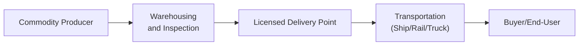

## Introduction

Physical delivery in commodity trading can be, well, a journey. I mean, after all these years of hearing about “paper barrels” of oil or “virtual bushels” of wheat, it can be easy to forget that many futures contracts still allow for the actual handover of real stuff—oil, gold bars, soybeans, you name it. This transformation from a standardized contract into actual goods is often the final link in a complex supply chain. In this article, we’ll delve into everything from designated warehouses to shipping brokers to the joys (and “gotchas”) of verifying commodity quality. We’ll also talk about how supply chain disruptions—like strikes, port closures, or, heaven forbid, a ship blocking a major canal—can cause major price volatility. So buckle up and let’s get to it.

## Commodity Futures and Physical Delivery Basics

In commodity markets, buyers and sellers can choose to settle contracts financially (by closing out or rolling forward a position) or by taking (or making) physical delivery. The motivation behind actual delivery can vary:

• Some hedgers want the raw input for processing (e.g., a wheat miller needs the grain).  
• Others prefer to profit from selling physical goods to end-users in a different region.  
• In some niche scenarios, market participants see arbitrage opportunities if local spot prices exceed delivery costs.

We often see physical delivery for agricultural products (like corn, soybeans, wheat) or energy commodities (like crude oil or natural gas). When delivery is part of the plan, logistical concerns become front-and-center: Where will the commodity be stored? How is it transported? Who checks the quality?

## Licensed Delivery Points and Storage Facilities

Commodities that require physical delivery must be moved to (or from) licensed delivery points. These are locations—warehouses, storage tanks, or other facilities—that meet exchange standards. Recognized licensed delivery points ensure consistent quality control, custody, and inventory management. For instance, the London Metal Exchange (LME) has an extensive global network of approved warehouses, and each has certain shipping and handling requirements.

Understanding licensed delivery points:

• They are exchange-approved: This ensures standardization of storage practices and documentation.  
• They maintain grading and inspection protocols: Commodities must meet specifications like minimum purity for metals or moisture levels for crops.  
• They unify dispute resolution: If a grading dispute arises, official guidelines determine the final verdict, reducing legal gray areas.

### Storage Challenges

Storage is rarely as simple as renting a big shed. Certain commodities require specialized conditions. Crude oil, for instance, typically sits in tank farms designed to minimize evaporation and contamination. Agricultural products might need climate-controlled silos or fumigation to deter pests. If you’ve ever come across musty grain, you know exactly how storage issues can translate into losses.  

## Operational Requirements: Transport, Quality Checks, and Documentation

Actually shipping physical commodities involves quite a few operational steps. Let’s walk through a typical scenario:

1. Transportation Setup:  
   • Identify shipping modes: Could be rail, trucking, or maritime transport—depending on distance, cost, and infrastructure.  
   • Arrange insurance: Freight insurance coverage is nearly always mandatory, especially for valuable commodities like precious metals.  

2. Quality Testing:  
   • Third-party inspectors: For many globally traded commodities, independent inspectors verify everything from purity to weight.  
   • Official sampling: Exchanges might require official sampling procedures (like “bucket” sampling for grains) verified by a licensed agency.

3. Documentation:  
   • Bills of lading: Acts as a receipt of shipment, confirming which goods got onto the vessel.  
   • Certificates of origin: Verifies the source of the goods (often crucial for tariff or phytosanitary reasons).  
   • Warehouse receipts: Proves you actually own the goods in a specific location.  

A personal story? Sure—during my time working with a small commodity trading firm, we once forgot to update a phytosanitary certificate for a shipment of soybeans. The beans got held up in port for weeks, costing us thousands in demurrage (that’s the fancy word for extra storage/parking fees). It’s a lesson you only want to learn once.

## Supply Chain Interruptions and Price Volatility

Maybe you remember how West Coast port strikes or cargo ship incidents can send ripples through global commodity markets. Supply chain interruptions come in many flavors:

• Labor strikes at key ports: Delays and backlogged shipments raise local commodity prices.  
• Natural disasters: Hurricanes can shut down entire shipping lanes, or flooding can devastate farmland.  
• Geopolitical risk: War zones or regional conflicts can block crucial trade routes, impacting everything from crude oil flows to grain exports.  

When a disruption occurs in a region that supplies a significant share of a particular commodity, prices can spike fast. Conversely, areas reliant on inbound deliveries risk shortages and inflated local commodity costs. Planning for these uncertainties—like arranging alternative cargo routes or locking in freight contracts early—helps reduce the operational and financial shock.

## Trade Finance: Facilitating Smooth Shipments

Trade finance is essential for bridging the trust gap between buyers and sellers. Typically, an exporter doesn’t want to ship commodities without guarantees of prompt payment, and an importer doesn’t want to pay upfront in case the goods arrive late or damaged. Tools like letters of credit (LCs) reduce these frictions. An LC ensures payment will be made to the exporter as long as they present the required shipping and quality documentation to a bank.

### Letters of Credit Step-by-Step

Let’s do a brief walk-through:

• Buyer’s bank issues an LC stating conditions (e.g., shipping date, product grade).  
• Seller ships goods and gathers relevant docs: Bill of lading, inspection certificate, insurance, etc.  
• Seller’s bank verifies the docs, ensuring strict compliance with the LC.  
• Payment is triggered once the financial institution is satisfied all conditions are met.

This process can sometimes feel bureaucratic (I recall the phrase “please do it in triplicate”), but it drastically reduces default risk and fosters global trade in commodities that might otherwise be too risky.

## Technology for Traceability and Fraud Reduction

When you have huge volumes of commodities traveling thousands of miles, verifying authenticity can be a headache. Historically, we’ve relied on paperwork. But guess what? Paper can be lost, forged, or tampered with. Enter new technology solutions:

• RFID Tags: Tiny radio-frequency chips attached to commodity shipments or packaging. They track location in real time and can store relevant data (origin, owner, batch number).  
• Blockchain Platforms: By recording each step of a commodity’s journey on an immutable ledger, fraud becomes more difficult—any suspicious activity is flagged the moment a record doesn’t match.  

Picture a global coffee supply chain, where each bag of coffee beans gets tagged with a scannable sensor at origin. As it moves from farm to warehouse to ship to roaster, each transaction is validated by multiple nodes on the blockchain. When the beans finally arrive, the roaster can confirm details on freshness, origin, and chain of custody. Consumers, for their part, can pay a premium if they trust the verified data on sustainable and fair-trade practices.  

## Freight Forwarders and Shipping Brokers

So how do large commodity traders coordinate all this shipping madness? Often by relying on freight forwarders or shipping brokers. These folks orchestrate:

• Freight capacity: They find the right vessel or shipping container at a fair price.  
• Customs paperwork: If you’ve ever tried to handle cross-border compliance solo, you know how complicated it can be.  
• Cargo tracking: They use specialized software (plus a healthy dose of phone calls) to keep tabs on shipments.  

The difference between a freight forwarder and a shipping broker can be subtle. Freight forwarders often handle the full range of logistics services, from packing to final delivery. Brokers might focus more narrowly on negotiating rates with carriers. Either way, forging a relationship with a reliable partner can streamline operations—especially when something unexpected happens, like a major route closure.

## Scenario Planning for Disruptions

In supply chain risk management, folks love to talk about “Plan B”—but in commodities, sometimes you need Plan C, D, and E, too. Contingency planning might entail:

• Multiple shipping routes: For example, if your typical route from Asia to Europe via the Suez Canal is blocked, you switch to the Cape of Good Hope—though shipping costs and transit times will surge.  
• Alternative suppliers: If your top supplier of cocoa beans is in a politically volatile region, having an alternate supply in a more stable country can mitigate risk.  
• Forward contracts for freight: Locking in shipping rates can help if you anticipate price surges for containers or tanker capacity during peak demand periods.

## Regulatory Considerations

Physical deliveries often cross borders, which means compliance with a litany of regulations:

• Sanitary and Phytosanitary Measures: Agriculture shipments in particular must meet biosecurity standards. Countries want to block invasive pests, diseases, or pathogens.  
• Customs duties and tariffs: Commodity classification codes can affect the duty rate. Misclassification might lead to penalties or shipment confiscation.  
• Environmental regulations: Some commodities, like timber, require proof they were sustainably harvested to comply with norms (e.g., the Lacey Act in the U.S.).  

Keeping track of global regulations can be a job in itself—it’s one reason large commodity houses maintain entire compliance departments.

## Common Pitfalls, Best Practices, and Real-World Examples

• Pitfall 1: Underestimating Political Risk  
  For instance, cocoa shipments from West Africa might encounter disruptions if local port authorities strike. Best practice is to maintain a wide network of potential shipping routes and have an emergency stockpile.

• Pitfall 2: Failing to Confirm Quality Clauses  
  Miscommunication on grade specifications can lead to rejections. Always get third-party verification and ensure the documentation sets the entire transaction up for success.

• Pitfall 3: Lack of Real-Time Monitoring  
  Without sophisticated tracking, you might not learn about a delayed shipment in time to mitigate downstream issues. Whether it’s an RFID system or a well-staffed ops team, real-time data is crucial.

### Case Study: The 2020 Negative Oil Price Event

Many market participants remember the frenzy in April 2020 when WTI crude oil prices briefly went negative. Part of the problem? With demand collapsing, onshore storage in Cushing, Oklahoma, became scarce. Traders stuck with expiring futures either had to find space in a tank (almost impossible) or sell at any price—even below zero. This fiasco underscores that physical delivery is no joke: if you can’t store or move the stuff, you risk catastrophic losses.

## Diagram: Simplified Commodity Supply Chain

Below is a Mermaid diagram illustrating the basic flow:

• Commodity Producer: Farms, mines, oil wells.  
• Warehousing and Inspection: Pre-delivery testing and storage.  
• Licensed Delivery Point: Official checkpoint for futures settlement.  
• Transportation: Bulk shipping to the buyer’s region.  
• Buyer/End-User: Consumes or processes the commodity.

## Conclusion and Exam Tips

If you’re preparing for the CFA exam—and you’re tackling an item set about physical deliveries—keep a few ideas front-of-mind:

• Understand the relationship between a futures price and the cost of carry. Even if the exam question is about logistics, examiners often test how storage and transportation costs factor into pricing.  
• Know the role of trade finance. Letters of credit, for example, can appear in vignettes describing how importers secure commodity shipments.  
• Be ready for scenario-based questions. The exam might ask how a rumored port strike affects your hedging position or how you’d adapt your supply chain routes.  
• Manage time on essays. If you see a multi-part question about supply chain risk management, a well-structured short answer referencing contingency planning can earn partial credit, even if you don’t recall every detail.  

The key is to demonstrate you can connect logistics, operational risk, and price formation in commodity markets. Good luck!

## Glossary

• Licensed Delivery Point: Approved location where futures contracts can be settled by physical delivery of commodities.  
• RFID Tag: A radio-frequency identification system used for tracking goods through the supply chain.  
• Trade Finance: Banking services (e.g., letters of credit, export credit) supporting international trade.  
• Phytosanitary Measures: Quarantine and biosecurity steps required to prevent the spread of pests or diseases in agriculture.

## References and Further Reading

• Rodrigue, J. (2020). The Geography of Transport Systems (5th ed.). Routledge.  
• Logistics Management Magazine. (Various issues). “Supply Chain Insights and Innovations.”  
• CFA Institute. (2023). “Global Supply Chain Management Tools and Techniques.” CFA Program Curriculum.

## Test Your Knowledge: Physical Delivery Logistics & Supply Chain Quiz



### Which of the following best describes a licensed delivery point in commodity futures?
- [ ] A remote production site where commodities are extracted at the source
- [ ] A major retail distribution center for end consumers 
- [x] An exchange-approved location for settling futures contracts via physical delivery
- [ ] An offshore holding facility that is exempt from tariffs

> **Explanation:** A licensed delivery point is an approved facility (e.g., warehouse, tank farm) where physical delivery for a specific futures contract can occur, ensuring standardized procedures and quality controls.

### What is one primary benefit of using trade finance tools, such as letters of credit?
- [ ] Minimizes transportation costs by securing discount freight rates
- [x] Reduces payment risk between buyers and sellers in international transactions
- [ ] Replaces aggregate stop-loss orders in commodity trading
- [ ] Eliminates the need for customs documentation in cross-border shipments

> **Explanation:** Trade finance products (e.g., letters of credit) protect both exporters and importers by ensuring payment is made only after documented shipping conditions are met.

### In which scenario would real-time RFID tracking be most beneficial?
- [ ] When commodities are stored in a single on-site location
- [x] When high-value commodities are shipped across multiple borders with risk of theft or loss
- [ ] When the market is exclusively domestic and the distance between buyer and seller is negligible
- [ ] When local regulation prohibits any form of product tagging

> **Explanation:** RFID technology provides real-time location and status data, making it particularly useful for monitoring high-value or sensitive shipments traveling long distances.

### Which factor often sparks abrupt price spikes in commodities due to constrained supply?
- [ ] Minor changes in labeling requirements
- [ ] Steady labor conditions at major ports 
- [x] Geopolitical conflicts or major strikes disrupting supply chains
- [ ] Seasonal transitions in farmland temperature

> **Explanation:** Sudden supply chain disruptions—like labor strikes or geopolitical issues—create immediate shortages in certain markets, leading to abrupt price surges.

### If an importer purchases a large quantity of corn via a futures contract and chooses physical delivery, which step is typically required?
- [x] Arranging a licensed warehouse facility for receipt
- [ ] Hiring only local trucking firms with no external oversight
- [x] Obtaining relevant quality inspection certificates
- [ ] Waiving all legal claims regarding product origins

> **Explanation:** The importer should secure a licensed warehouse at delivery, obtain official quality inspection documents, and perform other legal and logistical steps to complete physical settlement.

### How do sanitary and phytosanitary measures most directly affect agricultural commodity shipments?
- [x] They establish health and safety standards to prevent spread of pests or diseases
- [ ] They are taxes levied on cross-border commodity transfers
- [ ] They encourage swapping commodities among licensed investors
- [ ] They allow immediate customs clearance without inspection

> **Explanation:** These measures aim to protect ecosystems and human health by setting standards for imports of agricultural and food products, ensuring pests and diseases don’t spread.

### Which of the following would NOT be a primary service performed by freight forwarders?
- [x] Setting prices in the commodity futures market
- [ ] Managing customs documentation for international shipments
- [x] Negotiating carrier rates for bulk shipments
- [ ] Coordinating trucking and final-mile delivery

> **Explanation:** While freight forwarders coordinate logistical issues, customs documents, and shipments, they do not set commodity futures prices—exchanges and market forces drive pricing.

### Which of the following technologies aids in preventing tampering or misrepresentation of commodity storage records?
- [ ] Standard email confirmations
- [ ] Basic spreadsheets shared among trading partners
- [ ] Traditional paper ledgers
- [x] Blockchain-based transaction ledgers

> **Explanation:** Blockchain technology can create an immutable, transparent record of each step in the supply chain, reducing fraud tied to paper-based processes.

### A global steel producer is worried about a potential closure of its main shipping route. Which best practice helps mitigate that risk?
- [ ] Storing all steel in unlicensed facilities the moment a strike is rumored
- [x] Developing alternative shipping lanes and maintaining relationships with multiple carriers
- [ ] Cancelling all shipments to waiting clients until the route reopens
- [ ] Publicly disclosing shipping delays without seeking solutions

> **Explanation:** Diversifying routes and carriers helps manage unforeseen route closures or port shutdowns, ensuring minimal disruption to deliveries.

### True or False: Supply chain disruptions only impact the commodity’s local spot price with no effect on global futures markets.
- [x] True
- [ ] False

> **Explanation:** Tricky! This statement is actually false in reality, but the question is structured to check if you recognize that disruptions do influence global markets. Supply chain disruptions can indeed ripple into global futures prices when international participants perceive reduced supply or heightened risk. So the correct label for the statement is "False."  


