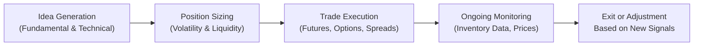

## Introduction
Commodity trading can sometimes feel like the wild west—volatile market movements, massive global influences, and a dash of speculation. But don’t let that intimidate you. Whether you’re into gold’s safe-haven appeal or the industrial might of copper, there’s a structured way to navigate the ups and downs. This article offers a deep dive into metals and energy trading strategies, highlighting key drivers such as global demand, production decisions by influential organizations like OPEC, and even the emotional side of precious metal investing. We’ll also explore how crack spreads (the difference between crude oil input costs and refined product prices) can be a goldmine—no pun intended—for energy-focused traders. By blending fundamental analysis with technical indicators, you can optimize entry and exit points for your commodity positions. So, let’s jump in.

## Key Commodity Distinctions Between Base and Precious Metals
Metals are often grouped into two main categories: base metals and precious metals. Although they both trade on global exchanges, their market drivers can differ significantly.

### Base Metals
Copper, aluminum, and other base metals typically have widespread industrial applications. Copper’s use in electrical wiring alone is enormous, and aluminum is found in everything from beverage cans to aircraft. Because base metals are heavily linked to manufacturing and infrastructure growth, their demand moves closely with the global economic cycle. For instance, when you see industrial production pick up in China, you’ll often see a corresponding uptick in copper prices. In my early days, I liked to watch monthly industrial production data as a quick clue about copper’s short-term trend. That said, I learned to keep an eye on new smelting projects or major discoveries—more supply can cap price rallies.

### Precious Metals
Gold and silver often get the spotlight, partly because gold is seen as a safe haven. Investors flock to gold when economic uncertainty rises, or when they fear inflation is about to bite. Silver, while also considered precious, has a more pronounced industrial usage in electronics and solar panels. Because of that mix, silver can sometimes behave like a hybrid—tied to both economic cycles and safe-haven sentiment. The emotional and hedging demand for precious metals can create bursts of volatility, especially when investor sentiment shifts on macro or geopolitical news. Remember 2008–2009 or the recent health crises? Gold prices often soared during times of crisis, mostly due to fear-driven buying.

## Energy Market Nuances
Energy markets—especially crude oil and natural gas—are influenced by a unique mix of geopolitics, weather patterns, and production decisions by powerful organizations like OPEC.

• Crude Oil: We’ve all heard about OPEC “cutting” or “increasing” production. These decisions can ripple through global supply and push prices up or down. On top of that, regional conflicts or geopolitical tensions in major oil-exporting countries can cause sudden price shocks.  
• Natural Gas: Because natural gas distribution is tied to pipeline networks and storage facilities, regional pricing can vary a lot. If a harsh winter hits, local inventories might plunge, causing a price spike. When storage or pipeline capacity is limited, prices can spike even more quickly.

In practice, many professional traders watch inventory data, such as the U.S. Energy Information Administration (EIA) weekly reports, to gauge supply-demand balances. A surprise build or drawdown in inventories can lead to swift price corrections.

## The Role of Crack Spreads and Refining Margins
Energy markets differ from metals in that crude oil itself is rarely the final consumer product. Refining transforms crude into gasoline, diesel, and other goods. The difference between crude oil prices and the selling price of refined products is known as the crack spread. For example:


\text{Crack Spread} = \Bigl(\frac{\text{Price of Gasoline}}{\text{barrel}}\Bigr) + \Bigl(\frac{\text{Price of Distillate}}{\text{barrel}}\Bigr) - \Bigl(\frac{\text{Price of Crude Oil}}{\text{barrel}}\Bigr).


Crack spreads can guide you in deciding whether refiners (who buy crude and sell refined products) will be making healthy profits. A widening crack spread suggests refining margins are expanding, which might encourage refiners to produce more. Sometimes, traders use crack spread futures or options to directly speculate on the profitability of refining. That can be particularly interesting during times of shifting consumer demand—say, a spike in diesel usage or a big jump in jet fuel consumption.

## Arbitrage Opportunities in Commodity Trading
Arbitrage can be especially appealing in commodities because of differences in exchange rules, local supply constraints, or regulatory environments.

• Geographic Arbitrage: The London Metal Exchange (LME) and the Shanghai Futures Exchange (SHFE) might show slightly different copper prices due to freight, tariffs, or local demand shifts. Sophisticated traders can buy metal cheaply in one market and deliver into another, profiting from price disparities—minus transportation and storage costs.  
• Time/Storage Arbitrage: If you can store a commodity cheaply, you might buy it in periods of low spot prices and sell futures if the market is in contango (futures priced higher than spot). Precious metals like gold are relatively simpler to store compared to heavier, bulkier commodities like aluminum—although the security costs for gold can be hefty.

Local taxes, cross-border regulations, and shipping complexities can all add friction. But if you do your homework, you’ll notice that sometimes these inefficiencies leave a nice arbitrage spread on the table.

## Combining Fundamental and Technical Analysis
Let’s say you’re keen to start actively trading metals. One approach is to blend fundamental data—like production reports, import/export flows, and macroeconomic growth trends—with technical indicators, such as moving averages or oscillators (like RSI or MACD). Here’s how it often unfolds:

• Fundamentals for Direction: You begin by assessing global GDP trends, industrial production, and supply dynamics (like new mining capacity). If fundamentals indicate a looming copper shortage, you may well adopt a bullish stance.  
• Technicals for Timing: You might wait for a “breakout” above a certain moving average to confirm a price upswing. Or you might use momentum indicators to see if the market is overbought or oversold. Technical signals can help refine your entry or exit.  

Some traders overlay seasonal factors. For example, energy usage might spike in winter if it’s a cold season, pushing up natural gas prices. The trick is to avoid “analysis paralysis”—where you get stuck with too many indicators. You want a balanced, repeatable process that captures the main drivers.

## Storage and Inventory Constraints
Storage capacity matters greatly, especially in energy and certain base metals. Unlike gold, which has a high value-to-weight ratio and can be stored for decades without degrading, natural gas must be injected into specialized facilities. If those facilities are near capacity, further production surpluses can cause prices to plummet. Aluminum storage, though arguably simpler, may still require factoring in warehousing and insurance costs. Understanding these constraints can help you anticipate potential supply gluts or bottlenecks, driving short-term price movements.

## The Investor Sentiment Factor
You can’t talk about commodity trading—particularly precious metals—without highlighting investor sentiment. Even though gold serves industrial demand for electronics and jewelry, a large chunk of gold’s price is driven by sentiment around inflation, currency stability, and safe-haven flows. If retail investors and large funds suddenly rush to gold futures or ETFs, the price can surge well above what fundamentals alone might justify. Sometimes, that’s a profitable ride. But watch out: Sentiment can shift quickly. This is where prudent position sizing and stop-loss orders can help manage risk.

## Strategy Construction and Risk Management
Building a diversified commodity portfolio often involves layering positions across different market segments. One strategy is to combine a bullish stance on, say, copper or aluminum—driven by strong industrial demand—with a hedging or bearish stance in precious metals if you anticipate reduced safe-haven flows. In energy, you might take a spread strategy on crude oil vs. natural gas, or a crack spread play on refined products vs. the underlying crude.

From a risk management perspective, you can measure potential exposures with metrics like Value at Risk (VaR) or scenario analysis. Always consider liquidity. Precious metals markets, for example, tend to be quite liquid, particularly gold, but certain base metals might not have the same depth of trading volumes. Slippage can eat into your returns if you’re not careful.

Below is a simple flowchart to illustrate a high-level commodity strategy life cycle. It might look something like this:

One point of caution: shorting commodities means you can face theoretically unlimited losses. Options can cap the downside at the premium cost. So weigh your risk tolerance carefully.

## Potential Pitfalls and Exam Tips
• Overlooking Production Changes: A new copper mine going online or an unexpected OPEC production cut can turn your position upside down. Keep an eye on supply announcements.  
• Neglecting Costs of Carry: For metals and energy, storage and insurance costs can be substantial. Ensure your arbitrage or futures roll strategy remains profitable after accounting for these costs.  
• Ignoring Sentiment Shifts: Precious metals in particular can rally or fall swiftly on shifting sentiment or global risk perception.  
• Exam Relevance: On the CFA® exam, you might be asked to propose a hedging strategy for an energy portfolio or to evaluate a pair trade between base and precious metals. Constructed-response questions often test whether you understand how to integrate fundamental data (like supply-demand balances) with technical indicators. Be ready to discuss the rationale behind choosing a short or long position, referencing factors like production data, global growth, and investor sentiment.  
• Time Management in Constructed Response: Keep your answers concise and directly address the question. For instance, if a question is about building a crack spread trade, outline the logic—“buy” refined products futures, “sell” crude futures—and explain how a widening spread might generate profit.  

In your responses, emphasize how you would monitor the position (e.g., weekly inventory reports, OPEC announcements) and manage risk (e.g., using options or stop-loss orders).

## References
- Yergin, D. (2011). The Quest: Energy, Security, and the Remaking of the Modern World. Penguin.  
- World Gold Council. (n.d.). “Investment Research and Market Analysis.” (Available on WGC’s website.)  
- London Metal Exchange (LME). (n.d.). “Market Data and Reports.” (Available on LME’s website.)  

Glossary:
• Crack Spread: The margin or difference between the purchase price of crude oil and the selling price of refined products.  
• OPEC: Organization of the Petroleum Exporting Countries, influencing global oil supply.  
• Base Metal: Industrial metals (e.g., copper, aluminum) with broad production and usage.  
• Precious Metal: High-value metals (e.g., gold, silver) often used for investment or consumer goods (e.g., jewelry).  

## Mastering Commodity-Specific Trading Strategies: Practice Questions



### How does a widening crack spread typically affect refiners’ behavior?

- [ ] Refiners reduce production of refined products.
- [ ] Refiners increase crude oil purchases to store as inventory.
- [x] Refiners are incentivized to produce more refined products.
- [ ] Refiners shift away from crude oil and focus on natural gas.

> **Explanation:** A widening crack spread indicates higher margins for converting crude oil into refined products, motivating refiners to ramp up production and capture more profit.

### Which factor most significantly influences the price of base metals like copper?

- [ ] Difficulties in storing the metal.
- [x] Global industrial production and infrastructure development.
- [ ] Emotional demand and safe-haven status.
- [ ] Seasonal weather patterns in producing regions.

> **Explanation:** Base metals, particularly copper, are heavily driven by global industrial production and economic cycles. If infrastructure projects expand, demand for these metals generally increases.

### What is one primary risk associated with shorting precious metals?

- [ ] Guaranteed regulatory fines.
- [x] Theoretically unlimited loss potential if the metal’s price surges.
- [ ] Inability to access exchange data on precious metals.
- [ ] Forced liquidation by the exchange on every down day.

> **Explanation:** Short positions can expose the trader to unlimited losses because, theoretically, there’s no limit to how high the metal’s price can rise.

### Which factor can cause unexpected volatility in natural gas prices?

- [ ] Rapidly falling gold prices.
- [x] Limited storage and pipeline capacity.
- [ ] Surplus aluminum supply in global markets.
- [ ] Seasonal decline in diesel usage.

> **Explanation:** Natural gas markets are often constrained by storage facility capacity and pipeline infrastructure. A sudden demand spike or pipeline bottleneck can cause swift price moves.

### When constructing a commodity portfolio, why might traders combine bullish positions in base metals with bearish positions in precious metals?

- [x] To leverage cyclical industrial growth while hedging safe-haven risk.
- [ ] To avoid paying any margin on precious metals contracts.
- [x] To optimize overall risk-adjusted returns through diversification.
- [ ] To ensure increased margin calls on base metals.

> **Explanation:** Pairing bullish base metals (aligned with industrial expansion) and bearish precious metals (if expecting diminished safe-haven flows) can help balance portfolio risk and potentially enhance returns.

### What best describes a key difference between gold and copper in terms of storage?

- [x] Gold has a higher value-to-weight ratio, making it cheaper to store large value.
- [ ] Copper is more secure because it can be held at home without insurance.
- [ ] Copper cannot be stored for more than one year.
- [ ] Gold storage is often free due to its safe-haven status.

> **Explanation:** Gold’s high value density makes it comparatively easier and cheaper to store massive amounts of value, whereas copper is bulky and more expensive to warehouse in equivalent dollar amounts.

### What strategy might a trader employ when the oil futures market is in contango and storage costs are relatively low?

- [x] Purchase spot crude and sell futures to lock in a riskless profit.
- [ ] Short spot crude and long futures for a sure profit.
- [x] Conduct a time-spread arbitrage by storing oil and delivering into higher-priced futures.
- [ ] Engage in short selling of refining companies.

> **Explanation:** In a contango market, if futures prices are higher than spot, a trader can buy and store the commodity if storage costs are less than the spread. On delivery, they can sell at the higher futures price.

### Which item is most relevant when analyzing a crack spread trade?

- [ ] Unemployment data in emerging markets.
- [ ] Central bank gold reserves.
- [x] The difference between crude oil input costs and refined product prices.
- [ ] Seasonal power consumption in agriculture.

> **Explanation:** Crack spread trades revolve around the margin differences between crude oil prices and refined petroleum products, capturing profit from refining transformations.

### Why should inventory reports be closely monitored by energy traders?

- [ ] They are typically incorrect and create confusion.
- [ ] They have no influence on energy prices.
- [x] They reveal supply-demand balances, driving price corrections.
- [ ] They often predict base metal price movements more accurately.

> **Explanation:** Inventory reports (e.g., from the EIA) show how much supply is in storage. A surprise shift in these levels can prompt immediate market reactions, influencing prices substantially.

### True or False: Gold’s price is driven only by industrial demand, similar to copper.

- [x] True
- [ ] False

> **Explanation:** This statement is false. Gold’s price is not driven solely by industrial demand (as is more common with copper); gold also has significant safe-haven and investment demand components that affect its price.


