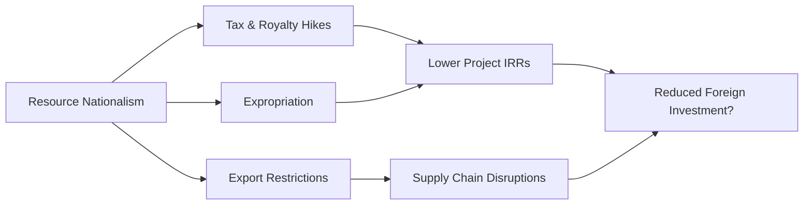

## Introduction
Have you ever read headline news about a government abruptly taking control of foreign-owned oilfields or imposing extra taxes on mining operations? If so, you’ve witnessed resource nationalism in action. Honestly, I remember feeling a jolt of surprise the first time I saw a big oil giant in South America lose its concession after spending millions—maybe billions—on exploration and development. In this section, we’ll explore the concept of resource nationalism, the geopolitical tensions underpinning it, and the ways these tensions reshape natural resource markets around the globe. 

We’ll talk about policy shifts, expropriation, local partnerships, trade agreements, and scenario analysis. We’ll dive into historical contexts like Venezuela and Indonesia, examine the impact on investment portfolios, and learn about best practices in mitigating risk. While the topic might feel heavy—especially with all the talk about government policies, capital flows, and expropriation—think of it like this: if you’re investing in commodities, you should know how politics can rock your bottom line.

## Understanding Resource Nationalism
Resource nationalism occurs when a government asserts greater control over, or demands a larger share of, the revenues generated from natural resources. The driving motive is often to ensure that local citizens (or the national treasury) benefit more directly from resource extraction, especially when those resources are valuable in international markets.

It can manifest, for example, as higher tax and royalty rates, stringent export restrictions, mandated local ownership stakes, or, in more extreme instances, complete nationalization of private assets. In finance terms, this means that, for a foreign investor, the fundamental risk profile of a project can shift overnight with a stroke of a president’s pen. Suddenly, the expected cash flows from a mining operation might get hammered by unexpected taxes or confiscation.

### Key Drivers Behind Resource Nationalism
• Economic Pressures: Governments under fiscal stress (perhaps facing budget deficits or public dissatisfaction) may target foreign-owned natural resource projects as a quick avenue to raise revenue.  
• Public Sentiment and Politics: Local populations often feel the benefits of resource extraction do not “trickle down.” Politicians capitalize on this discontent by promising more local control.  
• Commodity Market Cycles: During commodity booms, governments see how profitable foreign-owned operations become and want a bigger slice of the pie, especially when revenues are soaring.  
• National Pride and Sovereignty: Natural resources like oil, gas, metals, or rare earth elements are sometimes seen as part of the national identity. Letting external investors “take them away” can trigger political outcry.  

## Historical Context and Major Examples
From an investment standpoint, it’s crucial to learn from previous episodes of resource nationalism. The cautionary tales from countries like Venezuela and Indonesia help illustrate the stark realities.

### Venezuela’s Oil Nationalization
In the early 2000s, Venezuela implemented policies that fundamentally changed the energy sector’s structure. The government increased royalties and taxes, eventually forcing foreign oil companies into joint ventures where the state-owned oil company held a majority stake. Some international firms negotiated new terms; others lost their assets through outright expropriation. The country’s ongoing economic crisis has, ironically, forced it to reconsider partnerships with foreign firms. This flip-flopping highlights how quickly policies can shift with changes in leadership or macroeconomic conditions.

### Indonesia’s Mining Policies
Indonesia, rich in minerals such as nickel, has repeatedly revised its mining laws. In 2014, the government banned the export of certain unprocessed metals to encourage in-country smelting and stimulate industrial growth. International mining companies found themselves faced with new infrastructure demands or the choice to exit the market. Over time, the government introduced partial relaxations, but the uncertainty and additional capital expenditures cooled enthusiasm among some foreign investors.

### Rare Earth Export Restrictions
China’s rare earth mineral export restrictions (particularly around 2010–2011) jolted the tech world, since rare earths are critical components in everything from smartphones to wind turbines. The resulting supply shortage forced many industrial players to scramble for alternative sources. While China later eased restrictions, the episode showcased how quickly a single country’s policy might reverberate through global supply chains, sparking mandatory pivot strategies among manufacturers.

## Policy Shifts: From Leadership Changes to Public Opinion
One of the trickiest aspects of resource nationalism is how it can arise from sudden political transitions or populist sentiment. A new leader might promise constituents more local control over mines or farmland. Meanwhile, citizens may protest foreign companies if they believe local workers aren’t receiving fair wages or see environmental damage from resource extraction with insufficient government oversight.

### Political Triggers and “Resource Grabs”
Sometimes, policy changes come after sweeping elections or social uprisings. Consider a scenario where a candidate campaigns on “taking back” the country’s copper reserves from a foreign conglomerate. Once in office, they might enact legislation that reinterprets existing protections for foreign direct investment, or they might push for renegotiation of deals. This environment can create abrupt shifts in the net present value (NPV) of a project, as higher taxes or the threat of expropriation raise the discount rates and sabotage the project’s viability.  

## Trade Embargos, Sanctions, and Tariffs
Beyond straightforward resource nationalism, broader geopolitical tensions—like trade embargoes or sanctions—can also disrupt global commodity flows. 

• Trade Embargos: Total prohibition on commerce with a specific nation or entity. For example, if a major agricultural exporter faces an embargo, global grain prices could spike due to reduced supply.  
• Sanctions: These can freeze assets, prohibit investment, or limit the ability of a targeted nation to sell commodities on international markets. Sanctions on oil-exporting nations effectively remove supply from global markets, often causing price volatility.  
• Tariffs: Tariffs can be used by governments as leverage. For instance, imposing steel tariffs in response to a political dispute with a country that supplies steel can have ripple effects throughout construction, infrastructure, and heavy manufacturing sectors.  

From an asset allocation angle, a portfolio manager might pivot away from certain commodities or regions when the threat of looming sanctions is high. Similarly, the introduction of tariffs can shape overall risk-return considerations for real asset investors, especially if supply chains are reliant on cross-border flows.

## Corporate Strategies to Mitigate Political Risk
Foreign companies have developed a toolkit for mitigating resource nationalism and the broader geopolitical risk that accompanies it. Let’s walk through some of the most common tactics:

### Joint Ventures and Local Partnerships
Teaming up with domestic partners can help ensure local buy-in. A joint venture (JV) might share ownership between the foreign investor and the host government or local private entities. By aligning stakeholder interests, a JV reduces the likelihood of immediate nationalization. Governments are less inclined to expropriate assets if they or their local business elites already hold a stake.

### Negotiating Higher Local Content
Some resource-rich countries require that a certain percentage of materials, labor, or technology come from within the host country. Proactive companies exceed these baselines to foster goodwill—perhaps by training local employees for management roles or contracting local construction firms for infrastructure development. This approach builds positive relationships that can buffer against abrupt policy reversals.

### Political Risk Insurance
A specialized form of insurance covers expropriation, political violence, and similar disruptions. Providers range from private insurers to multilateral agencies like the World Bank’s Multilateral Investment Guarantee Agency (MIGA). Although it can be pricey, it reassures lenders and equity investors that at least part of their capital is safeguarded if a country’s political environment suddenly deteriorates.

### Long-Term Social and Environmental Focus
Under the broader umbrella of Corporate Social Responsibility (CSR), sponsoring local schools, hospitals, or environmental remediation efforts can be more than feel-good philanthropy—it can be a strategic hedge. When local communities see tangible benefits, they may lobby against resource grabs or new taxes that could shut down foreign ventures.

## Influence of Bilateral and Multilateral Trade Treaties
Multilateral and bilateral trade agreements create a degree of legal and economic predictability among member nations. While not a silver bullet against expropriation, treaties (such as the USMCA in North America or Mercosur in South America) often include investor-state dispute settlement provisions. These allow foreign investors to seek arbitration if a government’s actions severely harm their investments.

When a government is a signatory to robust trade treaties, it might tread more cautiously before imposing drastic export bans or expropriations—knowing it could face legal consequences or hamper broader trade relationships. However, it’s worth remembering that no treaty is invincible against a determined government responding to domestic political pressure.

## Corporate Social Responsibility (CSR) in High-Risk Regions
To address resource nationalism, companies frequently integrate CSR initiatives in their operational strategies. This approach places them in alignment with local developmental objectives and reduces the risk of abrupt regulatory changes. Locally employed workers, improved community infrastructure, and environmental safeguards all contribute to the notion that the company is “rooted” in the host country rather than just extracting resources for profit. 

CSR is often codified in contractual agreements and local development programs. Perhaps a mining company invests in roads, clinics, or clean water projects. In volatile geopolitical settings, these initiatives can help quell public anger if environmental or social controversies arise. 

## Scenario Analyses for Geopolitical Events
Hope for the best, prepare for the worst. That’s the motto for any serious investor in commodities, and scenario analysis is a key part of this. Scenario planning might simulate a peaceful environment, a moderate shift in regulations, or a full-blown resource nationalism push with forced expropriation. 

Let’s consider a simplified numeric example. You’re valuing a hypothetical gold mine in a politically unstable region. The base scenario assumes taxes are stable at 20% of net income. In a more adverse scenario, a new populist government imposes a 35% tax plus a 10% “windfall” royalty on gold exports. By recalculating the project’s internal rate of return (IRR) and net present value (NPV) under each scenario, we can better appreciate the range of outcomes:

• Base Scenario (Stable environment)  
  - Corporate tax rate: 20%  
  - Royalty: 5% of revenue  
  - IRR: 15%  
  - NPV: $100 million  

• Adverse Scenario (Resource nationalism)  
  - Corporate tax rate: 35%  
  - Windfall royalty: 10% of revenue  
  - IRR: 5%  
  - NPV: $20 million  

This dramatic difference emphasizes how sensitive commodity assets can be to policy swings. Then we might add a “Catastrophic Scenario” where expropriation results in zero salvage. While that outcome might seem extreme, the point is to track how potential changes in leadership or local sentiment could drastically shift your investment returns.

## Best Practices for Investors
• Due Diligence and Monitoring: Make sure to keep a pulse on local politics. If you see the incumbent government losing ground to a populist rival, that’s often a hint to reevaluate risk exposures.  
• Diversify Geographically: Instead of concentrating all bets in one region, spread exposure across multiple countries with different political profiles.  
• Establish Local Relationships: Having local advisors, employees, and supply chains can engender goodwill. In truly hostile takeovers, no amount of goodwill can fully protect you, but it helps mitigate moderate risks.  
• Make Use of Hedging Instruments: Explore the possibility of hedging with commodity derivatives. If you suspect supply disruptions from a region, an option or a futures contract in alternative markets may help offset price risk.  
• Institutionalize CSR: Implementing a well-funded and transparent social responsibility strategy can build a political constituency in your favor.  

## Common Pitfalls
• Underestimating Political Cycles: Some investors assume stability will last indefinitely if the current government favors foreign investment—only to be caught off-guard by abrupt leadership changes.  
• Ignoring Environmental and Social Concerns: Polluted water supplies or displacement of local communities can trigger strong backlash, fueling nationalism.  
• Over-Reliance on Arbitration Clauses: While international courts can help, enforcement of judgments can be difficult if the local government is unwilling to cooperate.  
• Failing to Account for Infrastructure Gaps: Even if there aren’t expropriation risks, the lack of reliable roads, ports, or power grids can hinder operations, driving up costs.  

## Conclusion
Geo-political tensions and resource nationalism are here to stay—and they’re not limited to a single region or commodity. Today’s global supply chains are deeply interconnected, so a policy change in one nation’s farmland or oilfields can reverberate through markets worldwide. Understanding the dynamics of nationalism, practicing robust scenario analysis, and structuring deals to incorporate local interests can keep you one step ahead. 

While it’s impossible to eliminate political risk altogether, prudent strategies—like local partnerships, CSR, adequate insurance, ongoing monitoring of the political environment, and bilateral or multilateral treaties—can empower you to navigate these complexities. At the end of the day, it’s crucial to stay flexible and maintain a margin of safety in your projections, so you’re poised to adapt quickly if the geopolitical winds shift.

## Glossary
Resource Nationalism: Government-led efforts to control and profit from natural resources within its jurisdiction, often through additional taxes, export restrictions, or expropriation.  
Sanctions: Government-imposed restrictions—such as freezing assets, limiting trade, or barring financial transactions—aimed at influencing another nation’s policies.  
Expropriation: When a government seizes privately owned property, which may or may not result in compensation to the owner.  
Bilateral Trade Agreement: A pact between two countries to reduce or eliminate trade barriers, often featuring investor protections and dispute resolution mechanisms.

## References and Further Reading
- Bridge, G. (2013). “Resource Geographies I: Making carbon economies, old and new.” Progress in Human Geography.  
- International Energy Agency (IEA). (Various reports). “Global Energy Trends and Policies.”  
- CFA Institute. (2023). “Political Risk and Investment.” CFA Program Curriculum.  
- Multilateral Investment Guarantee Agency. Available at: https://www.miga.org/

## Test Your Knowledge: Geo-Political Tensions and Resource Nationalism



### Which statement best describes resource nationalism?

- [ ] A short-term liquidity solution for foreign investors.
- [x] Government-led efforts to assert control over economic gains from natural resource extraction.
- [ ] Illegal foreign ownership of mines and oil fields.
- [ ] A complete ban on exporting any resource from the host country.

> **Explanation:** Resource nationalism involves a government increasing its control or share of profits from domestically extracted resources through taxes, royalties, expropriation, etc.

### Under a joint venture that pairs a foreign mining firm with a government, which of the following is generally a benefit for the foreign investor?

- [x] Lower likelihood of sudden expropriation due to shared ownership.
- [ ] Immediate guarantee of international arbitration rights.
- [ ] Elimination of geological and operational risks.
- [ ] Zero governmental oversight on capital inflows.

> **Explanation:** Joint ventures can align interests between private and public entities, reducing the risk of sudden nationalization.

### If a government imposes a new 15% windfall tax on resource extraction after commodity prices spike, this is an example of:

- [ ] Tariffs.
- [ ] Sanctions.
- [x] Resource nationalism.
- [ ] Market deregulation.

> **Explanation:** A windfall tax is a common tool of resource nationalism: raising government revenue from unexpectedly high commodity profits.

### When analyzing potential resource nationalism risks, scenario analysis typically includes:

- [x] Different tax regimes, royalty changes, and the probability of expropriation.
- [ ] Solely geologic data regarding mineral deposits.
- [ ] Global stock market index trends.
- [ ] Currency hedging outcomes but no policy changes.

> **Explanation:** Scenario analysis for geopolitical risks incorporates multiple policy shifts affecting expected returns, including new taxes and possible expropriation.

### Which of the following strategies helps mitigate political and resource-nationalism risk?

- [x] Political risk insurance and local partnerships.
- [x] Strong CSR initiatives in local communities.
- [ ] Ignoring changes in political climate.
- [ ] Centralizing all projects in a single region.

> **Explanation:** Examples of mitigating strategies include buying insurance, forming joint ventures, and investing in local communities.

### Trade embargoes generally:

- [x] Restrict commerce with a specific nation, potentially limiting resource flows.
- [ ] Increase supply in the global market due to lower political tension.
- [ ] Have no impact on the pricing of commodities.
- [ ] Guarantee free trade among multiple nations.

> **Explanation:** An embargo is a prohibition on trade with a particular country, which can reduce the international supply of certain commodities.

### Why might a government sign a bilateral trade agreement?

- [x] To stabilize cross-border investment and reduce risk of abrupt policy changes.
- [ ] To ensure no foreign companies can operate within its borders.
- [x] To attract foreign capital flows into key sectors.
- [ ] To bypass all domestic regulations on mining activities.

> **Explanation:** Bilateral trade agreements often contain provisions that protect foreign investors and encourage stable cross-border business. They can also attract investment in targeted sectors.

### Which is an example of expropriation?

- [x] A government seizing a mine without fair compensation.
- [ ] A private enterprise setting up its own tax code for local products.
- [ ] A shift from direct ownership to a licensing regime by mutual agreement.
- [ ] A local labor union striking for higher wages.

> **Explanation:** Expropriation refers to a government taking control or ownership of private property, often without adequate compensation.

### What is one possible advantage of implementing thorough CSR programs for a resource-based project?

- [x] It can build community goodwill that may deter hostile political action.
- [ ] It guarantees full exemption from environmental regulations.
- [ ] It allows companies to bypass local labor laws.
- [ ] It avoids the need for any local partnership or licensing requirement.

> **Explanation:** CSR initiatives—such as healthcare, education, or infrastructure development—help align local communities with a project’s success and can soften nationalist sentiment.

### A government imposes an immediate 30% export duty on a major metal used worldwide. This scenario could:

- [x] Cause significant supply disruptions and raise global prices.
- [ ] Unconditionally guarantee foreign direct investment influx.
- [ ] Improve the profitability of foreign investors overnight.
- [ ] End all forms of resource nationalism in the region.

> **Explanation:** An abrupt export duty can disrupt supply chains and lead to higher global commodity prices while reducing the profitability of international operators.


