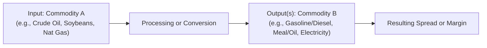
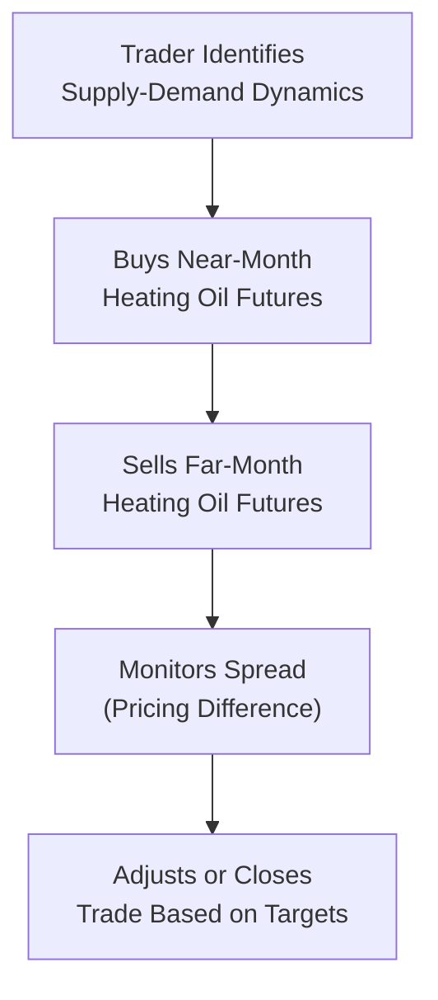

## Introduction

Commodity markets can appear overwhelming, especially when prices bounce around like an unhinged yo-yo. Many newcomers see only the frantic buying and selling, not realizing that some of the most compelling trades arise from differences in price relationships rather than outright future price direction. That’s where spread trading and arbitrage come into play.

Unlike a straightforward bet on, say, whether crude oil will rise or fall, spread trading involves taking offsetting positions to profit from the relative movement between different instruments or markets. If that sounds complex, don’t worry. After you get the hang of it, things can get pretty interesting. And there’s a reason many professional commodity traders consider spreads a critical piece of their strategy. In my opinion, it helps them reduce risk exposure while still tapping into market inefficiencies.

Below, we’ll cover several essential spread and arbitrage techniques that are common in commodity markets—crack, crush, and spark spreads, calendar spreads, location arbitrage, and more. We’ll then move into discussion on risk management, correlation breakdowns, and advanced quantitative approaches.

## Major Types of Commodity Spreads

### Inter-Commodity Spreads

Inter-commodity spreads represent price differentials between two or more related commodities. Think of steel and iron ore or gold and silver. The fundamental driver is that these commodities share a certain overlap in demand, supply, or production processes. Whenever the relationship between them drifts away from historical norms, a spread trade might pop up.

#### Crack Spread

Crack spread often refers to the difference between crude oil input costs and refined product output prices (e.g., gasoline and diesel). Refiners often hedge using the crack spread to protect themselves against adverse pricing that squeezes refining margins. A typical crack spread structure might be:
• Buying crude oil futures (the input).  
• Selling gasoline and heating oil futures (the outputs).

A standard example is the “3:2:1 crack spread,” implying that three barrels of crude oil produce two barrels of gasoline and one barrel of distillate fuel. If gasoline and distillate prices rise more steeply compared to crude, the spread widens.

#### Crush Spread

The crush spread is analogous but relates to the soybean complex. Generally, soybean processors purchase soybeans (the input) and convert them into two primary products: soybean meal and soybean oil. If the combined sale price of the meal and oil less the cost of the original soybeans grows, the crusher’s profit margin improves.

Here’s a simplified numeric example:

• 1 bushel of soybeans at US$15.00  
• Soybean meal produced: 44 lbs, each going for US$0.20 → US$8.80 total  
• Soybean oil produced: 11 lbs, each going for US$0.60 → US$6.60 total  

Total revenue from meal + oil = US$15.40  
Cost of soybeans = US$15.00  
Resulting crush spread per bushel = US$0.40  

Of course, real-world calculations often involve more precise yield ratios, but you get the idea: the spread captures the margin between raw soybean costs and processed product revenues.

#### Spark Spread

Natural gas (input) is converted into electricity (output). The spark spread measures the difference between the cost of the natural gas used for electricity generation and the price at which generated electricity can be sold. A wide spark spread typically signals profitable electricity production for gas-fired power plants. But if natural gas prices spike (like they sometimes do in cold winters) and electricity prices fail to keep pace, the spark spread narrows.

It might be easier to visualize an inter-commodity spread with a quick flow diagram:

Essentially, you buy or sell the input futures contract and take the opposite position in the output contract(s).

### Calendar Spreads

Calendar spreads—sometimes called time spreads—are positions involving the same commodity but different delivery months. You might buy a near-month futures contract and simultaneously sell a longer-dated contract, or vice versa. The idea is to exploit expected changes in supply and demand over time, differences in storage costs, or seasonality (wheat harvest cycles, for instance, or the shift in gasoline demand between winter and summer blends).

If you believe that near-term supply constraints will push up the price of a front-month contract faster than subsequent months, you could go long the near-month and short the later-month. This approach can help reduce your exposure to the commodity’s overall price moves—because you’re both long and short the same commodity—but you still profit if the front-month outperforms the later-month.

For instance, a trader might:

• Buy October WTI crude futures at US$83.00  
• Sell December WTI crude futures at US$84.00  

If the spread narrows (meaning October rises relative to December) the trader profits on the difference. However, watch out—if the back month rallies disproportionately, that spread can move against you.

### Location Arbitrage

Picture this: wheat in Kansas is priced at US$6.50 per bushel, while the same wheat in Chicago is going for US$6.70 per bushel. If transportation costs plus transaction fees total US$0.10, shipping wheat from Kansas to Chicago could yield a US$0.10 per bushel profit (6.70 – 6.50 – 0.10 = US$0.10). 

This scenario is a classic location arbitrage: capturing price differentials across regions or exchanges, adjusted for shipping and handling costs. Sometimes the mismatch disappears quickly (especially in our super-connected world), but not always. Weather disruptions, political events, or shipping constraints can temporarily keep local prices out of whack.

A classic example was the U.S. vs. European price differentials on refined fuels whenever tanker routes faced congestion. Traders who can quickly secure freight capacity (with stable shipping rates) can lock in an arbitrage profit by buying where products are cheaper and delivering them to a higher-priced market.

## Risk Management in Spread Trades

Even though a spread trade often involves lower net exposure than an outright position, risk isn’t zero. Markets can move in unexpected ways. For example, if you’re carrying a soybean crush spread, changes in global demand for soybean oil might not track meal demand as closely as in the past. This can shift the correlation between the two outputs.

Some common risk management approaches include:

• Delta-Hedging: If you’re dealing with options or more complex derivatives, you might hedge out some portion of your directional risk.  
• Ratio Spreads: Not all commodities convert on a one-to-one basis. You might need to trade futures in a particular ratio to approximate real-world production yields—like the 3:2:1 crack spread for crude oil.  
• Stop-Loss Orders: Placing automatic sell or buy-stop orders if the spread moves beyond a certain threshold.  

In many cases, the cost of capital and margin requirements can also define your risk. If your spread position ties up a lot of margin, you might face forced liquidation if other trades in your portfolio start losing. So, it’s good to keep an eye on margin levels across your entire account.

## Exploiting Arbitrage with Algorithmic and High-Frequency Trading

With global commodity markets trading practically 24/7, many firms rely on algorithmic or high-frequency trading (HFT) to spot fleeting mispricings. For location arbitrage specifically, algorithms might scrape data from multiple exchanges to detect real-time anomalies. If the model sees a profitable opportunity—say, a 2-cent discrepancy between COMEX gold futures and TOCOM (Tokyo Commodity Exchange) gold futures net of currency and transaction costs—it might place a trade in seconds, far faster than any person could react.

Still, HFT isn’t a golden ticket. There are costs: technology, exchange membership fees, colocation services, and robust risk controls—otherwise, a “flash crash” type of scenario could wipe out gains. Also, regulators keep an eye on algorithmic and HFT practices to ensure fair markets. A big theme for many HFT firms is risk-mitigated speed: the faster you can capture an arbitrage, the less likely your edge will disappear.

## Combining Fundamental and Quantitative Analysis

Spread traders often incorporate both fundamental insights (like weather patterns, geopolitics, inventory reports) and quantitative signals (like historical correlation, cointegration, or mean-reversion). If these two approaches agree, you can be more confident in your edge. For instance:

• Fundamental: A major drought threatens soybean harvests in Latin America. Meal production might be constrained, pushing meal prices up relative to soybeans.  
• Quantitative: Statistical models suggest that the current meal-soybean ratio is undervalued by 2 standard deviations compared to historical norms.  

When both the fundamental story and the quant signals align, many traders pull the trigger. Meanwhile, purely statistical arbitrage (stat arb) tries to identify short-term mispricings by modeling relationships among instruments. If the correlation or cointegration among certain commodities breaks down but then quickly reverts, that reversion can become your profit.

## Transaction Costs and Liquidity Concerns

All commodity trades—especially spreads—are subject to transaction costs such as:

• Brokerage fees and exchange fees  
• Slippage (the difference between the expected fill price and the actual fill price)  
• Bid-ask spreads in one or both legs of the trade  
• Additional clearing and margin expenses  

Because a spread trade involves multiple legs, costs can really add up. Typically, you want to trade commodities with ample liquidity, like WTI crude or soybeans, to keep bid-ask spreads tight. Illiquid commodities or times of day with low trading volume can erode any potential edge. The net margin on a spread can be low, so you need to ensure that transaction costs don’t kill your profit.

## Managing Correlation Breakdowns

In normal conditions, the relationships that define a crack or crush spread remain relatively stable. But what if a refinery meltdown slashes gasoline output, driving gasoline prices rapidly upward? The correlation with crude may break down. That’s the risk that spread traders often dread: the factor that historically tied your positions together suddenly vanishes. Demand or supply shocks, government policy changes, or shifts in consumer behavior can cause correlation breakdowns. 

One approach is to watch for regime shifts. Are you in an environment of rising interest rates (which might dampen broad demand for commodities) or intensifying regulation (like new emissions rules for ships that raise demand for low-sulfur fuel)? Keep an eye on broad macro signals. If you detect potential correlation changes, reevaluate your position sizing and hedges accordingly.

## Practical Example of a Calendar Spread Workflow

Below is a simplified diagram showing a typical calendar spread workflow for a refined product, like heating oil:

1. You study the fundamental backdrop: Are near-term inventories limited? Has the weather forecast turned sharply colder?  
2. You buy near-month and sell a far-month contract.  
3. Monitor the spread. If near-month prices soar relative to the later-month, your trade becomes profitable.  
4. At some point, you either close out or roll over the positions, depending on your strategy.

## Best Practices and Common Pitfalls

• Research Your Ratios: For processing spreads, such as the crush or crack spread, you must trade each leg in the appropriate ratio—don’t assume a 1:1 relationship.  
• Stay Current on Fundamentals: Commodity markets reflect real-world supply and demand. Crop reports, weather forecasts, new drilling technologies—each can drastically affect prices.  
• Watch Out for Contango vs. Backwardation: In calendar spreads, whether the market is in contango (distant futures priced higher) or backwardation (distant futures priced lower) can heavily influence spread behavior.  
• Control Leverage: Futures are inherently leveraged, and spread positions can magnify gains, but also losses, if strong correlation assumptions fail.  
• Mind Macro Factors: Monetary policy shifts (helpful to reference Chapter 1.13 from earlier in this volume) and changes in interest rates can ripple across commodity markets.  

## Ethical and Professional Considerations

CFA charterholders are bound by the CFA Institute Code of Ethics and Standards of Professional Conduct. Market manipulation, including “layering” or artificially influencing prices, is strictly off-limits. Always ensure your trades follow local and international regulations (like those from the CFTC in the U.S. or equivalent authorities elsewhere). Spread trading can be complex, so full, fair disclosure to clients and proper risk oversight are paramount.

## Exam Tips and Key Takeaways

• Identify the Main Spread Concepts: Know the difference between the crack, crush, and spark spreads. Practice small numeric examples.  
• Understand Calendar Spread Mechanics: Evaluate cost of carry, contango vs. backwardation, seasonality, and how to manage margin.  
• Be Prepared for Risk Management Questions: Expect scenario-based questions requiring you to hedge or adjust ratio spreads in the face of correlation changes.  
• Keep an Eye on Transaction Costs: The exam may include a question about net profitability after fees and slippage.  
• Integrate Fundamentals and Quants: The exam often tests your ability to combine real-world events (like a drought or new drilling technique) with a quantitative model.  

## References and Further Reading

- Sinclair, B. (2013). Calendar Spread Trading. Wiley.  
- Carter, C. A., & Revoredo-Giha, C. (2009). “Commodity Spread Trading and Market Efficiency.” Journal of Futures Markets.  
- CFA Institute. (2025). “Derivatives and Commodity Market Arbitrage.” CFA Program Curriculum.  

## Commodity Spread Trading and Arbitrage Knowledge Check



### Which of the following describes a spark spread?

- [ ] The difference between corn input costs and ethanol output prices  
- [x] The difference between the cost of natural gas and the price of electricity generated  
- [ ] The difference between crude oil prices and finished gasoline futures  
- [ ] The difference between soybeans and soybean oil  

> **Explanation:** The spark spread focuses on the relationship between natural gas as input fuel and the electricity generated.

### A trader notices that wheat trades at \$6.00 in one region and \$6.25 in another, while transport costs are \$0.20 per bushel. What is the location arbitrage profit if they can buy and ship wheat to the higher-priced region?

- [ ] \$0.30 per bushel  
- [ ] \$0.20 per bushel  
- [ ] \$0.00 per bushel  
- [x] \$0.05 per bushel  

> **Explanation:** The arbitrage profit is \$6.25 – \$6.00 – \$0.20 = \$0.05 per bushel.

### A crack spread usually involves which of the following underlying markets?

- [ ] Soybean oil and soybeans  
- [x] Crude oil, gasoline, and distillates  
- [ ] Natural gas and electricity  
- [ ] Wheat and corn  

> **Explanation:** The crack spread typically centers on crude oil (the input) and refined outputs such as gasoline and diesel (distillates).

### In a calendar spread, a trader simultaneously buys October WTI crude futures at \$80.00 and sells December WTI crude futures at \$82.00. If the spread narrows with the October contract rising to \$83.00 and December moving to \$83.50, what is the net profit?

- [ ] \$1.50 loss  
- [x] \$1.50 gain  
- [ ] \$3.00 gain  
- [ ] \$0.50 loss  

> **Explanation:** The trader went long October at \$80 and short December at \$82. The new prices are \$83 (for October) and \$83.50 (for December). The long leg gains \$3 (83 – 80). The short leg loses \$1.50 (83.50 – 82). Net profit = \$1.50.

### Which of the following is a key risk in spread trading if historically correlated assets become uncorrelated?

- [x] Correlation breakdown  
- [ ] Time value risk  
- [ ] Intrinsic value risk  
- [ ] No risk in spread trading  

> **Explanation:** Spread trades rely on correlations or stable price relationships between assets. If that breaks down, it can cause unexpected losses.

### When structuring a crush spread in the soybean market, a trader would likely:

- [x] Buy soybeans and sell soybean meal and oil  
- [ ] Buy soybean meal and soybeans, short oil  
- [ ] Sell soybeans and buy soybean meal and soybean oil  
- [ ] Only buy soybean meal  

> **Explanation:** The standard crush spread is buying soybeans (the raw input) while shorting the processed outputs (meal and oil).

### Which item best describes an advantage of calendar spreads over outright futures positions?

- [x] Reduced directional risk on the overall commodity price  
- [ ] Guaranteed arbitrage profits  
- [ ] No margin requirements  
- [ ] Complete immunity to fundamental changes  

> **Explanation:** Calendar spreads typically hedge out some price risk by offsetting one futures contract with another. It’s not a guarantee of profit, but it does moderate outright exposure to price swings.

### Algorithmic and high-frequency trading are often used to:

- [ ] Remove all risk from spread trades  
- [ ] Eliminate the need for fundamental analysis  
- [ ] Execute trades based on anecdotal market rumors  
- [x] Capture fleeting arbitrage opportunities quickly  

> **Explanation:** HFT systems monitor price discrepancies across markets in real-time, enabling them to exploit short-lived mispricings.

### A “3:2:1 crack spread” notion typically indicates:

- [x] 3 barrels of crude oil refined into 2 barrels of gasoline and 1 barrel of distillate  
- [ ] 3 barrels of gasoline cracked into 2 barrels of crude oil and 1 of distillate  
- [ ] 3 bushels of soybeans generating 2 units of meal and 1 unit of oil  
- [ ] 3 MMBtu of natural gas generating 2 kilowatts of electricity and 1 kilowatt of heat  

> **Explanation:** The 3:2:1 ratio specifically refers to the refining process: 3 barrels of crude producing 2 barrels of gasoline and 1 of distillate.

### A trader’s near-month contract is in a steep contango compared to the far-month. What does this imply for the calendar spread?

- [x] The near-month price is lower compared to the far-month, potentially influencing the spread structure  
- [ ] The far-month price is lower than the near-month price  
- [ ] The market is in backwardation  
- [ ] Nothing can be inferred about the spread  

> **Explanation:** Contango exists when longer-dated contracts trade at higher prices than near-term contracts, which affects calendar spread decisions (e.g., might lead a trader to buy the near-month and sell the far-month to benefit from a possible narrowing in the contango).


