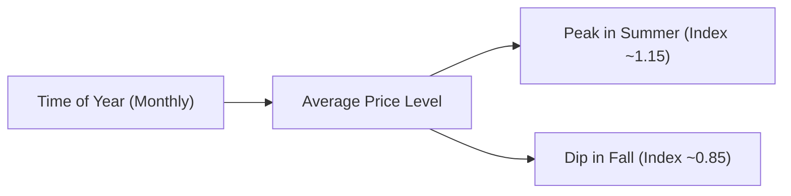
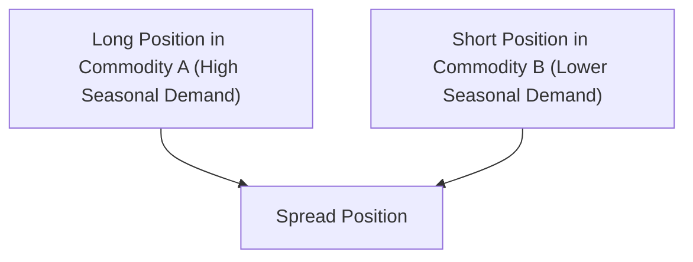

## Introduction and Key Concepts

Seasonality in commodities is a fascinating topic—honestly, it’s one of those things that felt like magic to me when I first started looking at price charts. You’d see corn prices zigzag at fairly predictable intervals, or crude oil rally into the summer months, and it kind of makes you scratch your head. But once you realize that the real world of harvest cycles, weather patterns, and consumer behavior is behind those price swings, you understand that “seasonality” is not just a buzzword. It’s a meaningful pattern rooted in fundamental supply-demand forces.

Seasonality Analysis refers to the study of repeating cyclical trends that occur at specific times throughout the year. In this section, we’ll focus on agriculture and energy—two commodity groups that exhibit some of the most pronounced seasonal patterns. We’ll explore how harvest times in the Northern and Southern Hemispheres affect crops like corn and wheat, how weather disruptions such as hurricanes may upend normal patterns, how summer driving season can push up gasoline prices, and why winter months often see surges in heating fuel demand. Plus, we’ll dig into how to incorporate these insights into trading or hedging strategies.

## Seasonal Forces in Agriculture

### Planting and Harvest Cycles

Agricultural commodities revolve around the planting and harvest calendar. For instance, many grains (corn, wheat, soybeans) are planted in the spring, experience a growth period in the summer, and are harvested in the fall—at which point, abundant new supply often triggers downward price pressure.

• Spring (Planting Season): Farmers purchase seeds and other inputs (fertilizers, herbicides), so input costs rise, which may or may not influence final crop prices. Markets might be highly sensitive to early weather patterns because poor or delayed plantings can drastically change harvest expectations.  
• Summer (Growing Season): During this time, markets watch weather forecasts closely—if it’s too dry, yields could suffer; if it’s too wet, planting or harvesting might get delayed.  
• Fall (Harvest Season): As crops come in, supply quickly enters the market. Prices often dip due to supply influx unless there’s a surprise (like a drought that cut yields).  
• Winter (Off-Season): Some crops, such as wheat in certain regions, may be planted in the fall and overwinter in the ground. Off-season months provide a gap when volatility can moderate, although global demand—and any unplanned supply disruptions—still matter.

Take, for example, a typical “corn seasonal trend” in the Northern Hemisphere. It’s not unusual to see corn prices stronger in the summer if the weather is hot and yields might be compromised—but after the harvest kicks off in late September or October, new supply can flood the market, pressuring prices lower.

### Impact of Weather Events

It’s important to remember that typical seasonality can quickly be overshadowed by extreme weather. A hurricane making landfall in the Gulf Coast at the wrong time can damage export terminals or crops. A scorching heat wave might wipe out a portion of a region’s yield, pushing prices higher—even in what’s normally a price-lull season. Cold snaps can also wreak havoc on winter wheat. So while seasonality is real, it’s not guaranteed: it’s more of a baseline into which real-world surprises get introduced.

### Regional Differences: Northern vs. Southern Hemispheres

Agriculture in the Southern Hemisphere (e.g., Brazil, Argentina) is offset by roughly six months from that of the Northern Hemisphere (e.g., the United States, much of Europe). That means global commodity traders must track two sets of planting-harvest cycles that can overlap. For instance, if Argentina’s soybean crop has a bumper harvest in January while the U.S. is in its dormancy period, this can keep prices lower for a while, even during a typical winter lull for U.S. beans.

## Seasonality in Energy Markets

### Demand Shifts: Heating and Cooling Needs

Energy demand reflects seasonal cycles tied to human behavior. In colder climates, winter sees a surge in demand for heating oil, natural gas, and electricity for heating (concepts often measured by “Heating Degree Days”). In summer, the demand for gasoline, jet fuel, or natural gas for air conditioning (“Cooling Degree Days”) can spike.

For instance, in the United States:  
• Winter Heating Season: Generally November through March, though it can vary geographically. Demand for heating fuels typically peaks, driving higher prices for natural gas and heating oil.  
• Summer Driving Season: Roughly Memorial Day to Labor Day, when folks hit the road more frequently, leading to potentially higher gasoline demand and, at times, higher crude oil usage in refineries.

On top of that, certain regions rely more heavily on one type of energy source. Northeastern states in the United States, for example, historically used more heating oil in winter, whereas natural gas usage might be more pronounced in the Midwest. Knowing these regional behaviors can help you spot trading opportunities (or risk exposures) that others might miss.

### Weather Extremes for Energy Infrastructure

Just as with agriculture, severe weather can disrupt energy production and distribution—hurricanes striking the Gulf of Mexico can shut down offshore drilling rigs, refineries, or pipelines, sending spot prices higher. A harsh winter freeze might cause wellhead freeze-offs in natural gas production regions, pushing natural gas prices up unexpectedly. So, while you can adopt a baseline seasonal approach to energy prices, you must also keep an eye on the potential for shocks that upend the usual patterns.

## Modeling Seasonality in Commodities

### Incorporating Historical Seasonal Data

Market participants often use “seasonal indices” to capture average price behavior for a specific commodity during each month or week of the year. These indices can help detect patterns such as “corn typically trades 3% above its yearly average in June” or “WTI crude sees 5% below-average prices in October,” and so on.

A common approach is:  
1. Take historical price data for a commodity over multiple years (ideally 10+ to even out anomalies).  
2. For each year, normalize prices by dividing each month’s price by the yearly average.  
3. Average these normalized values across all years to form a “seasonal index.”

Let’s illustrate a conceptual chart using Mermaid, showing how a seasonal index might look for a hypothetical commodity:

Here, you might see a bump in midyear (the growth/summer driving season) and a dip in the cooler months. This index then becomes a guide: if you see the market moving far away from “normal” seasonal charts, it may hint at an unusual supply-demand shift.

### Technical Indicators and Charting Tools

Traders sometimes overlay moving averages and technical signals on seasonal indices or use them in conjunction with fundamental data. For instance, you might say, “If the expected fall decline in soybean prices is not happening this year, maybe the supply is tighter than usual,” or “If natural gas is selling off more sharply than usual midwinter, perhaps demand has been weaker or a warm front arrived.” This can guide your entry and exit decisions.

## Storage and Inventory Fundamentals

### Strategic Reserves and Inventory Cycles

For many commodities—particularly energy commodities like oil and natural gas—storage plays a huge role in dampening or exacerbating seasonality. Let’s say you’re watching a mid-winter spike in natural gas prices. If there’s plenty of natural gas in storage, that extra supply can be injected into the market, stabilizing prices. Conversely, if inventories are already low going into the winter, price spikes can get dramatic.

Similarly for grains, if there’s ample carryover stocks from the previous season, the impact of a poor new harvest might be cushioned (though not entirely mitigated). This is why many professional traders hang on the weekly or monthly inventory reports published by agencies like the USDA (for grains) or the EIA (for energy).

### Seasonal Storage and Contango/Backwardation

Seasonality can interplay with futures term structure. For instance, crude oil or natural gas might move into “contango” (future prices above spot) when market participants expect higher demand down the line. Alternatively, it might shift into “backwardation” (spot prices above future) when there’s immediate or seasonal scarcity. Some advanced strategies revolve around capturing the “roll yield” from these shifts in futures curves—particularly if a commodity historically moves into contango in certain months or backwardation in others.

## Seasonality-Based Spread Trading

A popular approach is to exploit seasonal divergences via spread trading. For example:

• Summer Gasoline vs. Winter Heating Oil Spread: You might go long summer gasoline futures (because demand ramps up from road travel) and short the winter heating oil futures. This trade capitalizes on the differential seasonal demand patterns.  
• Corn vs. Soybean Spreads: In certain regions, farmers must choose which crop to plant. If soybeans are offering higher returns, farmers plant more soybeans, potentially making corn supply tighter. A trader might position accordingly.  

Of course, these spreads can go awry if the weather or macroeconomic conditions throw off normal demand patterns. But spread trading is often less volatile than outright directional trading because the positions partially hedge each other. The differences in each commodity’s seasonal pattern create the alpha opportunity.

## Climate Change and Evolving Patterns

One of the most interesting questions nowadays is how climate change may shift these long-standing seasonal patterns. Warmer winters in certain regions could reduce heating fuel demand. Earlier or more frequent heatwaves might mean planting schedules get moved forward or yields face new water stress. Over time, these shifts might force new approaches to seasonality analysis—a “seasonal index” based on the last 50 years might not remain entirely valid if climate changes the timing of planting/harvest or intensifies certain weather extremes. So while seasonality is powerful, always keep a pulse on evolving climate data.

## Practical Applications and Case Study

Let’s do a quick example, drawn from real markets:

### Corn Seasonal Patterns

Perhaps you’re a portfolio manager wanting to hedge exposure to feeding costs for livestock. Historically, mid-spring to mid-summer can be a period of heightened price risk if the weather in the U.S. Corn Belt turns unfavorable. You might watch the seasonal index that typically shows a moderate rally in June or July. If you see that, just ahead of harvest, the index is moving well above its historical norm, you could lock in a portion of your corn feed costs by going long futures or by using a forward cash contract.

Let’s say in 2023, you had a mild spring, and the USDA predicted record-high yields. If the corn price still soared, well, that mismatch might signal early dryness in the fields not captured in official data. So you’d stay vigilant, perhaps buy more coverage. Sure enough, a mid-June heatwave hits—yields are revised downward, prices spike—and your hedge is in-the-money. That’s seasonality in action, with a twist of weather risk on top.

## Best Practices and Common Pitfalls

• Overreliance on Past Patterns: The biggest pitfall is to assume that because something happened for the last 20 years, it must happen this year. Real markets can deviate quickly due to macroeconomic conditions, geopolitical events, or sudden weather extremes.  
• Ignoring Storage Reports: Even if you’re sure a price rally is “due,” large inventories can cap or delay that rally.  
• Not Considering Cross-Hemisphere Overlaps: The presence of major Southern Hemisphere producers in agriculture means you can get multiple harvest inflows within a single year.  
• Failing to Understand Demand Substitution: High gasoline prices can push some consumers toward alternative transportation or telework, dampening seasonal demand. Similarly in agriculture, if one fruit’s price surges, consumers might switch to an alternative, affecting your expected seasonal push.  
• Blind Spot on Transportation Logistics: I once had a soybeans position that completely missed the fact that barge traffic on the Mississippi was delayed due to historically low water levels. That’s a supply chain disruption that overrides typical seasonal patterns.

## Glossary

• Seasonal Index: A measurement representing typical price patterns for a commodity during distinct times of the year.  
• Harvest Cycle: The period in which crops are reaped, significantly influencing supply.  
• Heating Degree Days: A calculation used to estimate energy needs for heating based on outdoor temperatures.  
• Cooling Degree Days: A measure used to estimate energy needs for air conditioning.

## References and Further Reading

• Murphy, C. (1999). Technical Analysis of the Futures Markets. New York Institute of Finance.  
• U.S. Department of Agriculture (USDA). (Various reports). “Seasonal Crop Outlook and Statistics.”  
• Energy Information Administration (EIA). (n.d.). “Weekly and Seasonal Energy Market Analysis.”  

## Final Exam Tips

• For CFA exams, remember to connect the basics of supply and demand with the concept of seasonality. The exam might show a chart of historical price patterns and ask for interpretations or reasons behind apparent trends.  
• Be prepared to discuss how seasonality influences portfolios at the strategic asset allocation level, especially for those with commodity exposures.  
• Familiarize yourself with fee structures, benchmarking, and risk management aspects of commodity investments.  
• Keep an eye on how abnormal weather events may override typical seasonality. Possibly you’ll get a question about how to handle tail risks.  
• Time management is crucial in multi-part essay questions. If you see a question about “explain the seasonal effect on Commodity X,” a concise approach linking supply/demand fundamentals with seasonal cycles is best.  

## Test Your Knowledge: Seasonality in Agriculture and Energy



### Which of the following best explains why agricultural commodity prices often decline in the fall?

- [ ] There is decreased global demand for cereals in the fall.  
- [ ] Futures markets are closed during the autumn season.  
- [x] Harvest typically boosts supply, putting downward pressure on prices.  
- [ ] A global pricing cartel sets harvest pricing lower.  

> **Explanation:** Many crops are harvested during the fall, which increases supply and tends to push prices downward.

### What is the primary reason for higher gasoline prices during the summer months?

- [ ] Refinery capacity is drastically reduced in the summer.  
- [x] Driving activity increases, creating higher demand for gasoline.  
- [ ] Government subsidies push prices up.  
- [ ] Farmers use gasoline for agricultural equipment.  

> **Explanation:** Summer travel and driving season increase the demand for gasoline, often leading to higher prices.

### How can large storage inventories affect typical seasonal price trends in a given commodity?

- [ ] They exaggerate the usual seasonal price peak.  
- [x] They can dampen or delay price rallies by providing surplus supply when demand rises.  
- [ ] They create immediate shortages in the current market.  
- [ ] They render futures markets irrelevant.  

> **Explanation:** When storage levels are high, release of these inventories can offset typical season-driven shortages, moderating or postponing expected price rallies.

### Which of the following is true regarding Southern Hemisphere crop cycles compared to Northern Hemisphere crop cycles?

- [ ] They always occur simultaneously.  
- [x] They often happen about six months apart.  
- [ ] They have been legally coordinated to stabilize global prices.  
- [ ] They have no impact on global agricultural prices.  

> **Explanation:** Southern Hemisphere harvest times often offset Northern Hemisphere calendars by roughly half a year, affecting global supply flows at different intervals.

### If severe weather arrives during the peak growing season of corn, how might it alter typical seasonality?

- [x] It may lead to lower yields and push prices higher than usual.  
- [ ] It will have no effect on the expected seasonal price pattern.  
- [x] It can cause extreme volatility that deviates from historical seasonal trends.  
- [ ] It ensures a price floor that prevents downward moves.  

> **Explanation:** Severe weather impacting crops can reduce yields and increase market uncertainty, creating substantial deviations from standard seasonal price movements.

### Which term describes the phenomenon where spot commodity prices are higher than futures prices?

- [ ] Contango  
- [x] Backwardation  
- [ ] Arbitrage  
- [ ] Normal carry  

> **Explanation:** Backwardation means the current spot price is higher than the price in future delivery months, which can sometimes reflect near-term scarcity.

### When constructing a seasonal index for a commodity, a common step is to:

- [x] Compare each month’s price to the average price of that year and then average across multiple years.  
- [ ] Only use the highest price from each year.  
- [x] Include data from multiple decades to smooth out anomalies.  
- [ ] Exclude data from the harvest season to avoid skew.  

> **Explanation:** A proper seasonal index is generated by normalizing each month relative to that year’s average (or a baseline) and then averaging across many years to find typical patterns.

### Which of the following is a risk of relying solely on historical seasonal patterns?

- [x] Climate change and unexpected weather events might disrupt typical patterns.  
- [ ] Markets are always fully efficient, so seasonality has no predictive power.  
- [ ] Seasonal patterns never existed historically.  
- [ ] Regulators prohibit the use of seasonal data.  

> **Explanation:** Overreliance on historical data can be dangerous if new weather extremes, climate shifts, or macroeconomic conditions deviate significantly from past norms.

### A summer “long gasoline, short heating oil” spread strategy aims to profit primarily from:

- [ ] A constant price difference that doesn’t change with seasonality.  
- [ ] Lower volatility in both products.  
- [x] Seasonal demand differences between summer gasoline usage and winter heating needs.  
- [ ] Weather events that only affect ethanol production.  

> **Explanation:** This spread capitalizes on stronger summertime demand for gasoline relative to heating oil, yielding a potential profitable differential.

### True or False: Seasonality analysis in commodity markets accounts for the complete set of supply and demand influences, leaving virtually no room for surprise price movements.

- [ ] True  
- [x] False  

> **Explanation:** Seasonality is a powerful framework but does not account for unexpected disruptions (extreme weather, geopolitical issues, etc.) that can alter or overshadow typical patterns.


