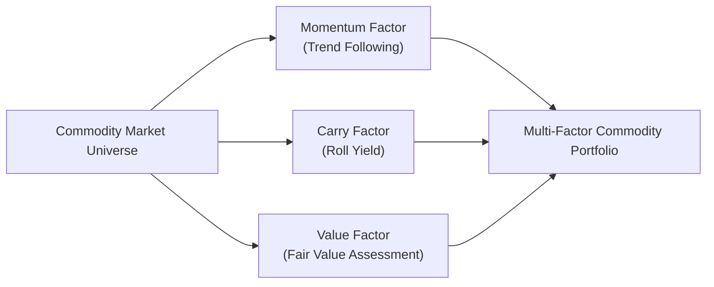
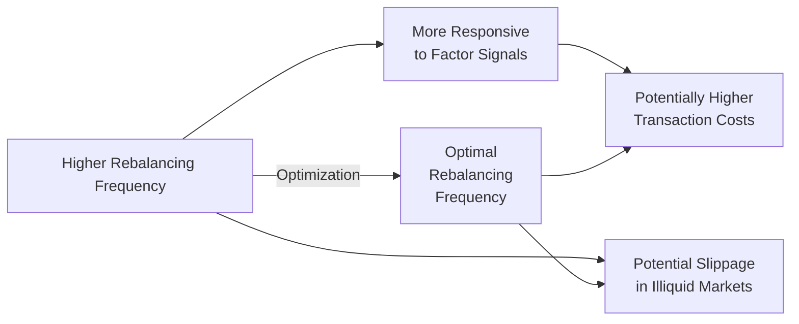

## Introduction and Context

Commodity factor investing has grown in popularity among institutional and individual investors who are looking for ways to diversify returns beyond traditional equity or bond factor strategies. While factors like value, momentum, and carry are widely known in equity markets, it might feel a bit surprising—or even a little daunting—to see them applied in commodities, which historically have been perceived as “tangible” resources with pricing heavily affected by supply, demand, and geopolitics.

But here’s the exciting part: commodity markets exhibit unique dynamics that can support factor-based approaches. The term structure of futures, the sensitivity to weather shocks, and the cyclical nature of certain commodities allow for systematic strategies that potentially capture persistent sources of alpha. This section demystifies advanced techniques in commodity factor investing and highlights how factors—like momentum, carry, and value—can be utilized in a disciplined, risk-aware manner.

## Understanding the Commodity Factor Universe

Factor investing essentially seeks to identify persistent, broad-based sources of risk and return. In equities, factors such as value, momentum, quality, size, and low volatility are frequently cited. When you shift your lens to commodities, factors such as momentum, carry (linked to roll yield), and value relative to historical or fundamental benchmarks are prominent candidates. 

Although these factors may resemble their equity counterparts, the driver behind each factor differs slightly when you consider storage costs, the possibility of backwardation or contango, and the unique role that geopolitical and environmental surprises can have on commodity prices. In addition, correlations between commodity factors and traditional assets can be surprisingly low, which further underscores the diversification potential.

Below is a simple visual illustrating how different commodity factors can interact within a multi-factor framework:



Think of the commodity market universe as the main “pool” of investable assets, while the three key factors—momentum, carry, and value—are distinct lenses through which investors analyze and select positions. Ultimately, these factor exposures come together in a single multi-factor commodity portfolio.

## Exploring the Momentum Factor

Momentum in commodities usually capitalizes on the continuation of price trends. Supply-and-demand imbalances, weather-related shocks, political disruptions, and other macro events can foster extended and self-reinforcing price movements. If you see the price of wheat skyrocketing due to unforeseen drought conditions, that trend can persist long enough for momentum-based strategies to enter near the beginning or middle of the move and potentially profit from ongoing momentum.

One personal anecdote: I remember running a basic trend-following strategy on coffee futures years ago. The price trend soared (and kept soaring) after a predicted frost in a major growing region turned out to be worse than expected. Momentum strategies, while not immune to sudden corrections, did capture a good tail of that upward movement. Of course, that’s a small-scale highlight—momentum does occasionally fail during choppy markets, so risk management is critical.

### Key Characteristics of Momentum in Commodities

• Supply/demand disruptions can extend price trends.  
• Roll yields can enhance or reduce net gains, depending on whether the curve is in backwardation or contango.  
• Momentum signals often rely on moving averages, breakout indicators, or other technical metrics.  
• Transaction costs can erode returns if signals change too frequently in volatile markets.  

### Implementing Momentum Strategies

A momentum strategy may involve sorting commodities by their recent returns (e.g., past three- to twelve-month performance) and longing the top performers while shorting the bottom performers. Position sizing might be adjusted based on volatility to ensure that higher volatility commodities do not dominate the portfolio risk.

The Python snippet below shows a simplified approach that ranks commodities by recent performance to determine which to go long or short:

```python
import pandas as pd
import numpy as np

# momentum_window defines lookback for measuring momentum
momentum_window = 60

daily_returns = price_data.pct_change().dropna()
rolling_returns = daily_returns.rolling(momentum_window).apply(lambda x: (1+x).prod()-1, raw=False)

ranked = rolling_returns.iloc[-1].rank(ascending=False)
threshold = int(0.2 * len(ranked))
long_positions  = ranked[ranked <= threshold].index
short_positions = ranked[ranked >= (len(ranked) - threshold + 1)].index

print("Long Positions:", long_positions)
print("Short Positions:", short_positions)
```

Though the above code is only a simple example, actual strategies will incorporate advanced filters—like ignoring extremely illiquid contracts or adjusting for volatility and cost constraints.

## Carry Factor and Roll Yield

Carry in commodities is often associated with the slope of the futures curve. The concept is simple in theory: if the forward (futures) contract is significantly cheaper (relative to the spot price) when you buy it—a market condition called backwardation—then as time passes, that futures price tends to converge with the spot price. Conversely, selling a futures contract in contango (where futures are more expensive than the spot price) can also be profitable. These differences between spot and futures prices can create a “roll yield” that is central to commodity carry strategies.

### Carry Factor Mechanics

• Backwardation (downward sloping curve) typically benefits long positions because you roll into a cheaper contract that converges upward toward the spot.  
• Contango (upward sloping curve) can penalize buyers but benefits short sellers, as their contract converges downward.  
• Seasonal patterns, inventory data, and geopolitical events can shift the curve shape dramatically over time.  

### Harvesting Systematic Alpha

Systematic carry strategies typically involve ranking commodities by their implied roll yield. A commodity with a strong positive roll yield (i.e., deep backwardation) may be a candidate for a long position, while a commodity in steep contango might be sold short. This approach aims to systematically harvest the roll yield over time. 

Be aware, though, that the term structure can shift quickly if supply shocks or demand spikes occur. As a result, many carry-factor investors keep a close eye on macroeconomic data and measure the basis (difference between spot and futures) meticulously.

## Value Factor in Commodities

Value investing in commodities can feel a bit different from equities or bonds because commodities do not generate earnings or coupons. Instead, we explore “fair value” by referencing production costs, historical price levels, or perhaps global demand growth trends. Some advanced practitioners might also use a “real price” approach, factoring in inflation or currency effects to gauge how “cheap” or “expensive” a commodity is relative to its long-term equilibrium.

### Approaches to Identifying Value

• Cost-of-production analysis: Compare spot prices with estimated extraction or production costs (useful for energy or metals).  
• Historical mean reversion: If a commodity trades far below or above its long-term price average, that might imply a mean-reversion opportunity.  
• Relative value: Compare two similar commodities. For instance, if Brent crude is historically priced near parity with WTI but diverges significantly, a pair trade could capture the reversion.  

### Caveats with Commodity Value Strategies

Commodities can deviate from “fundamental value” for extended periods if a major political upheaval or climate event disrupts production. Timing the reversion precisely is notoriously tricky. Risk management is essential—just because crude oil seems undervalued by cost-of-production metrics doesn’t mean it can’t plunge further if demand tanks unexpectedly.

## Combining Multiple Factors

Many investors prefer multi-factor approaches to avoid reliance on any single factor’s success. Here’s how a multi-factor model might blend commodity momentum, carry, and value:

• Construct separate factor portfolios for momentum, carry, and value.  
• Assign a weight to each factor (e.g., 30% momentum, 40% carry, 30% value).  
• Rebalance periodically, say monthly or quarterly, to ensure exposures remain aligned with the targeted weights.  

When one factor underperforms—like momentum during highly volatile, range-bound markets— another factor (like carry) might pick up the slack. This diversification of factor exposures can help smooth the return profile over time.

## Calibration, Rebalancing, and Transaction Costs

How often should you rebalance a multi-factor commodity portfolio? Frequent rebalancing might ensure factor alignment but also increase transaction costs. Longer intervals can reduce costs but raise the risk of drifting away from target exposures.

Investors often back-test different frequencies—monthly, quarterly, or even semi-annually—to find the right balance for their style and liquidity constraints. In addition, transaction costs can vary widely across commodity markets, especially for less liquid contracts. Slippage is also a non-trivial concern when rolling over large positions in lightly traded markets.

A simplified diagram below shows the interplay between factor signal strength, transaction costs, and rebalancing frequency:



In other words, you’re trying to find that sweet spot (the node E in the diagram) where you’re responsive enough to changes in market conditions but not hemorrhaging returns through ongoing costs.

## Correlation with Traditional Equity and Bond Factors

Commodity factor strategies can exhibit relatively low correlation with equity or bond factor strategies, presenting a diversification advantage in broader portfolios. For instance, an equity value strategy might have meaningful drawdowns during recessions, while a commodity momentum strategy focusing on “surging” precious metals or agricultural products might hold up better. Conversely, if economic activity accelerates and cyclical equities rally, certain commodity carry trades may also generate strong roll yields as inventory levels tighten.

From a capital allocation standpoint, it’s useful to see how commodity factor exposures might behave alongside other alternative investments, such as real estate or hedge funds. The dynamic nature of factors in commodities—particularly momentum—means correlations can vary during stress periods.

## Risk Management Overlays

Commodity markets can be notoriously volatile. A single storm, geopolitical conflict, or trade embargo can drastically move prices. Therefore, factor-based strategies often benefit from some risk overlay techniques:

• Stop-loss protocols: Proactively exit or reduce losing trades, especially if prices move against the factor signal.  
• Volatility targeting: Adjust position sizes based on realized or implied volatility.  
• Position limits and reversion triggers: Cap exposure in highly correlated or illiquid contracts.  

Let’s illustrate a simple volatility-adjusted approach. Suppose your momentum signals tell you to go long on silver futures. If volatility is high, you scale down your position to keep portfolio risk consistent. If volatility is lower, you scale up. Over time, this helps avoid extreme drawdowns while still preserving exposure to favorable momentum trends.

### Example Volatility-Targeting Formula

Many practitioners target an annualized volatility level, say 10%. If σᵣ is the rolling realized volatility for a given commodity, Wᵣ is the “raw” weight from your current factor signal, and σₜ is your annual volatility target:

Wᵥ = (σₜ / σᵣ) × Wᵣ

Where Wᵥ is the volatility-targeted weight. This quick formula just scales your raw factor-intended position by the ratio of target volatility over current volatility.

## Practical Implementation Considerations

In practice, setting up a multi-factor commodity strategy entails many operational and strategic steps:

• Data integrity: Commodity data can be patchy, especially for some of the more exotic or thinly traded contracts.  
• Rolling strategies: Carefully manage roll schedules to avoid liquidity shortfalls or excessive slippage.  
• Derivative usage: Factor strategies in commodities are typically derivative-based (futures, options), so robust collateral and margin management are essential.  
• Regulatory constraints: Some regions have position limits or special reporting requirements for participants in commodity futures (e.g., U.S. Commodity Futures Trading Commission reporting).  

It’s also wise to confirm that each factor truly contributes distinct alpha potential, rather than just layering correlated risk exposures. Back-tests and factor correlation analysis can reveal if you’re inadvertently doubling down on the same bet in different guises.

## Final Thoughts and Exam Relevance

From a CFA exam standpoint, understanding how factor-based strategies in commodities differ from equity-oriented approaches is crucial. You’ll want to have a handle on key performance drivers—like the specific nature of roll yield (carry), supply-and-demand-driven momentum, and various methods of establishing a fair value. Remember that a robust risk management overlay is especially important in commodity futures because leverage can amplify both gains and losses. 

Exam questions might test your knowledge of how to measure roll yield, interpret futures curves, or structure a multi-factor strategy. They could also delve into how to calibrate factor weights or implement volatility targeting. Keep in mind the potential low correlation with equity and bond factors—often a draw for institutional investors.

## Best Practices and Pitfalls

• Stay mindful of transaction costs. Factor-based approaches can turn high-frequency trading if rebalancing is too frequent, eating up your alpha.  
• Always calibrate your signals and weightings with real-world liquidity in mind.  
• Don’t overfit. Data-mining in commodity markets—like any market—can lead to spectacular back-test results but poor live performance.  
• Use robust risk overlays such as stop-loss levels or volatility targeting, especially in the face of unpredictable events like geopolitical disputes or extreme weather conditions.  
• Diversify across multiple factors. Relying on a single factor can lead to painful drawdowns if that factor goes out of favor.  

## References and Further Reading

• Asness, C., Moskowitz, T., & Pedersen, L. H. (2013). “Value and Momentum Everywhere.” Journal of Finance.  
• Daskalaki, C., & Skiadopoulos, G. (2011). “Should Investors Include Commodities in Their Portfolios After All? New Evidence.” Journal of Banking & Finance.  
• CFA Institute. (2023). “Factor Investing Applications in Commodities.” CFA Program Curriculum.  

----

## Tips for the CFA Exam

• Practice scenario-based problems. Exams often incorporate short vignettes describing various factor signals and futures curve structures, asking you to identify the best approach (e.g., carry vs. momentum).  
• Know your formulas. Be prepared to calculate roll yield, factor returns, volatility adjustments, and final portfolio weights.  
• Keep your definitions clear. Distinguish momentum, carry, and value as they apply to commodities, differentiating them from equity contexts.  
• Watch for trick questions. Commodity factor exam items often test your grasp of technical aspects like backwardation vs. contango, or they might mix in an unexpected real-world event that invalidates your standard approach.  
• Time management. If the exam includes an item-set on commodity factor investing, ensure you can move decisively through the calculations and qualitative assessments.  

## Commodity Factor Investing Mastery: Test Your Knowledge



### Which of the following best describes the “carry factor” in commodity investing?

- [ ] The extra return generated from physical storage of commodities.  
- [x] Profit opportunities stemming from upward or downward slopes in the futures curve.  
- [ ] Gains realized from arbitrage between different exchange-traded commodity contracts.  
- [ ] Outperformance driven by fundamental production cost considerations.  

> **Explanation:** The carry factor in commodities is typically linked to the slope of the futures curve (backwardation vs. contango) and the corresponding roll yield.

### How can momentum strategies in commodities capture prolonged price trends?

- [ ] By immediately closing positions during supply/demand shocks.  
- [ ] By focusing solely on short-term price reversals.  
- [x] By leveraging the continuation of directional price moves after significant supply or demand disruptions.  
- [ ] By solely using fundamental data and ignoring technical indicators.  

> **Explanation:** Commodity momentum strategies profit from extended directional price movements often triggered by supply or demand shocks, thereby riding the trend as it continues.

### What is a potential pitfall when using cost-of-production to determine a “value factor” in commodities?

- [ ] Production costs can never be accurately estimated.  
- [x] Commodity prices may deviate from cost-of-production metrics for extended periods due to macro events or speculative activities.  
- [ ] Value factors cannot be applied to any tangible assets.  
- [ ] Cost-of-production data is usually obtained in real time without delay.  

> **Explanation:** Even if you determine a commodity’s fair value via production costs, external forces (e.g., geopolitical shocks) can keep prices away from that benchmark for a long time.

### Which of the following best supports a multi-factor approach in commodity investing?

- [ ] Commodities exhibit negligible volatility and make single-factor strategies reliable.  
- [ ] Each factor (momentum, carry, value) is strongly correlated, making multi-factor strategies redundant.  
- [x] Different factors outperform at different times, thus diversifying a portfolio’s return drivers.  
- [ ] Commodity factors tend to move in tandem with equity factors, reducing diversification benefits.  

> **Explanation:** Multi-factor portfolios in commodities can smooth out returns because not all factors succeed or fail at the same time.

### Which statement about volatility targeting in commodity factor portfolios is most accurate?

- [ ] Volatility targeting is only used for equity portfolios.  
- [x] It scales positions based on changes in market volatility to keep portfolio risk at a consistent level.  
- [ ] It eliminates drawdowns completely by using dynamic hedging.  
- [ ] It is identical to stop-loss procedures in all respects.  

> **Explanation:** Volatility targeting adjusts position sizes in response to market volatility fluctuations. It does not fully eliminate drawdowns but can help keep risk more consistent.

### When calibrating factor weights in a commodity portfolio, an investor should do which of the following?

- [ ] Use equal weighting for all factors, regardless of their historical performance.  
- [x] Consider historical performance, correlation among factors, and transaction costs to decide factor weights.  
- [ ] Base all factor weights solely on the largest data sample available.  
- [ ] Avoid rebalancing, as it increases costs.  

> **Explanation:** Factor weighting decisions typically involve analyzing correlations, historical efficacy, and associated costs to optimize performance.

### Which best describes the relationship between commodity factor returns and equity factor returns?

- [ ] They are perfectly correlated, making them redundant for diversification purposes.  
- [ ] They are usually highly correlated in recessionary periods only.  
- [ ] They move in tandem whenever markets are in contango.  
- [x] They have relatively low correlations, offering potential diversification benefits.  

> **Explanation:** Commodity factor strategies typically behave differently from their equity counterparts, often delivering diversification advantages.

### How can backwardation influence a systematic carry strategy?

- [ ] It has no effect on a systematic carry approach.  
- [x] Backwardation can create a positive roll yield for long positions, benefiting a carry strategy.  
- [ ] Backwardation benefits short positions exclusively.  
- [ ] It makes it impossible to roll futures contracts without incurring a loss.  

> **Explanation:** A backwardated market allows long futures positions to “roll” into cheaper contracts, possibly earning a positive roll yield over time.

### If a commodity momentum strategy experiences frequent whipsaws (rapid price reversals), which common measure can help mitigate losses?

- [x] Stop-loss protocols.  
- [ ] Always doubling positions after each loss.  
- [ ] Complete removal of short exposures.  
- [ ] Elimination of transaction cost considerations.  

> **Explanation:** Stop-loss orders or protocols help limit drawdowns by preventing excessive losses during choppy and rapidly reversing price moves.

### True or False: In a multi-factor commodity portfolio, assigning 100% weight to momentum is generally considered the best way to avoid factor drawdowns.

- [x] True  
- [ ] False  

> **Explanation:** This is a trick question. Putting 100% weight on a single factor actually increases the chance of factor-specific drawdowns. A multi-factor approach is typically advocated to mitigate such risk.  


