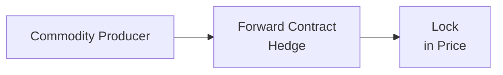

## Overview and Purpose
If you’ve ever chatted with a friend who works at an oil refinery—like I once did over a cup of coffee—you might have heard stories about how they lock in prices to avoid the wild swings of crude oil. Commodity prices can go up, down, or sideways for months on end, and advanced derivative structures are the key to managing all that risk. In this section, we’re going to dive deep into exotic derivatives such as average price options, lookback options, barrier options, and spread options. We’ll also examine VPP contracts, structured notes linked to commodity indices, and other specialized solutions that large producers, consumers, and investors use to tailor hedges and exposures.

Along the way, we’ll highlight best practices (and pitfalls) in modeling these instruments, ensuring smooth trade settlement and regulatory compliance. By the end, you’ll have a broad understanding of how these advanced products work in practice and how they might show up on the exam—or in your next career move, for that matter.

## Exotic Commodity Derivatives: A Quick Refresher
Before we dig into the advanced instruments, let’s remind ourselves: commodity derivatives help transfer or manage price risk for assets like crude oil, natural gas, metals, or agricultural products. In Chapter 1, we touched on how alternative investments can play a significant role in portfolio diversification. When we talk about advanced commodity derivatives, we’re going a step further, customizing the payoff structures to solve specific risk or return objectives.

### Average Price Options
An Average Price Option (sometimes called an Asian option in broader derivatives contexts) is a contract where the payoff depends on the average price of the underlying over a specified period rather than its price at a single point in time.

• Example Scenario: Suppose a wheat miller wants to hedge against rising wheat prices. Instead of using a plain vanilla call option, the miller buys an average price call option. If wheat prices spike early in the month but revert to normal afterward, the payoff will reflect the “average” of daily prices. This helps smooth out short-lived price shocks.

• Payoff Representation (Call):
  
  Let T be the total number of observation points; Sᵢ be the underlying price at observation i; K the strike price. The final settlement price S_avg is:
  
  S_avg = (1/T) × ∑(i=1 to T) Sᵢ

  The payoff at maturity for an average price call is:
  
  max( S_avg - K, 0 )

(If you’d like more detail, check out Hull (2021) for a thorough breakdown.)

• Why It’s Used: This option is particularly effective for commodities with high short-term volatility, because it reduces the risk of intraday or short-window spikes. This can also mean lower premiums compared to a standard option, though it may limit upside if a single shock event would have generated a larger profit.

### Lookback Options
Lookback options let the holder “look back” over the life of the option to determine the best possible payoff. There are different flavors—some let you lock in the highest underlying price (for a call) or the lowest underlying price (for a put).

• Example: A metals wholesaler wants to ensure they capture the most favorable price for aluminum over a 90-day window. They buy a lookback call option, paying a hefty premium in return for the right to exercise at the lowest observed underlying price during the period. If aluminum soared to record highs at some point, they effectively “lock in” bigger profits.

• Why It’s Used: Because lookback options basically guarantee the best extent of the underlying’s move, they are extremely useful for hedging in volatile commodity markets. That said, they can be pretty expensive—so they’re more common in certain niche scenarios or for more critical exposures that absolutely need the best possible price.

### Barrier Options
Barrier options either come into existence (‘knock-in’) or cease to exist (‘knock-out’) if the price of the underlying crosses a specified barrier.

• Example in Energy Markets: An oil producer might purchase a knock-out put option to hedge against a price drop. If the price of oil never breaches a certain barrier—say, $55/bbl—the option remains active. But if the price dips below $55, the option “knocks out,” effectively vanishing. This structure can reduce initial premiums for the producer.

• Why It’s Used: Barrier options often have lower premiums than vanilla options because there’s a chance the option may knock out or fail to become active. Commodity traders use them to manage cost while still achieving targeted price protections or advanced coverage for specific levels.

## Swaps and Forward Contracts: A Closer Look
While you’ve likely encountered swaps and forwards in earlier chapters (and definitely in your Level I basics), let’s just confirm how they apply in commodity markets.

• Swaps for Hedging: Take a natural gas utility that wants stable prices for the next 12 months. It enters into a commodity swap, paying a fixed rate (or fixed price) and receiving a floating market price. This swap locks in a predictable cost, transferring the upside or downside exposure to the counterparty.

• Forward Contracts: For many agricultural producers, forward contracts are the bread and butter. They agree today to deliver a certain amount of soybeans in 6 months at a fixed price. This ensures they can plan around stable revenues and can help manage farmland operational risks discussed in Chapter 5 on Natural Resources.

**Key Considerations**  
• Credit Risk: Over-the-counter (OTC) swaps and forwards are exposed to counterparty risk. Clearing through central counterparties (CCPs) mitigates this but can add margin requirements.  
• Collateral Management: Mark-to-market requirements can be tricky if the commodity is highly volatile, forcing participants to post more collateral on short notice.  

## Volumetric Production Payment (VPP) Contracts
A Volumetric Production Payment (VPP) essentially allows an investor to receive a certain share of future production from an energy (or other commodity) asset in exchange for upfront cash.

• Mechanism: In an oil & gas context, the producer sells a slice of future output to a financier. The financier doesn’t assume direct ownership of the well but has rights to a portion of the revenue from the volume produced.

• Why Useful: Producers can secure capital without diluting equity or issuing debt. The investor gets commodity price exposure plus a revenue stream if production is robust.

• Risks: Production shortfalls can reduce VPP payouts. Additionally, if commodity prices fall, the investor’s revenue stream is reduced. From a valuation perspective, you have to consider not only the commodity’s projected price but also the operational metrics of the producing asset.

## Structured Notes Linked to Commodity Indices
Structured notes let investors tap into commodity index performance—sometimes with added features like principal protection or leveraged upside.

• Example: A bank issues a structured note linked to the performance of a broad commodities index (like the S&P GSCI or Bloomberg Commodity Index). The note might promise 120% participation in any price increases above a certain threshold, but with a cap if the index rises too high. Or it could provide principal protection if the index falls, but cap the upside accordingly.

• Why It’s Used: These can be attractive to investors who want exposure to commodities but prefer a more “bond-like” wrapper. You might see them used by wealth managers who want to introduce alternative exposures in a client’s balanced portfolio. Structured notes, however, bring issuer credit risk and can be complex to unwind prior to maturity.

• Example Payout: If a note offers full principal protection (say, $1,000 face value) plus 80% of the index average return over six months, the investor might get back $1,000 plus 0.80 × (any positive return of the index). If the index is negative, the worst case is receiving the $1,000 at maturity.

## Spread Options (e.g., Crack Spreads in Energy)
A spread option is a derivative whose payoff depends on the price difference between two underlying assets (or the same asset at different points in time). In commodities, a common application is the crack spread in energy markets, dealing with the spread between crude oil and refined products like gasoline or heating oil.

• Crack Spread: This is the difference between the price of crude oil and the wholesale prices of refined products (e.g., gasoline, diesel). Refiners use spread options to hedge their processing margin: if crude rises but refined product prices don’t keep up, margin shrinks, so a spread option can compensate.

• Example Payoff (Crack Spread Option):
  
  Let P₁ be the price of the refined product (e.g., gasoline) and P₂ be the price of crude oil. The payoff of a call spread option might be:

  max( (P₁ – P₂) – K, 0 )

  where K is the strike on the spread.

• Why It’s Used: Instead of hedging each commodity’s price movement independently, a spread option captures the relationship between the two, which is often more relevant to the refiner’s profit margins.

## Margin Requirements, Collateral Management, and Regulations
Advanced derivatives can require significant margin—and not just the initial margin. Variation margin calls may occur daily or even intraday, depending on volatility and the exchange’s rules (or the clearinghouse’s risk protocols in OTC markets).

• Collateral Management: You may need to maintain cash or liquid securities to meet margin calls. For a large commodity consumer in the metals sector, big price swings can lead to sudden demands for additional collateral—sometimes forcing them to sell other assets or tap credit lines.

• Regulatory Environment: Different jurisdictions have distinct rules for clearing, reporting, and capital requirements. Dodd-Frank in the U.S. and EMIR in Europe, for instance, impose stringent reporting obligations on swaps. Complex structures (like barrier options or multi-asset derivatives) might face higher capital charges for banks offering them.

• Exam Tip: Ensure you can explain how margining works in both exchange-traded and OTC contexts, and how regulators impose margin or capital requirements to mitigate systemic risk.

## Modeling Multi-Asset Commodity Derivatives
In reality, many commodity traders attempt to hedge or speculate on correlations between, say, natural gas and crude oil, or between base metals and precious metals. A multi-asset derivative can help them do so in a single instrument.

• Example: A mining company might use a multi-asset option that references both copper and gold prices. The payoff could hinge on the average (or spread) between the two. The correlation factor becomes crucial: if copper and gold move in opposite directions, the payoff might be quite different than if they move together.

• Complexity: Valuing multi-asset options typically involves modeling correlation, volatility surfaces, and possibly mean reversion in commodity spot prices. In short, your quant team might reach for advanced numerical methods like Monte Carlo simulation (discussed in more detail back in Chapter 2.15 on Performance Simulation and Scenario Testing).

## Trade Settlement, Reconciliation, and Operational Risks
Let’s be real: advanced commodity derivatives can be a headache to settle. Determining the “average price” for an average price option, identifying real physical settlement volumes in a VPP, or reconciling complex payoff structures often requires multiple steps and data sources.

1. Trade Confirmation: Detailed term sheets define how the final payoff is calculated, including the averaging formula, barrier triggers, or spread references.  
2. Reconciliation: Parties verify that each daily price or volume measure is calculated and recorded consistently.  
3. Settlement: Payment of gains or losses, which might be in cash or partially in some deliverable commodity (rare but possible in certain VPPs).  
4. Operational Risk: Any mismatch in data or in accounting for knock-in/knock-out conditions can lead to major disputes or profit/loss misstatements.

A friend of mine used to manage derivative operations at a mid-sized commodity trading house and often said, “The biggest challenge isn’t the trade itself; it’s making sure everyone agrees on the final numbers.” So, watch out for that in real life—and be mindful of it on exam questions that test your ability to interpret payoffs or settlement processes.

## Practical Illustrative Example
To make this more concrete, let’s walk through a short scenario:

• Situation: A large integrated energy company processes crude oil into refined products. It’s worried about narrowing crack spreads due to potential oversupply of refined products. At the same time, it wants to secure stable revenue from an upcoming expansion that’s financed partly by a VPP.

1. It uses a crack spread option (call) to hedge the risk of oil rising more than gasoline and diesel.  
2. It sells a portion of projected output to a hedge fund via a VPP, receiving upfront cash to fund well development. In return, the hedge fund will receive a portion of the refined product revenue.  
3. For any leftover unhedged portion, it might enter into an average price forward curve lock to smooth out short-term volatility in oil feedstock prices.

By combining these strategies, the company addresses both short-term margin risk and longer-term operational financing needs. However, it must ensure it has enough liquidity to handle margin calls on the crack spread option and the forward curve lock. This synergy of instruments highlights how powerful these advanced structures can be when used together—yet also how complicated they can become to manage.

## Exam Strategy and Common Pitfalls
• Understand the Payoff Formulas: For average price, barrier, lookback, or spread options, be crystal clear on how each payoff is computed. The exam might give you partial data and expect you to fill in the blanks.  
• Focus on the “Why”: Often you’ll be asked about the rationale for choosing one exotic derivative over another. Emphasize cost differences, risk profiles, and hedging effectiveness.  
• Don’t Overlook Operational Risk: A question might revolve around margin calls, settlement disputes, or how changes in regulation affect these structures.  
• Time Management: If an exam item set includes big calculations, break them down step by step. Don’t panic if you see a new exotic name—most revolve around the same payoff logic you know from basic options, just with a twist.

## References
• Hull, J. (2021). Options, Futures, and Other Derivatives (10th ed.). Pearson.  
• Kolb, R. (Editor). (2017). The Handbook of Commodity Investing. Wiley.  
• Whaley, R. (2006). Derivatives: Markets, Valuation, and Risk Management. Wiley.

## Final Exam Tips
• Tackle Conceptual Questions First: Some exam questions may be purely conceptual, testing if you know when and why to use each structure.  
• Practice a Variety of Formulas: Be ready to handle the arithmetic. Even if the exam doesn’t ask you to compute a full payoff, partial computations are fair game.  
• Read the Fine Print: Many exam item sets or essays will embed the details of triggers (barrier), averaging methodology, or correlation factors. Always confirm the assumptions in the question.  
• Use Common Sense: If you see a question about a “knock-out barrier” on a commodity that’s already trading past the barrier, it might be worthless from inception. Check each step logically.

---

## Test Your Knowledge: Advanced Commodity Derivative Structures



### Which of the following best describes an average price option?

- [ ] An option whose payoff depends on the minimum price observed over the contract period.  
- [x] An option whose payoff is linked to the arithmetic mean of the underlying’s price over a specified period.  
- [ ] An option that automatically knocks in if the barrier is breached.  
- [ ] An option that offers participation only above a certain price threshold.  

> **Explanation:** An average price option’s payoff is based on the average of the underlying price over several observations. This helps mitigate short-term volatility.

### A lookback option is most useful for which primary reason?

- [ ] It reduces variance by averaging the underlying’s price.  
- [x] It allows the holder to lock in the best price level observed during the option’s life.  
- [ ] It knocks out if the underlying breaches a certain barrier.  
- [ ] It can be exercised any time before its expiration.  

> **Explanation:** A lookback option effectively grants the ability to exercise at the most favorable price observed across the life of the contract, making it particularly valuable in highly volatile commodity environments.

### In a crack spread option, the payoff depends on:

- [x] The price differential between crude oil and refined products.  
- [ ] The average price of the commodity over the contract period.  
- [ ] Whether the barrier is touched.  
- [ ] The historical lowest price of the underlying.  

> **Explanation:** A crack spread option is structured around the difference between the cost of crude oil and the value of refined products, capturing the refiner’s margin.

### Which best characterizes a Volumetric Production Payment (VPP)?

- [ ] A forward contract for immediate delivery of a commodity.  
- [ ] A swap where both parties exchange cash flows based on floating prices.  
- [x] A contract where future production revenue is sold for upfront capital.  
- [ ] A deliverable futures contract expiring in one month.  

> **Explanation:** In a VPP, the producer transfers a portion of future production revenues in exchange for immediate funding. It’s a form of structured financing common in energy markets.

### What is the primary benefit of using structured notes linked to a commodity index?

- [x] They can provide principal protection with some exposure to commodity upside.  
- [ ] They have no counterparty risk and settle instantly.  
- [x] They eliminate all risk of loss.  
- [ ] They are always cheaper than buying the underlying commodity futures.  

> **Explanation:** Structured notes often combine tailored payoffs with some level of principal protection. However, they still carry issuer (credit) risk and can be more complex than standard futures or ETFs.

### How does a knock-out barrier put option primarily reduce its premium cost?

- [x] The option ceases to exist once the barrier is breached, lowering its potential liability to the seller.  
- [ ] The premium is always fully refundable at expiry.  
- [ ] Barrier breaches trigger an automatic payout.  
- [ ] They have no time value.  

> **Explanation:** A knock-out feature extinguishes the option if the price passes a certain level, which reduces the seller’s risk and thus lowers the option’s premium relative to vanilla options.

### When modeling multi-asset commodity derivatives, which key parameter is typically most critical in valuation?

- [x] The correlation between the underlying commodities.  
- [ ] The interest rate of a government bond.  
- [x] The daily margin requirement.  
- [ ] The historical settlement data from unrelated commodities.  

> **Explanation:** In multi-asset or spread-based derivatives, correlation between the underlying price series crucially influences the joint payoff distribution.

### An investor seeking to hedge short-term spikes in soybean prices might favor which derivative?

- [x] An average price option.  
- [ ] A knock-out call option.  
- [ ] A lookback put option.  
- [ ] A crack spread call option.  

> **Explanation:** An average price option smooths out short-term volatility by referencing an average price over time.

### One common operational risk in advanced commodity derivatives is:

- [x] Settlement discrepancies leading to mismatched payoffs.  
- [ ] Reduced margin requirements.  
- [ ] Zero correlation among all commodity prices.  
- [ ] No reliance on clearinghouses.  

> **Explanation:** Complex payoff calculations and numerous observation points can create reconciliation challenges that lead to settlement discrepancies—an operational risk hot spot.

### Barrier options are activated or deactivated based on whether:

- [x] The underlying’s price reaches a certain predetermined level.  
- [ ] The average price is below or above the strike price.  
- [ ] The correlation between two commodities changes sign.  
- [ ] The contract approaches its stated maturity.  

> **Explanation:** Barrier options hinge on whether the underlying touches or crosses a specified price level, causing the option to knock-in or knock-out.


