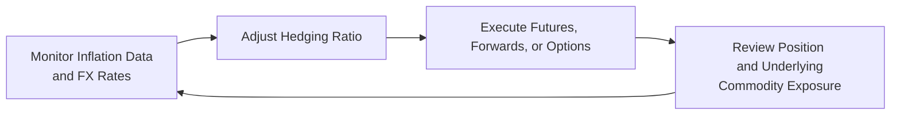

## Overview

Inflation hedging and currency risk management often spring to mind when we think about commodities—especially if we recall those moments when raw material prices soared alongside ramping inflation. Maybe you’ve been there before: you expected to lock in stellar returns from a commodity exposure, only to find out that currency swings ate away a big chunk of the profits. It’s frustrating, right?

This segment tackles both sides of that coin: first, how commodities can serve as that trusty inflation hedge, and second, how to manage currency risk so that your carefully planned gains don’t vanish simply because your base currency took an unanticipated turn. We’ll walk through real asset-based solutions, dynamic hedging strategies, emerging market considerations, and a bunch of examples to clarify key points.

## Commodities as an Inflation Hedge

### The Concept of Inflation Hedging
An inflation hedge is a position or strategy designed to protect investors from the erosion of purchasing power, which can occur whenever the consumer price index (CPI) or other relevant inflation measures rise. Commodities—like oil, precious metals, agricultural produce, and industrial metals—are often viewed as a natural hedge against inflation. After all, if the price of raw materials is climbing, it’s logical to think that the value of the commodity exposure might climb in tandem.

Here’s a quick personal anecdote: I remember evaluating a basket of metals (copper, aluminum, nickel) during a time inflation was ticking upward. For the first few months, it felt like we had discovered a hidden gem. Then inflation soared faster than we expected, and the commodity basket indeed rose in value, offsetting the rising cost environment. Of course, I also had to keep an eye on the currency side—copper is typically quoted in U.S. dollars, and if my home currency was anything but USD, let’s just say the “gain” was more complicated to interpret.

### Why Commodities Track Inflation
Commodities often reflect changes in inflation because they are the raw inputs of the economy’s engine. When the prices of energy, metals, or grains move higher, manufacturers and consumers eventually pay more for end products. This dynamics-based relationship underpins the argument for commodities as a key inflation hedge in multi-asset portfolios.

From an economic theory angle, Purchasing Power Parity (PPP) suggests that exchange rates should, over the long run, move in proportion to price levels between countries. Rising domestic inflation eventually leads to shifts in exchange rates, theoretically. Meanwhile, commodities priced globally (often in USD) can reveal these inflationary signals swiftly.

### Interest Rates and Monetary Policy
Central banks adjust interest rates to influence inflation and economic growth. When a central bank loosens monetary policy (e.g., lowering interest rates or expanding its balance sheet), it tends to stimulate activity, which can fuel inflation—especially if too many dollars chase too few goods. Historically, expansions in money supply have often led to higher commodity demand (sometimes even speculative demand), pushing commodity prices up. If you rely on commodities as part of your return stream or hedge, you’ll want to watch those monetary policy meetings like a hawk.

## Understanding Currency Risk in Commodity Transactions

### Key Drivers of Exchange Rate Movements
Exchange rates can pivot for reasons both fundamental and speculative. Some core drivers include:  
• Relative interest rates: If Country A pays higher interest than Country B, investors funnel capital to the higher-yield country, strengthening its currency.  
• Trade balances: Persistent deficits can weaken a currency, while surpluses can strengthen it.  
• Political stability: Markets often reward stable countries with stronger currencies, while political shocks can trigger capital flight.  

Whenever you’re dealing in commodities—say, you’re an emerging market producer exporting oil internationally or a U.S. consumer importing raw materials—these exchange-rate fluctuations can significantly impact your bottom line.

### Exchange Rate Exposure and Commodity Prices
Take crude oil as a typical illustration. It’s primarily priced in U.S. dollars, so if you’re a non-U.S. consumer, you’re vulnerable to USD exchange rate swings. On the flipside, if your functional currency is the USD but you’re producing oil in, say, an emerging market with a different domestic currency, you might see your production costs in that local currency. The interplay of these two currency frameworks can mean your profit margin is subject to constant fluctuations.

Let’s throw in a quick formula for the forward exchange rate (simplified for illustration). If S₀ is the current spot rate (expressed as units of domestic currency per unit of foreign currency), then the forward rate F can be approximated by:


F = S_0 \times \frac{(1 + i_{\text{domestic}})}{(1 + i_{\text{foreign}})}


This relationship (often called interest rate parity) helps set the forward price for exchange rates. If you’re locked into a commodity contract for future delivery, you might want to hedge that currency fluctuation with a forward contract, especially if you see a big difference in interest rates across currencies.

## Key Hedging Techniques

### Currency Futures and Forwards
Futures and forwards are contractual agreements to buy or sell currency at a future date at a price determined now. Imagine an importer in Europe who expects to buy U.S.-priced oil in six months. If the euro is strong now but might weaken, the European buyer may enter a forward contract to lock in the EUR/USD exchange rate, effectively insulating itself from a sudden euro depreciation. It’s a straightforward approach but requires counterparty monitoring, especially for forward contracts.

### Options and Collars
Another approach uses currency options. Rather than commit to buying or selling at a set forward rate, an option gives you the right—but not the obligation—to transact at a pre-agreed strike price. It can be more flexible than a forward or future. A collar strategy pairs a purchased put option with a sold call (or vice versa), limiting downside cost while capping upside potential.

### Money Market Hedging
In certain situations, you can create synthetic forwards by borrowing one currency and lending in another. This money market hedge approach can be useful if you have lines of credit or the ability to deposit funds in different currencies without too much friction. It’s basically a financial balancing act to offset inflows or outflows in foreign currencies.

### Merging Inflation-Linked Bonds with Commodity Exposures
While commodities can help hedge inflation, some investors prefer to pair them with other real asset-based solutions—like inflation-linked bonds (e.g., TIPS in the U.S. or index-linked gilts in the U.K.). The bond component offers you a real rate plus an adjustment for CPI, while the commodity exposure can provide price appreciation (and a dash of volatility, let’s be honest).

The upside:  
• The interest payments adjust for inflation on the bond side.  
• Commodity exposure performs well in demand-driven inflationary scenarios.  

The combined effect is often a more stable hedge than relying on a single asset class. Of course, watch for correlation changes—sometimes commodities and inflation deviate from a historical pattern.

## Emerging Market Producers vs. Developed Market Consumers

### Political Uncertainty and Liquidity Constraints
Producers in emerging markets (EMs) might face more acute political risk, partial capital controls, and not-so-deep foreign exchange markets. So even if an EM-based miner wants to hedge currency risk, the forward or futures market for their home currency might be illiquid or priced at wide spreads. That can hamper effective hedging. In worst cases, currency inconvertibility or regulatory constraints make it nearly impossible to implement standard hedges.

For developed market (DM) consumers, hedging may be easier: liquidity is broad, and currency markets for the U.S. dollar, euro, or Japanese yen are quite deep. This disparity can create an odd dynamic: the DM-based investor can systematically hedge their commodity cost risk, while the EM-based producer remains partially exposed. Over time, these structural advantages in DM currency markets can influence the flow of funds and shape global commodity prices.

### Case Example: Copper Exporter in Chile
Picture a Chilean mining company. Chile’s peso can be quite volatile because copper is a significant national export. As copper prices shift with global demand, capital flows into or out of the country, moving the exchange rate. The miner would like to hedge both commodity price risk and currency risk—but robust forward markets for CLP (Chilean peso) vs. USD may have limited depth, especially in a crisis. This reality complicates the company’s risk management approach.

## Dynamic Hedging Strategies in Practice

### Why Static Hedges Might Fall Short
A static hedge—say, locking in your exchange rate for 12 months and sunsetting the conversation—can backfire if market conditions change drastically. Commodities are notoriously volatile; so are currencies at times. As the correlation between inflation, commodity prices, and currency movements shifts, a static hedge might overshoot or undershoot your real risk.

### Adjusting to Evolving Correlations
A dynamic hedge means regularly reassessing your exposures and adjusting your hedging ratios. Some advanced managers use Value at Risk (VaR) or parametric scenario analyses to decide when to re-hedge or roll forward positions. Others rely on macroeconomic indicators—checking inflation expectations, central bank policy signals, and forward curves—to guide how aggressively to hedge. It can feel a bit like spinning plates, but done right, it helps you keep pace with a fast-changing environment.

### Example of a Dynamic Hedge Roll
Consider an importer who expects to purchase 10,000 barrels of oil each quarter. They might initially hedge 80% of their currency exposure for the next quarter, then watch interest rates and inflation data to decide if they want to adjust to 90% or 70% coverage two months into that period. This rolling approach aims to remain agile.

Below is a Mermaid diagram illustrating a simple dynamic hedging workflow:

In the diagram, there’s a loop connecting the monitoring of inflation data and exchange rates (A) through the adjustment of the hedging ratio (B), execution of hedges (C), and periodic review (D).

## Interplay Between Commodity-Driven Inflation and Macroeconomic Factors
Commodity-driven inflation does not exist in a vacuum. Demand for raw materials can surge if there is global economic growth, but other factors—like productivity gains or workforce changes—can offset inflationary pressures. Plus, governments can intervene through subsidies, export controls, or strategic reserves that distort commodity pricing signals.

The net effect: your hedging strategy needs to consider not just the commodity price and your direct currency cross, but also potential policy changes, supply chain disruptions, and correlations with other portfolio assets. It’s a puzzle, but that’s part of what makes commodity-based investing both fascinating and tricky.

## Practical Tips and Best Practices

• Maintain a holistic view: Evaluate inflation risk, commodity exposure, and currency exposure in a unified framework.  
• Keep an eye on crisis correlations: Correlations often move to 1.0 in a crisis, so prudent managers avoid overreliance on single-asset hedges.  
• Evaluate the cost of carry: With some derivatives, you might pay a premium or face negative roll yield if the market is in contango.  
• Don’t forget operational considerations: If your firm is physically producing or consuming the commodity, align your financial hedges with operational timelines.  
• Reassess frequently: As we noted in dynamic hedging, markets shift fast. A set-it-and-forget-it approach is rarely optimal.

## Exam Relevance and Strategy Considerations
On the CFA Level III exam, expect scenario-based questions that ask you to identify (1) an appropriate inflation hedge using commodities and (2) a mechanism for hedging currency risk for an international transaction. You could see cases where you are the portfolio manager for a sovereign wealth fund in an emerging market setting, or you’re assisting a corporate treasury in a developed country. They might present you with a forward price, spot price, interest rates, or implied volatility data for currency options, asking you to propose a cost-effective hedge.

• Focus on practical application: Show that you can read the data, pick the right hedge instrument, and evaluate its payoff.  
• Time management: For essay questions, plan your structure. Typically, you’ll need to articulate the rationale, math (like forward rate calculations), plus any relevant disclaimers or considerations.  
• Macro frameworks: Understanding relationships among inflation, commodity prices, and central bank policy is crucial.  

## References and Further Reading
• Fabozzi, F., & Focardi, S. (2008). Trend Following and Inflation Hedging. Research Foundation of CFA Institute.  
• Solnik, B. (2000). International Investments. Addison-Wesley.  
• CFA Institute. (2023). “Reading on Currency Management: An Introduction.” CFA Program Curriculum.

## Test Your Knowledge: Inflation Hedging and Currency Risk Management



### Which statement best describes the primary rationale for viewing commodities as an inflation hedge?

- [ ] Commodities are immune to market volatility.
- [x] Commodities often rise in value along with general price levels.
- [ ] The correlation between commodities and inflation is consistently negative.
- [ ] Commodity markets operate independently of global monetary policies.

> **Explanation:** Commodities are often viewed as an inflation hedge because their prices tend to rise when overall prices rise, preserving real value.

### Which of the following is a key driver of exchange rate movements that can impact commodity transactions?

- [ ] The color of banknotes in each country.
- [x] Differences in interest rates between countries.
- [ ] Cultural norms around savings and spending.
- [ ] Political rhetoric unrelated to monetary policy.

> **Explanation:** A major factor in exchange rate fluctuations is the difference in interest rates between two currencies, which attracts or deters capital flows.

### A European steel producer anticipates buying iron ore priced in USD. Which approach would best protect it from an unexpected rise in the USD/EUR exchange rate over the next three months?

- [ ] Ignore foreign exchange hedging and focus solely on iron ore price risk.
- [ ] Wait until the transaction date and hope the EUR remains strong.
- [x] Enter a forward contract on USD to lock in today’s EUR/USD rate.
- [ ] Purchase a call option on the EUR.

> **Explanation:** A forward contract sets the cost in local currency (EUR), mitigating adverse exchange rate movements between now and the transaction date.

### Which of the following best describes a collar strategy for currency hedging?

- [x] Buying an option while selling another to limit downside cost but cap potential benefits.
- [ ] Purchasing an unlimited number of options with no premium.
- [ ] A dynamically adjusted futures strategy with monthly rollovers.
- [ ] Using currency swaps to lock in loan interest rates.

> **Explanation:** A collar typically involves buying a put option and writing a call option (or vice versa), thereby setting a floor and a cap on the exchange rate exposure.

### When might a static currency hedge be inadequate for commodity-related transactions?

- [ ] In stable markets with predictable inflation.
- [x] In volatile markets where commodity correlations and exchange rates shift rapidly.
- [ ] When the investor wants to eliminate all market risks.
- [ ] If there is a long-term decline in commodity prices.

> **Explanation:** A static hedge can become misaligned if market conditions change abruptly, so a dynamic approach is often necessary in highly volatile situations.

### Which asset combination often provides a more robust inflation hedge than relying on commodities alone?

- [ ] Regular corporate bonds plus venture capital funding.
- [x] Inflation-linked bonds plus certain commodity exposures.
- [ ] Equities plus a collar on the domestic currency.
- [ ] A mix of cryptocurrencies and short-term T-bills.

> **Explanation:** Inflation-linked bonds (like TIPS) and commodities often complement each other for inflation protection by offering different sensitivities to inflationary drivers.

### Which factor often prevents emerging market producers from efficiently hedging currency exposure?

- [ ] High levels of foreign trading desks willing to offer derivative contracts.
- [x] Illiquid forward markets and high transaction costs.
- [ ] Access to numerous incentive programs from local governments.
- [ ] Overly stable exchange rates.

> **Explanation:** Emerging market producers can face limited liquidity and high risk premiums, making effective hedging more difficult or expensive.

### According to interest rate parity, the forward price on a currency is influenced by:

- [ ] The difference in capital gains taxes between two jurisdictions.
- [ ] Seasonal demand for shipping containers.
- [x] The relative interest rates in the two countries for that currency pair.
- [ ] Unemployment benefits and entitlement programs.

> **Explanation:** Interest rate parity states that forward prices adjust to reflect the interest rate differentials between two currencies.

### Which best describes a major risk in commodity-driven inflation scenarios?

- [ ] Complete elimination of inflation from the economy.
- [ ] Guaranteed stability in currency markets.
- [ ] Negative correlation between commodity and currency prices.
- [x] Correlations among asset classes may spike, limiting diversification benefits.

> **Explanation:** During times of market stress (often driven by commodity-driven inflation), correlations can converge, undermining typical diversification strategies.

### True or False: A dynamic hedging strategy requires periodic reassessment of exposures and may involve adjusting hedge ratios based on evolving market conditions.

- [x] True
- [ ] False

> **Explanation:** Dynamic strategies involve active management of hedges. As market conditions change, hedge ratios are adjusted accordingly.


