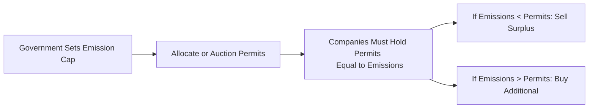

## Introduction

So, let’s talk about carbon—not the diamond kind, but the carbon that escapes from factories, mines, and your beloved car’s tailpipe. You’ve probably heard that fossil fuel usage is fueling climate change, but you might still be wondering, “Why does a commodities investor care about these pesky emissions?” Thing is, climate regulations and consumer sentiment have changed the rules of the game. Players in oil, gas, metals, and agriculture need to grasp how carbon credits work, how regulations are evolving globally, and how to measure a project’s carbon footprint.

In this section, we’ll walk through the fascinating world of carbon credits and the broader framework of environmental policies—like cap-and-trade—and how they impact both investment return and risk. We’ll discuss best practices in environmental impact assessments (EIAs), see how renewable energy is changing demand for certain commodities, and dig into how Environmental, Social, and Governance (ESG) metrics matter when raising capital. And if you’re thinking this all sounds a little too “nice to have,” well, there’s an increasing body of evidence and experience that regulatory oversight and market preferences make climate strategy essential for long-term growth. In my opinion, ignoring it is, well, a bit like throwing your seeds on concrete and hoping for a bumper crop.

## Environmental Impact of Commodity Production

Commodity production—oil extraction, coal mining, agriculture, or metals smelting—produces a variety of pollutants. Chief among these, of course, are greenhouse gases (GHGs), such as carbon dioxide (CO₂) and methane (CH₄). These emissions come from burning fuel in heavy machinery, from industrial processes, or sometimes from land-use changes like deforestation to make way for farmland. If you think about a typical oil well, it not only has direct emissions (like the flaring of associated gas) but also indirect ones from the construction of pipelines and the electricity used on site. All of these factors shape the environmental footprint.

From a risk management standpoint, the global pivot toward more stringent climate regulations creates a cost burden for large emitters. And from an investment lens—especially if you recall earlier chapters on portfolio diversification—commodity assets often help hedge inflation or diversify away from equities. However, in a world with evolving carbon policies, the attractiveness of certain commodities can shift quickly. Think about it this way: heavy emitters may face extra taxes, additional operating requirements, or even reputational risk that translates to a higher cost of capital.

## Carbon Credits: Filtering Emissions with Market Forces

Carbon credits are tradeable certificates that grant the holder the legal right to emit one metric ton of carbon dioxide (or the equivalent). Sound abstract? Let’s break it down: if you’re a company with a set limit on emissions, you can either reduce your own emissions or buy additional allowances (carbon credits) from others who are cleaner than they need to be. This dynamic fosters a supply-and-demand marketplace for carbon.

### Anatomy of Cap-and-Trade

The term “cap-and-trade” might sound complicated, but it’s basically: the government sets a “cap” on total carbon emissions for a region, then divides that cap into discrete permits (the “allowances”). Emitters are required to hold enough allowances to cover their emissions. If a company manages to reduce its emissions below its permitted level, it can sell the leftover allowances; if it emits more than allowed, it must buy credits. This creates a financial incentive to invest in cleaner tech. The irony is that for many companies, the cost to upgrade to lower-emission processes might be less than the cost of buying carbon credits in the marketplace. That’s precisely how a well-designed cap-and-trade scheme encourages innovation.

Here’s a simple diagram to illustrate the flow of cap-and-trade:

### Offsets and Carbon Projects

Offsets are another flavor of carbon credits; they represent projects that reduce or remove GHGs from the atmosphere, like reforestation or improved farming techniques that sequester carbon in soil. If you as a commodity producer can invest in offset projects, you may generate carbon credits to sell (or to offset your emissions). This might mean a farmland invests in improved soil management or a timberland invests in reforestation to soak up more CO₂. I once visited a farmland project where they switched to no-till farming—fewer tractor passes, a lot less fuel usage, and more carbon stored in the soil. They ended up generating offsets that became a revenue stream. That was a surprise to me, because farmland didn’t initially strike me as a place you’d see a direct connection to carbon credits. But in practice, the synergy is there.

## Regulatory Frameworks

Now, let’s spotlight a couple of the biggest regulatory regimes that shape how carbon credits are created, priced, and traded. Understanding these frameworks helps us see how carbon compliance (or non-compliance) changes a company’s strategy, cost structure, and risk profile.

### EU Emissions Trading System (EU ETS)

The EU ETS, launched in 2005, remains the largest multinational cap-and-trade market. It covers major polluters in power generation, manufacturing, and aviation within the European Economic Area. The idea is that each installation (such as a power plant or refinery) receives or buys a certain number of allowances each year. If it needs more, it purchases them from the secondary market. Over time, the cap decreases, which intensifies the scarcity of allowances and often drives up the carbon price—ultimately promoting cleaner operations.

For investors, companies regulated under the EU ETS might face volatility in their operating expenses since carbon allowance prices can fluctuate. A steel producer that uses coal-fired blast furnaces might see its costs jump if allowance prices spike. That kind of risk can be hedged partly by forward contracts in the carbon market, but it often depends on the availability and liquidity of the specific carbon instruments. Alternatively, such firms might choose to invest in technology upgrades—like an electric arc furnace—to reduce emissions. So behind the scenes, the existence of a robust carbon market can profoundly influence capital expenditures and operating decisions.

### California’s Cap-and-Trade Program

California has pioneered its own program since 2013, covering electricity producers, large industrial facilities, natural gas distributors, and other sectors. While smaller than the EU ETS in total coverage, it’s an intriguing blueprint for state-level regulation in the United States. The state sets a cap on total GHG emissions, ratcheting it down over time. Similarly, businesses subject to the program can purchase allowances from quarterly auctions or offset credits from approved projects (e.g., forest preserves). 

Now, the interesting part is how this system integrates with broader markets: California partners with Quebec to form a cross-border carbon market, meaning credits can sometimes flow between the jurisdictions. For commodity traders and producers, these linkages create opportunities—and complexities. If you’re a heavy emitter operating in multiple North American regions, you must track not only local carbon prices but also how jurisdictions might link or change their regulations. 

## Renewable Energy and Demand Disruption

Remember that old phrase, “Necessity is the mother of invention”? In the commodities space, the drive for lower carbon footprints has catalyzed growth in renewables like solar, wind, and hydropower. We’re also seeing a push toward battery metals (lithium, nickel, cobalt) to power electric vehicles and store energy. This transition is, well, shaking up the traditional demand patterns:

• Fossil fuels: Over the long term, we may see a gradual decline in the demand for coal and certain heavy-grade oils as cleaner alternatives become more cost-competitive and regulations clamp down on high-emission fuels.  
• Metals: The push for electrification and renewable energy technologies can spur demand for metals used in battery production, wind turbines, or solar panel components.  
• Agriculture: Biofuels and new sustainable farming practices can alter how farmland is used and how crops are rotated, sometimes creating synergy with carbon offset programs.  

For an investor, the question is whether these shifts might cause certain commodities to become “stranded assets”—for example, a deep-sea oil project that becomes unprofitable if carbon costs skyrocket and alternative fuels flourish.

## Environmental Impact Assessments (EIAs) and Permitting

If you’re investing in an oil sands project or a new copper mine, local regulations may require you to do an Environmental Impact Assessment (EIA) before you get the go-ahead. This is basically a study evaluating how the project might affect local ecosystems, water resources, air quality, and communities. EIAs can also address climate-related impacts, especially in jurisdictions with strict GHG oversight. Why does this matter to an alternative investments analyst?

• Project Timeline: A thorough EIA can delay project start dates, which might hamper the IRR (internal rate of return).  
• Operating Conditions: Regulators might limit operational hours or require protective technologies, which can increase capital or operating expenses.  
• Community Relations: A robust EIA with stakeholder engagement can foster goodwill and reduce the odds of lawsuits.  

Taking the time to do an EIA properly can also result in intangible benefits. It confirms you’re less likely to face a sudden regulatory clampdown or reputational backlash. Plus, some large institutional investors now require proof of sound environmental practices before committing capital.

## ESG Metrics and Disclosures

As global capital markets place greater emphasis on sustainability, commodity companies that want to attract institutional investment may need to demonstrate robust ESG credentials. Environmental disclosures can include data such as:

• Scope 1, Scope 2, and potentially Scope 3 emissions.  
• Use of renewable energy in operations.  
• Land use, water management, and biodiversity preservation.  
• Plans for reducing GHG intensity over time.  

In my opinion, these disclosures can sometimes feel like an endless series of forms and steps. But guess what? Many limited partners (LPs), especially pension funds and endowments, now treat ESG as a non-negotiable factor in their investment policy statements. Failing to meet those standards might disqualify a commodity fund from receiving allocations. So whether you love or hate the extra paperwork, the market is pushing these metrics front and center.

## Carbon Offsets in Agriculture and Forestry

Agriculture and forestry projects can create carbon offset credits by improving land management, planting trees, or preserving existing forests. Think blow-drying your hair with the window open. That’s a bit random, but let me explain: we don’t typically see farmland as an emissions sink, but as more land managers adopt climate-friendly practices, agricultural soils can store carbon in the same way forests do. This might allow them to sell carbon offset credits in cap-and-trade or voluntary markets.

Forestry is a bit more intuitive: each tree sequesters carbon in its biomass. Plantation timber, sustainable logging, and reforestation programs can thus create a decent revenue stream from carbon offsets—beyond just selling the wood. This merges well with prior chapters about farmland and timberland as alternative investment classes. The synergy is that you could invest in farmland not just for the agricultural yield but also for the carbon credits that farmland might generate.

## Strategies for Resilience: Cleaner Tech and Better Waste Management

Commodity-intensive operations are vulnerable to carbon price shocks, forced technology upgrades, or (perhaps worst of all) a battered reputation if found guilty of grossly polluting practices. So, how do these companies stay resilient?

• Cleaner technology adoption: Switching to higher-efficiency equipment or changing production processes to cut emissions intensity.  
• Waste and water management: Minimizing toxic discharge and recycling water in closed-loop systems can reduce environmental damage (and often reduce operating costs).  
• Green financing: Using sustainability-linked loans or green bonds to finance low-carbon updates, which may bring more attractive financing terms.  
• Upgrading corporate governance: Creating dedicated positions or committees for climate and environmental oversight.  

The bottom line is that these strategies don’t just help the planet—they can also help ensure a company doesn’t get blindsided by regulatory action or the next wave of climate activism.

## Simple Formula for Estimating Carbon Offset Costs

It’s useful to show a simple formula for companies that purchase offsets to neutralize some of their emissions. If your firm needs to offset a certain volume of emissions due to a regulatory or voluntary target, you might see a cost structure something like this:


\text{Carbon Offset Cost} = P_{\text{offset}} \times Q_{\text{emissions}}


Where:  
• \\(P_{\text{offset}}\\) is the price of one carbon offset credit (per ton).  
• \\(Q_{\text{emissions}}\\) is the quantity of emissions (in tons) you need to offset.  

As trivial as this might look, the real complexity lies in the variability of \\(P_{\text{offset}}\\). Prices fluctuate by project type, region, regulatory environment, and verification standard. Some companies may hedge offset prices or lock into multi-year offset purchase agreements to manage cost volatility.

## Exam Tips and Key Takeaways

• Integration with Portfolio Strategy: Carbon costs can shift the risk-return profile of specific commodity investments. Consider the correlation between carbon price movements and commodity prices in constructing or rebalancing portfolios.  
• Innovation and Disruption: As carbon regulation toughens, expect restructuring in carbon-heavy industries. Keep your eyes on renewable energy, carbon capture technology, and new business models (such as carbon farming).  
• Regulatory Risk: Understand the local frameworks—such as EU ETS or regional systems like California’s—because they can dramatically affect a project’s viability and future cash flow.  
• ESG & Disclosure: So many institutional investors are leaning into these metrics. Thoroughly verifying a company’s sustainability claims can help mitigate greenwashing concerns.  
• Carbon Offsets: If considering farmland, forestry, or related assets, factor in revenue streams from carbon credits. They can raise your IRR but also come with verification costs and market price risk.  

As you study, anticipate scenario-based questions. A typical prompt might describe a commodity producer’s carbon intensity and ask how changes in carbon pricing or offset availability would affect the producer’s NPV or corporate strategic decisions. Familiarize yourself with how carbon markets function and connect with broader commodity fundamentals.

## References and Further Reading

• Stern, N. (2006). The Economics of Climate Change: The Stern Review. Cambridge University Press.  
• World Bank. (2022). State and Trends of Carbon Pricing. Washington, DC: World Bank Publications.  
• CFA Institute. (2024). “ESG Analysis and Application in Investments.” CFA Program Curriculum.  
• Intergovernmental Panel on Climate Change (IPCC) Reports: https://www.ipcc.ch/  
• California Air Resources Board (CARB): https://ww2.arb.ca.gov/  
• European Commission (EU ETS): https://ec.europa.eu/clima/policies/ets_en  

## Test Your Knowledge: Environmental Impact, Carbon Credits, and Regulation Quiz



### Which of the following best describes the primary function of a cap-and-trade system?

- [ ] To eliminate all carbon emissions from industrial processes.
- [ ] To finance renewable energy projects via tax incentives alone.
- [x] To set an overall emissions limit and allow trading of emission permits among companies.
- [ ] To subsidize fossil fuel companies for exploring new drilling sites.

> **Explanation:** A cap-and-trade program imposes a total cap on emissions and issues permits that can be bought or sold. This market-based approach encourages reductions where they are most cost-effective.

### In the EU Emissions Trading System (EU ETS), how does the emissions cap typically change over time?

- [ ] It remains constant each year to maintain price stability.
- [x] It decreases gradually to incentivize progressive emission reductions.
- [ ] It increases gradually to lower allowance prices.
- [ ] It is determined solely by the individual companies within the system.

> **Explanation:** The EU ETS sets a descending cap over time to reduce overall emissions and promote cleaner technology adoption among participating industries.

### A company emits 10,000 metric tons of CO₂ per year. If the offset price is $15 per ton, and the firm decides to offset 1,000 tons, how much will the offset purchase cost?

- [ ] $150
- [x] $15,000
- [ ] $1,500
- [ ] $150,000

> **Explanation:** Using the formula (Offset Cost) = Price × Quantity = $15 × 1,000 = $15,000.

### Which of the following is a key difference between carbon allowances and carbon offsets?

- [x] Allowances are part of a cap-and-trade regulatory program, while offsets often come from emission-reduction projects outside the cap.
- [ ] Carbon offsets are always easier to obtain than allowances.
- [ ] Carbon offsets always cost more than allowances.
- [ ] Allowances are purchased voluntarily, while offsets are mandatory.

> **Explanation:** Carbon allowances are emission permits within a regulatory cap-and-trade system, whereas offsets are created by projects that reduce emissions and can be sold in either regulated or voluntary markets.

### In California’s cap-and-trade program, which statement is true?

- [x] It allows regulated companies to use a certain proportion of offset credits to satisfy part of their compliance obligations.
- [ ] It bans the use of offsets entirely.
- [ ] It only regulates passenger vehicles.
- [ ] It has no connection to other jurisdictions.

> **Explanation:** California allows restricted use of offset credits for compliance; it also has a link with Quebec’s carbon market, broadening the trading pool.

### If an investor is looking at a farmland project that also generates revenue from carbon offsets, which of the following should they consider carefully?

- [x] The verification standards for the carbon offsets.
- [ ] The daily closing prices of cross-currency swaps.
- [ ] The correlation between farmland yields and gold prices.
- [ ] The volume of water rights in desert mining.

> **Explanation:** The investor should ensure offsets are verified according to credible standards, enabling them to be recognized in regulated or voluntary carbon markets.

### Which best describes how environmental, social, and governance (ESG) disclosures impact commodity firms?

- [ ] ESG disclosures are purely cosmetic and have negligible effects on a firm's capital-raising ability.
- [ ] ESG disclosures don’t matter unless a firm is seeking bank loans.
- [ ] ESG disclosures are typically kept confidential from investors.
- [x] ESG disclosures can improve access to institutional capital and enhance transparency with stakeholders.

> **Explanation:** Investors increasingly require detailed ESG disclosures, and better transparency can reduce financing costs and improve the firm’s reputation.

### In analyzing a company exposed to carbon regulation, what is a key factor to watch regarding operating profitability?

- [ ] The firm’s plan to invest in non-related sports franchises.
- [ ] The color of its marketing materials.
- [x] The company’s annual carbon allowance or offset purchase cost relative to revenue.
- [ ] The height of the company’s physical factory walls.

> **Explanation:** For carbon-intensive operations, the cost of allowances (or offsets) compared to revenue materially affects the company’s margins and cash flow.

### How do carbon offset projects in forestry typically generate offset credits?

- [x] By absorbing CO₂ as trees grow, thereby reducing net atmospheric emissions.
- [ ] By creating synthetic fossil fuels to replace coal in power plants.
- [ ] By ignoring reforestation initiatives to save costs.
- [ ] By inventing new forms of farmland equipment.

> **Explanation:** Forestry projects reduce net GHG levels through tree growth, capturing carbon in biomass. This process can generate offset credits that can be sold in carbon markets.

### True or False: In a cap-and-trade system, the government generally increases the emissions cap over time to promote economic growth.

- [ ] True
- [x] False

> **Explanation:** The cap typically decreases over time, encouraging emitters to adopt cleaner technologies and lower their emissions progressively.


