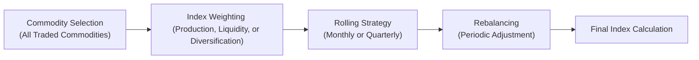

## Introduction
Commodity indices might look intimidating, but they play a huge role in modern portfolios—especially when you’re trying to diversify your exposure beyond traditional stocks and bonds. I’ll admit it: The first time I encountered commodity indices, I was a bit stunned by how many variations exist. There’s the classic S&P GSCI, the Bloomberg Commodity Index, and a host of “second-generation” indices that tweak weights, roll schedules, and selection methods in ways that can seriously affect your returns. The goal here is to share everything from how these indices choose their components to how they roll from one futures contract to another, and how these choices can lead to different performances. Along the way, expect some real-world anecdotes, a bit of number-crunching, and a few diagrams showing how these indices are structured.

## Key Components of Commodity Index Construction
Before we dive into specifics, let’s outline the broad components every commodity index methodology has in common:

• Selection Universe: Which commodities are considered?  
• Weighting Scheme: How do they decide the weight for each commodity (production-based, liquidity-based, or diversification-based)?  
• Rolling Mechanism: When a futures contract expires, how does the index “roll” into a new contract?  
• Rebalancing Schedule: How frequently do commodity weights get reset to target levels?  
• Governance: What are the rules for adding/removing commodities and adjusting index methodology?

At the simplest level, a commodity index tries to replicate a passive investment in the futures of that basket. But, trust me, the devil is in the details—especially when it comes to how often they switch (roll) their futures contracts and how that roll might generate or lose returns (the infamous “roll yield”).

Below is a high-level mermaid diagram that shows a simplified overview of how commodity indices are constructed:



## Common Commodity Index Weighting Schemes
A huge factor that differentiates commodity indices is how they weight each constituent. Let’s break down the big methods:

### Production Weighting
Indices like the S&P GSCI (previously known as the Goldman Sachs Commodity Index) typically rely on production-based weighting. The general idea is: “If a commodity has a higher share of global production, it should have a higher weight in the index.” For instance, crude oil historically dominates this index because it’s heavily produced and consumed worldwide.  
• Pros: Reflects the economic importance of each commodity (think global supply).  
• Cons: Concentration risk. You can end up with very heavy weights in a handful of energy commodities, making your index more vulnerable to big moves in oil and natural gas.

### Liquidity Weighting
The Bloomberg Commodity Index (BCOM) chooses components partly based on their liquidity (for instance, trade volume and open interest) and partly on production and diversification metrics. BCOM strives for greater balance among energy, metals, and agriculture.  
• Pros: Typically more diversified, which can help reduce risk from a single commodity’s price swings.  
• Cons: May underrepresent smaller but strategically important commodities (like certain metals or softs).

### Market-Cap Weighting
Though less common in commodities than in equities, some dynamic commodity indices attempt a “market cap” approach by using a combination of forward price curves and open interest to size each commodity’s share.  
• Pros: Seeks to approximate where the bulk of investable money sits.  
• Cons: You might still face concentration risks if certain commodities dominate in open interest (again, energy is often large).

### Diversification-Tilted
Some second-generation indices impose special constraints—like “No commodity can exceed 10% of the total portfolio.” This approach ensures broad coverage. It also might incorporate correlation-based weighting, so that highly correlated commodities get less weight to enhance diversification.  
• Pros: More stable returns, less sector concentration.  
• Cons: Can deviate significantly from real-world commodity consumption or production patterns.

## Rebalancing and Rolling Methodologies
Once the index has assigned weights, it must rebalance at a given frequency—maybe monthly, quarterly, or annually. Rebalancing is about resetting back to target allocations if, say, one commodity soared in price and started to dominate the index. If you do it too often, transaction costs can eat you alive. If you do it too infrequently, your portfolio might drift into unintended exposures.

### Rolling Mechanics
But the bigger operational challenge is rolling futures contracts. Futures expire, so to maintain a long exposure, you have to sell the expiring contract and buy a farther-month contract. The way it’s done can significantly influence returns.

• Simple Front-Month Roll: Many indices just roll into the next month’s contract on a predetermined schedule (like the 5th through 9th business day).  
• Enhanced Rolling: Some see that if the next contract is selling at too large a premium (contango), they might skip to a contract further out in hopes of a better roll yield.  
• Seasonal Rolling: Indices that handle commodities like grains or natural gas might shift to different months in anticipation of seasonal supply/demand.

#### Roll Yield
Roll yield can be positive if the futures curve is in backwardation (the spot or near-month futures are trading at a premium to longer-dated futures), or negative if in contango. Commodities historically known for backwardation (like certain precious metals or occasionally energy) can deliver a positive roll yield, although this dynamic can change quickly.

## Popular Commodity Indices
Let’s consider two big names:

### S&P GSCI
• Weighting: Production-based, leading to a high allocation to energy.  
• Roll Method: Generally rolls on a monthly schedule, shifting from the expiring contract to the next-nearest.  
• Exposure: Heavier tilt towards energies means performance is often highly correlated with oil price movements.  
• Rebalancing: Annual reconstitution of weights based on updated production data.  

### Bloomberg Commodity Index
• Weighting: Diversification-based with liquidity and production adjustments.  
• Roll Method: Different schedule that can spread out the roll over multiple days to reduce market impact.  
• Exposure: More balanced coverage of energy, agriculture, and metals compared to S&P GSCI.  
• Rebalancing: Annual with monthly reviews for extreme changes or unusual events.

It’s not unusual to see material differences in returns between the S&P GSCI and BCOM—especially when oil goes on a wild ride. An energy bull run often makes the S&P GSCI outperform since it’s so energy-heavy. But in a stable or falling energy environment, BCOM’s heavier weighting in precious metals or agriculturals can smooth the ride.

## Dynamic and Second-Generation Commodity Indices
In practice, the old-school “first-generation” indices are purely rules-based. They basically follow a strict schedule for rolling. They don’t try to time the market or shift weights in response to current fundamentals. However, second-generation indices do:

• Heuristic or Momentum-Based Weighting: For instance, overweight commodities with positive price momentum.  
• Seasonality Adjustments: Tilt the weight in agriculture or natural gas depending on expected seasonal patterns.  
• Risk Parity Indices: Allocate risk evenly among different commodities based on volatility.  
• Fundamental Tilt: Adjust exposure based on fundamentals like stocks-to-use ratios in agriculture or inventory levels in energy.

Second-generation indices may attempt to reduce contango or exploit backwardation. This can create new exposures—some beneficial, some less so. But they also tend to have higher complexity and transaction costs. One common approach is to examine if the commodity’s curve is in backwardation, and if so, choose near-month futures; if in contango, skip to a further contract with a flatter upward slope.

## Performance, Diversification, and Risk
Commodity indices are popular with institutional investors partly because they can serve as a hedge against inflation and offer diversification from standard equity and bond portfolios. Historically, certain commodities (like precious metals) demonstrated a lower correlation with equities. However, correlation structures shift over time.

When including a commodity index in your portfolio, watch out for:
• Sector Concentrations: High weighting to energy might overshadow your diversification benefits.  
• Roll Returns: Negative roll yields can erode total returns in contango markets.  
• Volatility: Commodity markets can be choppy, especially for agricultural or weather-sensitive commodities.  

### Quick Example of Roll Yield Impact
Let’s say you buy a near-month crude oil futures contract priced at \$60/bbl. Next month, as the contract nears expiry, the next-month futures price is \$62/bbl (slight contango). To maintain exposure, you have to buy the \$62 contract and close the \$60 contract. You’ve effectively locked in a \$2 cost, which is a negative roll yield. If this roll cost repeats for multiple months in a row, it can significantly drag on returns.

## Tracking Error and Portfolio Implementation
Often, investors gain exposure via an Exchange-Traded Fund (ETF) that attempts to replicate a given commodity index. But replication isn’t always perfect. You can see differences because of management fees, timing of trades, or even slight variations in which futures contract the ETF holds. That difference between your actual returns and the index’s returns is your tracking error.

• Minimizing Tracking Error: Some ETFs use a “full replication” approach. Others use “sampling,” which can lead to bigger divergences.  
• Choosing the Right Benchmark: If your strategy is production-weighted but your fund invests in a balanced index, you may see consistent performance deviation.

## Simple Python Example: Calculating an Index Return
Below is a small snippet showing how you might calculate a hypothetical monthly index return if you have data for each commodity’s return in a CSV file along with their weights. This snippet is just to illustrate the kind of “back-of-the-envelope” approach you might take for an in-house index calculation.

```python
import csv

def compute_commodity_index_return(file_path):
    commodities = []
    with open(file_path, 'r') as f:
        reader = csv.DictReader(f)
        for row in reader:
            # Suppose CSV has columns: Commodity, Weight, Return
            weight = float(row['Weight'])
            ret = float(row['Return'])
            commodities.append((weight, ret))
    
    # Weighted sum of returns
    index_return = sum([w * r for w, r in commodities])
    return index_return

# Let's assume 'commodity_data.csv' has columns: Commodity, Weight, Return
monthly_index_return = compute_commodity_index_return('commodity_data.csv')
print(f"Monthly Commodity Index Return: {monthly_index_return:.2%}")
```

In practice, real index calculations can be more involved, factoring in rolling days, different notional amounts, and rebalancing dates. But the notion of summing up weighted returns is the conceptual foundation.

## Rebalancing Frequency and Index Drift
Rebalancing frequency can drastically affect returns, particularly if certain commodity prices surge or crash between reconstitution dates. A more frequent (e.g., monthly) rebalancing schedule ensures the index’s weighting remains close to its target, but can also increase transaction costs and potential slippage. Less frequent rebalancing (e.g., annual) might allow big drifts in commodity weights—possibly leading to bigger performance swings, good or bad.

### KaTeX Formula for Weighted Return
You might recall a standard formula for an index’s weighted return:


R_\text{Index} = \sum_{i=1}^{N} w_i \times R_i


where \\( w_i \\) is the weight for commodity \\( i \\) and \\( R_i \\) is the total return of that commodity’s futures over the measurement period. This formula might be recomputed after each rebalancing date, adjusting weights as necessary.

## Potential Correlations Across Sectors
One of the main reasons to invest in a commodity index is correlation diversification. But each commodity sector might behave differently:
• Energy prices can be sensitive to geopolitical events and OPEC policies.  
• Agriculture can depend on weather patterns or emerging market demand.  
• Metals can move with industrial and technology cycles, and precious metals can reflect safe-haven demand.  

When you sum these together, the correlation with equities and bonds could be lower, which is helpful for the overall portfolio. However, in certain crisis periods—like global market panics—correlations can jump as investors liquidate positions across all asset classes.

## Dynamic (Adaptive) Commodity Indices
Some advanced commodity indices adjust weights based on market signals (e.g., inflation data, economic growth, or yield curves). They might reduce exposure to contango-heavy commodities or shift weight to commodities that show higher demand. These “dynamic” or “adaptive” approaches can deliver outperformance but also carry higher fees and complexity—especially if the methodology frequently trades in and out of positions.

## Common Pitfalls and Considerations
• Overlooking Transaction Costs: Heavy rolling might erode returns.  
• Underestimating Volatility: Commodity prices can be whipsawed by factors outside typical financial fundamentals (like droughts, hurricanes, oil spills).  
• Ignoring Index Methodology Differences: If you track S&P GSCI but invest in a BCOM-based product, your performance can deviate a lot.  
• Misjudging Correlations: Correlations can shift over time, especially during economic crises.

## Final Exam Tips
• Compare major index types (S&P GSCI vs. BCOM). Pay special attention to weighting differences (production vs. liquidity vs. diversification) because exam questions often revolve around these distinctions.  
• Understand how roll yield arises—both positive (backwardation) and negative (contango)—and be able to illustrate it with a numerical example.  
• Pay attention to how rebalancing frequency can impact drift and transaction costs. Knowing the trade-off will help you in scenario-based exam questions.  
• If an exam question mentions dynamic or second-generation indices, look for clues about seasonality, momentum, or fundamental tilts in commodity exposures.  
• Don’t forget tracking error. On the exam, you might see a scenario where an ETF slightly diverges from the index if it uses a different roll schedule or weighting method.  
• Practice with short sets of data to see how a commodity index’s total return might differ from spot price movements due to the embedded mechanics of rolling futures.

## References
- Erb, C., & Harvey, C. (2006). “The Strategic and Tactical Value of Commodity Futures.” Financial Analysts Journal.  
- Gorton, G., & Rouwenhorst, K. G. (2006). “Facts and Fantasies about Commodity Futures.” Financial Analysts Journal.  
- Bloomberg Indices. (n.d.). “Commodity Index Methodology.” (Available on Bloomberg’s website.)  
- S&P Global. (n.d.). “S&P GSCI Methodology.” (Available on official S&P website.)

## Commodity Index Construction Methodologies Quiz



### Which of the following best describes how the S&P GSCI primarily weights its components?

- [ ] By liquidity and open interest.
- [x] By measuring global production levels of commodities.
- [ ] Equally, regardless of economic significance.
- [ ] Based on analyst forecasts of commodity consumption.

> **Explanation:** The S&P GSCI uses a production-based weighting approach. Crude oil and other energy components often get larger weights due to higher global production and consumption patterns.

### What is one key difference between first-generation and second-generation commodity indices?

- [ ] Second-generation indices lock in commodity weights once a year and never rebalance.
- [ ] First-generation indices are always actively managed.
- [x] Second-generation indices can include dynamic or heuristic strategies (e.g., momentum, seasonality) to adjust weights.
- [ ] First-generation indices invest directly in physical commodities rather than futures.

> **Explanation:** Unlike first-generation indices that rely on purely passive, rules-based methods, second-generation indices may employ additional heuristics, momentum indicators, or seasonal adjustments.

### In a contango environment (futures prices are higher than spot or near-month prices), what is the usual impact on roll yield for a long futures position?

- [x] It tends to be negative, since rolling into more expensive, longer-dated contracts erodes returns.
- [ ] It tends to be positive when rolling from the longer-dated into the nearby contract.
- [ ] It tends to be zero unless there is a demand shock.
- [ ] It tends to be positive only for agricultural commodities.

> **Explanation:** In contango, each time you roll to a higher-priced contract, you effectively lose some notional value, creating a negative roll yield.

### Which is an advantage of the Bloomberg Commodity Index (BCOM) relative to the S&P GSCI?

- [x] More balanced exposure across energy, agriculture, and metals.
- [ ] Heavier weighting in crude oil to capture higher implied volatility.
- [ ] No rebalancing schedule.
- [ ] It only includes agricultural commodities.

> **Explanation:** BCOM aims for diversity among the commodity sectors, whereas S&P GSCI often exhibits an energy-heavy allocation.

### How does rebalancing frequency affect a commodity index?

- [x] More frequent rebalancing can reduce drift but increase transaction costs.
- [ ] Increasing rebalancing frequency always has no impact on performance.
- [x] Less frequent rebalancing allows commodity weights to drift significantly.
- [ ] Rebalancing frequency is never a structural component of commodity index design.

> **Explanation:** Rebalancing too often can create unnecessary transaction costs and slippage; doing it too rarely allows the portfolio to deviate from the target exposure.

### Which of the following is true regarding roll yield?

- [x] Roll yield can be positive in a backwardated market, where near-month futures trade at a premium to longer-dated contracts.
- [ ] Roll yield is always negative for all sectors of commodities.
- [ ] Roll yield only exists in equity markets.
- [ ] Roll yield automatically cancels out transaction costs.

> **Explanation:** In backwardation, buying cheaper distant contracts and selling more expensive near-month contracts can yield a gain. That’s a positive roll yield.

### In the context of commodity indices, “tracking error” usually means:

- [x] The performance difference between an index-tracking fund and the index itself.
- [ ] Mistakes in calculating the daily net asset value.
- [x] The identical returns an ETF achieves compared to an index.
- [ ] The inability to reconcile broker statements.

> **Explanation:** Tracking error is the deviation between the replicating portfolio (like an ETF) and the benchmark index performance. Sometimes it’s caused by fees, timing, and trading strategies.

### Which factor often leads the S&P GSCI to experience higher volatility compared to a more diversified index?

- [x] Its heavier weighting in energy commodities, especially crude oil.
- [ ] Its exclusive focus on precious metals.
- [ ] Its monthly rebalancing with no rollout schedule.
- [ ] Its rotating schedule of seasonal weights in agriculture.

> **Explanation:** Because S&P GSCI is production-weighted, energy (notably crude oil) can dominate. Energy markets often see larger price swings, driving higher volatility for the index.

### Which example illustrates a dynamic (i.e., second-generation) indexing approach for commodities?

- [x] Overweighting backwardated commodities and underweighting those in severe contango based on market signals.
- [ ] Assigning static weights once a year purely based on global production data.
- [ ] Maintaining a fully collateralized position in front-month futures only.
- [ ] Holding a single commodity futures contract for a decade without rebalancing.

> **Explanation:** A dynamic or second-generation index typically adapts to market conditions, such as contango/backwardation states, or other signals like seasonal demand.

### True or False: Commodity indices typically invest directly in physical commodities like barrels of oil or bushels of wheat.

- [x] True
- [ ] False

> **Explanation:** Actually, in practice, most invest via futures contracts. But the statement is tricky—some specialized approaches use physical holdings, yet popular commodity indices to which investors gain exposure generally use futures-based strategies for liquidity and practical reasons.


