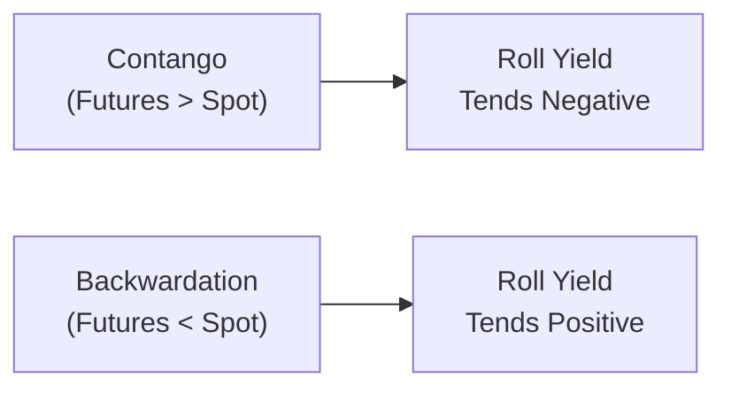

## Introduction

Picture this scenario: you own a futures contract on a commodity—say, crude oil—that’s about to expire. To maintain your exposure, you need to “roll” your position into the next contract. But as soon as you do that, you notice your return changes. Sometimes you gain a bit in the process; other times, you lose a slice of your returns. That little slice is known as the roll yield. Meanwhile, you might hear folks talk about the “convenience” of physically owning a commodity. The intangible benefit of actually holding the commodity (e.g., guaranteeing supply in times of scarcity) is called the convenience yield. Both these yields play a huge role in the overall performance of commodity investments—both from a portfolio perspective and in day-to-day trading decisions.

Below, we’ll explore why roll yield and convenience yield matter, how they’re calculated, and how understanding them can help you become a more effective participant in commodity and natural resource markets.

## Understanding Futures Markets and the Shape of the Curve

Before diving directly into roll yield, let’s set the stage. A commodity’s spot price is the price for immediate purchase. But if you look at futures prices—contracts for delivery at later dates—you might see a different picture altogether. Sometimes longer-dated futures are more expensive than near-term futures. Other times, they’re cheaper. These differences produce two main conditions:

• Contango: When longer-term contracts trade at higher prices than near-term contracts.  
• Backwardation: When longer-term contracts trade at lower prices than near-term contracts.

In practical terms, if you’re looking at an oil futures curve that’s sloping upward from near-term to long-term maturities, you’re looking at contango. If it’s sloping downward, it’s backwardation.

Why does this matter? Because rolling your futures position from one contract to the next—i.e., selling the soon-to-expire contract and buying the next one—can lead to a gain (in backwardation) or a loss (in contango). This outcome is exactly what we call roll yield.

## Defining Roll Yield

Roll yield is the return generated (or lost) when a futures contract converges toward the spot price as expiration approaches—and when traders simultaneously replace that expiring contract with a new one. Mathematically, a simplified version of the roll yield from period \\(t\\) to \\(t+1\\) can be expressed as:


\text{Roll Yield} = \frac{F_{t+1} - F_t}{F_t}


where \\(F_t\\) is the futures price for the current (near-term) contract at time \\(t\\), and \\(F_{t+1}\\) is the futures price you pay when you roll into the next contract.

### Positive vs. Negative Roll Yield

• Positive roll yield often arises in backwardated markets, where your new contract’s price is actually lower than the expiring contract’s price. You sell the higher-priced near-term contract and buy a cheaper later-dated contract, pocketing the difference.  
• Negative roll yield happens more often in contango markets, when the new contract is more expensive. You end up losing that price difference as you roll to the higher-priced contract.

I remember the first time I tried rolling a metal futures contract in a particularly steep contango. Let’s just say I was disappointed to see how much it ate into my overall returns.

## Calculating Roll Yield in Practice

In practice, traders typically measure roll yield by comparing the front-month futures price to the second-month futures price and seeing how that difference evolves as we approach expiration. If the second-month contract costs more, you might see a negative roll yield. But if it costs less, you might be in luck with a positive roll yield.

### Historical Example

Let’s take a hypothetical situation with crude oil futures:

• Near-month contract (F1) is priced at \$50 per barrel.  
• Next-month contract (F2) is at \$52 per barrel.  

When you roll from F1 to F2, you sell the near-month for \$50 and buy the next-month for \$52. Assuming no other changes in the spot market, your roll yield is:


\frac{52 - 50}{50} = \frac{2}{50} = 4\% \quad \text{(negative to you, as you pay more)}


However, if the next-month contract was \$48, your roll yield would be +4% in your favor. This difference might sound small, but over multiple roll periods, it can significantly alter total returns.

## Convenience Yield: The Extra Perk of Holding the Physical Commodity

Convenience yield is basically the intangible or non-monetary benefit you get by holding a physical commodity rather than a futures contract. Why might you value physical ownership? Because if you’re actually holding, say, bushels of wheat, you’re guaranteed supply—especially if a shortage strikes. You don’t have to worry about sourcing in a tight market. That intangible security, or “convenience,” can be particularly valuable for commodities with:

• High demand volatility (e.g., industrial metals used in manufacturing).  
• Susceptibility to supply shocks (e.g., energy commodities during geopolitical tensions).  
• Seasonal or weather-related supply fluctuations (like certain agricultural products).

### Fundamental Drivers of Convenience Yield

• Storage Costs: If it’s expensive to store a commodity (e.g., you need specialized facilities for natural gas), that lowers the net benefit of physically holding it, which can influence the net convenience yield.  
• Supply Constraints: If the market anticipates possible shortages or supply bottlenecks, convenience yield spikes as buyers want guaranteed access.  
• Product Necessity: Commodities with essential use-cases (such as fuels or vital metals) might exhibit higher convenience yields, especially during uncertain times.

In times of scarcity, the physical holder can continue operating or meet immediate demand, which can translate into big operational or competitive advantages. That’s a big part of the convenience yield story.

## Linking Roll Yield, Convenience Yield, and Spot Returns

One of the crucial lessons in commodity investing is that total returns come from several components:

1. Spot Price Return: This is the change in the market price of the commodity itself.  
2. Roll Yield: Gains or losses from switching from expiring contracts into new ones.  
3. Collateral Yield: If you post collateral (e.g., T-Bills) to support your futures position, you earn interest on that collateral.  
4. Convenience Yield (if you’re physically holding the commodity): This isn’t always “yield” in the direct sense but can reduce certain costs or risks.

### Putting It All Together

An upward trend in the spot price might look fantastic, but if the market is in deep contango, you might end up with a negative roll yield that offsets a portion of those spot gains. Conversely, a commodity in backwardation often provides both spot price gains and positive roll yield, creating a strong overall return potential for futures-based investors.

In a well-known commodity index strategy—like the S&P GSCI or the Bloomberg Commodity Index—roll yield can heavily influence overall index returns, sometimes more than the spot price performance, especially during prolonged periods of strong contango or backwardation.

## Contango vs. Backwardation in a Nutshell

Here’s a simple diagram illustrating how market shape can influence roll yield:

When the futures curve is upward sloping (Contango), rolling forward usually means buying higher-priced contracts. That can hurt your returns. When the futures curve is downward sloping (Backwardation), you typically buy cheaper contracts as you roll, which can be beneficial.

## Varying Convenience Yields Across Commodities

Not all commodities are created equal in terms of convenience yield. For instance:

- Industrial metals like copper or nickel might see a spike in convenience yield when factories need to ensure ongoing metal supply.  
- Agricultural commodities, particularly those prone to weather impacts (corn, wheat, etc.), might carry higher convenience yields at certain times of the year.  
- Precious metals like gold may display lower convenience yields if they’re held primarily for investment. Although in some cases, there’s still a convenience aspect for manufacturers of electronics or jewelry.

Sometimes you’ll see grain markets with minimal convenience yield because supply is abundant and easy to access. However, if a drought or transportation strike occurs, that convenience yield can shoot upward almost overnight.

## Integrating Roll Yield and Convenience Yield into Strategies

### Spread Trades

A common strategy that capitalizes on roll yield is a calendar spread, where you buy and sell futures of differing maturities to exploit the shape of the futures curve. If you expect the market to move from contango to backwardation (or vice versa), a well-structured calendar spread can help you profit from changes in the roll yield structure.

### Covered Calls in Commodity Markets

You might also hear about covered calls (or “buy-write” strategies) in commodity markets. While typically associated with equities, the principle can be adapted when physically holding commodities or through certain exchange-traded products (ETPs). If you physically hold the commodity (and thus enjoy its convenience yield), you can sell calls on that commodity’s futures to generate extra income. But the underlying convenience yield can also factor into your cost-benefit analysis—particularly if you can’t easily replace the commodity in case you get called away.

### Hedging and Supply Security

For corporations, convenience yield can influence how they hedge. For instance, an airline that physically holds aviation fuel in storage might reduce its reliance on near-term futures markets. The intangible benefit of that guaranteed fuel can become extremely valuable in times of market stress, effectively boosting convenience yield. Meanwhile, roll yield matters when the airline goes to hedge future demand—if it’s rolling fuel contracts in contango, that can become a drag on cost savings.

## Practical Calculation Example

Let’s say you’re examining a hypothetical commodity called “XYZ” that’s trading at these futures prices:

- Spot: \$100  
- 1-month futures: \$102  
- 2-month futures: \$101  

If you hold the 1-month contract and it’s about to expire, you plan to roll into the 2-month contract. On day one of your position, the near contract is \$102. The next-month contract is \$101. By the time you roll (in about a month), suppose the near contract converges to \$100 (the spot), while the next contract might be \$99. If you started at \$102 and ended up buying your next contract at \$99, you might realize a positive roll yield:


\frac{99 - 102}{102} \approx -2.94\% \quad \text{(relative to the initial cost if you bought at \$102 and sold at final price \$100)}


Of course, the final numbers depend on how the spot and futures prices converge over time. If contango or backwardation intensifies (or eases), your roll yield changes.

## Common Pitfalls

1. Overlooking Roll Yield in Performance: Many investors focus on the spot return of a commodity without realizing that the real drag (or boost) might come from roll yield.  
2. Ignoring Storage Constraints: If you plan on physically holding, watch out for storage costs or difficulties—it reduces net convenience yield.  
3. Confusing Spot Upside with Total Return: Consistent contango can erode profits even if the spot price generally trends upward.  
4. Underestimating Volatility: Commodities can experience sudden shifts from contango to backwardation due to geopolitical events, weather, or unexpected supply shocks.

## Exam Relevance and Conclusion

From a CFA exam standpoint (particularly if you’re focusing on advanced portfolio management and alternatives), grasping roll yield and convenience yield is crucial. They help explain why a commodity fund’s returns might differ dramatically from just the commodity’s spot price movement. In real-life portfolio management, ignoring these yields can lead you to misjudge the attractiveness of a commodities strategy.

If there’s one takeaway, it’s this: Mind the gap between spot and futures! That gap, shaped by contango/backwardation and convenience yield, can have a sizable impact on your bottom line—one that’s often greater than you might anticipate at first glance.

### Quick Exam Tips

• When you see “contango,” immediately think “negative roll yield” (in most cases).  
• Remember that “backwardation” often correlates with a beneficial roll yield.  
• Pinpoint convenience yield as the intangible reason to hold a physical commodity, and think about how changes in supply or demand can elevate that yield.  
• For exam questions, watch out for references to “calendar spreads” or “rolling strategies,” as these commonly highlight roll yield concepts.  
• Don’t forget that net returns can be a combination of spot changes, roll yield, collateral yield, and any convenience yield if you’re physically holding the commodity.

## References and Further Reading

- Till, H., & Eagleeye, J. (2005). “Commodities—A Case for Active Management.” EDHEC Risk and Asset Management Research Centre.  
- CFA Institute. (2023). Commodity and Derivatives Readings. CFA Program Curriculum.  
- Irwin, S., & Sanders, D. (2012). “Financialization and Structural Change in Commodity Futures Markets.” Journal of Agricultural and Applied Economics.

## Test Your Knowledge: Roll Yield and Convenience Yield



### Which of the following best describes roll yield?

- [ ] The return generated by storing a commodity in a warehouse.  
- [x] The gain or loss realized when rolling from an expiring futures contract into a new one.  
- [ ] A dividend you receive for holding physical commodities.  
- [ ] The difference between the spot return and the collateral yield.  

> **Explanation:** Roll yield emerges specifically from the act of rolling a futures position, reflecting the price difference between the contracts you sell and the contracts you buy.

---

### In a market that is in backwardation, rolling your futures contracts generally results in:

- [x] A positive roll yield.  
- [ ] A negative roll yield.  
- [ ] No effect on yield.  
- [ ] Extremely high storage costs.  

> **Explanation:** Backwardation refers to a downward-sloping futures curve. The next-month contract is usually cheaper, so rolling often produces a gain (positive roll yield).

---

### What is convenience yield?

- [ ] An interest payment you earn on collateral.  
- [ ] A type of dividend paid to stockholders.  
- [x] The intangible benefit stemming from physically holding a commodity.  
- [ ] A short-term boost in futures prices ahead of expiration.  

> **Explanation:** Convenience yield represents the advantages of having the physical commodity on hand, such as ensuring supply in times of market stress or shortage.

---

### Which market condition often results in a negative roll yield?

- [x] Contango.  
- [ ] Backwardation.  
- [ ] Inverted yield curves in the bond market.  
- [ ] Quantitative easing.  

> **Explanation:** In contango, future-dated contracts are more expensive than near-term contracts, so rolling forward typically costs more and erodes returns.

---

### Which of the following does NOT directly affect convenience yield?

- [ ] Storage costs.  
- [x] The local risk-free interest rate.  
- [ ] Potential supply disruptions.  
- [ ] The necessity of guaranteeing physical supply.  

> **Explanation:** The primary drivers of convenience yield revolve around supply security, storage feasibility, and ensuring the commodity is actually on hand. The local risk-free interest rate might affect collateral yields but doesn’t directly determine convenience yield.

---

### Why is roll yield particularly important for investors in commodity index funds?

- [ ] Commodity index funds only track spot prices.  
- [x] Futures-based indexes roll contracts regularly, so the shape of the futures curve can significantly impact returns.  
- [ ] Commodity index funds never trade futures.  
- [ ] Roll yield doesn’t affect index returns.  

> **Explanation:** Many commodity index funds rely on futures contracts to achieve exposure, meaning they continually roll forward as contracts expire. Those rolls can add or subtract from total returns depending on market structure.

---

### Which of the following statements about roll yield is true?

- [ ] Positive roll yield is guaranteed in contango markets.  
- [x] Roll yield can be either positive or negative depending on whether futures prices are higher or lower over successive maturities.  
- [ ] Roll yield always offsets spot price returns.  
- [ ] Roll yield is unaffected by changes in the spot price.  

> **Explanation:** Roll yield depends on whether you pay more or less for the next contract relative to the contract you’re selling, which in turn depends on market structure.

---

### A commodity’s convenience yield is likely to increase when:

- [ ] The market expects excess supply and stable demand.  
- [x] Potential supply constraints or strong demand make it essential to hold the physical commodity.  
- [ ] Futures contracts trade at deep discounts to spot.  
- [ ] Contango transitions to backwardation.  

> **Explanation:** Convenience yield spikes when there’s a strong practical benefit to physically holding the commodity, such as anticipated shortages or urgent demand.

---

### An airline physically storing jet fuel to guard against supply disruptions references:

- [ ] A negative roll yield strategy.  
- [ ] A contango-driven approach.  
- [x] Realizing a convenience yield.  
- [ ] Arbitraging backwardation.  

> **Explanation:** Holding the physical commodity ensures immediate availability and lowers operational risk, which illustrates how convenience yield works.

---

### True or False: Roll yield can sometimes have a larger impact on total returns than movements in the spot price of the commodity.

- [x] True  
- [ ] False  

> **Explanation:** Over extended periods, especially in strong contango or backwardation, roll yield can indeed overshadow spot price changes in determining final returns.


