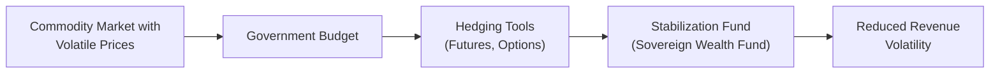
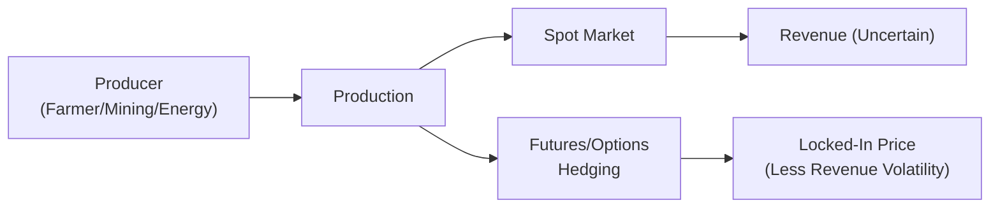

## Overview
Have you ever thought about how countries that depend heavily on oil exports (or any key commodity) manage the risk that prices will tank just when they need revenue the most? Or maybe you’ve wondered how a family farm can avoid going broke if crop prices drop unexpectedly right before the harvest? These concerns—sovereign hedging for entire economies and producer hedging for individual enterprises—are at the heart of this section. Sovereigns and producers face considerable exposure to commodity price fluctuations. With the help of forward contracts, futures, options, and other financial tools, they aim to stabilize revenue, control costs, and reduce vulnerability to wild price swings.

In my opinion, hedging is often misunderstood. Some folks see it as a sure-win “insurance,” while others fear it might limit the upside when prices skyrocket. The truth? Hedging is more about smoothing out the peaks and valleys. Whether it’s maintaining a predictable national budget or ensuring that your copper mine can service its debt, hedging helps align revenue (or cost) certainty with real-world obligations. Let’s step through how sovereigns, large producers, and smaller industry players adopt hedging strategies—and the challenges they might face along the way.

## Sovereign Hedging Strategies
Sovereign hedging refers to measures taken by national governments (or government-affiliated entities) to manage the impact of commodity price volatility on their finances. Because many countries rely on commodities for export revenue (think of major oil exporters or big agricultural producers), a steep drop in commodity prices can wreak havoc on public budgets, hinder development projects, and even spark political unrest.

### Stabilizing National Budgets
Countries often employ hedging programs to keep their budgets stable. If you’re a minister of finance in a major oil-exporting country, you don’t want to be forced to slash public spending when oil prices go down. That’s especially important in countries where the state shoulders a large portion of social or infrastructure expenses.

A common tactic is to enter into futures or structured option contracts (like collars) that set a “floor” on the price received for the commodity. In doing so, the government can, at least to some degree, guarantee a minimum level of export revenue. If what you want is to ensure you’ve got enough money to cover government wages, infrastructure projects, or social programs, these hedges can be a huge relief.

### Sovereign Wealth Funds
Sovereign Wealth Funds (SWFs) often execute or support these hedging activities. Think of an SWF as a large investment pool owned by the government, funded by surplus commodity revenues (often oil, natural gas, or minerals). In principle, SWFs work as a cushion against boom-bust cycles. When commodity prices are high, a portion of the extra revenue flows into the fund. When prices dip, the SWF can step in to finance government spending, making up for shortfalls.

Below is a simple flowchart that illustrates how a government budget might integrate hedging tools and a stabilization fund:

**Budget Stabilization:** The process of locking in a predictable, stable revenue—often through financial derivatives—and supplementing shortfalls from a stabilization fund if market prices disappoint.

### Addressing Currency and Trade Policies
Commodity exporters also worry about currency risk. Even if you’re earning big bucks from oil in U.S. dollars, your government spending is typically in local currency. So governments sometimes hedge currency exposure as well, using forward currency contracts or currency swaps. In a global environment with shifting trade policies—like new tariffs or evolving trade agreements—effective hedging can become even more crucial.

## Producer Hedging Strategies
On the opposite end of the size spectrum are the producers. These could be large-scale players like multinational mining firms or smaller businesses like a mid-tier soy farm. Regardless of size, they share a common goal: to mitigate risk and achieve a smoother revenue or cost profile.

### Locking In Profits or Containing Costs
Producers generally use futures, forwards, and options to secure a favorable selling price or purchase price. If you’re an energy producer pumping out barrels of crude, it can be pretty nerve-racking not knowing what the price will be in six months. By hedging, you can lock in a certain price. This may protect you from a sudden price collapse—though, to be fair, it also means you can’t fully cash in if prices suddenly shoot upward.

Below is a schematic showing how a typical commodity producer might implement hedges:

- **Futures Contracts:** Standardized contracts to buy or sell a commodity at a predefined price on a specific future date. For instance, a wheat farmer might sell wheat futures to lock in the price of their upcoming harvest.
- **Forward Contracts:** Similar idea but privately negotiated. A small orchard may strike a forward contract with a local food processor for a particular price, quantity, and delivery schedule.
- **Options (Puts/Calls):** A producer might purchase put options, giving them the right (but not the obligation) to sell their commodity at a set price (the strike). This creates a price floor—if the market collapses, they can still sell at the strike price.

### Selecting a Hedging Objective
Producers can hedge for different reasons:
- **Profit Maximization:** Some producers hedge only partially, aiming to lock in a known margin for part of the production while retaining some upside exposure.
- **Cost Containment:** Others might hedge inputs, such as energy costs for an airline or feed costs for a livestock farm, to protect themselves from rising input prices.
- **Revenue Smoothing:** A big factor is making sure the monthly or quarterly cash flow doesn’t bounce all over the place. Steady income can be important for paying down debt or just managing day-to-day operations.
- **Debt Servicing:** If you have a big loan payment each quarter, you can’t afford to see your product’s price dive right before you owe the bank. Hedging ensures you meet your debt obligations with fewer sleepless nights.

## Complexities in Hedging
It’s tempting to think you just “set it and forget it” with a hedging strategy—but that’s rarely reality. Real-world hedging can be difficult for several reasons:

### Production Schedules and Capital Expenditure
If you’re running a mining operation, your production timeline could be a couple of years (or more). How do you align a hedge with an uncertain production schedule? Mines don’t always yield at the pace or quantity predicted. And if you’re heavily hedged but underdeliver on the commodity, you might be forced to buy it in the spot market at possibly higher prices to fulfill your hedge obligation.

Capital expenditures (CAPEX) for expansions, new equipment, or environmental compliance can also complicate the hedging picture. Maybe you plan to reinvest profits into new rigs or farmland, expecting certain cash flows. If your hedges are locked in too low, you might struggle to fund expansions.

### Basis Risk and Mismatches
A common problem is basis risk, where the underlying commodity price may not move perfectly in tandem with the futures or forward price you used to hedge. Suppose you’re a specialty coffee grower using a more generic coffee futures hedging. If the premium you usually get for your special beans decreases relative to the standard coffee futures contract, your hedge might be imperfect.

**Basis Risk** is essentially the risk that your cash (spot) price deviates from the futures price when you want to close out or roll over your hedge. Sometimes, the difference in location, grade, or even logistical constraints can produce unexpected price differentials.

### Ramifications of Poorly Structured Hedges
Poorly structured hedges can be downright disastrous. I remember talking to a small mining executive who once locked in a hedge at prices far below the eventual market. Sure, it protected them if prices plummeted—but they ended up losing out on huge gains that competitors smartly captured. Sometimes you see the opposite: a firm might over-hedge or hedge at the wrong times, leading to big losses when prices move in their favor.

In the case of sovereign hedging, a poorly timed or misunderstood derivative strategy can leave governments facing large, unexpected cash margin calls. If the hedging requires daily settlement—like with futures—big losses in the derivative positions might drain government liquidity in the meantime, even if they are offset by higher commodity revenues.

## Role of Governance and Oversight
Both sovereign entities and producers need strong corporate governance (or government oversight) to ensure hedging strategies are transparent, properly monitored, and aligned with overall objectives. Oversight committees typically:
- Approve hedge ratios and quantity to be hedged.
- Review potential counterparties and credit risk.
- Set guidelines on permissible instruments (futures, options, swaps, etc.).
- Monitor market movements and margin requirements.
- Evaluate performance and conduct post-mortem analyses.

An effective risk management culture often includes robust internal controls, documentation, and clear delegations of authority. If a single trader or official can make multi-billion dollar hedging decisions alone, that’s a risk.

## Interplay with Global Economic Conditions
Let’s not forget that any hedging program unfolds in a bigger international context. Commodity exporters like oil-producing nations balance hedging programs against currency movements, geopolitical relationships, and potential shifts in demand (e.g., alternative energies). Similarly, producers might see shipping bottlenecks or new tariffs that disrupt the standard correlations they’ve relied on for years.

For instance, an agricultural producer in Country A might rely on a single major buyer in Country B. If Country B imposes new quotas or taxes on imports, that could reduce demand. The futures contract the producer used to hedge might still reflect global market prices, but the local price they receive could plummet, leading to basis mismatches.

## Example: Oil-Exporting Sovereign Hedge
Here’s a simplified numeric example often discussed in policy circles:

• A major oil-exporting country expects to produce 100 million barrels of oil over the next fiscal year.  
• The government budget is balanced if oil prices stay at or above USD 60 per barrel.  
• Worried about a potential price drop, the finance ministry purchases put options with a strike of USD 60 on enough barrels (say 50 million) to partially protect the budget.  
• If oil prices drop below USD 60, the put options pay out, supplementing the shortfall.  
• If oil prices rise above USD 60, the government’s net revenue is higher than budgeted anyway, minus the cost of purchasing the puts.

Sure, the cost of the put options reduces some upside. But from the perspective of stable public finances, it’s a worthwhile insurance policy, especially if a big infrastructure project or crucial social spending depends on that revenue.

## Example: Producer Hedge for Corn Farmer
Picture a corn farmer who faces volatile prices each season. She estimates selling 5,000 bushels of corn, with a break-even cost of USD 4.00 per bushel. If the current futures price for corn is USD 4.50 per bushel for harvest-time delivery, she may decide to lock in that price by selling corn futures. This ensures a moderate profit margin. If at harvest the spot price is only USD 3.80, she loses money in the cash market but gains on the futures contract. If it’s at USD 5.00, she gains in the cash market but loses on the futures contract—ultimately stabilizing her net income around USD 4.50 (minus basis and transaction costs).

## KaTeX Formula for Hedge Ratio (Optional Concept)
If you’re curious, the hedge ratio often used by producers can be expressed generally as:


\text{Hedge Ratio} = \frac{\text{Quantity to Hedge}}{\text{Total Production Estimate}}


Producers sometimes hedge only a portion of total expected production. For instance, hedging 40% of output might balance risk and uncertainty over the actual yield (in the case of agriculture) or actual production rate (in the case of mining or energy extraction).

## Conclusion and Exam Tips
Sovereign and producer hedging strategies pivot on a single premise: achieving greater predictability in an unpredictable world. While the details can become incredibly complex—especially with multi-year production schedules, changing trade policies, and uncertain global demand—the fundamentals remain straightforward. You’re trying to reduce risk, smooth out cash flows, and preserve the ability to meet obligations.

For the CFA exam, focus on:
- Why sovereign entities hedge (budget stabilization, social programs, political stability).  
- How sovereign wealth funds complement hedging by providing a buffer for surplus revenues.  
- Various hedging instruments (futures, forwards, options) and their advantages/disadvantages.  
- Basis risk, counterparty risk, and margin calls.  
- Corporate governance and oversight—who’s in charge of setting hedge ratios, monitoring trades, and ensuring alignment with broader organizational or national goals.  
- How global macro conditions can affect hedging success (currency fluctuations, demand shifts, new trade agreements).

One common pitfall is to confuse the objective of hedging with outright speculation. Remember, a well-structured hedge focuses on protecting existing exposures, not creating new ones. Also, watch out for assumptions about correlations or stable basis relationships that might not hold up under extreme market stress.

Good luck with your studies! And don’t be shy about reviewing real-world examples, especially in countries or producers that frequently make the financial headlines for hedging success or failure stories.

## References
- International Monetary Fund (IMF). (2012). “Commodity Price Volatility and Government Revenues.” Policy Paper.  
- Carter, C. A., Rausser, G. C., & Smith, A. (2011). “Commodity Booms and Busts.” Annual Review of Resource Economics.  
- CFA Institute. (2024). “Hedging and Risk Management for Institutions.” CFA Program Curriculum.

## Test Your Knowledge: Sovereign and Producer Hedging Objectives



### A government that depends heavily on oil exports might hedge primarily to: 
- [ ] Speculate on higher prices for profit. 
- [ ] Generate larger profits in the derivatives market. 
- [x] Stabilize its budget for predictable revenue. 
- [ ] Minimize import costs of manufactured goods. 

> **Explanation:** Sovereigns typically hedge commodity exposure to ensure stable, predictable revenue and support their fiscal operations (e.g., social spending and infrastructure projects).

### Which statement best describes the purpose of a sovereign wealth fund in commodity-exporting nations?
- [x] To manage surplus revenues and smooth out boom-bust cycles. 
- [ ] To maximize short-term trading gains. 
- [ ] To serve as a hedge for private corporations. 
- [ ] To eliminate currency risk entirely. 

> **Explanation:** A sovereign wealth fund invests surplus commodity revenues, helping governments ride out downswings in commodity prices and maintain public spending programs.

### A producer uses futures to lock in a selling price. Which scenario indicates the main advantage of this strategy?
- [ ] Price in the physical market rises, and the producer misses out on higher revenue. 
- [ ] Price in the physical market also increases, resulting in basis risk. 
- [ ] Price in the physical market remains unchanged. 
- [x] Price in the physical market falls below the locked-in futures price. 

> **Explanation:** If the market price tanks, the producer benefits by having locked in a higher price through the futures market.

### What is “basis risk” in the context of commodity hedging?
- [ ] The risk that hedgers fail to meet margin calls. 
- [ ] The risk that an option expires worthless. 
- [x] The risk that the futures price and the spot price do not move in perfect tandem. 
- [ ] The risk that the hedging instruments get canceled by regulators. 

> **Explanation:** Basis risk arises when the product or location underlying the futures contract differs from the producer’s actual commodity, causing potentially divergent price movements.

### When a government employs put options for its oil exports at a strike price near the country’s budget breakeven level, it is most directly establishing: 
- [x] A price floor to protect minimum needed revenue. 
- [ ] A price ceiling that allows unlimited upside. 
- [x] A partial hedge strategy with some upside if prices rise. 
- [ ] A short position that speculates on falling oil prices. 

> **Explanation:** Purchasing puts sets a price floor (strike price) but allows the government to benefit if the market price settles above the strike, minus the cost of the premium.

### A mining company that over-hedges its copper output might:
- [x] Have to buy copper in the spot market to satisfy delivery obligations if production is lower than expected. 
- [ ] Earn unlimited profit in all market conditions. 
- [ ] Eliminate all risk exposure completely. 
- [ ] Reduce capital expenditure obligations. 

> **Explanation:** Over-hedging means they might need to fulfill more short futures contracts than the actual output, forcing them to buy copper at possibly higher spot prices if production underperforms.

### Which of the following is a key motivation for agricultural producers to hedge?
- [x] Smoothing cash flows to manage operational costs. 
- [ ] Introducing additional exposure to currency fluctuations. 
- [x] Locking in guaranteed margin for part of the expected crop. 
- [ ] Eliminating weather risk. 

> **Explanation:** Hedging helps manage revenue uncertainty, thereby (1) smoothing cash flows and (2) securing at least partial margin.

### Which risk factor is least likely to be managed by a direct hedging program with commodity futures?
- [ ] Price fluctuations of the underlying commodity. 
- [ ] Cash flow volatility over the short term. 
- [x] Geopolitical tensions that reduce commodity demand globally. 
- [ ] Partial misalignment between the futures contract and the spot commodity (basis risk). 

> **Explanation:** While hedging can address price risk, it’s unlikely to mitigate broad geopolitical upheavals that fundamentally shift demand or supply, though those might still indirectly affect the hedge’s effectiveness.

### Corporate governance structures for hedging programs often include:
- [x] Internal risk committees with oversight responsibilities. 
- [ ] Single-trader authorization for large, unmonitored hedges. 
- [ ] Secrecy around hedge ratios. 
- [ ] Full speculation on market direction. 

> **Explanation:** Sound governance entails designated committees reviewing positions, analyzing hedges, and setting prudent guidelines to ensure robust oversight.

### When a government’s hedges incur paper losses in a futures-based program but spot prices for its export commodity rise, the net effect is generally:
- [x] A balanced outcome, as higher export revenues offset derivative losses. 
- [ ] Larger overall losses because hedging is inherently loss-making. 
- [ ] No change in overall revenue. 
- [ ] A requirement to reduce output. 

> **Explanation:** Even though the futures hedge may lose money, the government earns correspondingly higher revenues in the physical market, thus achieving the primary goal of revenue stabilization.


