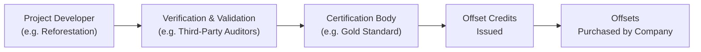

## Introduction and Overview

Climate change—whew, it sometimes feels like it’s all anyone talks about these days. If you’ve spent any time watching the latest headlines, you’ll know that companies, including big commodity juggernauts, are feeling the heat. Literally. Temperature records are often being shattered, and regulation around carbon emissions keeps piling on. You might be asking: “Okay, so how does this tie into alternative investments, and, more specifically, commodities?” Well, that’s exactly what we’ll explore here. In the world of petroleum extraction, metals mining, and agribusiness, climate risk can’t just be swept under the rug; it has direct financial implications. And to mitigate that risk, many firms are buying carbon offsets—credits designed to counterbalance their greenhouse gas emissions.

We’ll dive into the nuts and bolts of this approach: how carbon offsets work, how they’re verified, and whether they’re actually as squeaky-clean as some marketing brochures would have us believe. We’ll also look at how to quantify climate risk in the first place—an essential step if you want to manage it—and then examine how insurance, specialized reinsurance, and derivatives can come into play. Ultimately, you should come away with a thorough grasp of how climate risk is shifting investment strategies in commodities and how offset programs fit into the grand scheme of risk management.

## The Rising Need to Measure and Mitigate Climate Risk

It’s no secret that climate change affects weather patterns and the availability of natural resources. For commodity extraction firms—think oil refiners, copper miners, agricultural producers—these shifts can be disastrous. Longer drought periods might hammer crop yields. Unusually strong hurricanes can halt offshore drilling. Meanwhile, many governments around the world are imposing carbon taxes or emission trading schemes, adding new layers of regulation and cost.

Climate scenario analysis has emerged as a critical tool here. It uses forward-looking models to test how a firm’s operations and supply chains might fare under different temperature and policy pathways. For instance, a metals mining company might run a scenario assuming global warming surpasses 2°C, anticipating more frequent flooding events in a key operational region. Or a palm oil plantation might test what happens if stricter carbon taxes are implemented in the next five years.

In the commodity space, climate risk further intersects with:

• Physical Risks: Damage to infrastructure or disruption in supply caused by extreme weather events.  
• Transition Risks: Regulatory changes (like carbon pricing) or shifts in consumer preferences (like the pivot to clean energy).  
• Liability Risks: Potential lawsuits if companies face legal action for their share of emissions.  

And if you’re thinking, “Hmm, that’s a lot to juggle,” you’re right. The existential question is: how can these companies address or mitigate their climate footprint? One approach is carbon offsets.

## Carbon Offsets in a Nutshell

Carbon offsets are credits representing compensatory greenhouse gas (GHG) reductions. When companies can’t reduce their own emissions immediately—or find it more expensive to do so—they often purchase offsets from projects that do something beneficial for the climate. Maybe a project is reforesting land in Indonesia to capture more CO2, or installing wind turbines in a developing country to displace the need for coal-fired power.

It’s like saying, “I created a ton of CO2 over here, but I paid someone else to remove that ton somewhere else,” leading to a net-zero emission change. Offsets can be purchased on voluntary markets or sometimes mandated by compliance regimes (e.g., the European Union Emissions Trading System (EU ETS)).

In many cases, firms set net-zero targets, effectively pledging that by a certain date, they’ll bring their carbon footprint down to zero (or close to it) by some combination of direct reductions, efficiency improvements, and offsets. But, um, is it always that straightforward? Let’s see how these offsets get validated.

## The Verification and Certification Processes

Offsets are only as good as the certification behind them. In other words, if a project claims to reduce emissions by 100,000 metric tons of CO2, we need a credible third party to verify that figure. Two major standards organizations include:

• Verified Carbon Standard (VCS), administered by Verra.  
• Gold Standard, established by WWF and other NGOs.  

These frameworks outline rigorous methodologies for measuring, reporting, and verifying (MRV) emission reductions. They typically require:

• Additionality: The project’s carbon reductions wouldn’t have happened without offset funding.  
• Permanence: The reductions should not be easily reversed (e.g., the forest shouldn’t be cut down a year later).  
• Auditing: Independent third-party verifiers must confirm project data.  

Once verified, offsets are serialized (think of them like barcoded carbon-credit IDs) and tracked to prevent double-counting. The process can be a bit labyrinthine, kissing up to local regulations, stakeholder reviews, site visits, and monitoring intervals.

You might see something like this in a simplified diagram:



## Potential Controversies and Criticisms

Yes, there’s a dark side. Sometimes companies will offset but do little or nothing to change their own polluting activities. That leads to accusations of “greenwashing,” where the carbon offset purchase is more of a PR tactic than a genuine environmental strategy.

There are also concerns around the uneven global enforcement of offset standards. In certain regions with minimal regulatory oversight, unscrupulous project developers could inflate the reported benefits or fail to maintain the carbon-reducing activities over time. And it’s not always easy to confirm the so-called “additionality”: was that wind farm going to be built anyway, even without offset funding? If so, then maybe purchasing offsets from that project doesn’t truly reduce the net global footprint.

## Financial Implications for Commodity Extraction Firms

Now for the big question: how does any of this show up on a balance sheet or in a discounted cash flow analysis? For commodity extraction firms, climate risk can mean:

• Higher Operating Costs: Carbon taxes can eat into margins. Better factor that into your net present value (NPV) calculations.  
• Premium for “Greener” Commodities: If brand-conscious buyers prefer responsibly sourced commodities, there might be an opportunity to charge a premium or secure better contracts.  
• Investor Pressure: Institutional investors increasingly screen for sustainability performance, especially in an ESG context. Firms might see capital costs rise if they fail to meet these new standards.

Some sophisticated firms incorporate a “shadow carbon price” into their capital budgeting decisions. For instance, they might assume a hypothetical cost of $50/ton of CO2 in the near future. If a project is too sensitive to that assumption, it may not be viable long-term.

### A Quick Python Snippet for Valuing Emission Liabilities

Below is a toy example in Python that calculates the potential liability if a company expects to emit a certain amount of CO2 and internalizes a future carbon price. (This is just a rough demonstration—it’s not full-blown project finance!)

```python
import numpy as np

annual_emissions_tons = 100000  # e.g. 100,000 tons CO2
carbon_price = 50  # $50 per ton (shadow price)
discount_rate = 0.08
years = 10

liability = 0
for t in range(1, years+1):
    present_value = (annual_emissions_tons * carbon_price) / ((1 + discount_rate) ** t)
    liability += present_value

print(f"Estimated Present Value of Potential Carbon Liability: ${liability:,.2f}")
```

This snippet loops through a 10-year period, discounting future carbon costs back to the present. Obviously, real models get more complicated—emissions can vary year by year, carbon prices might escalate, and discount rates might shift with perceived climate risk. But it’s a neat illustration.

## The Role of Insurance and Reinsurance Solutions

Commodity firms also look to insurance markets to offset climate-related physical risks—hailstorms, floods, hurricanes, you name it. Instruments like catastrophe bonds (CAT bonds) have grown popular. These securities allow insurers or reinsurers to transfer extreme weather risk to capital markets. If a defined catastrophic event occurs, the bondholders might forfeit principal to help defray the issuer’s losses.

Reinsurance companies, in particular, have been raising red flags about climate change for decades, because they see firsthand how destructive and frequent extreme weather events can be. So they’re pricing that risk into their products. If you’re a commodity producer in a coastal region, your property insurance could skyrocket if climate models predict a serious uptick in hurricane frequency and intensity.

## Opportunities for New Product Development in Carbon Offsets

It might sound weird to say, but climate concerns can be catalysts for innovation. You can have new offset projects with direct commodity linkages—like a palm oil producer that invests in a reforestation project in the same ecosystem it impacts. Another possibility is derivatives or structured notes that bundle offset credits with commodity returns, so the investor is partially hedged against climate regulation risk while also contributing to sustainability goals.

We’re seeing talk about tokenized carbon credits on blockchain platforms, aiming for improved transparency. Some players even imagine blending carbon offset tokens with commodity-based tokens (like tokenized gold or tokenized farmland). It’s early days, but keep an eye on that space. If you read Chapter 7’s coverage of digital assets, you’ll notice parallels with how tokenization is evolving.

## Integrating Climate Scenarios into Long-Term Investment Projections

Stress testing commodity portfolios under various climate scenarios is getting serious attention. For example, you might create scenarios like:

• “2°C Pathway”: Emission reductions occur in line with the Paris Agreement, meaning stricter caps, heavier carbon taxes, and accelerated shift to renewable energy.  
• “4°C Pathway”: Slow global action leads to major physical impacts—rising sea levels, more extreme droughts, and storms. Commodity supply chains might be seriously disrupted, shifting global trade patterns.  

In each scenario, you’d examine how commodity prices, costs, and offset requirements might evolve. The logic is then used to refine discount rates or incorporate climate “haircuts” into valuations. It’s reminiscent of the climate scenario analysis we touched on in Chapter 9 (Global Macro and Alternative Risk Premia), where macro-level climate policies can suddenly push commodity markets into new regimes.

## Glossary Spotlight

Carbon Offsets: Credits representing reductions in greenhouse gas emissions, which can be purchased to compensate for one’s own emissions.  
Greenwashing: Misleading claims about the environmental benefits of a company’s operations or products.  
Net-Zero Target: A state in which a company or country effectively contributes no net carbon dioxide emissions to the atmosphere.  
Climate Scenario Analysis: Modeling method to evaluate how future physical and regulatory changes could impact an entity’s finances.

## Putting It All Together

So, you can probably see how this all intersects with commodity-oriented alternative investments. Climate risk is here to stay, and the financial sector is scrambling to internalize those costs—and potential opportunities. Carbon offsets are one tool in the toolbox, but they aren’t a silver bullet. Companies, regulators, and investors need to be vigilant about the authenticity and longevity of the offset projects they support. Otherwise, we’re left with a well-intentioned but ineffective strategy.

If you speak with a portfolio manager who invests heavily in oil & gas or in large-scale agribusiness, they’ll likely tell you that they’re paying more attention to climate data, investing in offsets, and re-evaluating supply chains to ensure resilience. The question is not whether to incorporate climate risk, but how thoroughly you do it.

## Final Exam Tips

• Know Your Definitions: The concepts of additionality, permanence, and net-zero targets are testable. Be ready to define these and discuss how they’re validated.  
• Calculate Impact: Watch for item-set questions where you calculate the present value of a future carbon liability. Understanding discount rates and scenarios is crucial.  
• Evaluate Criticisms: Essay questions might ask you to argue the pros and cons of carbon offsets, including whether they truly mitigate emissions or just shift responsibility.  
• Integrate ESG: Climate risk is a core part of ESG analysis. In a portfolio management context, it’s allied with countless topics from risk budgeting to factor exposures.  
• Stress Testing: Be comfortable applying scenario analysis. Don’t forget the interplay between physical and transition risks.  
• Manage Time: In the exam’s constructed-response portion, lay out your logic clearly and succinctly. Climate scenario questions can be tempting “rabbit holes,” so stay structured.  

## References and Further Reading

- Intergovernmental Panel on Climate Change (IPCC). (2022). Assessment Reports.  
- Gold Standard. (n.d.). “Carbon Credit Projects and Certification.” (Available on Gold Standard’s website.)  
- CFA Institute. (2024). “Climate Risk and ESG Analysis in Global Markets.” CFA Program Curriculum.  
- Verra. (n.d.). Verified Carbon Standard.  
- Swiss Re Institute. (2025). “Global Climate Risk Analysis and Insurance Solutions.”

---

## Test Your Knowledge: Climate Risk and Carbon Offsets



### Which of the following best describes the concept of carbon offsets?

- [ ] They are future contracts used to hedge currency risk.
- [x] They are credits that represent a reduction in greenhouse gas emissions to compensate for one’s own emissions.
- [ ] They are government permits allowing the sale of oil and gas.
- [ ] They are derivatives designed to track commodity spot prices.

> **Explanation:** Carbon offsets are credits representing greenhouse gas reductions or removals. They can be applied against a company's emissions to achieve net-zero targets or regulatory compliance.

### What does “additionality” refer to in the context of carbon offset projects?

- [x] The emission reduction would not have occurred without the offset funding.
- [ ] Project verification by a third party.
- [ ] The ability to sell offsets on multiple markets simultaneously.
- [ ] The public registry that tracks each offset credit.

> **Explanation:** Additionality ensures that the emission reductions are extra—i.e., they wouldn’t have happened under a “business as usual” scenario.

### What is a key criticism often raised against carbon offset purchases?

- [x] They can encourage companies to buy credits instead of reducing their own emissions.
- [ ] They do not require any independent auditing.
- [ ] Offsets are universally guaranteed to be costlier.
- [ ] Net-zero targets are irrelevant to the ESG community.

> **Explanation:** A common critique is that offsets may be used as a quick fix to “mask” corporate inaction on direct emissions reductions. This can sometimes be labeled as greenwashing.

### Which risk is primarily linked to climate scenario analysis?

- [ ] Equity beta risk only.
- [x] Transition risks, physical risks, and liability risks.
- [ ] Liquidity risk in emerging markets.
- [ ] Inflationary risk from currency devaluation.

> **Explanation:** Climate scenario analysis deals with transition risk (regulations), physical risk (extreme weather), and liability risk (litigation), among others.

### When integrating a “shadow carbon price” into capital budgeting:

- [x] Firms consider a hypothetical carbon cost when evaluating projects.
- [ ] It is illegal in most jurisdictions, thus rarely used.
- [x] It helps stress test how new regulations might impact profitability.
- [ ] It is only applicable to reforestation projects.

> **Explanation:** Shadow carbon pricing is a voluntary, hypothetical mechanism that allows companies to gauge how profitable a project might be under future carbon pricing policies.

### What is one potential role of CAT bonds in climate risk management?

- [x] They transfer extreme weather risk from insurers to capital markets.
- [ ] They provide long-term financing for gold mining operations.
- [ ] They regulate emissions trading directly.
- [ ] They guarantee currency stability in emerging markets.

> **Explanation:** Catastrophe (CAT) bonds enable insurers and reinsurers to securitize risk, so if a catastrophe occurs, part or all of the bond principal goes to cover losses.

### Why might a commodity extraction firm purchase carbon offsets?

- [x] To compensate for emissions that are difficult to reduce immediately.
- [ ] To avoid all climate regulation entirely.
- [x] To meet net-zero targets and potentially market their products as “low carbon.”
- [ ] Because offsets are mandated by the IPCC.

> **Explanation:** Offsets allow firms to balance out emissions they cannot yet eliminate, aiding compliance with net-zero or other climate goals.

### Which of the following is a distinguishing feature of the Verified Carbon Standard (VCS)?

- [x] It requires projects to demonstrate additionality and be independently audited.
- [ ] It only applies to renewable energy projects in North America.
- [ ] It disallows any verification, leaving it to the developer’s discretion.
- [ ] It automatically provides carbon tax credits.

> **Explanation:** VCS sets strict rules for measuring, reporting, and verifying projects, ensuring real and credible offsets.

### In commodity markets, a higher carbon tax generally leads to:

- [x] Increased operating costs for emission-heavy producers.
- [ ] Enhanced returns for diesel-only transportation fleets.
- [ ] Lower consumer prices on high-carbon products.
- [ ] Guaranteed legal immunity from environmental lawsuits.

> **Explanation:** Carbon taxes directly increase the cost of production for companies with significant emissions, often translating into higher operating expenses.

### True or False: “If a carbon offset project is not maintained over time, there is no risk of ‘reversal’ or invalidation of the offset credits.”

- [ ] True
- [x] False

> **Explanation:** Permanence is crucial in offset projects. If a forest project is later cut down, the previously sequestered carbon is released, negating the offset benefit.


