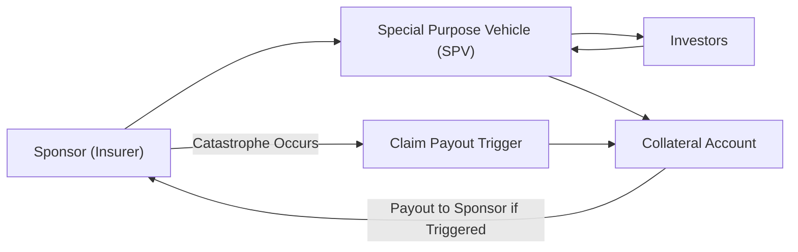

## Introduction

Insurance-linked instruments (ILIs) for catastrophe and weather risk are, in many ways, the unsung heroes of the capital markets. They enable risk to be transferred from insurers, reinsurers, and even municipalities to global investors. These instruments can help insulate entire communities from the financial aftermath of natural and weather-related disasters. If you’ve ever taken a stroll along a coastline hammered by hurricanes—like I did one summer in a tiny Florida beach town—you might appreciate how powerful (and scary) Mother Nature can be. Well, ILIs stand ready to cushion the financial blow of such devastating events.

In this article, we’ll explore the mechanics of insurance-linked instruments, particularly catastrophe (CAT) bonds and weather derivatives. We’ll also dive into parametric triggers and see why they can be easier to administer than traditional indemnity-based insurance. We’ll talk about potential pitfalls (like basis risk), highlight the diversification benefits these products bring to an investment portfolio, and examine how pricing complexities arise when modeling tail risks and climate shifts. Along the way, we’ll keep this ever so slightly informal, so you can feel at home even if you’re fairly new to all this.

## Understanding Catastrophe (CAT) Bonds

Catastrophe bonds (often called CAT bonds) are high-yield debt instruments designed to shift the financial burden of a catastrophic event from an insurer or reinsurer to capital market investors. CAT bonds can be used to insure against various disasters—earthquakes, hurricanes, floods, even named storms. The main idea is simple: an insurer (sometimes called the sponsor) issues a bond to investors. If no qualifying catastrophe occurs, investors get their principal back plus coupon payments. However, if a specified catastrophic event does occur, the sponsor can suspend or reduce principal repayments to pay for claims.

CAT bonds became increasingly relevant after major disasters exposed the often-limited capacity of the traditional reinsurance market. Institutions realized that tapping into the broader capital markets might add deeper pockets and reduce reliance on conventional reinsurance.

### Key Features

• High Yield: Because there is, well, a genuine chance of losing principal if a catastrophic event triggers the bond, CAT bonds typically pay higher rates than comparably rated corporate or sovereign debt.  
• Multiyear Maturities: CAT bonds tend to have maturities ranging from one to five years, often aligning with reinsurance contract durations.  
• SPV Structure: Usually, a special purpose vehicle (SPV) is created to issue the bonds. The SPV holds the principal from investors in a collateral account, which is invested in low-risk instruments (like Treasuries) so that investors can be repaid if no catastrophe occurs.

Below is a simplified diagram illustrating how the CAT bond structure usually looks:



In this structure, investors place their capital with the SPV, which invests it in secure assets, such as government bonds. If no catastrophe occurs within the bond term, the SPV repays principal plus interest to investors. If a qualifying event does occur, a portion (or all) of the principal is used to compensate the sponsor for its losses.

## The Role of Parametric Triggers

One of the big leaps in insurance-linked instrument design is the move from indemnity-based triggers to parametric triggers. Rather than linking payouts to actual insurance claims, parametric triggers link them to objective, measurable parameters of an event—like the earthquake Richter scale reading, the hurricane’s maximum wind speed, or the amount of rainfall in a day.

Let’s say a CAT bond uses a parametric trigger of wind speeds above 150 mph in a specific region. If a registered weather station in that region detects such speeds, the bond is triggered, and the insurer (sponsor) is entitled to some or all of the bond principal. This approach speeds up payouts because it avoids claims-adjusting processes. It also provides greater transparency to investors, who know exactly under which circumstances the payout will occur.

Of course, parametric triggers do come with “basis risk.” That’s the risk that the trigger might be met but actual damage is minimal (or vice versa). Maybe the storm’s recorded speed is just above 150 mph in one location, easily triggering the bond, but most related damage is actually nonexistent or very far away. We’ll discuss basis risk more in detail shortly.

## Weather Derivatives and Their Uses

If you’ve ever planned an outdoor wedding (or just a big family party) and worried about the weather, you might have felt an emotional version of basis risk. Weather derivatives formalize that nervousness into a tradable contract—like temperature-based futures, precipitation options, or humidity swaps. They allow purchasers to hedge the risk of abnormal or adverse weather. For example:

• A ski resort can buy snowfall derivatives to offset lost revenue in a low-snow season.  
• A power utility might use temperature futures to hedge an unusually hot summer that leads to skyrocketing air-conditioning demand.  
• A farmer might purchase rainfall options to hedge the financial impact of drought or flooding.

These instruments rely heavily on reliable weather stations and indexes. In a typical temperature-based derivative, the payoff might be tied to the number of accumulated cooling degree days (CDD) or heating degree days (HDD) across a particular time window. When actual degree days exceed or fall below a predetermined threshold, the derivative pays out. Like CAT risk, weather-related exposure can also have low correlation stocks and bonds. That diversification profile partly explains why large institutional investors sometimes invest in weather derivatives, especially if they’re comfortable with commodity or environment-related exposures.

## Pricing Event-Linked Securities and Diversification Benefits

Event-linked securities—like CAT bonds and weather derivatives—are often admired for their diversification benefits. Generally, the occurrence of a natural disaster is independent of corporate earnings and interest rate fluctuations, meaning returns on these instruments can have low correlation with mainstream equity and fixed-income markets.

However, pricing them is no small feat. You need to estimate the likelihood and magnitude of catastrophic (or simply unusual) events, which can be intricate and uncertain. When modeling tail risks, parties often rely on advanced catastrophe models developed by specialized firms. These models incorporate:

• Historical data (decades or even centuries of records for hurricanes, earthquakes, floods, etc.).  
• Climate change projections and shifting weather patterns (the baseline risk might be higher than in earlier decades).  
• Geospatial analysis of infrastructure vulnerability.  
• Engineering data on how structures actually hold up under certain conditions.

### A Simplified Expected Loss Formula

From an actuarial perspective, the value of a CAT bond might revolve around an expected loss concept. If we let p represent the estimated probability of the payout being triggered, and L the expected loss to the investor if triggered, the expected annual loss is roughly:

$$
\text{Expected Loss} = p \times L
$$

Investors compare that value to the coupon spread offered by the bond. If the risk-adjusted return is attractive relative to other opportunities, it’s in their interest to invest.

Below is a very basic Python snippet that shows how you might compute an expected loss in a simplistic scenario:

```python
import math

p = 0.02  # 2% chance in any given year

principal = 1_000_000
loss_fraction = 0.5  # 50% loss of principal if triggered

expected_loss = p * (loss_fraction * principal)
print(f"Expected Loss per year: {expected_loss} USD")
```

Of course, real-world models get far more complicated, with multi-year probabilities, partial triggers, layered coverage, correlation across multiple perils, climate change scenarios, and so forth.

## Basis Risk in Parametric Solutions

Basis risk is a huge deal in parametric insurance structures. Let’s suppose a parametric trigger is set at earthquake magnitude 7.0 in a certain region. The quake occurs at magnitude 6.9—very close but still below the threshold. Maybe the actual damage is catastrophic, yet the bond is never triggered. Uh oh, that’s an example of the sponsor’s downside, because they get no payout while still incurring heavy losses.

Alternatively, the opposite scenario can unfold. The quake hits magnitude 7.1 near a largely unpopulated zone, triggers the bond, but actual losses are minimal. Then the sponsor effectively receives a “windfall” payment. Either situation leads to a mismatch between parametric metrics and real-world damage. This mismatch is known as basis risk.

To mitigate basis risk, insurers often design multiple triggers or layered triggers. They also use multiple measuring stations—pulling from multiple wind-speed sites or multi-zone rainfall data. But it’s never a perfect science. Sponsors have to weigh the operational simplicity of parametric triggers against the risk of a mismatch between the event measurement and actual loss.

## Typical CAT Bond Structures and Maturities

CAT bonds are usually structured to last from one to five years—some are even longer, depending on the supply-demand dynamics in the ILS (insurance-linked securities) market. Common structures:

• Indemnity Trigger: Payout based on actual losses suffered by the sponsor. Minimizes basis risk but can require lengthy claims processing.  
• Parametric Trigger: Based on event parameters. Minimizes time to payout but can introduce basis risk.  
• Industry Loss Index: Tied to an industry-wide loss measure. If total industry losses exceed a threshold, a payout occurs.  
• Hybrid Approach: Blends parametric measures with some indemnity or index triggers.

Regardless of the trigger, moral hazard (the risk that the insured party might behave less carefully because they’re insured) is relatively small in CAT bonds. If a sponsor is looking at a potential hurricane, it can’t exactly “invite it in.” Adverse selection—where sponsors who suspect they’ll be hit by a specific risk are more likely to engage in these bonds—can be controlled by rating agencies, regulatory oversight, and transparent risk modeling.

## Regulatory and Rating Agency Considerations

Insurance-linked instruments fit under the umbrella of alternative risk transfer. Because they are hybrids—part capital market product, part insurance contract—they garner attention from both financial and insurance regulators. Some key considerations:

• Capital Adequacy: Reinsurers using CAT bonds may have capital requirements influenced by solvency frameworks such as Solvency II in Europe or RBC (Risk-Based Capital) frameworks in other jurisdictions.  
• Accounting Treatment: IFRS and US GAAP have evolving guidance on how to treat these instruments on the balance sheet, especially concerning the classification of the SPV and the timing of any payouts.  
• Ratings: CAT bonds often receive specialized ratings from agencies that weigh probability of default from catastrophic events. Standard & Poor’s, Moody’s, and Fitch all have dedicated teams analyzing the bond’s expected loss, the event modeling, sponsor credit quality, and the collateral structure.  
• Disclosure: Regulators often require robust disclosures on the underlying event models and triggers, ensuring that investors know exactly how risk is being measured.

## Practical Applications and Case Studies

Perhaps the best way to appreciate these instruments is through real stories. Several years back, a Caribbean island (which I once visited for a quick weekend getaway—ah, the beaches were amazing) decided to issue a parametric CAT bond linked to hurricane wind speed. When that region was struck by a major storm, the bond triggered quickly, delivering funds within weeks or even days. That helped the local government rebuild roads, restore electricity, and salvage its tourism industry—much faster than if it had to rely on slow-moving foreign aid.

Weather derivatives also pop up. Electricity companies across Europe and North America frequently use temperature-based derivatives to hedge earnings volatility. If you’re, say, an energy producer in the UK, a mild winter might mean fewer folks cranking up the heat and thus less revenue. A well-structured derivative can offset that shortfall. These real-world scenarios show that the markets for CAT bonds and weather derivatives are more than exotic novelties: they can preserve livelihoods.

## Exam Tips: Common Pitfalls and Strategies

From a CFA perspective, especially at Level III where big-picture portfolio integration is crucial, insurance-linked instruments can appear in item-set or constructed-response questions. Here are a few tips:

• Understand the Trigger Mechanisms: Be ready to contrast parametric triggers with indemnity triggers. You might be asked to recommend an appropriate trigger, given the sponsor’s potential basis risk or administrative burdens.  
• Evaluate Diversification: On the exam, they often emphasize how low correlation with traditional markets can benefit a portfolio’s risk-return profile. Be prepared to do quick Sharpe Ratio or standard deviation computations incorporating an ILS.  
• Pricing Logic: You could be asked to identify key factors that influence expected loss or yield spreads on a CAT bond (modeling uncertainties, sponsor credit, severity rating of the event, etc.).  
• Basis Risk: Always remember: parametric solutions = basis risk. Indemnity solutions = less basis risk but slower settlement. Possibly they’ll give you a scenario with mismatch issues to diagnose.  
• Regulatory Constraints: Candidates may be tested on IFRS vs. local GAAP classification for insurance liabilities or reinsurance assets. Also watch out for references to capital adequacy.  
• Time Management: Sometimes, exam questions require you to parse through details on triggers, probabilities, or layering structures. Keep your approach systematic—outline the key relevant details (trigger type, probability, payoff, etc.) and then show your analysis step by step.

## References and Further Reading

- Cummins, J. D., & Trainar, P. (2009). “Securitization, Insurance, and Reinsurance.” Journal of Risk and Insurance.  
- Swiss Re Institute. (Various years). Sigma Reports on Catastrophe Bonds.  
- Harrington, S. (Editor). (2009). The Financial Crisis, Systemic Risk, and the Future of Insurance Regulation. Brookings Institution.

---

## Test Your Knowledge: Insurance-Linked Instruments Quiz



### Which of the following best describes a Catastrophe (CAT) bond?

- [ ] A bond that always pays 100% principal back regardless of events
- [x] A high-yield bond whose principal may be reduced if a specified catastrophic event occurs
- [ ] A zero-coupon bond that farmers use to hedge yield risk
- [ ] A government bond specifically indexed to inflation

> **Explanation:** CAT bonds allow insurers to transfer the risk of catastrophic events to the capital markets, with payouts triggered by an event’s occurrence or severity.

### When a CAT bond uses a parametric trigger, which major risk typically arises?

- [ ] Liquidity risk
- [ ] Credit risk
- [ ] Moral hazard
- [x] Basis risk

> **Explanation:** With a parametric trigger, losses may not perfectly align with measurable parameters (like wind speed or earthquake magnitude), creating potential mismatches.

### One of the main benefits of including CAT bonds in a diversified portfolio is:

- [x] Their low correlation with stock and bond markets
- [ ] Their high correlation with equity returns
- [ ] Their immunity to all market risks
- [ ] Their regulatory exemptions under Basel III

> **Explanation:** Natural disasters typically do not coincide with corporate earnings cycles or interest rate moves, so CAT bonds often exhibit low correlation with traditional assets.

### Which of the following best illustrates a weather derivative?

- [x] A contract that pays out if average seasonal temperature exceeds a threshold
- [ ] A bond paying principal only in the event of a solar flare
- [ ] A share issued by a wind turbine manufacturer
- [ ] A loan guaranteed by the Federal Emergency Management Agency (FEMA)

> **Explanation:** Weather derivatives typically reference temperature, rainfall, snowfall, or other quantifiable weather indices.

### Why might an insurer prefer a parametric trigger in its insurance-linked instrument?

- [x] Faster payouts and simpler claim processes
- [ ] Guaranteed absence of basis risk
- [x] More transparency for investors about the underlying risk metrics
- [ ] Lower premiums for the policyholders

> **Explanation:** Parametric triggers allow swift, objective payouts and provide clear event criteria. However, basis risk still exists.

### Which of the following is an example of basis risk in parametric insurance?

- [x] The trigger is met but actual damage is minimal
- [ ] The coverage is triggered by conventional indemnity measures
- [ ] The bond is not rated by any agency
- [ ] Premiums are set below market rates

> **Explanation:** Basis risk occurs when the trigger metric diverges from actual losses, e.g., a high measured wind speed but negligible damage.

### What are typical regulatory considerations for CAT bonds?

- [x] Ensuring capital adequacy, full disclosure of risk models, and proper accounting treatment
- [ ] Eliminating all risk for investors
- [x] Requiring rating agency evaluations specific to catastrophic events
- [ ] Forbidding institutional holdings of CAT bonds

> **Explanation:** CAT bonds are subject to both insurance and capital market regulations. Rating agencies typically assess event risk, and disclosures are required by regulators.

### Which of these instruments is most likely to hedge a ski resort’s seasonal revenue exposure?

- [x] A snowfall derivative
- [ ] An interest rate swap
- [ ] Equity index futures
- [ ] A corporate bond with a floating coupon

> **Explanation:** A snowfall derivative is used to manage revenue exposure when snowfall is below normal, reducing the resort’s operating income.

### In an exam context, which approach might best handle an item-set question on parametric CAT bonds?

- [x] Summarize the key trigger details, compute probabilities, discuss basis risk
- [ ] Ignore the bond structure and focus only on assets under management
- [ ] Provide a lengthy discourse on corporate governance
- [ ] Confuse parametric triggers with standard credit risk triggers

> **Explanation:** Exam questions often test understanding of how triggers and probabilities interact with event losses and basis risk.

### True or False: With parametric-based CAT bonds, if threshold parameters are met, the bond will definitely pay out full principal to investors.

- [ ] True
- [x] False

> **Explanation:** Parametric-based CAT bonds typically reduce or eliminate investor principal if the trigger parameters are met, rather than paying out investors.


