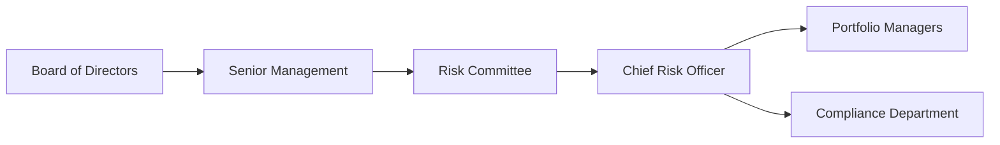

## Introduction
Risk monitoring and governance often conjures images of large conference rooms, serious board members, and thick policy manuals. But the truth is, effective risk oversight can be downright empowering—especially for hedge funds trying to balance risk-taking with preservation of capital. I remember chatting (well, more like nervously whispering) with a senior hedge fund manager who said, “I like to run the strategy like an Formula 1 driver, with both speed and safety in mind.” That line stuck with me. 

In other words, hedge fund managers need to drive forward returns but also be certain that the wheels don’t come off at higher speeds. This is precisely why a strong risk governance framework matters. In this section, we explore best practices in risk monitoring and governance for hedge funds. Our goal? To help you feel confident integrating rigorous processes, comprehensive policies, and a risk-aware culture into everyday operations.

## The Value of a Formal Risk Governance Framework
One might ask: Why do we even need a formal framework? Can’t we just patch together some risk limits, compliance checks, and a few weekly meetings? Well, maybe if we want a shaky foundation. A sound risk governance framework defines clear roles and responsibilities among the Board of Directors, senior management, risk officers, and compliance teams. In a hedge fund context, it’s the blueprint for making thoughtful, prudent decisions that ultimately protect investor capital.

Below is a simplified illustration of how roles and responsibilities might be structured in a typical hedge fund risk governance hierarchy:

• Board of Directors: Oversees the big-picture strategy, sets overall risk appetite, and enforces accountability.  
• Senior Management: Implements the Board’s mandate and ensures resources are allocated for proper risk management.  
• Risk Committee: Maintains and updates risk policies, monitors exposures, and escalates major breaches.  
• Chief Risk Officer (CRO) or Equivalent: Coordinates with portfolio managers, compliance, and operations to ensure ongoing risk monitoring.  
• Portfolio Managers: Responsible for tactical risk decisions within established guidelines.  
• Compliance Department: Takes the lead on regulatory matters and conflict-of-interest issues, ensuring no one is slipping below the radar.

## Comprehensive Risk Policies and Coverage
If the risk governance framework is the blueprint, then risk policies are the building materials. Comprehensive risk policies should address a variety of risk exposures, each requiring different techniques:

Marketplace volatility easily reminds us that “business as usual” is usually not the norm. That’s why advanced scenario analysis (discussed below) and real-time risk analytics (to detect limit breaches) are mission-critical:

• Market Risk: Loss potential from market movements (e.g., equity prices, interest rates, exchange rates). Techniques like Value at Risk (VaR) and beta analysis are often used.  
• Credit Risk: Risk of default or credit deterioration, particularly relevant if a hedge fund invests in bonds or trades with counterparties in over-the-counter (OTC) markets.  
• Liquidity Risk: The possibility that a fund cannot meet withdrawal requests or margin calls without incurring unacceptable losses. Monitoring daily cash flows, redemption structures, and asset-level liquidity is key.  
• Operational Risk: Failures in internal processes, systems, or external events—ranging from cybersecurity breaches to trade-settlement errors.  
• Compliance Risk: Regulatory sanctions or penalties resulting from inadequate policies, breaches, or unethical activity.

Because hedge funds often employ derivatives, leverage, and complex trading strategies, strong risk policies also emphasize internal controls, separation of duties, and robust documentation. This ensures that each part of the hedge fund machine runs smoothly—even when the markets look more like a roller coaster than a steady escalator.

## Fostering a Robust Internal Control Environment
I like to think of internal controls as the “safety rails” that keep you on track. If a back-office error or rogue trader incident leads to large losses and reputational damage, it’s often because there was insufficient oversight in the first place. 

Key elements of a robust internal control environment include:  
• Separation of Duties: The person initiating a trade isn’t the same person approving or settling it.  
• Regular Internal Audits: Independent reviews of operations, compliance, portfolio valuations, and technology systems.  
• Clear and Documented Processes: Up-to-date procedure manuals, checklists, and guidelines.  
• Technology Solutions: Automated trade capture, reconciliation systems, and compliance monitoring tools to catch and correct issues early.

Many hedge funds also stress the importance of rotating staff duties from time to time—just enough so that no one person becomes absolutely indispensable or able to hide suspicious activity unchallenged.

## Stress Testing, Scenario Analysis, and Back-Testing
Ever wonder how a hedge fund would hold up if markets tumbled like they did during the Global Financial Crisis, or if we saw a massive oil supply shock reminiscent of the 1970s? Stress testing and scenario analysis let you explore “what if” events so you’re not caught blind. Periodically, for your own peace of mind, it’s helpful to conduct:

• Stress Testing: Subject portfolios to extreme (though plausible) market conditions such as record-high volatility or systemic liquidity squeezes.  
• Scenario Analysis: Examine the effect of multi-factor changes, such as a shock in credit spreads plus a surge in interest rates.  
• Back-Testing: Compare how your models or strategies would have performed in historical periods like the 2008 crisis or the dot-com bust.

In practice, a hedge fund might combine a few advanced quantitative models (like Monte Carlo simulations) with more straightforward scenario approaches—essentially saying, “If we see a 30% drop in equity markets plus a 300-basis-point jump in credit spreads, do we have enough cash or collateral to stay afloat?”

Occasionally, I’ve heard teams say, “Why bother? History never repeats exactly.” True, but it often rhymes. Learning how your portfolio might respond under severe stress can highlight vulnerabilities and prompt necessary hedging or capital-raising actions.

### Simple VaR Calculation in KaTeX
Although hedge funds may rely on more sophisticated approaches, many still keep an eye on Value at Risk (VaR) as a baseline measure of potential loss:


\text{VaR}_{\alpha} = \mu + z_{\alpha}\,\sigma


Where:  
• \\(\mu\\) is the expected return of the portfolio,  
• \\(\sigma\\) is the standard deviation of the portfolio returns,  
• \\(z_{\alpha}\\) is the critical value from the normal distribution for a given confidence level \\(\alpha\\).

While VaR does not capture tail risk perfectly (and can understate risk in non-normal distributions), it remains a useful starting point for monitoring daily exposures and triggering risk reviews when thresholds are breached.

## Leveraging Technology for Real-Time Monitoring and Conflict Detection
Picture a cockpit jam-packed with flight instruments—some tracks winds, some altitude, others measure engine performance. Now apply it to a hedge fund: that’s your risk dashboard. Such technology solutions typically provide:

• Automated Monitoring of Risk Limits: Continuous scanning so that if your portfolio hits thresholds—like a 10% single-name concentration limit—an alert is triggered.  
• Real-Time Market Data Feeds: Price movements, credit spread changes, and implied volatility updates feed into risk analytics.  
• Limit Breach Notifications: Automated messages that go to the CRO, risk committee, or even portfolio managers when you exceed a risk boundary.  
• Automated Conflict-of-Interest Checks: Systems can identify suspicious trades (e.g., front-running or trades that might directly violate internal policies).

A robust suite of analytics not only adds speed, but it also frees risk officers to focus on higher-level interpretation rather than sifting manually through mountains of data. Having debugged a few “buggy” risk systems myself, I can confirm that ensuring your technology is well implemented and tested is at least as important as having the technology in the first place.

## Cultivating a Risk-Aware Culture
As you’ve probably guessed, risk monitoring shouldn’t exist in a silo. If you have a terrific system for capturing exposures but your portfolio managers “game the system” or keep certain trades off-book, you’ve compromised the entire effort. That’s where organizational culture comes in.

In a risk-aware culture:  
• Communication is Transparent: Portfolio managers speak openly with compliance teams and risk officers rather than hiding trades.  
• Training is Frequent: Everyone, from junior analysts to senior executives, is trained to identify red flags and potential conflicts.  
• Accountability is Clear: If the risk officer flags a limit breach, management must act. No looking the other way simply because it’s a “star trader.”  
• Ethics and Integrity are Central: Align with the CFA Institute’s Code of Ethics and Standards of Professional Conduct. War stories abound of funds that soared in the short term, sensationalized returns, but flamed out due to questionable ethical practices.

A healthy risk culture also means celebrating risk management successes as well as trading-oriented wins. Maybe the fund avoided a meltdown during a crisis because the CRO insisted on hedging. That’s worthy of recognition (and maybe even a high-five in the hallway).

## Aligning Incentive Structures with Long-Term Performance
Hedge funds are known for their performance-based compensation. However, short-term performance incentives can sometimes inflate risk-taking. Suppose a portfolio manager stands to earn a large bonus for short-term gains but faces limited downside if a trade goes south—this obviously misaligns manager risk appetite with the best interests of the fund and its investors.

To address these concerns, many hedge funds are gradually shifting to variable compensation models tied to longer-dated performance metrics, such as multi-year rolling returns. Clawback provisions can also help: if future performance suffers significant losses, a portion of previously awarded bonuses might be returned or withheld. Though not always popular, these compensation structures reinforce that risk is a marathon, not a sprint.

## Common Pitfalls and Potential Challenges
Even the best plans face roadblocks. Some commonly observed challenges include:

• Over-Reliance on Models: Quants sometimes design sophisticated but opaque frameworks that miss real-world complexities.  
• Underinvestment in Risk Infrastructure: Great ideas remain stuck when there’s no budget for robust analytics, or when the fund invests heavily in front-office tools but neglects operations and controls.  
• Cultural Resistance: Some managers may resist risk oversight, seeing it as a nuisance or “growth inhibitor.” Without executive buy-in, risk frameworks often become mere “paper tigers.”  
• Regulatory Changes: Hedge fund regulations differ across jurisdictions; compliance teams must stay up-to-date with evolving guidelines, whether from SEC (U.S.), FCA (U.K.), or other global bodies.

## Case Study: A Hypothetical Hedge Fund Stress
To illustrate how all these pieces work together, imagine the fictional “Global Macro Alpha Fund,” known for its heavy use of currency and interest-rate swaps. Here’s a scenario that tests the fund’s risk framework:

1) Inflation Surprise: The fund’s largest currency position is tied to a region that hikes rates unexpectedly, causing a big swing in exchange rates.  
2) Bond Market Turbulence: Concurrently, global yields spike, slashing bond values.  
3) Liquidity Crunch: Redemptions surge as investors get nervous.

Fortunately, Global Macro Alpha Fund has a robust risk governance structure:

• The CRO identifies rising inflation risk in the weekly risk meeting and triggers a route for higher hedging in the currency portfolio.  
• The scenario analysis performed monthly flagged the potential for a bond market meltdown, prompting the risk committee to propose derivatives hedges.  
• The CFO had strong liquidity policies requiring cash buffers, so even with redemptions, the fund can cover withdrawals without forced selling.

By adopting these best practices, the hypothetical fund weathers the storm far better. Without them, it could’ve ended in a fire sale of illiquid assets and big lumps of capital losses.

## Practical Tips for the CFA Exam
• Link Risk to Strategy: The exam often asks how a hedge fund’s investment mandate aligns with its risk management. Connect the dots between risk appetite and the fund’s overall strategy.  
• Show You Know the Tools: Stress testing and VaR are commonly tested topics. Be ready with formulas, examples, and limitations.  
• Ethics and Compliance: The CFA Institute code is always relevant. In your exam answers, reference how these guidelines shape risk governance.  
• Illustrate with Examples: Don’t just define scenario analysis—give a quick scenario, like an equity shock combined with a credit spread blowout.  
• Understand Governance Structure: Answers that detail who’s responsible for what are often looked upon favorably.  
• Time Management: In essay or item-set questions, structure your response logically—outline key risks, recommended controls, and potential outcomes succinctly.

## References and Further Reading
• International Organization of Securities Commissions (IOSCO) guidelines on hedge funds governance:  
  https://www.iosco.org/  
• CAIA Association, “Risk Management for Hedge Funds,” Alternative Investment Analyst Review.  
• COSO, “Enterprise Risk Management—Integrated Framework.”  
• CFA Institute, “Standards of Practice Handbook,” for ethical principles and professional guidelines.

## Test Your Knowledge: Hedge Fund Risk Governance Quiz



### Which of the following best describes the purpose of implementing a formal risk governance framework in a hedge fund?

- [x] It establishes clear roles, responsibilities, and policies for identifying, assessing, and managing risks.
- [ ] It focuses solely on maximizing short-term performance incentives for portfolio managers.
- [ ] It provides guidelines to eliminate all forms of trading volatility.
- [ ] It centralizes all trading decisions under one individual for consistent governance.

> **Explanation:** A formal risk governance framework ensures structured accountability and oversight, with distinct roles defined for the Board, senior management, committees, and operational teams.

### What does “separation of duties” in a hedge fund’s internal control environment aim to achieve?

- [ ] It reduces front-office salaries by combining roles into a leaner workforce.
- [ ] It allows star managers to handle every aspect of the investment process autonomously.
- [x] It minimizes potential conflicts and errors by distributing key tasks to different individuals.
- [ ] It eliminates the need for a chief risk officer.

> **Explanation:** Separation of duties ensures that no single person has complete control over critical functions (e.g., trading and settling). This practice significantly reduces both operational risk and fraud risk.

### Why are stress testing and scenario analysis used in hedge funds?

- [ ] To guarantee that market crises will never cause losses.
- [ ] To simplify financial modeling by relying on stable market assumptions.
- [ ] To identify co-investment opportunities with limited partnership structures.
- [x] To examine how the portfolio might perform under extreme or hypothetical market conditions.

> **Explanation:** Stress testing simulates extreme market environments to see how a portfolio reacts, while scenario analysis considers various plausible future states. They are essential for anticipating potential vulnerabilities.

### Which of the following is an example of technology-enabled risk monitoring?

- [x] Real-time limit breach alerts sent to the CRO.
- [ ] Verbal notification by the portfolio manager every month.
- [ ] Relying on unverified external blog posts for market insight.
- [ ] Filing periodic risk reports with no real-time data.

> **Explanation:** Automated alerts from a centralized system keep teams aware of risk exposures as markets move, facilitating faster decision-making and corrective actions.

### A robust risk-aware culture in a hedge fund is best emphasized by:

- [x] Regular training, transparent communication, and integrated compliance oversight.
- [x] Recognition of risk management successes and firm-wide accountability.
- [ ] Concealing minor limit breaches to avoid scaring investors.
- [ ] Limiting risk discussions only to heads of the trading desks.

> **Explanation:** Risk culture thrives when open dialogue, accountability, and recognition for prudent risk-taking exist at all levels. Concealing breaches or limiting risk oversight fosters potentially disastrous blind spots.

### Why might a hedge fund consider using clawback provisions in compensation?

- [ ] To penalize star managers for correct market calls.
- [x] To recapture or reduce bonuses if future performance suffers, aligning incentives with long-term results.
- [ ] To reduce compliance oversight by focusing only on short-term gains.
- [ ] To increase liquidity risk by deferring redemptions indefinitely.

> **Explanation:** Clawback provisions incentivize managers to think about future consequences and help ensure that compensation aligns with sustained, risk-adjusted performance rather than quick, potentially reckless gains.

### Which type of risk is most impacted by failures in processes or systems?

- [ ] Market risk
- [ ] Liquidity risk
- [ ] Credit risk
- [x] Operational risk

> **Explanation:** Operational risk stems from inadequate or failed internal processes, people, and systems. Issues like data entry errors, cybersecurity breaches, or system outages fall under this category.

### A limit breach in a hedge fund refers to:

- [ ] A small regulatory fine for misreporting data.
- [x] Exceeding a predefined threshold for risk exposure (e.g., portfolio concentration or VaR limit).
- [ ] The standard deviation of monthly returns.
- [ ] A manager surpassing the fund’s high-water mark.

> **Explanation:** A limit breach is when the fund’s actual exposure goes beyond the established risk tolerance or limit. It typically triggers review and corrective action.

### What is the primary benefit of performing back-testing on hedge fund strategies?

- [ ] It guarantees future outperformance by relying on historical success.
- [ ] It eliminates the possibility of limit breaches under extreme scenarios.
- [ ] It replaces the need for all other risk measures.
- [x] It evaluates how a strategy or model would have performed under historical market conditions.

> **Explanation:** Back-testing gives insights into the performance of a strategy if it were applied during past market environments. While not a guarantee of future success, it’s a valuable tool in identifying a strategy’s strengths and weaknesses.

### True or False: Aligning incentive structures with long-term, risk-adjusted performance helps reduce the likelihood of excessive risk-taking.

- [x] True
- [ ] False

> **Explanation:** When compensation rewards managers for sustainable performance over multiple years rather than focusing on immediate gains, there is typically less incentive to engage in overly risky strategies.


