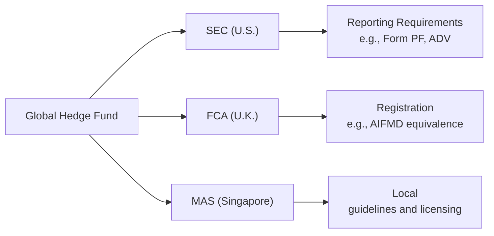

## Introduction
Anyone who’s tried to set up or run a hedge fund in multiple countries is probably familiar with the swirl of forms, deadlines, formal declarations (and, quite frankly, minor heart palpitations) that go along with global compliance. It’s like having to juggle different sets of rules simultaneously—imagine playing chess, checkers, and backgammon all at once. Fun, right?

But fear not. In this section, we’ll talk about how hedge fund managers can smartly handle multi-jurisdictional compliance and registration, particularly focusing on major regulators—the SEC (United States), the FCA (United Kingdom), and the MAS (Singapore). We’ll also explore some general best practices so that, whether you’re registering in the EU, a financial center in Asia, or an emerging market, you can keep everything organized, legal, and, hopefully, less stressful.

## Understanding Regulatory Requirements Across Jurisdictions
Getting multi-jurisdictional compliance right means understanding each regulator’s demands before shipping off your marketing materials or accepting investor capital. Different countries define “accredited investors” differently, impose distinct reporting timelines, or even restrict which hedge fund strategies can be marketed to their citizens. One time, a former colleague confided in me that they accidentally used the same sales deck in three countries without realizing a big chunk of disclaimers was missing for investors in one jurisdiction. Oops. That’s precisely what we want to avoid.

Keeping track of these rules is crucial for:
• Protecting investors and abiding by local investor protection laws.  
• Maintaining your firm’s reputation and avoiding regulatory fines or, worse, legal action.  
• Ensuring smooth distribution of your hedge fund’s offering materials.

## Key Global Regulatory Regimes

### United States: SEC Requirements
In the U.S., the Securities and Exchange Commission (SEC) expects hedge fund advisers to comply with a slew of regulations, including registration under the Investment Advisers Act of 1940, unless an exemption applies. Typical forms include:

• Form ADV: This discloses your fund’s business details, ownership, and conflicts of interest.  
• Form PF: Larger private fund advisers, especially “systemically significant” managers, often have to file Form PF, providing data on fund size, leverage, and general risk exposures.  

Managers also need to classify investors under Regulation D to ensure they’re accredited or qualified clients, which can get complicated if you simultaneously raise capital from individuals overseas. Prohibitions and guidelines around “general solicitation” can differ from those in other jurisdictions, so if you’re planning that flashy ad campaign, be aware that U.S. rules might have additional constraints.

### United Kingdom: FCA Responsibilities
Across the Atlantic, the Financial Conduct Authority (FCA) has its own stance on hedge fund regulation. Remember that the U.K. is no longer part of the EU, so the guidelines that once aligned with European rules may now have diverged somewhat. If you’re marketing or managing from London, you’ll have to consider:

• FCA Authorization: Managers typically need to be authorized under the Financial Services and Markets Act.  
• AIFMD (Alternative Investment Fund Managers Directive) Equivalence: Despite Brexit, the U.K. has “onshored” much of the AIFMD’s content, so cross-border marketing within the EU remains tricky. You might need to register with local regulators in addition to the FCA.  
• Disclosure Requirements: The FCA is particularly focused on transparency, so you’ll find robust rules around marketing documents, risk disclosures, and investor suitability.

### Singapore: MAS Guidelines
Singapore has quickly become a financial powerhouse in Asia, offering appealing business conditions, a strategic location to reach emerging markets, and—let’s face it—fantastic noodles. The Monetary Authority of Singapore (MAS) oversees banking, insurance, and capital markets. Key elements for hedge funds include:

• Licensing Regimes: Fund managers can be licensed under different MAS frameworks, such as the Capital Markets Services (CMS) license or the Registered Fund Management Company (RFMC) regime.  
• Accredited Investor Exemptions: In Singapore, managers commonly rely on the “accredited investor” concept, but local thresholds can differ from the U.S. approach.  
• Detailed Compliance: You’ll need to comply with risk management guidelines, especially if you’re employing sophisticated derivatives strategies. MAS is known for detailed oversight when it comes to derivative exposures and capital requirements.

### Beyond the Big Three
Of course, we’re only scratching the surface here. If you’re branching into fast-rising markets like Brazil, India, or the United Arab Emirates, you’ll face additional local rules and potential currency controls or capital restrictions. Always consider:

• Unique local definitions of accredited (or “professional”) investors.  
• Marketing restrictions (yes, some places still don’t let you easily share marketing decks with unsophisticated investors).  
• Potential requirements to have a local agent or local presence for fund distribution.

## Cross-Border Marketing and Solicitation Restrictions
Cross-border marketing might sound like a fun growth strategy until you realize how different the marketing rules can be. Some jurisdictions explicitly require disclaimers in marketing materials, while others limit distribution to institutional or high-net-worth individuals only. A single sales deck might need region-specific disclaimers to remain compliant. 

Additionally, you should carefully track each local rule for “pre-marketing.” Some regulators see pre-marketing (like meeting prospective investors to gauge interest before formal registration) as a regulated activity. Meanwhile, others might have a lighter approach. Keep a thorough database or spreadsheet—really, any method that works—to ensure you’re labeling each prospective investor properly and sending materials that comply with each local rule.

## Specialized Compliance Personnel or External Counsel
If you’re feeling a bit overwhelmed, well, you’re not alone. It’s absolutely common for hedge funds to hire specialized legal counsel or experienced compliance professionals. Modern guidelines shift quickly in an interconnected world. Just when you’re sure you have a handle on your submission for the FCA, guess what? A new regulatory circular might come out from MAS or the SEC. 

• Internal Hires vs. External Counsel: Some funds keep a specialized team in-house to coordinate with external counsel in each jurisdiction. Others prefer to rely primarily on local law firms.  
• Ongoing Education: It might sound cliché, but compliance staff really do need continuing education to keep up with changes.  
• Tech Tools: Some hedge funds are investing in compliance software that automatically updates local forms or checks marketing materials for region-specific disclaimers. That can save a lot of headaches.

## Capital Controls and Tax Treaty Considerations
Maybe you’ve decided to accept investment from an emerging market with currency restrictions. Let’s say you’re raising from an institutional investor in a country with tight exchange controls. You’ll need to factor in:

• Capital Repatriation Restrictions: Will you be able to easily return profits or principal to these investors?  
• Tax Withholding: For cross-border investments, some jurisdictions impose a withholding tax on gains. Specific tax treaties might reduce the rate, but you’ll need to confirm that your fund meets the criteria for favorable treatment.  
• Transfer Pricing & Double Taxation: If your fund or management company is set up across multiple locations, you might have to handle complex international tax rules ensuring you’re not paying too much or too little in taxes.

## Internal Protocols and Segregated Reporting
Dealing with multiple governments’ demands can lead to triplicate, maybe even quadruplicate, reporting. Let’s face it, no one wants to file the same data set 17 times. A robust internal system can help.

1. Mapping Requirements: Start by mapping each regulator’s required forms, deadlines, and content.  
2. Segregated or Tagging Systems: Some hedge funds keep investor data segmented by country or region in their CRM (Customer Relationship Management) tool. It’ll help identify investor type, track relevant disclaimers, and maintain a compliance trail.  
3. Calendar of Deadlines: Mark each deadline for forms (e.g., Form ADV for the SEC, local forms for the MAS, or AIFMD transparency filing in the U.K.).  
4. Timely Submissions: Regulators often impose strict deadlines. Miss them, and you can expect fines or a stern letter (at best).

## Real-World Example
Imagine you have a Delaware-domiciled hedge fund that’s actively marketing to U.H.N.W. (Ultra-High-Net-Worth) individuals in Singapore and the U.K. You might need:

• A separate marketing deck for U.S. investors that references SEC rules and the accreditation thresholds under Reg D.  
• Another deck (or disclaimers slide) for the U.K. investor referencing the FCA’s marketing rules for professional or sophisticated investors.  
• Written disclosures in Singapore referencing the local definition of accredited investors, plus compliance with MAS regulations on the offers of securities.  

For new managers, navigating all these differences can be dizzying. Establishing a consistent compliance blueprint from the start is much easier than unpicking the mess later.

## Visualizing a Multi-Jurisdictional Structure

Below is a simple Mermaid diagram illustrating how a global hedge fund might handle regulatory obligations for the U.S., the U.K., and Singapore. Note how each branch has its own reporting or submission path.

## Best Practices and Common Pitfalls
• Centralized Compliance Oversight: Don’t rely on a single jurisdiction’s framework for everything.  
• Consistent Disclosures: Regulators generally appreciate consistency. If you have a conflict of interest policy for one jurisdiction, replicate it (with tweaks as needed) in others.  
• Marketing Approvals: Double-check disclaimers are region-appropriate before distribution.  
• Adequate Insurance and Risk Management: Investigate global professional indemnity or errors-and-omissions insurance.  
• Frequent Policy Reviews: Laws change. Keep an annual or semi-annual schedule for thorough policy and procedure reviews.

One big pitfall is “overconfidence.” Some managers assume that if they’ve cracked the code in the U.S., they can do the same overseas. But, well, that’s rarely the case. Another common stumble is ignoring ongoing compliance. Setting up is one thing—maintaining robust controls year after year is another matter entirely.

## Conclusion
Multi-jurisdictional compliance and registration can look daunting, but with a strategic approach—and maybe a healthy dose of patience—it becomes manageable. Remember, navigating these requirements can open doors to global capital, giving you access to a broad base of sophisticated investors. So, while it might feel like you’re learning multiple languages at once, the payoff can be huge.

For the CFA® exam, it’s important to understand the gist of these requirements, how they fit into a hedge fund’s operational framework, and the risks of non-compliance. On a practical level, you’ll want to remember the interplay between registration obligations, accredited investor definitions, marketing rules, and local variations in capital controls. Pay special attention to how these regulatory frameworks might show up in case studies or scenario-based questions.

## Glossary
• FCA (Financial Conduct Authority): The U.K. regulator overseeing financial markets and services.  
• MAS (Monetary Authority of Singapore): The central bank and primary financial regulatory authority in Singapore.  
• Accredited Investor: An individual or entity meeting certain net worth or income thresholds, permitting investment in private funds without some of the usual protections.

## References and Further Reading
• Global Investment Performance Standards (GIPS) by CFA Institute.  
• International Regulation of Hedge Funds by IOSCO.  
• Local regulatory guides (e.g., SEC website in the U.S., FCA Handbook in the U.K., MAS circulars in Singapore).  

## Mastering Multi-Jurisdictional Compliance: 10-Question Quiz



### Which regulatory body requires Form ADV for hedge fund advisers operating in its jurisdiction?
- [x] SEC in the U.S.
- [ ] FCA in the U.K.
- [ ] MAS in Singapore
- [ ] FINMA in Switzerland

> **Explanation:** The SEC (U.S. Securities and Exchange Commission) requires investment advisers, including many hedge fund managers, to file Form ADV as part of the regulatory registration process.

### Which of the following is a responsibility of the FCA in the United Kingdom?
- [x] Authorizing and supervising financial entities under the Financial Services and Markets Act
- [ ] Setting federal interest rates
- [ ] Issuing treasury bills on behalf of the government
- [ ] Setting Singapore’s capital requirements

> **Explanation:** The Financial Conduct Authority (FCA) is responsible for regulating and supervising financial market participants in the U.K. It does not set interest rates (that is the Bank of England’s function) nor does it govern Singapore’s capital requirements.

### Which statement best describes the role of MAS in Singapore?
- [ ] It’s focused only on commercial banking regulations
- [ ] It supervises only insurance companies
- [ ] It issues guidelines on capital markets, but registration is handled by a separate body
- [x] It serves as the central bank and primary financial regulatory authority overseeing banking, capital markets, and insurance

> **Explanation:** The Monetary Authority of Singapore (MAS) acts as the central bank and oversees a broad range of financial activities, including banking, securities, and insurance.

### If a hedge fund manager wants to market to U.K. investors, which regulation might govern their activities post-Brexit?
- [x] FCA rules on marketing to professional clients, potentially including AIFMD-equivalent provisions
- [ ] Only the SEC’s Regulation D
- [ ] MAS guidelines for accredited investors
- [ ] There are no regulations on marketing in the U.K.

> **Explanation:** Even after Brexit, managers seeking to market alternative funds in the U.K. typically fall under the FCA’s domain, and aspects of the Alternative Investment Fund Managers Directive (AIFMD) have been adopted into U.K. law.

### A fund manager from the U.S. who wants to raise capital in Singapore should:
- [x] Familiarize themselves with the MAS accreditation thresholds and CMS licensing requirements
- [ ] Only file Form PF with the SEC
- [ ] Not bother with local registration, since the U.S. securities laws suffice
- [ ] Assume the U.K.’s regulations are automatically valid in Singapore

> **Explanation:** To operate in Singapore, managers generally must follow MAS regulations, including rules for accredited investors and potential licensing under local guidelines such as the Capital Markets Services (CMS) license regime.

### Which of the following best illustrates the concept of segregated reporting?
- [x] Filing separate sets of regulatory reports for each jurisdiction in which the hedge fund operates
- [ ] Combining all compliance reports into a single master document for global regulators
- [ ] Reporting only to the manager’s home country regulator
- [ ] Using the same disclaimers for every jurisdiction without adjustments

> **Explanation:** Segregated reporting involves tailoring and submitting distinct regulatory filings for each jurisdiction’s requirements, ensuring accuracy and compliance in every market.

### Capital controls in an emerging market might affect a hedge fund’s ability to:
- [x] Repatriate profits or principal to foreign investors
- [ ] Track investor progress via a CRM system
- [x] Exchange local currency into foreign currencies easily
- [ ] Conduct due diligence on prime brokers

> **Explanation:** Capital controls restrict how much and how easily money can flow across borders. Hedge funds must account for potential limitations on repatriation, currency conversion, or other financial flows, which can materially impact their operations.

### Which of these scenarios potentially violates marketing regulations?
- [x] Using U.S.-specific disclosures when soliciting investors in Singapore
- [ ] Submitting timely forms in each jurisdiction where the fund is registered
- [ ] Hiring local counsel to ensure compliance with each jurisdiction
- [ ] Developing region-specific offering documents that address local rules

> **Explanation:** Using U.S.-specific disclosures for investors outside the U.S. may fail to satisfy local compliance requirements. Even a small mismatch in disclaimers can violate marketing rules in another country.

### When discussing accredited investor thresholds internationally, which statement is true?
- [x] Each jurisdiction may define accredited or professional investors differently, requiring separate compliance
- [ ] The SEC’s definition universally applies
- [ ] Only the MAS sets thresholds that matter globally
- [ ] None of the jurisdictions define accredited investors differently

> **Explanation:** Every regulatory regime may have its own net worth, income, or sophistication criteria for accredited/professional investors, so compliance requires local knowledge and precise alignment with each definition.

### True or False: A hedge fund that’s properly registered with one major regulator (like the SEC) automatically meets the requirements for all other global regulators.
- [x] False
- [ ] True

> **Explanation:** Registration with one regulator does not grant automatic compliance in other jurisdictions. Each market has distinct rules and you must file or register accordingly.


