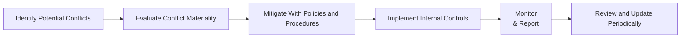

## Introduction and Context

Conflict of interest policies and robust internal controls are like the backbone of any well-functioning hedge fund. If you’ve ever watched a sports team where the coach also referees the game—and maybe even sets ticket prices—then you know how easily conflicts can arise when a single party holds too many roles and influences. Hedge funds face the same kind of risk if they lack checks and balances. Anyway, let's dive in and see why a strong conflict of interest policy is so critical, how to build one, and how to keep it humming along in the real world.

## Why Conflicts of Interest Matter

Sometimes you’ll hear folks say, “Well, we’re all professionals with the highest integrity, so we don’t really need formal conflict of interest policies.” And sure, maybe 99.9% of the time that works out. But when something does go wrong—like potential front-running of trades or a suspicious related-party transaction—investors and regulators can lose trust, fast. Conflicts of interest can undermine investor confidence, erode the hedge fund’s credibility, and potentially land you on the front page of a financial newspaper for all the wrong reasons. That’s why identifying, managing, and mitigating potential conflicts is a top priority for operational excellence.

## Common Types of Conflicts in Hedge Funds

Conflicts of interest can show up in some pretty sneaky ways.

### Personal Trading
Portfolio managers and analysts often have access to nonpublic, market-moving information. If they use that information in their personal trading accounts or tip off friends, that’s front-running or insider trading—both serious violations that compromise the fund’s integrity.

### Related-Party Transactions
Sometimes a hedge fund invests in companies where employees or executives have close ties. Or maybe the fund hires third-party vendors owned by a friend. These are known as related-party transactions. They can be legit if handled transparently, but they’re absolute red flags if hidden or improperly disclosed.

### Allocation of Investment Opportunities
Ever see that scenario where the “hot” deals go to certain favored client accounts, leaving less-attractive investment opportunities for everyone else? That’s a major conflict and can lead to lawsuits or seriously damaged client relationships.

### Compensation Structures
If portfolio managers are compensated based solely on short-term returns, they might be tempted to ramp up risk for quick gains, possibly clashing with the overall risk policy or the best interests of long-term investors. This misalignment of incentives can cause trouble faster than you might think.

## Building a Formal Conflict of Interest Policy

### Establish the Purpose
Every hedge fund should adopt a clear, written conflict of interest policy that states its objectives: to identify, manage, and mitigate potential conflicts in a systematic way. This sets the tone and underscores your commitment to ethical conduct—an element that resonates well not only with investors but also with regulators and the general partner community.

### Outline Key Conflict Scenarios
Nobody can address every single bizarre scenario that might come up, but it’s still crucial to list the big ones: personal trading, related-party transactions, vendor relationships, side agreements, or dual directorships. Being explicit about these situations helps employees recognize them early.

### Roles and Responsibilities
Who’s in charge of monitoring compliance? Typically, it’s the Chief Compliance Officer (CCO), but the policy should name a small group or committee that supervises conflict-of-interest issues. The point is to ensure no single person is both “detective and suspect,” if you will.

### Reporting Structure
Have a process that requires individuals to disclose conflicts or potential conflicts as soon as they arise. In many hedge funds, an annual or semiannual questionnaire is used to capture changes in personal holdings, directorships, or relationships. Plus, real-time reporting is often the best bet—nobody wants to wait six months to discover that a key employee has been funneling deals to his cousin’s company.

## Pre-Clearance and Monitoring of Employee Trades

There’s this classic joke: “Hedge fund employees sometimes trade more than the fund.” It can happen. That’s why pre-clearance procedures are essential.

- Employees typically must request permission (pre-clearance) before trading securities or derivatives that the hedge fund itself is researching or trading.  
- Continuous monitoring systems—often thorough compliance software—track trade dates, times, size, and price to detect anomalies or front-running patterns.  

Sure, employees can grumble that it slows them down, but well-structured personal trading policies protect both the individual and the firm.

## Duty Segregation for Checks and Balances

Picture a small hedge fund with one manager who picks the investments, executes the trades, and books the trades in the system—essentially wearing all the hats. Well, that’s a recipe for mistakes (or willful manipulation). 

### Why Segregation Counts
Segregating duties means dividing tasks among different teams or individuals:
• Portfolio management team proposes the trades.  
• Execution desk (or prime broker) handles official trading activity.  
• Operations or back-office staff confirms and settles the trades, reconciling them with fund custodians.  

By splitting these responsibilities, you make it much harder for a single person to engage in fraud or unintentional misreporting. Also, you reduce the chance of simple mistakes slipping through the cracks.

## Compliance Training and Education

Having a written policy is one thing, but do employees really know what to do when confronted with a borderline scenario? That’s where periodic compliance training swoops in. 

• Provide real-life examples: front-running, disclosing client info, or questionable vendor relationships.  
• Encourage a safe environment for discussing tricky scenarios—like that “buddy from college who wants inside intel.”  
• Reinforce relevant regulations (e.g., SEC guidelines in the U.S.) and tie them back to the firm’s internal codes.

## Whistleblower Procedures and Anonymous Reporting

Let’s be honest: sometimes an employee suspects wrongdoing but feels worried about retribution or career repercussions. A whistleblower procedure allows employees to report concerns anonymously, so they don’t have to fear for their jobs if they see something fishy.

### Key Elements of an Effective Whistleblower Procedure
• Confidential Reporting Channel: Maybe a hotline or an online platform, making the whistleblower’s identity unknown if they choose.  
• Independent Review: Ensure that a neutral third party or compliance officer handles the initial investigation.  
• Protection Against Retaliation: The policy should be crystal clear that retaliation won’t be tolerated, which encourages legitimate whistleblowing rather than hush-hush secrets.

## Putting It All Together: A Conceptual Diagram

Below is a Mermaid diagram illustrating a straightforward approach for managing conflicts of interest in a hedge fund setting.

In this workflow:
• Potential conflicts are identified (e.g., personal trading, related-party transactions).  
• Materiality is assessed to determine if immediate action is needed.  
• Mitigation steps or controls are applied.  
• Ongoing monitoring ensures compliance.  
• Regular reviews catch policy gaps or new conflict scenarios.

## Real-World Anecdote

I remember working with a small hedge fund that, in its early days, let the CFO also handle trade reconciliations. Everything seemed fine until a routine audit uncovered a glaring mismatch in the official statements. Turned out, a breakdown in segregation of duties made it easier for an error to go unnoticed for months. Long story short, they ended up overvaluing a particular position and had to restate the fund’s performance. This scenario, while not always about malicious intent, drove home the point that one person wearing too many hats can create big operational vulnerabilities.  

## Best Practices, Pitfalls, and Strategies

• Best Practice: Create a centralized conflict-of-interest register that’s updated regularly, so compliance officers track all reported conflicts in one place.  
• Pitfall: Failing to keep the policy relevant to current market conditions (e.g., new asset classes or technologies). A policy from 10 years ago might not address risks from digital assets, algorithmic trading, or block trades.  
• Strategy: Introduce a rotating function within the compliance team. Every year or two, shuffle responsibilities to maintain fresh eyes on potential conflicts.  

## Exam Relevance and Final Tips

From a CFA exam perspective, conflicts of interest tie back to ethics, governance, and risk management. Expect questions on how to properly identify and disclose conflicts, handle personal trading policies compliantly, and respond to compliance issues. For instance, an item set might outline a scenario where a portfolio manager executes personal trades just before placing large orders for the fund, and you’d have to identify the ethical and regulatory infractions.

• Time Management: In a constructed response question, be sure to address any references to the CFA Institute Code of Ethics or Standards of Professional Conduct.  
• Scenario Familiarity: Be prepared to tackle real-life examples—personal trading, related-party deals, and so forth.  
• Mitigation Frameworks: Show you know how to design or refine a conflict-of-interest policy.  

## References

• Ethical and Professional Standards by CFA Institute  
• Code of Ethics and Standards of Practice Handbook by CFA Institute  

• For additional context on oversight structures, see Chapter 8.8: “Managing Operational and Reputational Risks.”  
• For more details on advanced governance considerations, see Chapter 8.3: “ESG Factors, Governance, and Compliance.”  

--------------------------------------------------------------------------------

## Practice Questions on Conflict of Interest and Internal Controls



### Which of the following best describes a “conflict of interest” in a hedge fund setting?

- [ ] A short-term drop in fund performance.
- [ ] A manager’s inability to generate alpha.
- [x] A situation where the personal interests of fund personnel or affiliates interfere with the fund’s fiduciary duty.
- [ ] An employee’s interest in advanced trading software.

> **Explanation:** A conflict of interest occurs when the personal or financial interests of managers, employees, or affiliates impair—or appear to impair—their ability to act in the best interests of the fund and its investors.

### What is front-running?

- [ ] Processing trades in an efficient manner.
- [x] Trading based on advanced knowledge of pending large orders.
- [ ] Backdating certain trades to achieve better settlement terms.
- [ ] A legitimate means of maximizing alpha returns.

> **Explanation:** Front-running is when an individual uses prior knowledge of a large forthcoming order to trade for personal gain before the fund’s official trade hits the market.

### Which of the following helps hedge funds prevent front-running by employees?

- [x] Pre-clearance and continuous monitoring of employee trades.
- [ ] Allowing employees unlimited discretion to trade personal accounts.
- [ ] Limiting the fund’s trades to just equity indices.
- [ ] Eliminating the role of the compliance team entirely.

> **Explanation:** Requiring employees to seek pre-clearance for trades and routinely monitoring personal accounts can detect or deter front-running.

### In effective conflict-of-interest policies, why is segregation of duties essential?

- [ ] It ensures that the fund operates with fewer team members.
- [x] It prevents any single individual from controlling multiple processes.
- [ ] It allows the fund to skip third-party audits.
- [ ] It automatically eliminates all compliance issues.

> **Explanation:** Segregating responsibilities among different teams cuts down the risk that one person can manipulate the lifecycle of a trade or oversight process.

### Which statement accurately describes whistleblower procedures?

- [x] They offer a confidential or anonymous way for personnel to report potential misconduct or violations.
- [ ] They require employees to report only to HR in person.
- [x] They are typically integrated into the conflict-of-interest policy and compliance framework.
- [ ] They place all investigative responsibility on the CFO.

> **Explanation:** Effective whistleblower programs allow employees to submit concerns anonymously and are overseen by compliance or an external third party to ensure impartiality.

### Which of the following highlights a gap in managing conflicts of interest?

- [ ] Updating employee training annually.
- [ ] Requiring all employee trades to be logged.
- [ ] Disclosing all related-party transactions in official filings.
- [x] Failing to disclose a new board seat taken by a portfolio manager.

> **Explanation:** A manager taking on a board seat potentially creates a conflict if the manager has decision-making power or insider knowledge relevant to the hedge fund’s investments.

### How often should a hedge fund review and update its conflict-of-interest policy?

- [ ] Only when launching a new fund.
- [x] Periodically (e.g., annually or semiannually) and whenever material changes occur.
- [ ] Never, if the policy is drafted by legal counsel.
- [ ] Only when a regulatory warning is issued.

> **Explanation:** Best practice is to review the policy at least annually or whenever there’s a significant organizational or regulatory change, ensuring continuous relevance.

### One of the most effective ways to mitigate “allocation of investment opportunities” conflicts is:

- [x] Clearly documenting allocation policies and ensuring equal access to new investments for all clients under similar mandates.
- [ ] Providing the best opportunities only to the largest investors.
- [ ] Keeping the origin of new deals secret from the compliance team.
- [ ] Making sure each portfolio manager decides on allocations unilaterally.

> **Explanation:** When all investment opportunities are allocated consistently and fairly, and the process is documented, it decreases allegations of favoritism or misconduct.

### Why might hedge funds incorporate compliance training sessions?

- [x] To ensure employees understand the ethical and legal boundaries, using real-world scenarios.
- [ ] To help employees pass regulatory exams unrelated to hedge fund activities.
- [ ] To discourage employees from reporting potential frauds.
- [ ] To eliminate the need for a compliance team.

> **Explanation:** Training maintains awareness of rules and potential conflicts, preparing employees to recognize and respond appropriately to ethical dilemmas.

### In a robust whistleblower program, the fund should:

- [x] Provide confidentiality and protection from retaliation.
- [ ] Dismiss any employee who files a complaint.
- [ ] Share names of whistleblowers in monthly reports.
- [ ] Limit anonymous reporting to direct supervisors.

> **Explanation:** A strong whistleblower program encourages transparency by protecting individuals who report concerns and should guarantee confidentiality to avoid retaliation.


