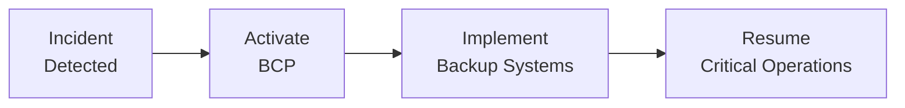

## Introduction and Key Considerations

Disaster Recovery and Business Continuity Plans (BCPs) are like that spare tire you keep in your trunk—you hope you never need it, but oh boy, if you do, you’ll be glad it’s there. Hedge funds, as well as other alternative investment managers, face an array of potential disruptions: cyberattacks, natural disasters, infrastructure failures, or even, you know, a sudden global pandemic that forces everyone to work from home. In other words, you need a plan not just for your technology but also for your people, processes, and external stakeholders.

Within the realm of hedge fund operational excellence, having a robust BCP is more than just a regulatory checkbox (although it is partially that, too). It’s also about preserving investor confidence, maintaining regulatory compliance, and, perhaps most importantly, ensuring that the fund can continue delivering value under adverse conditions. Many managers have discovered that a well-tested plan can be the difference between minimal downtime and total chaos.

Below, we’ll explore the core elements of an effective BCP, from building an actionable framework to performing disaster simulation drills. We’ll throw in some real-life experiences, highlight common pitfalls, and offer best practices for advanced business continuity. Let’s dig in.

## Why Business Continuity Matters

Imagine walking into your data center on a Monday morning and seeing that a broken pipe has flooded the server room. This exact scenario happened at a small hedge fund I once visited. Thankfully, the water damage was contained quickly due to a well-coordinated response—IT staff had redundant servers offsite, e-mails had automatically switched to a cloud provider, and they had a rotational schedule so the team knew exactly who to call first. Maybe it wasn’t the typical scenario you’d see in a textbook, but it was a stark reminder that disruptions can strike anytime.

For hedge funds, interruption in operations can spiral into reputational damage, regulatory scrutiny, and major financial loss. Additionally, from a CFA Institute Code of Ethics and Standards perspective, managers must protect client interests, including safeguarding sensitive data (Standard III(E)). Sustained outages or data loss can violate these professional standards and erode stakeholder trust.

## Core Elements of a Hedge Fund BCP

A strong BCP is both flexible and systematic. It needs to scale with the growth of the fund, adapt to new technologies, and keep pace with evolving regulations. Let’s look at the building blocks:

### Risk Assessment and Identification
First off, identify major vulnerabilities. A thorough risk assessment accounts for external hazards (floods, hurricanes, cyberattacks) as well as internal risks (system failures, power outages, employee errors). Hedge funds often rely heavily on prime broker relationships and advanced technology infrastructures, so you’ll want to map out all points of potential failure.

### Tiered Recovery Objectives
Once you’ve identified risk exposures, define your Recovery Time Objectives (RTOs) and Recovery Point Objectives (RPOs). An RTO indicates how fast you need to get critical systems back online, while the RPO shows how much data loss is acceptable. In hedge fund land, that’s usually pretty close to zero. But some systems can take longer to recover than others.

### Offsite Data Storage and Redundant Systems
One of the cardinal rules is to maintain backups of key operational data, including account statements, position records, investor communications, and compliance documents. Many managers use cloud-based backups with data centers in diverse geographic locations—think “offsite storage on steroids.” The key is to ensure your backups can be quickly and securely accessed when your main site goes down.

### Clear Communication Strategies
Communication is absolutely central to a BCP. It’s not only internal employees who require instructions. Investors, regulators, auditors, prime brokers, and other stakeholders need to know what’s happening. Let’s say you discover a cybersecurity breach at 3:00 a.m. You’ve got to ensure that the entire crisis response chain is activated immediately—everyone from your IT staff and compliance officer to your portfolio manager might need to jump in. The last thing you want is your largest investor learning about it first on social media.

### Agile Workforce and Remote Capabilities
I remember chatting with a colleague who managed a small hedge fund in Florida. A hurricane forced their entire office to shut down for over a week. Guess what saved them? They had a tested remote-work capability: employees could securely access trading platforms and research systems from any internet-connected device. Even though the physical office was out of commission, they continued trading and delivering performance updates as though nothing had changed. The moral: flexible workforce arrangements can be integral to business continuity.

### Response Teams and Chain of Command
A well-documented BCP outlines who does what—an organizational chart of crisis roles. If a cybersecurity attack hits, an Incident Response Team might consist of legal counsel, compliance, IT, and senior management. Each individual or team has specific tasks, escalation paths, and contact protocols. Without this clarity, confusion can paralyze your entire response.

### Testing and Simulation Exercises
Far too often, organizations create a BCP…and then let it gather dust. Disaster simulation exercises—whether tabletop or live drills—keep everyone familiar with the response protocols. A quick tip: try running these tests unannounced. That’s the surest way to reveal your blind spots. If employees can’t remember the crisis hotline or the steps to switch to the backup server, it’s better to find out during a test than in the midst of a real disaster.

## Periodic Review and Adaptation

All good plans need a periodic tune-up. Technological shifts happen fast: new trading algorithms, new analytics platforms, new regulations. Your BCP needs to keep pace. Let’s be honest: nothing is more embarrassing than pulling out your continuity plan in a crisis only to see the contact info for your prime broker is three years outdated.

Moreover, your regulatory environment may change, especially if you operate in multiple jurisdictions. In the United States, for instance, the SEC has specific guidelines for investment advisers to maintain robust BCPs. European managers must observe MiFID II operational resilience standards. Failing to keep your plan up to date can spell trouble beyond just operational disasters—it can open you up to compliance issues.

## Common Pitfalls and Best Practices

• Underestimating Human Factors: Technology, shmechnology. Your fancy backup system means nothing if employees don’t know how to actually activate failover processes. Training is crucial.

• Inadequate Testing: A plan not tested is a plan not trusted. Conduct tabletop and live drills at least annually, if not more often, especially after major updates.

• Lack of Duplicate Vendors: Hedge funds typically rely on multiple external service providers—think prime brokers, fund administrators, data providers. Dependence on a single external vendor can create a massive single point of failure.

• Overlooking Communication: You absolutely need an investor-specific communication plan. The last thing you want is your largest LP thinking you’re offline permanently when you’re only dealing with a minor data center hiccup.

• Neglecting Physical Security: BCPs are not just about IT. Flooded buildings, power outages, and yes, health emergencies (as we all learned) can incapacitate an organization if not handled carefully.

## Diagram: Typical Disaster Recovery Flow

Below is a simple Mermaid diagram to illustrate how a typical hedge fund might respond to a crisis, from incident detection all the way to resuming critical operations. Notice how each step feeds the next:

In a well-oiled BCP, these steps are executed rapidly and in tandem with a robust communication protocol: employees are alerted, external stakeholders receive timely updates, and senior management oversees the entire process.

## Integrating Regulatory Requirements

Hedge funds operating under the purview of global regulators must demonstrate their ability to continue operations subject to a variety of events:

• U.S. SEC: Under Rule 206(4)-7, registered investment advisers must adopt and implement written policies and procedures, including BCPs, to meet fiduciary responsibilities to clients.

• Europe (ESMA, MiFID II): Firms need to demonstrate operational resilience and ongoing ability to protect client interests.

• Asia-Pacific: Heavily regulated markets like Singapore (MAS) and Hong Kong (SFC) require proof that financial institutions can preserve data integrity and investor access during crises.

The underlying principle? Regulators expect that a serious attempt has been made to assess vulnerabilities, define recovery objectives, and test the plan regularly.

## Cybersecurity Integration

We’re seeing a convergence of BCP and cybersecurity frameworks. A data breach can disrupt operations just as much as a physical event. That’s why top-performing hedge funds typically integrate their cybersecurity incident response plan into the overall BCP. This includes steps for isolating affected systems, notifying law enforcement (if required), and mitigating financial and reputational damage.

## Service Providers and External Dependencies

Keep in mind that your primary prime broker, fund admin, or even your data feed providers also must have robust BCPs themselves. As part of your operational due diligence (ODD), it’s a good idea to check how frequently they test their backups, where they store their data, and how they plan to communicate in an emergency. Some hedge funds even go so far as to request service organizations’ SOC 2 reports to gauge the reliability of their internal controls.

## Developing a Continuity Culture

Finally, a BCP means little if it’s treated as a “box-checking” exercise. The most resilient hedge funds build a continuity culture. Employees at every level understand their part in a crisis, the plan is accessible and user-friendly, and management invests in ongoing training. It’s not exactly fun to practice a flood scenario on a sunny summer day, but as some would say: “Better to sweat in training than to bleed in war.”

## Putting It All Together: A Sample Action Plan

Below is a concise outline to help you structure or refine an existing BCP:

• Identify the scope and objectives (RTOs, RPOs).  
• Map critical operations, documents, data sets, and third-party relationships.  
• Develop written procedures detailing each step of crisis activation and escalation.  
• Set up redundancies: backup data center, cloud storage solutions, alternative site for staff relocation.  
• Train employees on emergency contacts, crisis roles, and responsibilities.  
• Run simulation exercises at least annually, and after significant system or personnel changes.  
• Document lessons learned and refine the plan.  
• Communicate updates to all stakeholders—internal and external—and ensure alignment with regulatory requirements.

And remember: revise, revise, revise. A BCP is never static. If it is, it’s probably outdated.

## Final Exam Tips

• Scenario Analysis: You might see a prompt describing a flood, cyber breach, or severe power outage. Be ready to walk through the steps of a BCP, focusing on immediate actions, roles, communication, and fallback systems.  
• Ethical Considerations: The CFA Code and Standards emphasize protecting client data and ensuring timely, accurate communication. Negligent handling of disasters could raise ethical red flags under Standard III(E), Preservation of Confidentiality.  
• Documentation: For essay-style questions, be precise about each stage of your plan. Use bullet points or short paragraphs to detail escalation paths and control procedures.  
• Testing Protocols: Examiners often test your knowledge of the importance of routine drills and plan reviews.  
• Regulatory Context: Understand that multinational hedge funds must comply with multiple regulators. Show that you grasp the high-level principles common across jurisdictions (backup data, minimal downtime, stakeholder communication).

Armed with these insights, you’ll be able to tackle exam questions with confidence and, more importantly, set the stage for operational resilience in the real world.

## References

- “Disaster Recovery and Business Continuity Best Practices,” ISACA.  
- “Guidance on Business Continuity Planning,” Federal Financial Institutions Examination Council (FFIEC).  
- CFA Institute (2022). CFA Institute Code of Ethics and Standards of Professional Conduct.  
- U.S. Securities and Exchange Commission (SEC), Rule 206(4)-7.  
- European Securities and Markets Authority (ESMA), MiFID II Operational Resilience Guidelines.  

---

## Hedge Fund Disaster Recovery Quiz



### Which common pitfall can significantly undermine a hedge fund’s Business Continuity Plan?

- [ ] Over-investing in communication systems
- [x] Failing to test the plan with regular simulations
- [ ] Reducing exposure to aftermarket trading platforms
- [ ] Eliminating backup servers to cut costs

> **Explanation:** A BCP that remains untested may not function correctly during a real crisis. Frequent and realistic drills are essential to identify and address weaknesses in the plan.

### Which of the following is the primary goal of a Business Continuity Plan?

- [x] Ensuring key operations and data remain accessible during disruptions
- [ ] Maximizing portfolio returns through market arbitrage
- [ ] Reducing capital gains liabilities for high-net-worth clients
- [ ] Lobbying regulators for beneficial policy changes

> **Explanation:** The main purpose of a BCP is to keep critical systems and processes running or recover them quickly in the face of adverse conditions.

### In the context of hedge fund business continuity, what is the function of offsite data storage?

- [ ] Storing outdated client data in compliance with data privacy laws
- [ ] Keeping confidential data accessible to all employees
- [x] Maintaining critical backups and documents away from primary business sites
- [ ] Encouraging staff to work remotely full-time

> **Explanation:** Offsite storage ensures that crucial data and documents remain safe and retrievable if a primary site is compromised.

### A hedge fund’s Recovery Time Objective (RTO) refers to:

- [x] The desired duration in which critical operations must be restored
- [ ] The maximum acceptable amount of data loss
- [ ] The minimum number of employees required onsite during disruptions
- [ ] The percentage of returning investors after a market crash

> **Explanation:** RTO measures how fast you need systems up and running after a disruption. It differs from RPO, which focuses on allowable data loss.

### Which strategy best addresses the communication needs of various stakeholders during a crisis?

- [x] Preparing a separate communication protocol for employees, investors, and regulators
- [ ] Posting mass updates exclusively on social media outlets
- [x] Using a dedicated crisis response team to handle urgent communications
- [ ] Delaying communication until the event is fully resolved

> **Explanation:** Effective communication may involve multiple parallel channels. Employees need operational updates, investors want to protect capital, and regulators must be informed to ensure compliance.

### Conducting an unannounced tabletop exercise primarily helps a hedge fund to:

- [ ] Verify if the vacation schedule of employees aligns with policy
- [ ] Lower the overall portfolio risk via real-time stress tests
- [x] Identify unrecognized gaps or confusion in the crisis plan
- [ ] Inform stakeholders of potential real estate expansions

> **Explanation:** Unscheduled or surprise exercises often reveal real-world weaknesses in how people react and how effectively resources are deployed.

### What is a crucial benefit of integrating cybersecurity within a BCP?

- [x] It allows the hedge fund to quickly isolate affected systems during a cyberattack
- [ ] It ensures indefinite system availability without human oversight
- [x] It fulfills the minimum standard of environmental auditing
- [ ] It negates the need for ongoing compliance checks

> **Explanation:** A data breach can halt operations just as effectively as a physical disaster. Integrating both in a single plan ensures rapid detection, containment, and recovery.

### Why might regulators require routine BCP assessments for hedge funds?

- [x] To ensure firms can meet fiduciary obligations, protect client data, and remain solvent during disasters
- [ ] To enforce brand consistency across multiple service lines
- [ ] To simplify the process of prime broker selection
- [ ] To diversify the hedge fund’s investment strategies

> **Explanation:** Regulatory bodies prioritize operational resilience and client protection, so regular BCP evaluations are mandated to confirm compliance and readiness.

### When updating a BCP, which of the following factors is least likely to prompt revision?

- [ ] A major upgrade in trading software
- [ ] A new regulatory requirement from the SEC
- [ ] Relocation to a new office building
- [x] A short-lived market correction that does not affect operations

> **Explanation:** BCP revisions are triggered by changes that affect processes, technology, infrastructure, or regulatory obligations. Minor market fluctuations that don’t alter operations typically won’t require a formal BCP update.

### True or False: A strong BCP culture means employees across all levels understand their crisis responsibilities and practice them regularly.

- [x] True
- [ ] False

> **Explanation:** Broad employee buy-in and understanding of contingency protocols are hallmarks of an effective continuity culture, ensuring faster and more unified responses when a crisis hits.


