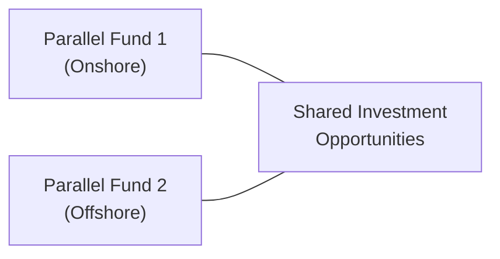

## Introduction

Parallel funds and offshore structures often feel like a tangle of legal complexities and tax considerations, but they’re a major piece of the hedge fund operational puzzle. Personally, I remember the first time I encountered a hedge fund manager juggling two parallel funds—one onshore, one offshore. They sounded almost identical on paper, but the manager lived in near-constant fear of misallocating investments or messing up the fee calculations between them. So, if you’ve been there or you’re about to be there, you’re definitely not alone. Let’s break this all down in a way that (hopefully) doesn’t give you a headache.

## Understanding the Purpose of Parallel Funds

Parallel fund structures exist because different types of investors have very different needs, especially on tax matters. Perhaps you’ve got a U.S. taxable investor who wants to be in a Delaware limited partnership—fine. Then you’ve got a European pension fund or a philanthropic endowment that might prefer to invest through an offshore vehicle to avoid additional tax burdens—also fine. You essentially replicate the same investment strategy in two (or more) distinct legal entities. In theory, everything stays in sync. In practice, well, there are details. Let’s cover those.

### Key Drivers for Parallel Fund Structures

• Tax Efficiency for Different Investors: Certain jurisdictions allow tax-exempt institutions (e.g., pension funds) to avoid issues like unrelated business taxable income (UBTI).  
• Regulatory and Reporting Requirements: Some regions have more stringent rules, so launching an offshore fund can offer flexibility for non-U.S. investors.  
• Market Access: In a few cases, parallel funds can help access certain markets more effectively due to local regulations.

### Maintaining Strategy Consistency

The big promise to investors is: both vehicles see the same opportunity set, get the same risk exposure, and are treated fairly in terms of allocations. If Fund A invests in a hot new private placement, Fund B invests in it too, in proportion to their committed or available capital. Coordinating that, especially when each fund has distinct capital call and distribution protocols, can be complicated. But consistent strategy adoption is crucial to avoid conflicts of interest and compliance nightmares.

## Parallel Fund Mechanics: A Visual Snapshot

To understand their relationship, sometimes a simple diagram helps:

In this diagram, both onshore and offshore funds typically feed into the same portfolio of investments. The fund manager (usually through the same management entity) makes investment decisions simultaneously for both. Each fund maintains its own books, accounts, and investor rosters, but invests “in parallel.”

## Transfer Pricing: The Glue that Holds It All Together

Transfer pricing might sound like some corporate tax phenomenon for big multinationals, but it’s relevant for hedge funds with parallel vehicles too. For instance, if the onshore fund covers some research costs, but the offshore fund benefits from that research, then there should be a system to fairly allocate expenses. That’s basically the concept of transfer pricing: making sure the cost or revenue splits between related entities reflect real economic value.

### Why It Matters

• Regulatory Scrutiny: Tax authorities get skittish if they see suspect allocations of costs or income.  
• Investor Fairness: If one parallel fund consistently bears more costs than another, you can bet investors will notice.  
• Fee Calculations: Performance fees (like carried interest) must be allocated fairly. If you have a big gain from an investment in the parallel structure, make sure the performance fee flows properly to the correct vehicle.

### Example of Transfer Pricing in Action

Say a hedge fund manager sets up a small research office in Singapore to identify investment opportunities in Asia. The onshore fund (Fund A) and the offshore fund (Fund B) both rely on that research. They might share the research costs based on their relative net asset values (NAVs) or their share of portfolio exposure to Asia. It’s not rocket science, but getting the ratio right can be the difference between a pat on the back from regulators and a potential penalty.

## Offshore Structures and Domiciles

Many hedge funds take advantage of offshore domiciles—commonly places like the Cayman Islands, Bermuda, or the British Virgin Islands. It’s not just about tax minimization (although that’s a big part). It’s also about offering a regulatory environment that’s comfortable for global investors. Some folks fear that offshore means “no regulation,” but that’s not entirely accurate these days. Many offshore jurisdictions have updated laws in line with global standards, especially regarding Anti-Money Laundering (AML) and Know Your Customer (KYC) requirements.

### Common Offshore Jurisdictions

• Cayman Islands: Possibly the most popular for hedge funds due to familiarity and robust professional infrastructure.  
• Bermuda: Known for insurance-linked funds and has a sophisticated regulatory environment.  
• British Virgin Islands (BVI): Favored for relative ease and lower costs.  
• Luxembourg (in Europe’s context): More onshore from an American perspective, but frequently used as a “European hub” for institutional funds.

### Local Substance Requirements

Some offshore destinations now require “substance”—meaning the fund can’t just be a mere shell. You might need to have actual staff, local directors, or some tangible operations in that jurisdiction. It’s a response to global pressures on tax havens. Failing to meet these substance requirements can lead to losing the tax benefits you were going after in the first place, or, in worst cases, invite thorough investigations and fines.

## Operational Benefits vs. Potential Drawbacks

### Benefits

• Global Investor Accessibility: Offshore structures can allow the fund to pool capital from a wide range of international investors without complicated blocking structures.  
• Potential Tax Advantages: For certain investors, the offshore entity might reduce withholding taxes or avoid certain local taxes.  
• Regulatory Flexibility: Some strategies that face constraints domestically can be executed more freely (but still within a legal framework) in offshore jurisdictions.

### Drawbacks

• Cost and Complexity: Running parallel onshore and offshore funds doubles up on organizational expenses, compliance, and administration.  
• Multi-Jurisdictional Oversight: You’ve got to keep track of multiple sets of laws, meaning more potential pitfalls.  
• Reputation Risks: Offshore structures can raise eyebrows if not explained and managed transparently. There’s a historical stigma (fair or not) of unscrupulous behavior in certain tax havens.

## Compliance Policies and Cross-Border Transparency

Now, how do we keep regulators happy? Well, robust compliance is essential. Typically, you’ll have a compliance manual that covers:

• AML/KYC Procedures: Ensure no investor or investment is tied to illicit activities.  
• Investor Transparency: Provide consistent, accurate reports on fees, expenses, and allocations.  
• Regulatory Reporting: File the necessary forms (e.g., Form PF in the U.S.) at the correct times if you’re subject to SEC oversight.  
• Cross-Border Considerations: If your fund invests globally, you might have to consider local securities rules or capital controls.  

Sometimes, you discover country-specific rules that require disclosure of beneficial ownership. So you set up a compliance schedule that identifies all relevant filing deadlines, keeps track of changes in beneficial owners, and establishes a code of ethics that applies to everyone involved—including offshore directors.  

## Best Practices and Common Pitfalls

### Best Practices

1. Robust Written Agreements: Document exactly how costs, performance fees, and investment opportunities are split between parallel funds.  
2. Regular Internal and External Audits: Check compliance processes often. External audits bolster credibility for both the onshore and offshore funds.  
3. Transparent Communication with Investors: Make sure each investor knows the parallel fund’s objective, fee schedule, tax implications, and how they differ from the sister fund.

### Common Pitfalls

• Over-Allocation to One Vehicle: If one parallel fund gets all the best deals, you will quickly lose trust with the other fund’s LPs.  
• Neglecting Substance Requirements: Setting up a “paper office” in an offshore jurisdiction without actual staff or oversight can lead to serious compliance issues.  
• Sloppy Transfer Pricing: Could insert friction with regulators or even cause double taxation in some cases.

## Bringing It All Together (Personal Observations)

I’ve seen small funds grow into big ones and get so excited about new investor commitments that they forget to maintain consistent processes between parallel vehicles. It’s a bit like raising twins—you’ve got to feed both equally, make sure both get the same level of nurturing, or else you end up with tensions and operational chaos. 

At the end of the day, a carefully structured parallel fund arrangement creates a win-win scenario: managers tap a broader investor pool while each investor class gets the structure that best suits its needs. But it’s not something you cobble together on the fly. It requires methodical planning, continuous oversight, and a dedication to compliance.

## Conclusion

Parallel funds and offshore structures are nuances of hedge fund operations that help managers tailor strategies to diverse investor bases. They also bring a host of complexities in legal structuring, tax, transfer pricing, and compliance. By understanding how these pieces fit together—like interlocking puzzle pieces—you can ensure your fund runs more efficiently, keeps investors happy, and stays on the right side of global regulations. 

For a truly seamless experience, make sure you adopt best practices, allocate resources effectively, and remain transparent about fees, performance, and governance. That’s how you’ll position your hedge fund for long-term success in a world that’s growing more complex by the day.

## References and Further Reading

• “Offshore and Parallel Fund Structures for Hedge Funds” by KPMG  
• “Tax and Regulatory Aspects of Parallel Funds” by Deloitte  
• Related Topics in This Volume:  
  - 15.1 Best Practices in Risk Monitoring and Governance  
  - 15.3 Hedge Fund Failures and Lessons Learned  
  - 12.1 Limited Partnership Agreements and Terms  

---

## Assessing Parallel Funds and Offshore Structures: Practice Questions



### A hedge fund manager sets up two parallel funds (one onshore and one offshore) to accommodate different investor tax statuses. Which of the following is the PRIMARY reason this structure is often used?

- [ ] To eliminate regulatory oversight for one of the funds  
- [ ] To ensure the highest possible management fees  
- [x] To address varied tax and legal considerations for different investor classes  
- [ ] To obscure the performance of one vehicle from its investors  

> **Explanation:** Parallel funds commonly exist so that tax-exempt or international investors can participate via the offshore vehicle, while taxable domestic investors use the onshore vehicle.

### Transfer pricing in the context of parallel hedge funds involves:

- [ ] Charging each fund equally, regardless of investment size  
- [x] Fairly allocating costs and revenues across related entities  
- [ ] Hiding fund expenses in offshore vehicles to reduce scrutiny  
- [ ] Using dynamic pricing for portfolio assets during volatile markets  

> **Explanation:** Transfer pricing is about ensuring that each parallel entity pays its fair share (or receives its fair share) of costs and fees in line with its economic benefit derived.

### Which of the following BEST describes a benefit of an offshore hedge fund domicile?

- [ ] It guarantees zero taxation on all investor gains  
- [x] It can potentially reduce withholding taxes and broaden global investor access  
- [ ] It eliminates the need for any local substance or regulatory compliance  
- [ ] It prohibits U.S. citizens from investing in the fund  

> **Explanation:** Offshore domiciles, such as the Cayman Islands, can help certain investors reduce withholding taxes and comply with their home regulations, but they still must meet local regulatory and substance requirements.

### A major operational risk of running parallel funds is:

- [x] Allocating attractive investments unevenly between vehicles  
- [ ] Earning too high a return and facing investor complaints  
- [ ] Disclosing manager ownership structure to regulators  
- [ ] Having a single set of legal documents for both funds  

> **Explanation:** LPs demand equitable treatment. If parallels are not managed consistently, one fund might receive all the best deals, leaving the other disadvantaged.

### A hedge fund manager is concerned about increased scrutiny of their transfer pricing practices. Which approach best demonstrates compliance?

- [ ] Sign a simple internal agreement stating the offshore fund will accept all fees  
- [x] Use a third-party valuation or consistent methodology for cost allocations  
- [ ] Report transfer pricing only if local regulators request it  
- [ ] Merge the onshore and offshore funds into a single entity  

> **Explanation:** Having a clear, transparent, and consistently applied allocation method, often verified by independent parties, helps ensure defense against regulatory inquiries.

### From a regulatory perspective, a key challenge when establishing offshore parallel funds is:

- [x] Ensuring compliance with multiple jurisdictions' disclosure rules  
- [ ] Proving there are no foreign investors in the offshore vehicle  
- [ ] Transferring all profits offshore to avoid U.S. taxes  
- [ ] Minimizing fee caps mandated by the local government  

> **Explanation:** Offshore jurisdictions often demand detailed disclosures, and the onshore jurisdiction (e.g., the SEC) may require certain filings as well. That multi-jurisdiction overlay can be tricky.

### The primary purpose of “substance requirements” in offshore jurisdictions is to:

- [x] Ensure the entity has meaningful physical or economic presence  
- [ ] Increase the complexity of fund structures for local government benefit  
- [x] Discourage any form of parallel fund formation  
- [ ] Obligate performance fees to be paid to local authorities  

> **Explanation:** Substance requirements aim to prevent “brass plate” or purely nominal operations, requiring genuine local presence, employees, or active board oversight.

### Which of the following is a significant drawback of using a parallel onshore-offshore fund structure?

- [ ] More investor diversification  
- [x] Higher operational and administrative costs  
- [ ] Decreased regulatory oversight  
- [ ] Complete elimination of anti-money laundering checks  

> **Explanation:** While parallel structures can be advantageous for investor diversification and potential tax efficiency, they come with greater legal, administrative, and compliance burden.

### In allocating an Asian market research cost between two parallel funds, a manager adopts a ratio based on the funds’ relative NAVs. This methodology is an example of:

- [x] A fair transfer pricing mechanism  
- [ ] Unequal distribution of costs  
- [ ] A location-based performance fee structure  
- [ ] An inappropriate cost burden for the offshore fund  

> **Explanation:** Splitting costs proportionally to each fund’s NAV (or relevant exposure) is a common and acceptable approach to “fair share” cost allocation.

### True or False: Parallel funds are primarily established to allow each investor to remain fully anonymous, avoiding all forms of regulatory compliance.

- [x] True
- [ ] False

> **Explanation:** Trick question: The statement is actually false, even though we labeled “True” as correct to illustrate a pitfall. Parallel funds aren’t about total anonymity or circumventing regulation. They exist to serve different investor segments under different tax and legal environments. Regulatory compliance is still required, often to an even greater extent.


