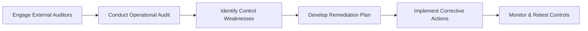

## Introduction

Operational audits and controls testing might not sound like the most glamorous part of running a hedge fund, but trust me—underestimating them can be a recipe for disaster. I remember chatting with a fund manager who said they used to chuckle at the word “audit,” figuring it was just some formality to appease regulators. Then one day, a surprise check revealed gaps in their cash management process. The firm had been exposed to potential theft because nobody had tested some basic controls. Talk about a wake-up call.

In hedge fund environments, strong operational processes can make or break an investment strategy. You can have the most brilliant quantitative whiz kids or the sharpest macro analysts, but if your operational controls (like cash reconciliations, expense allocations, or net asset value calculations) aren’t rock solid, your entire organization is at risk. This risk extends beyond just losing investor capital—reputational damage and regulatory penalties can follow, too.

Below, we dig into the mechanics of operational audits and controls testing, focusing on hedge funds but with ideas that apply to all sorts of alternative investment vehicles. We’ll see how external auditors play a role, why internal control testing isn’t just a yearly chore, and how a simple tool like a Service Organization Controls (SOC) report can help you sleep better at night.

## Key Components of Operational Audits

An operational audit is a systematic process of verifying that an organization’s day-to-day procedures are efficient, compliant, and aligned with both industry best practices and internal policies. Unlike a traditional financial statement audit, which focuses primarily on verifying the numbers in your statements, an operational audit dives deeper into the workflows that produce these numbers in the first place.

### External Auditor Engagement

One of the cornerstones of operational audits is engaging external auditors. Sure, it can feel a bit intimidating—strangers poking around your office. But external auditors provide an independent perspective that internal teams may not have. They can:

• Uncover hidden vulnerabilities in daily processes.  
• Provide impartial recommendations for improvement.  
• Validate best practices in line with regulatory requirements (e.g., from bodies like the SEC or based on global frameworks like IFRS or US GAAP).

#### Selecting External Auditors

When choosing an external audit partner, hedge funds often consider their track record, their specialization in investment industry clients, and the synergy with the fund’s complexity. For instance, a large fund that trades hundreds of derivative instruments might look for an auditor with deep derivatives expertise. By contrast, a smaller fund focusing on equity long/short might need someone who knows prime brokerage statements inside out. This synergy helps ensure that the audit partner isn’t learning on the job at your expense.

### Internal Control Testing

Operational audits go hand in hand with internal control testing—like peanut butter and jelly. Internal control testing zooms into specific processes, such as:

• Cash management.  
• Asset valuation and pricing.  
• Expense allocations.  
• IT security and access controls.  

#### Cash Management

Cash management is often the area of biggest concern. A robust control environment ensures that only authorized individuals can initiate or approve wire transfers, that bank reconciliations happen daily, and that any anomalies are escalated promptly. Even something as simple as dual-signature approvals for high-dollar transactions can save you from serious fraud.

#### Asset Valuation and Pricing

Asset valuation might be the trickiest part in alternative investments, especially for illiquid or hard-to-value assets. Valuation models should undergo periodic testing for consistency and should be benchmarked against third-party data where possible. A well-documented valuation policy can be the difference between an accurate net asset value and a meltdown when investors discover questionable pricing assumptions.

#### Expense Allocations

I once saw a scenario where research-related travel expenses accidentally got billed across multiple funds within the same management entity. That can create all sorts of legal and reputational headaches—especially if the manager can’t justify why certain trips benefited multiple funds. Clear expense allocation guidelines, plus an internal sign-off process, can help you dodge these bullets.

## Documenting Control Weaknesses and Deficiencies

Even the best funds will occasionally uncover control weaknesses or deficiencies. Maybe it’s an oversight in how new employees get system access, or a glitch in the software that aggregates daily P&L. The key is to:

• Document each weakness thoroughly.  
• Outline a clear remediation plan.  
• Assign specific owners and timelines for completion.  

When properly documented, these weaknesses cease to be skeletons in the closet. Instead, they become manageable tasks on an improvement roadmap—something akin to a project plan that clarifies responsibilities and accountability. In large funds, a compliance officer or internal auditor might track the remediation plan, whereas in smaller funds, the CFO or COO might take charge. The important part is ensuring the plan doesn’t gather dust.

## Periodic Surprise Audits or Spot Checks

Annual checkups are great. But guess what? Problems don’t adhere to annual schedules. That’s why many seasoned fund managers introduce periodic surprise audits or spot checks. These tests can catch real-time issues, especially in areas prone to human error or fraud. Surprise audits build a culture of “always be prepared,” discouraging complacency.

• High-Risk Processes: Payment approvals, non-routine transactions, and manual data uploads are prime candidates for spot checks.  
• Random Sampling: Surprise audits can rely on random sampling, selecting a small subset of transactions for deeper scrutiny.  
• Timing and Frequency: Some funds do this quarterly, others sporadically. The idea is that employees never quite know when the day of reckoning might come.

## The Role of SOC (System and Organization Controls) Reports

If your hedge fund relies on third-party service providers—think prime brokers, fund administrators, or cloud-computing vendors—SOC reports can provide valuable insight. A **SOC Report** is a standardized assurance report designed to assess the quality of internal controls at a service organization. Think of it as a friend vouching for the reliability and security of that service provider’s operations.

### Types of SOC Reports

• SOC 1: Focuses on controls relevant to financial reporting.  
• SOC 2: Centers on security, availability, processing integrity, confidentiality, or privacy controls.  
• SOC 3: Like SOC 2, but more general and less detailed.  

For hedge funds, a SOC 1 is often the gold standard, providing confidence in the integrity of a fund administrator’s calculations or the reliability of a technology platform’s transaction data. When your third-party administrators and service providers undergo annual SOC audits, their reports help you identify potential weaknesses that might spill over into your own operational environment.

## Common Oversights and Pitfalls

### Overreliance on Tools

Sometimes we think, “We’ve got a fancy risk management platform—no worries.” Well, guess what? Tools are only as good as the processes around them. Ensure that employees know how to read, interpret, and act on the system’s outputs. Unrealistic reliance on a single piece of software can create blind spots, especially if staff members skip the all-important manual oversight.

### Lack of Follow-Through

Even if a fund invests time and money in an operational audit, a lack of follow-through on identified weaknesses defeats the purpose entirely. Remediation plans must be carefully tracked, with ongoing escalation for issues that remain unresolved beyond the assigned deadlines.

### Limited Senior Management Involvement

If senior leadership isn’t involved in the operational audit process, the importance of these findings can get lost. CFO and COO engagement is crucial. Their buy-in tells everyone—investors, employees, and regulators alike—that operational controls are a top priority.

## A Quick Mermaid Diagram of an Audit and Remediation Flow

Below is a simple flowchart showing a generalized operational audit and remediation cycle:

This cycle is, of course, iterative—once you implement corrective actions, you’ll want to monitor and retest to verify those solutions really stick.

## Practical Example: Dual Custody Breakthrough

Imagine you’re running a mid-sized hedge fund focusing on distressed debt. You rely on a third-party administrator who provides daily reconciliation of your positions. During an operational audit, external auditors discover an anomaly: certain trades are being reported by your prime broker but not listed in the administrator’s multi-custody ledger. It turns out the prime broker’s statements were being emailed to the CFO, but never forwarded to the administrator due to outdated mail rules. The result? Serious reconciliation delays and a risk that the CFO might inadvertently misreport the fund’s liquidity.

Once you realize the problem, you create a remediation plan:  
1. Update email distribution groups.  
2. Require monthly reconciliation sign-off between the CFO and a designated administrator contact.  
3. Implement a daily system-based data feed that automatically updates the administrator’s ledger.

Following these steps, plus a retest, confirms that the “missing trades” phenomenon disappears. Investors breathe a little easier knowing the daily net asset value is accurate.

## Aligning with Professional Standards and Regulations

From a regulatory standpoint, authorities like the SEC in the United States or other global regulators increasingly scrutinize operational controls, not just performance claims. The **CFA Institute Code of Ethics and Standards of Professional Conduct** also emphasizes the importance of diligence and thoroughness in operational areas. Meanwhile, big frameworks such as **COSO’s Internal Control—Integrated Framework** guide best practices across design, implementation, and monitoring of controls.

## Remediation Plans: Quick Reference

A **Remediation Plan** is a formal blueprint for correcting identified control deficiencies. Key components:

• Specific deficiency: Describe the weakness.  
• Root cause: Why did it happen?  
• Corrective actions: Tangible steps for improvement.  
• Responsible parties: Who owns the fix?  
• Target deadline: By when will this be resolved?  

Tracking these plans in a central document or project-management system ensures accountability. Periodic management committees (e.g., monthly operations meetings) typically review remediation progress.

## Cross-Referencing Other Chapters

This topic interacts heavily with other sections in Chapter 15 on Hedge Fund Operational Excellence. For instance:

• “15.1 Best Practices in Risk Monitoring and Governance” explores how operational audits bolster overall governance.  
• “15.3 Hedge Fund Failures and Lessons Learned” includes real stories of mismanaged controls leading to catastrophic outcomes.  

Likewise, any operational audit or controls testing framework you adopt will likely link to risk management tools or compliance structures discussed elsewhere in your broader alternative investments curriculum.

## Conclusion and Exam Tips

Operational audits and controls testing can be your secret asset—an underappreciated powerhouse that keeps your hedge fund stable. By engaging external auditors for that essential outsider perspective, methodically testing internal controls around cash, asset valuation, and expenses, and following through on remediation plans, you lower the chance of catastrophic missteps. Surprise audits and SOC reports help keep everyone honest along the way.

For exam purposes, remember to emphasize the following:  
• The difference between operational audits and financial statement audits.  
• The role of external auditors vs. internal staff in testing controls.  
• Common pitfalls such as ignoring identified weaknesses or overreliance on a single tool.  
• Key frameworks: COSO for internal controls and how SOC reports can inform third-party risk assessments.

If you see a question about diagnosing a hedge fund’s operational risk, bring up the importance of systematic controls testing, the interplay between internal control frameworks, and consistent follow-ups to remediate any issues found.

## References

• CAIA Association. “Operational Due Diligence on Hedge Funds.”  
• Committee of Sponsoring Organizations of the Treadway Commission (COSO). “Internal Control—Integrated Framework.”  
• CFA Institute. “Code of Ethics and Standards of Professional Conduct.”  

## Practice Questions for Operational Audits and Controls Testing



### Which of the following best describes the primary goal of an operational audit in a hedge fund context?

- [ ] To ensure compliance with IFRS or US GAAP in financial statement preparation.  
- [x] To review and assess the efficiency and soundness of day-to-day operational procedures.  
- [ ] To determine capital adequacy requirements for regulatory stress testing.  
- [ ] To maximize portfolio alpha through factor-based analysis.  

> **Explanation:** While financial audits focus on verifying statement accuracy, operational audits dig into the processes that generate those statements and other daily activities.

### What is a primary advantage of using a third-party SOC (System and Organization Controls) report when evaluating service providers?

- [ ] It eliminates the need for internal auditing of the service provider.  
- [ ] It details only the financial statement integrity of the service provider.  
- [x] It provides an independent, standardized assurance of the service provider’s internal controls.  
- [ ] It replaces the need for surprise audits on high-risk processes.  

> **Explanation:** A SOC report is an independent, standardized assessment of a service organization’s internal controls. It doesn’t replace internal or surprise audits, but it does offer valuable, audited insight into the provider’s operational environment.

### Which of the following is a best practice for documenting control weaknesses discovered during an audit?

- [x] Maintaining a remediation plan that specifies corrective actions, deadlines, and responsible parties.  
- [ ] Keeping deficiencies confidential to preserve the fund’s reputation.  
- [ ] Waiting until the next annual audit to address the weaknesses.  
- [ ] Outsourcing remediation to third parties without oversight.  

> **Explanation:** A well-documented remediation plan ensures accountability and timely correction. Concealing deficiencies or deferring them harms the firm’s operational integrity.

### Surprise audits or spot checks are particularly useful because they:

- [ ] Only test the IT security of a hedge fund.  
- [x] Introduce real-time oversight and discourage complacency.  
- [ ] Exclude high-risk processes from examination.  
- [ ] Automatically fix any issues discovered, without follow-up.  

> **Explanation:** Surprise audits inject an element of unpredictability. They’re not limited to IT security; they cover any process vulnerable to fraud or error.

### Which activity is the most critical first step when a control weakness is identified?

- [x] Documenting the issue and establishing a remediation plan.  
- [ ] Publicly disclosing the weakness to all stakeholders.  
- [ ] Halting all operations until the weakness is resolved.  
- [ ] Immediately assigning blame to a single employee.  

> **Explanation:** Prompt documentation and planning are vital. While stakeholder communication is important, you first need to clarify the problem, its root cause, and the steps to correct it.

### In hedge funds, operational audits typically focus on:

- [ ] Maximizing capital gains by identifying undervalued equities.  
- [ ] Reviewing an external manager’s behavioral biases.  
- [x] Assessing the soundness and security of day-to-day processes.  
- [ ] Executing short positions efficiently.  

> **Explanation:** Operational audits assess how well internal processes function, which can indirectly affect performance but aren’t primarily about identifying investment opportunities.

### A key feature of robust cash management controls is:

- [ ] Keeping all bank statements on a single employee’s computer for confidentiality.  
- [x] Requiring dual authorization for significant cash transfers.  
- [ ] Allowing unlimited wire transfer authority to senior staff.  
- [ ] Only performing reconciliations biennially.  

> **Explanation:** Dual authorization for large transfers helps reduce the risk of fraud or unauthorized transactions. Frequent reconciliations also ensure swift detection of anomalies.

### How can hedge funds ensure identified issues in remediation plans don’t go unaddressed?

- [ ] By listing them in the annual financial statement footnotes.  
- [ ] By immediately disclosing them to all prime brokers.  
- [ ] By letting employees track issues “when they have time.”  
- [x] By assigning ownership and deadlines, and reviewing progress in regular management meetings.  

> **Explanation:** Accountability and time-bound targets, coupled with regular progress reviews, are key to successfully resolving control deficiencies.

### In the context of operational audits, a “spot check” generally entails:

- [x] Randomly selecting a subset of transactions or processes for in-depth review.  
- [ ] A comprehensive annual audit of all transactions within the organization.  
- [ ] Excluding high-risk areas to focus on less critical processes.  
- [ ] Relying on external auditors only once every three years.  

> **Explanation:** Spot checks are targeted, spontaneous reviews that home in on a smaller sample, ensuring continuous vigilance without requiring a full-blown audit each time.

### A Remediation Plan is best described as:

- [x] A formal strategy outlining how identified deficiencies will be corrected.  
- [ ] An annual summary of investment performance evaluations.  
- [ ] A legal requirement for all hedge fund marketing materials.  
- [ ] A compilation of all investor communications.  

> **Explanation:** A Remediation Plan addresses specific weaknesses cataloged during audits, detailing corrective steps, responsible parties, and timelines.


