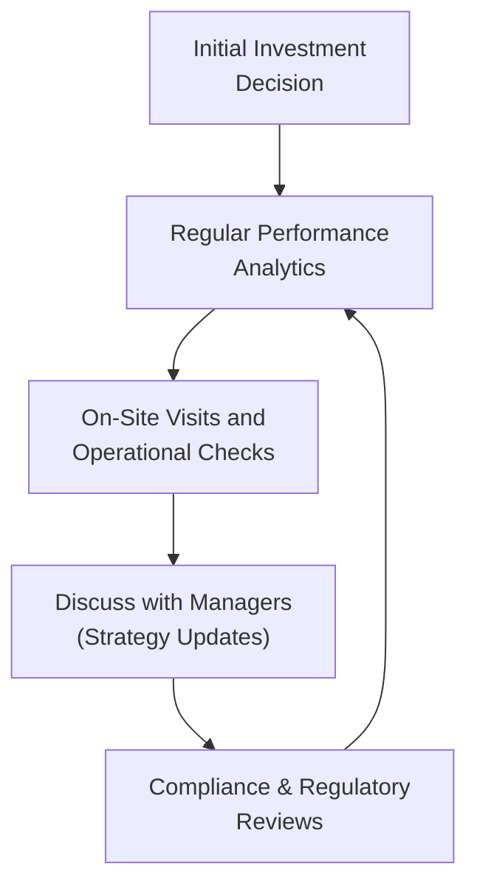

## Introduction

Have you ever felt uneasy about investing in something you can’t continuously observe? Well, I certainly have. Maybe it reminds me of the time I invested with a small emerging manager many years ago—everything checked out initially, but I quickly realized how important it was to stay vigilant over the life of that investment. Ongoing due diligence is basically that vigilance. It’s the continuous process of confirming that a hedge fund, or any alternative investment, remains aligned with your return objectives, risk tolerance, and operational expectations.

In Chapter 6 of this Volume, we discussed various hedge fund strategies and the initial due diligence steps. Now, we’ll dig deeper into how to keep the conversation and oversight active throughout the life of the investment. The ongoing due diligence process addresses questions such as: “Is the hedge fund’s style drifting away from its stated approach?” “Have there been any significant changes in personnel or tech infrastructure?” and “Will the manager’s new strategy shift create unintended exposures in my portfolio?” These are the tasks that separate a well-run multi-year relationship from a short-term disaster.

## Why Ongoing Due Diligence Matters

It may seem obvious to keep monitoring your positions, but in the hedge fund world—where strategies are often opaque and dynamic—ongoing due diligence is non-negotiable. Strategies evolve, market conditions change, and even the best managers can face unforeseen operational issues or drift from their original style. Continuous oversight ensures you’re not caught off-guard by any of these challenges and helps spot red flags before they become fiascos.

This continuous review goes well beyond initial analysis. Even if a fund performed spectacularly during your first year of investment, it’s far from guaranteed to keep shining if its market microstructure approach changes or if it onboarded an entirely new trading team. Simply put, ongoing due diligence helps preserve capital, manage risks, and sustain a healthy line of communication between you and the fund managers.

## Key Areas to Evaluate

### Portfolio Risk Exposures, Liquidity, and Style Consistency

One central aspect of ongoing due diligence is continuously verifying that the hedge fund’s investment style, liquidity terms, and risk exposures match what was originally promised. If the manager, for instance, advertises a market-neutral equity strategy but you notice large directional bets creeping in, that might be a style drift. 

Liquidity terms also warrant scrutiny. Hedge funds often come with lock-ups, gates, or other restrictions that might change over time. Reviewing liquidity at regular intervals—perhaps quarterly—lets you determine whether you can redeem capital in a reasonable timeframe if performance or strategy alignment sours.

Style Consistency is crucial. It refers to the degree to which the manager adheres to the declared style or strategy. Deviations can be both a red flag and a potential source of unexpected beta exposures creeping into your portfolio. 

### On-Site Visits and Operational Checks

Spending time at the fund’s operations can be an eye-opening experience. I remember walking into a fund’s server room once—like, physically onsite—and realizing their entire risk engine was basically an archaic set of spreadsheets. If the technology is stuck in the last decade, you might wonder whether the fund can handle high-frequency data and risk controls effectively.

An on-site visit also gives you the chance to evaluate the team dynamic in person. Have key contributors left the firm? Are new hires adjusting well? Are compliance personnel properly integrated with the front-office staff? This personal, face-to-face element can reveal intangible cultural shifts that don’t show up on performance reports.

### Updating Performance Analytics

Monitoring performance is obvious, but it’s important not to limit that to a single metric like total return. Consider risk-adjusted measures to reflect how much volatility (or downside risk) was required to generate those returns. Additionally:

• Tracking Error: This measures how closely a fund’s returns align with or deviate from a particular benchmark—or from a known factor model.  
• Factor Exposure: Understanding whether the fund’s returns are being driven by systematic factors (like momentum, value, etc.) or by unique alpha can be insightful. A sudden shift in factor exposures might signal a change in the manager’s style.  
• Drawdown Analysis: Consider the size and speed of capital drawdowns in different market environments.  

These analytics, updated each quarter or month, help alert you to irregularities—like an unexplained variance from normal performance or a sustained increase in volatility.

### Compliance and Regulatory Developments

While performance often steals the spotlight, operational and compliance issues can be equally important. If a manager is under regulatory investigation or has faced even minor compliance infractions, you’ll certainly want to know. Request updates on:

• Recent compliance findings  
• Regulatory audits or inquiries  
• Material operational or structural changes, like a new prime broker or change in fund administrator  
• Changes in valuation policies or risk controls  

Hedge funds often interact with a complex web of service providers (auditors, administrators, prime brokers). If any of these relationships are terminated or replaced, find out why. Such changes might indicate red flags—though sometimes they’re just routine transitions.

### Maintaining Open Dialogue with Managers

An open and honest relationship with fund managers is vital. Ask about their market outlook, especially if they’re known to pivot or adapt strategies based on macroeconomic shifts. Inquire about any new directions they’re exploring in designing trades. Are they considering new geographies, new asset classes, or advanced quantitative techniques? 

This ongoing conversation can be formal (scheduled quarterly calls) or casual (a quick check-in at an industry conference). The key is to keep communication channels open. Any sudden silence or avoidance of direct questions can be a cue to dig deeper.

## Practical Due Diligence Flow

Below, you’ll find a simple conceptual diagram illustrating a cyclical approach to ongoing due diligence. It outlines a possible workflow that integrates performance reviews, on-site visits, and compliance checks in a repeating cycle.



This cycle never ends. You keep doing these steps in a loop as long as your capital remains committed to the hedge fund.

## Example of Factor Exposure Analysis

For instance, assume you’re invested in a hedge fund claiming to be “market-neutral U.S. mid-cap.” You run a factor exposure analysis every quarter. Initially, the fund has minimal exposure to the overall market (beta ≈ 0.1), plus a consistent tilt toward “value” and “momentum” factors. Suddenly, in Q2, you discover the fund’s beta jumps to 0.5, and “momentum” factor rose significantly. What happened?

• Maybe the portfolio manager changed their hedging approach, or replaced short positions that offset market risk with something less effective.  
• Perhaps the manager sees a strong bull market in mid-caps, so they intentionally ramp up net exposures to capture alpha.  
• Could the manager be drifting from strategy? That’s a possibility too.

Regardless, the spike in factor exposure signals a question. Ongoing due diligence means you’d call the manager, schedule a review, and then decide if you’re comfortable with the new risk profile. If not, you might reduce your allocation or redeem entirely.

## Basic Formula: Tracking Error

Below is a simple Python snippet for computing tracking error relative to a benchmark. This might come in handy for your ongoing analytics:

```python
import numpy as np

# of matching length.
def calculate_tracking_error(fund_returns, benchmark_returns):
    # Calculate differences
    differences = np.array(fund_returns) - np.array(benchmark_returns)
    # Standard deviation of return differences
    t_error = np.std(differences, ddof=1)
    return t_error

fund = [0.02, 0.01, -0.01, 0.03]
benchmark = [0.015, 0.005, 0.0, 0.03]
print("Tracking Error:", calculate_tracking_error(fund, benchmark))
```

Tracking error provides insight into consistency, both for the manager’s style and your own expectations. If the fund commits to replicating or loosely mirroring a certain benchmark, a high or rising tracking error can be a big sign of drift or other issues.

## Common Pitfalls in Ongoing Due Diligence

• Overreliance on Past Performance: Don’t assume great past returns guarantee robust future performance.  
• Neglecting Operational Red Flags: Spotting a suspicious change in fund administrators—or a sudden exodus of senior staff—and failing to investigate can be costly.  
• Poor Communication: If you shy away from direct conversations with hedge fund managers, you may remain in the dark about pivotal changes.  
• Limited Budget for On-Site Visits: In-person visits can be time-consuming and expensive, but they often reveal intangible aspects of culture and technology that no phone call or slide deck can replicate.  

## Real-World Anecdote

A friend of mine once discovered that the “quant” hedge fund he was invested in had one key developer quietly exit the firm—he was basically the mastermind behind their entire algorithmic system. My friend didn’t find out until the next year’s investor letter. By the time he redeemed, performance had already dipped due to the coding quality left behind. Had he maintained a more engaged approach—perhaps with earlier onsite or teleconference visits—he might have spotted the departure and re-evaluated his position sooner.

## Strategies to Ensure Effective Ongoing Due Diligence

• Establish a routine: Set up systematic processes and a schedule for updating performance analytics, reading risk reports, and contacting the manager.  
• Use third-party resources: Engage consultant or third-party analytics platforms to track factor exposures and risk metrics, especially if you lack in-house tools.  
• Formalize on-site visits: Write a checklist of topics to explore, from IT infrastructure and staff retention to compliance processes.  
• Emphasize transparency: Communicate that you welcome both good and bad news from your fund managers. This fosters trust and helps you pivot faster when needed.

## Critical Reflections and Exam Tips

As you prepare for the CFA exams, keep in mind that real-life hedge fund due diligence doesn’t end after you sign the subscription documents. Scenario-based questions might test your understanding of how to detect style drift or rising correlation with broad equity markets. In constructed-response formats, you could be asked to articulate which operational red flags would trigger an immediate redemption. The exam often integrates ethics and professional standards into these topics. For instance, ignoring a compliance investigation or brushing off a major operational deficiency could indicate a failure to uphold the duty of loyalty to your clients (if you’re an advisor).

A final tip: be ready to quantify metrics like tracking error, factor exposure, and risk-adjusted return. The exam might require you to apply formulas or interpret the results in the context of a changing hedge fund strategy.

## References and Further Reading

• “Hedge Fund Due Diligence: A Source of Alpha in a Sea of Beta” by CFA Institute.  
• “Investor Due Diligence in Alternative Investments” by IPE (Investment & Pensions Europe).  
• CFA Institute Code and Standards – especially for ethical considerations in oversight.  
• Chapter 6, “Hedge Funds,” in this same Volume for additional background on hedge fund strategies and structures.

## Self-Assessment: Ongoing Hedge Fund Due Diligence Quiz



### Which of the following best describes "style consistency" in a hedge fund context?

- [x] The degree to which a hedge fund adheres to its declared investment style.
- [ ] The consistency of performance relative to a particular peer group.
- [ ] The stability of management fees over the life of the fund.
- [ ] The usage of advanced algorithms to maintain stable allocations.

> **Explanation:** Style consistency refers to whether the hedge fund manager remains true to the initially stated investment style. Deviations may signal style drift.

### During an on-site visit, an investor notices a sudden departure of key personnel. What immediate action is most appropriate?

- [x] Seek further information about the departure and assess the potential impact on the fund’s strategy.
- [ ] Immediately request a full redemption from the fund.
- [ ] Assume it’s a normal turnover and take no further action.
- [ ] File a formal complaint with regulators.

> **Explanation:** It’s prudent to gather detailed information on the reason for departure and evaluate how it could affect fund operations before deciding how to act.

### An ongoing due diligence process would least likely include:

- [ ] Regular conference calls to discuss recent performance and strategy shifts.
- [x] A one-time inspection of the fund’s operational infrastructure at inception only.
- [ ] Analysis of changes in factor exposures over time.
- [ ] Requests for updates on compliance findings.

> **Explanation:** Ongoing due diligence is, by definition, continuous. A one-time inspection at inception without further monitoring is insufficient.

### What does “tracking error” typically measure?

- [x] The volatility of the return difference between a portfolio and a benchmark.
- [ ] The difference in Sharpe ratios among various funds.
- [ ] A quantification of beta exposure to the market.
- [ ] The expense ratio of a fund.

> **Explanation:** Tracking error indicates how closely the fund’s returns track or deviate from a defined benchmark over time.

### Why is factor exposure analysis crucial for ongoing due diligence?

- [x] It reveals if the fund’s returns are driven by intended risk factors or hidden exposures.
- [ ] It’s mandated by all global regulatory authorities.
- [x] It can detect sudden deviations from the stated investment style.
- [ ] It guarantees outperformance relative to the market.

> **Explanation:** Factor exposure analysis highlights the underlying drivers of returns, helping identify hidden risks and style drift, though it cannot guarantee outperformance.

### If an investor identifies a rising correlation with broad equity markets in a supposedly market-neutral fund, which red flag might this indicate?

- [x] Possible style drift or net exposure change.
- [ ] A deliberate attempt to reduce volatility.
- [ ] Enhanced short-selling strategies.
- [ ] Potential prime broker conflict of interest.

> **Explanation:** An increase in correlation may suggest the fund has moved away from its previously neutral positioning.

### Which of the following best describes an “open dialogue” with hedge fund managers?

- [x] Frequent and willing exchange of insights about market outlook, strategy shifts, and risk appetite.
- [ ] Quarterly redemption requests regardless of performance.
- [x] Checking in about new or evolving investment theses.
- [ ] Publicly questioning the manager in social media forums.

> **Explanation:** Ongoing communication is vital for understanding how strategies evolve and how the fund is positioning itself in various market conditions.

### What is a primary benefit of an on-site technology review?

- [x] Confirming the robustness of the systems supporting trades, risk management, and data security.
- [ ] Ensuring the manager invests only in hardware stocks.
- [ ] Reducing the official management fee through negotiations.
- [ ] Confirming the hedge fund uses only open-source software.

> **Explanation:** Observing the fund’s infrastructure firsthand is key to understanding its capacity for risk control and operational reliability.

### How can a fund’s change in third-party administrator be interpreted?

- [x] It could be part of a normal business decision or a sign of operational concerns, requiring additional questions.
- [ ] It always signals an imminent fund shutdown.
- [ ] It never should raise concerns unless there is a simultaneous compliance issue.
- [ ] It implies the fund is definitely seeking a new prime broker.

> **Explanation:** Investors should be curious why a fund changes an important service provider, as such a shift might be routine or could indicate deeper problems.

### True or False: Ongoing due diligence primarily concerns performance metrics and does not include operational reviews.

- [x] True
- [ ] False

> **Explanation:** This statement is designed to check attention to detail. Actually, it’s false that it “does not include operational reviews.” Ongoing due diligence definitely includes operational checks. Therefore, the statement as given is incorrect, so marking “True” indicates we understand the statement is ironically false.



---

**Note on the final question:** The correct conceptual takeaway is that ongoing due diligence also includes operational and compliance reviews, not just performance monitoring. The quiz prompt ironically states the opposite to check whether learners are carefully reading.

Remember, a comprehensive ongoing due diligence process can save you from unnecessary risks and maximize the chances of achieving your investment objectives—while making sure that what you see is, well, actually what you get.
