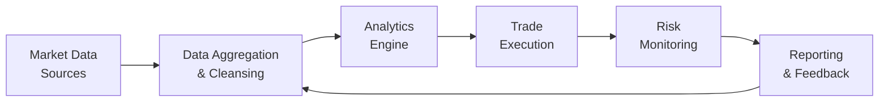

## Introduction
So, let’s start with a quick personal story. At one of my first hedge fund internships (way back when I still asked a dozen questions about how to open a Bloomberg terminal), I remember watching a senior trader literally sprint from the breakroom—spilling coffee everywhere—because the trading system locked up for a split second at the open. We’re talking a fraction-of-a-second glitch, but for him, it might as well have been an eternity. That was my first lesson in just how important technology and immediate access to data can be in hedge fund operations.

In the fast-paced and highly competitive hedge fund world, technology is more than a mere utility—it's the backbone of alpha generation and risk management. Many strategies hinge on ultra-specific, real-time data, advanced analytics, and lightning-fast trade execution. A single hiccup can literally be measured in dollars lost or opportunities missed. Sounds high pressure, right? Well, that’s hedge funds in a nutshell.

This section explores critical components of technology infrastructure, data analytics, and trade execution for hedge funds. We’ll look at best practices for building robust systems, employing cutting-edge analytics, and ensuring secure, fail-safe operations. By the end, you’ll (hopefully) see how the right tools and processes can reduce operational risk and help snag that performance edge everyone’s chasing.

## Core Technology Infrastructure
Technology infrastructure encompasses everything from servers and network architecture to data storage, software integrations, cybersecurity protocols, and beyond. In many ways, it’s the engine that powers a hedge fund’s daily activities.

### Architecture and Scalability
If you’re running a multi-strategy fund or dealing with real-time price feeds, you need to design systems that scale quickly and reliably. With increased trade volumes or new data feeds, your platform should be flexible enough to handle the extra workload without sacrificing speed. Traditional on-premise setups can sometimes struggle to scale abruptly. This is why more hedge funds have embraced cloud or hybrid solutions—they can expand bandwidth and storage without a massive hardware upgrade. Of course, the transition to the cloud must be balanced with robust security, privacy, and regulatory compliance, especially for funds handling sensitive client data.

### Low-Latency Platforms
Low-latency platforms let you place trades in microseconds. Consider high-frequency traders (or HFT specialists). For them, a one-millisecond increase in trading speed can be the difference between capturing fleeting arbitrage opportunities and missing them. Even if a fund isn’t strictly HFT, it often needs to access streaming data from multiple venues and respond in near real-time. 

A typical simplified approach might involve co-locating servers at major exchange data centers to reduce signal travel time. It also means optimizing code, network paths, and even specialized hardware (like field-programmable gate arrays, or FPGAs) for speed. But let’s be real: this all costs money, and not every strategy demands that level of investment. The key is aligning technology spend with the specific latency needs of the fund’s trading strategy.

### Cybersecurity
We can’t talk about core infrastructure without mentioning the intangible threats lurking around every network corner. Cyberattacks on financial institutions are widespread, and hedge funds—sitting on valuable market-sensitive data—are prime targets.

Common cybersecurity protocols go beyond a basic firewall. You might see multifactor authentication (MFA) for logins, intrusion detection systems (IDS) to spot abnormal network activity, zero-trust frameworks, and employee training about phishing and social engineering. The best systems incorporate a layered approach to security, from the data center up to each end-user’s device. And, yes, it’s essential to create (and frequently test) incident response playbooks for scenarios like ransomware attacks or data breaches.

## Data Analytics for Hedge Funds
If you think about hedge funds of yesteryear, many thrived on fundamental research and personal relationships. These days, you still need strong relationships, but you also need heavy-hitting data analytics to sift through mountains of information. From alternative data (such as satellite imagery or social media sentiment) to structured market data, advanced analytics can be the secret sauce that yields alpha.

### AI-Driven Analytics and Machine Learning
Artificial intelligence and machine learning (ML) enable funds to scan massive datasets and hunt for hidden market signals. For instance, a machine learning model might evaluate thousands of stock price features—anything from momentum to corporate sentiment—looking for anomalies that might predict future price movements.

A practical example: suppose you feed your ML model fundamental data (like quarterly earnings, revenue growth, or free cash flow), plus real-time price updates, and maybe even Twitter sentiment. That’s all well and good, but the trick is to avoid overfitting. Overfitting is when your model picks up noise instead of valid signals, performing great on past data but poorly in real markets. Rigorous out-of-sample testing and robust validation are absolutely essential to keep your model grounded.

### Unified Data Warehouse
Hedge funds can get overwhelmed by the sheer volume of data from different sources—each with its own format. As simple as it sounds, a robust data warehouse is invaluable. It centralizes everything—historical price data, corporate event data, proprietary research, risk metrics, and even external datasets—into a consistent environment. The benefits include:
- Streamlined data queries and analytics
- Reduced errors and data duplication
- Easier compliance and audit trails
- Faster time-to-insight, because everyone’s using the same data

### Real-Time Market Data Feeds
Another aspect of data analytics success is real-time data. If you’re trading intraday strategies, you might rely on direct feeds from major exchanges or use consolidated feeds that aggregate data from multiple venues. Latency matters predominantly in real-time feeds. Tools such as event stream processing let you filter, transform, or enrich the data in-memory (think microseconds) before your algorithms act on it.

Below is a simplified diagram (in Mermaid format) illustrating how data flows within a hedge fund’s analytics framework:



## Trade Execution Dynamics
Now let’s dive deeper into trade execution, which goes hand in hand with robust data analytics. A brilliant signal or price prediction doesn’t mean much if you’re unable to effectively execute the trades.

### Execution Algorithms
Many hedge funds use execution algorithms to automate how orders are placed in the market. These algorithms can break large orders into smaller slices, time them carefully, or use liquidity-seeking logic to minimize market impact. Examples include:
- Volume-Weighted Average Price (VWAP) algorithms  
- Time-Weighted Average Price (TWAP) algorithms  
- Implementation Shortfall (designed to reduce slippage relative to a reference price)

### Trade Cost Analysis (TCA)
Trade Cost Analysis is the systematic review of trades to identify direct costs (commissions, fees) and indirect costs (slippage). A simplified equation to illustrate slippage is:


\text{Slippage} = \text{(Average Execution Price)} - \text{(Reference Price)}


While that might look fairly obvious, TCA can get more nuanced by factoring in the timing of each trade, opportunity costs, market volatility, and so on. The idea is to refine your algorithms and possibly your choice of broker or execution venue. Over many thousands of trades, incremental improvements in TCA can have a major impact on performance. 

### Alternative Trading Systems and Dark Pools
While many trades route to standard exchanges, large trades can create significant price impact. Dark pools or other alternative trading systems (ATS) aim to match orders confidentially, so that large institutional trades don’t tip off the entire market. However, these venues also live under regulatory and best-execution scrutiny. Hedge fund managers must carefully evaluate the liquidity and fairness of ATS—sometimes you get less price improvement than expected, or your trades might get front-run if the ATS isn’t well policed.

## Risk Monitoring in Real Time
As soon as a trade is executed, robust risk monitoring tools come into play. Real-time position data, risk factor sensitivities, and scenario analyses all help portfolio managers see if a new trade is pushing the overall portfolio beyond comfortable risk bounds.

### Real-Time Position Tracking
Imagine a direct-lending strategy that’s also playing in credit default swaps (CDS) for hedging. Without consolidated, real-time position updates, it’s easy to “accidentally” become overexposed to a particular credit if you can’t see how all those derivatives add up. Hedge fund operations often implement real-time position monitoring solutions that fetch trades directly from execution systems, update positions, and feed them into a risk engine.

### Intraday Adjustments
With advanced analytics, you can detect that it’s time to lighten up or reinforce a position. For instance, a manager might use sentiment data. If negative news about a certain company hits social media and is spreading fast, the manager’s risk engine might raise a red flag prompting a partial liquidation. These frequent intraday tweaks can be automated or discretionary, but either way, technology is the enabler.

## Building Redundancy and Contingency Plans
This is the part you never really want to use but absolutely must have in place. If your primary systems go down—maybe your data center experiences a connectivity failure—what’s your Plan B?

### Backup Communication Channels
Many hedge funds maintain a secondary internet line from a different service provider. They also have direct phone lines to the prime broker or clearinghouse so they can manually close positions if the main electronic system fails. It’s not as quick or efficient, but it might save a meltdown.

### Alternative Trading Systems
Likewise, when one exchange or venue experiences a significant outage (yes, it does happen, though rarely), the ability to reroute orders to alternative trading systems is crucial. This ensures you’re not locked out of the market at a critical time.

## Best Practices for Vendor Management
It’s rare for a hedge fund to do everything in-house. You might outsource certain functions—like middle-office operations, data management, or even technology architecture—to specialized vendors. That’s perfectly fine, but you need robust vendor due diligence and ongoing oversight.

Ask yourself:
- Is the vendor financially stable?
- Do they have relevant expertise in hedge fund operations?
- What are their own cybersecurity practices?
- Can they handle my volume plus a buffer for future growth?

Establishing Key Performance Indicators (KPIs) and Service Level Agreements (SLAs) helps keep vendors accountable. Regular audits or at least formal check-ins can flag issues before they become big headaches. 

## Practical Case Study: The Knight Capital Glitch
A (by-now infamous) example often cited in operational risk discussions is Knight Capital’s 2012 fiasco. Knight Capital (not exactly a hedge fund but an important market maker) lost about $440 million in a single trading day due to a software deployment error. The new code was only partially installed, leading to unintended orders flooding the market. While this is an extreme scenario, it underscores the importance of:
- Careful release management
- Rigorous testing protocols
- Clearly defined rollback strategies

Had Knight’s technology team taken the time to double-check the deployment prior to the market open, they might have caught the mismatch in code versions. Organizational culture plays a key role here: encouraging thorough testing and a “no-heroics” approach to last-minute changes can be uncomfortable in a fast-paced environment, but it pays off.

## A Quick Python Example
Below is a very simplistic example of using Python to evaluate a metric called “time in market” for an intraday trading strategy. Assume you have a data array of timestamps, each indicating when a position was opened or closed. This example is obviously a toy model, but it shows how easily code can be integrated into your trade lifecycle analytics:

```python
import pandas as pd

data = {
    'TradeID': [1, 2, 3, 4],
    'Action': ['Open', 'Close', 'Open', 'Close'],
    'Timestamp': ['2025-02-15 10:00', '2025-02-15 10:30',
                  '2025-02-15 14:00', '2025-02-15 14:45']
}
df = pd.DataFrame(data)
df['Timestamp'] = pd.to_datetime(df['Timestamp'])

opens = df[df['Action'] == 'Open'].set_index('TradeID')
closes = df[df['Action'] == 'Close'].set_index('TradeID')

merged_df = opens.join(closes, lsuffix='_open', rsuffix='_close')

merged_df['Time_in_Market'] = (merged_df['Timestamp_close'] - merged_df['Timestamp_open']).dt.total_seconds() / 60.0

print(merged_df[['Timestamp_open', 'Timestamp_close', 'Time_in_Market']])
```

In reality, you’d also incorporate fill details, volumes, and strategy signals. But even these small scripts can be part of an ongoing pipeline that monitors trade performance, identifies anomalies, or calculates valuable metrics in near real-time.

## Common Pitfalls
1. **Overreliance on Vendors**: Assuming your passage of risk to a third party eliminates the need for internal oversight. Nope, you still own the risk.  
2. **Insufficient Testing**: Rushing new features, data feeds, or strategies to production without thorough testing.  
3. **Poor Version Control**: Failing to document and track code changes, leading to confusions like the Knight Capital scenario.  
4. **Underestimating Latency**: Even if you’re not an HFT, ignoring time lags can lead to suboptimal fills or missed signals.  
5. **Neglecting Data Quality**: Throwing all sorts of data at your analytics engine without ensuring it’s clean, consistent, and relevant.

## Ethical and Regulatory Overlays
Hedge funds operate under various regulations, depending on the jurisdiction. Managers also have to abide by the CFA Institute Code of Ethics and Standards of Professional Conduct; that includes standard compliance with recordkeeping, confidentiality of client information, and accurate representation of performance. When it comes to technology:
- Data usage must respect client privacy and legal constraints (especially if dealing with alternative data that might involve personal information).  
- Trade execution must follow best-execution guidelines, ensuring the fund isn’t misrepresenting quotes or front-running.  
- Cybersecurity measures must meet a level “reasonably expected” by regulators in a given region.

## Bringing It All Together
To remain competitive—and to stay on the right side of operational risk—hedge funds need a holistic approach to technology. That means:
- Investing in high-speed, low-latency trade execution where it fits the strategy.  
- Embracing advanced data analytics tools such as machine learning, to gain deeper insight and predictive strength.  
- Maintaining strong cybersecurity protocols (MFA, IDS, encryption, etc.) to defend sensitive trading data.  
- Integrating real-time market data and position monitoring systems for timely risk detection and portfolio rebalancing.  
- Keeping robust backup systems (both technical and operational) to handle outages.  
- Conducting rigorous vendor due diligence and oversight for outsourced technology functions.  

Like so many other facets of hedge fund operations, it boils down to thorough planning, consistent execution, and constant refinement. Oh, and a healthy respect for Murphy’s Law—because if something can go wrong, it likely will, at the worst possible moment.

## Glossary
• **Low-Latency Platforms**: Systems designed for extremely high-speed trading and data processing, minimizing delays (latency) between order issuance and execution.  
• **AI-Driven Analytics**: Computational methods using artificial intelligence and machine learning to interpret large, complex datasets for predictive insights.  
• **Cybersecurity Protocols**: Policies, frameworks, and tools that protect networks, systems, and programs from digital attacks. Examples include multifactor authentication and intrusion detection systems.  
• **Alternative Trading Systems (ATS)**: Electronic platforms that match buy and sell orders. They operate outside traditional exchange structures, often to reduce market impact for large institutional trades.

## References & Further Reading
1. “Automated Trading Desk: A Primer” by CFA Institute.  
2. “Cybersecurity and Financial System Resilience: Macrofinancial Implications” by IMF:  
   https://www.imf.org/  
3. “Global Technology Trends in Asset Management” by Deloitte.  

<br/>

## Test Your Knowledge: Technology, Data Analytics, and Trade Execution Quiz



### Which statement best describes the purpose of low-latency trading platforms?

- [ ] To increase the number of trades placed in a portfolio, regardless of profitability
- [x] To minimize delays between order issuance and execution, capturing price advantages quickly
- [ ] To ensure trades can only be executed in after-hours or extended sessions
- [ ] To comply with regulatory reporting standards for over-the-counter derivatives

> **Explanation:** Low-latency trading platforms aim to reduce network and processing delays, allowing hedge funds to react swiftly to market price changes—especially important in high-frequency or opportunistic trading strategies.

### What is a key benefit of implementing AI-driven analytics within a hedge fund’s data infrastructure?

- [ ] Eliminating all risk of overfitting in historical data
- [ ] Removing the need for fundamental analysis
- [x] Identifying subtle, nonlinear patterns that may provide alpha signals
- [ ] Enabling unlimited scaling without cost factors

> **Explanation:** AI-driven analytics can ferret out complex patterns across large datasets—often patterns that may not be easily visible through traditional fundamental or technical approaches.

### A robust hedge fund cybersecurity framework should generally include which of the following?

- [x] Multifactor authentication and intrusion detection systems
- [ ] A single firewall with open access to research staff
- [ ] Social media sharing of all trades to ensure transparency
- [ ] Reliance entirely on cloud providers for security responsibilities

> **Explanation:** Hedge funds typically utilize multifactor authentication, layered firewalls, intrusion detection, and other measures. Simply having a firewall is insufficient, and relying solely on cloud providers is risky.

### What is an advantage of real-time position monitoring in hedge fund trading operations?

- [x] It allows immediate detection of risk exposures, enabling timely rebalancing or hedging.
- [ ] It permanently locks in daily profits at the open of each trading session.
- [ ] It guarantees a hedge fund will beat its benchmark in all market conditions.
- [ ] It automatically reduces the number of trades executed.

> **Explanation:** Monitoring positions in real time helps managers see how the portfolio’s exposures are shifting intraday. This allows them to adjust positions quickly to manage risk or capitalize on short-lived opportunities.

### Which statement best captures a major function of Alternative Trading Systems (ATS)?

- [x] They let institutional traders execute large orders with reduced market visibility (dark pools).
- [ ] They provide direct retail customer access to major exchanges without fees.
- [x] They offer improved liquidity for large trades, minimizing potential market impact.
- [ ] They guarantee better pricing for all participants, regardless of order size.

> **Explanation:** ATS, including dark pools, often help large investors trade sizable blocks with less market impact. However, pricing advantages are not always guaranteed, and these systems mainly serve institutional players with large block orders.

### What is the main purpose of Trade Cost Analysis (TCA)?

- [x] To evaluate explicit and implicit trading costs, helping refine execution strategies.
- [ ] To ensure a hedge fund always pays the lowest commissions possible.
- [ ] To advertise the fund’s performance to potential investors.
- [ ] To directly calculate the Sharpe ratio of a portfolio.

> **Explanation:** TCA looks at various trade-related costs (commissions, spreads, slippage) so managers can enhance execution efficiency and reduce unnecessary drag on returns.

### In hedge fund technology, which of the following is a best practice for contingency planning?

- [x] Maintain a secondary internet line from a different provider in case of primary failure.
- [ ] Only test backup systems once every five years.
- [x] Implement alternative trading systems as a fallback if the main exchange experiences outages.
- [ ] Assume that power outages do not affect financial servers.

> **Explanation:** Hedge funds often have multiple internet lines, backup power generation, redundant servers, and alternative trading venues—testing them regularly is crucial for resilience.

### Why might a hedge fund incorporate a data warehouse into its analytics framework?

- [x] To centralize data from various sources, enabling consistent analysis and reduced errors
- [ ] To disclose proprietary signals and strategies to competitors
- [ ] To limit the number of vendors used for prime brokerage services
- [ ] To reduce compliance with regulatory reporting

> **Explanation:** A unified data warehouse integrates disparate streams of data into one repository, helping ensure quality and consistency in analyses while facilitating audit trails.

### What lesson can be drawn from the Knight Capital 2012 software deployment error?

- [x] Even a small oversight in release management can cause catastrophic financial losses.
- [ ] Hedge funds should never invest in equity markets.
- [ ] High-frequency trading strategies are immune to operational risk.
- [ ] Firms should rely entirely on manual trade execution.

> **Explanation:** Knight Capital’s event underscores how minor oversights in software deployment, testing, and release management can spiral into enormous losses—pointing to the importance of rigorous operational processes.

### True or False: For hedge funds, overfitting a machine learning model means it performs better on real market data than on historical data.

- [ ] True
- [x] False

> **Explanation:** Overfitting means the model shows promise on the historical (training) dataset, but fails to generalize well to new, real-world data. Essentially, it has “learned” noise instead of valid signals.


