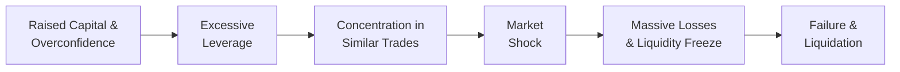

## Introduction

So, I’ll be the first to admit that hearing stories of hedge fund collapses can sound a bit like drama from a finance soap opera—there’s always a mix of overconfidence, hidden leverage, and a sudden market shock that sets the stage. But unlike your usual TV series, these real-life collapses typically destroy vast amounts of capital, damage reputations, and create ripples (sometimes tsunamis) throughout entire markets. As future financial analysts, we want to not only understand what went wrong in these scenarios but also learn how to spot early red flags so it doesn’t happen again on our watch.

Below, we’ll take an in-depth look at some of the more infamous hedge fund collapses, focusing on how seemingly genius strategies and big bets led to massive financial turmoil. We’ll also glean lessons learned, from the absolute necessity of robust risk controls to the critical importance of discipline and transparency. Let’s dive in.

## Key Hedge Fund Collapses

### Long-Term Capital Management (LTCM)
If there is a single name in hedge fund lore that stands above the rest, LTCM is it. In the mid-to-late 1990s, this fund boasted some of the biggest intellectual firepower in the industry—Nobel Prize winners, seasoned Wall Street veterans, and a thoroughly quantitative approach. LTCM specialized in fixed-income arbitrage, employing enormous leverage to squeeze profits from relatively small spreads in the bond market.

• Leverage and Concentration: LTCM famously used leverage ratios well above 25-to-1. Not only did they gear up, but they poured a large portion of their capital into highly correlated bond arbitrage positions (U.S. Treasuries, interest rate swaps, etc.). When Russia defaulted on its debt in 1998 and global markets panicked, LTCM’s carefully constructed models didn’t hold. Serious disruptions in liquidity, plus rising spreads in the fixed-income arena, sank the portfolio.  
• Liquidity Squeeze: Banks started demanding more collateral, while LTCM’s positions deteriorated. With no plan for rapid deleveraging, LTCM faced margin calls it simply couldn’t meet.  
• Result: The U.S. Federal Reserve orchestrated a bailout to prevent systemic contagion. LTCM was effectively dismantled by the consortium of banks that stepped in.  

I remember being shocked when first reading about LTCM in business school. How could a team of actual geniuses miss such critical risk factors? Well, perhaps genius doesn’t always translate into mindful risk controls—and that’s where humility and robust governance come in.

### Amaranth Advisors
Fast forward just under a decade, and we see another eye-popping meltdown: Amaranth Advisors. In 2006, Amaranth made a fortune in natural gas trades. But in 2007, that success took a horrible turn, as dearly held positions swung by billions of dollars against the fund. Here’s what happened:

• Overconcentration: Amaranth placed enormous bets on the spread between winter and summer natural gas prices. Sounded clever—until prices took a turn that the fund didn’t expect.  
• Strategy Drift: The fund actually started out as a multi-strategy hedge fund but ended up leaning heavily into energy trading (particularly natural gas). Had it stuck to the original multi-strategy approach, the meltdown might have been mitigated.  
• Liquidity Crisis: As short-term natural gas prices soared and the longer-dated contracts sank, the margin calls rose steeply. In less than two weeks, Amaranth was decimated, losing over USD 6 billion.

Sure, it’s easy to point fingers, but the bottom line is that concentration and complacency can defeat even the brightest manager. You could say Amaranth’s meltdown is a textbook example of what happens when “things are going great” blinds you to a potential black swan event.

## Organizational In-House Knowledge Retention

Now, you might be wondering, “What do we do about this at the institutional level?” One critical practice is to document major mistakes and near misses in something like a “lessons learned” database or a post-mortem process. Most large institutions conduct risk reviews when trades go wrong or markets shift unexpectedly. But these insights can get lost if not carefully documented, shared, and integrated into ongoing risk framework updates.

• Accountability Mechanisms: Assign responsibility for mistakes to specific processes (not witch hunts, but fair accountability). This preserves transparency and prevents repeating the same missteps.  
• Culture of Learning: At great organizations, there is an emphasis on growth mindsets. If your fund invests in knowledge retention, you create institutional memory that endures beyond any single manager’s tenure.  
• Action Plans: Summary documents of errors and recommended improvements should be tested in future trading scenarios so that they don’t collect dust in a file cabinet.

## Early-Warning Indicators

If we could predict major tail-risk events, we’d all be millionaires, right? Well, we can’t predict them with certainty, but we can keep an eye on the canary in the coal mine. Through the lens of LTCM and Amaranth—plus many other examples, including the Bear Stearns High-Grade Structured Credit Strategies Funds fiasco—several early-warning indicators stand out:

• Rising Leverage Ratios: Are you leveraging at levels that are out of sync with historical norms or your own risk appetite statement? Any jump to 10-to-1 or 20-to-1 (or beyond) is a major red flag.  
• Liquidity Mismatches: If the instruments you’re trading are illiquid, but your investor redemption terms are short, you may face a forced liquidation scenario in a crisis.  
• Elevated Market Volatility: If volatility spikes, do you have the capacity (capital, margin) to handle large swing exposures? Or do you rely on the assumption that volatility will revert quickly?  
• Stress Tests and Scenario Analyses: If these exercises consistently show catastrophic losses, but no one is taking corrective measures, that’s a clue you’re ignoring the writing on the wall.  
• Redemptions and Investor Concentrations: A major investor pulling out can spark a chain reaction of redemptions. Funds that rely heavily on a small group of clients face a much higher redemption risk in times of stress.

Keeping tabs on these five signals can help managers identify a precarious position before it turns into a meltdown. Maybe it sounds obvious, but in the heat of a bull market, it’s astonishing how easy it is to wave away these indicators as “just paper losses.”

## Importance of a Disciplined Investment Process

If you’ve ever tried a fad diet only to give it up for the next best craze, you’ll relate to the concept of “strategy drift” that occurs when managers lose discipline. This often goes hand in hand with style drift, where the fund invests in positions outside its stated strategy. The best approach:

• Clearly Defined Mandate: Hedge funds should have a well-articulated investment thesis—whether it’s a macro strategy, fixed-income arb, or event-driven approach. This includes guidelines on leverage, liquidity, and portfolio constraints.  
• Continuous Risk Committee Reviews: A cross-functional risk committee (involving risk managers, portfolio managers, compliance officers) that meets regularly is essential. They can catch the early signs of drift or ask tough questions about new positions that appear suspiciously outside the normal scope.  
• Emphasis on Proper Diversification: Instead of piling money into a single asset class or directional bet, a disciplined manager maintains diversification across instruments and markets.  
• Independent Mark-to-Market Valuations: Have an independent party or at least a robust internal system for pricing illiquid or complex securities. No more “mark-to-model” illusions that fail to reflect real market conditions.

## Common Patterns: Overconfidence, Strategy Drift, and Misalignment

All right, let’s talk about one of the more intangible factors: human nature. Overconfidence can be a killer in markets because it leads to ignoring risk controls just when they might be most necessary. Hedge fund managers with a track record of success sometimes let their early wins embolden them to take on bigger or unhedged bets.

• Manager Overconfidence: Past success does not guarantee future success, but overconfident managers can become convinced their personal skill alone can conquer any market environment.  
• Strategy Drift: We touched on this. It can be subtle at first. You might see a “safe” fixed-income fund dabbling in equity derivatives “for hedging,” only to watch that portion balloon into a major chunk of the portfolio.  
• Incentive Misalignment: Often a manager is heavily incentivized to take risk for that sweet upside performance fee. But when the floor falls out, the worst they face might be the loss of personal capital or reputational harm, while investors absorb the lion’s share of losses.

### A Quick Mermaid Diagram on the Cycle of Hedge Fund Failure

## Tail-Risk Considerations

Failure to grasp tail risk can be especially devastating. Many hedge funds rely on daily VaR (Value at Risk) or historically derived volatility estimates that don’t fully account for black swan events. As a refresher, the parametric VaR at confidence level \\(\alpha\\) can be approximated (under a normal distribution) as:


\text{VaR}_{\alpha} = \mu - z_{\alpha} \cdot \sigma


where:  
• \\(\mu\\) is the expected return,  
• \\(\sigma\\) is the standard deviation,  
• \\(z_{\alpha}\\) is the z-score corresponding to the desired confidence level (\\(\alpha\\)).  

But real returns in crises can exhibit non-normal distributions, with fat tails and skewness. That means tail events can be much more probable (and severe) than the VaR model might suggest. LTCM’s meltdown provided a painful, real-world demonstration of “six-sigma” events occurring more frequently than the normal distribution would predict.

## Steps for Minimizing Future Failures

1. Robust Risk Framework:  
   A layered approach is best—stress testing, rigorous scenario analyses, track correlations under various regimes. Don’t just rely on historical data that might not apply in abnormal market conditions.

2. Prudent Leverage Management:  
   Establish explicit leverage limits in fund offering documents. If your strategy truly demands higher leverage, ensure the capital structure is stable, and have a plan to reduce exposures (or raise collateral) quickly when conditions deteriorate.

3. Diversification and Exposure Limits:  
   Concentration risk is a silent killer. Setting exposure limits ensures no single position (or correlated set of positions) can sink the entire fund.

4. Independent Oversight:  
   Engaging third-party administrators, prime brokers, and risk consultants helps keep an unbiased eye on valuations, liquidity, and red flags. This is especially crucial for small to mid-sized hedge funds where resources are tight.

5. Clear Communication with Investors:  
   Aligning your investor base’s redemption terms and risk tolerance with the fund’s strategy is crucial. If your fund has illiquid strategies, ensure investors understand the lock-up periods or gating provisions so that redemptions are less disruptive.

6. Documenting Lessons Learned:  
   As mentioned, building an in-house knowledge repository of past mistakes fosters better institutional memory. This helps the next wave of managers avoid repeating the same errors.

## Real-World Case Studies & Anecdotes

• Archegos Capital Management (2021): While not structured exactly like a hedge fund, Archegos used total return swaps to build massive, leveraged positions in a handful of stocks. When those stocks tumbled, multiple prime brokers were hit with multibillion-dollar losses. This meltdown highlighted how opaque leverage can accumulate through derivatives.  
• Bear Stearns High-Grade Funds (2007): Before the subprime crisis was front page news, these funds saw huge losses in mortgage-backed securities. When investors realized the extent of the illiquidity and leverage, redemption pressures triggered a downward spiral, eventually culminating in the funds’ collapse.  

In each instance, the pattern is consistent: high leverage, overconcentration, and inadequate risk oversight meet a market shock. And suddenly it’s game over.

## Exam Tips for CFA Candidates

• Many exam questions will ask you to identify risk management lapses. Make sure you can explain how concentration risk, leverage, and liquidity mismatches contribute to tail-risk events.  
• You might see case-study style vignettes describing a hedge fund. The exam could prompt you to detect early-warning signs or propose operational controls that would mitigate the described risk factors.  
• Ethical and professional standards also come into play. Remember how misaligned incentives or insufficient disclosure can breach the CFA Institute’s Code and Standards.  
• When discussing portfolio management, especially in alternative investments, demonstrate your understanding of how VaR and other risk measures can fail to capture tail risks.

## Conclusion

Hedge fund failures can happen to even the most celebrated managers and sophisticated funds. LTCM taught us that brilliance doesn’t override fundamental risk controls, while Amaranth reminded us how critical it is to stick to a discipline and avoid letting a single strategy (or star trader) overshadow prudent portfolio construction. Across the board, misaligned incentives, overconfidence, and poor governance remain consistent culprits.

These lessons are not just nice-to-haves. They are essential elements of robust fund management. Whether you plan to manage a hedge fund yourself or sit on the other side of the fence evaluating them for potential investments, be sure to internalize the big takeaways: manage leverage carefully, diversify properly, maintain a culture of accountability and transparency, and always, always keep an eye on potential tail risks. Because as soon as the illusions of “sure bets” unravel, it’s usually too late to avoid serious damage.

## Glossary

• Concentration Risk  
  The risk that arises from investing a large portion of a portfolio in a single position, asset class, or strategy, which makes the portfolio vulnerable if that position underperforms or experiences sharp volatility.

• Tail-Risk Event  
  A rare, extreme market movement (far in the tails of the distribution) that can cause disproportionately large losses. Traditional models often underestimate the probability and severity of these occurrences.

• Strategy Drift  
  Occurs when a fund manager deviates from the original strategy and style promised to investors—often moving into new areas or asset classes in search of higher returns or to recoup prior losses, thereby increasing risk.

## References & Further Reading

• Lowenstein, Roger. *When Genius Failed: The Rise and Fall of Long-Term Capital Management.*  
• Bank for International Settlements (BIS) Research Reports on Hedge Fund Failures.  
• CFA Institute’s *Standards of Practice Handbook* for ethical considerations in alternative investments.  
• Hull, John. *Options, Futures, and Other Derivatives* for theoretical underpinnings of derivative-based trading strategies.  

## Test Your Knowledge: Hedge Fund Failures and Lessons Learned



### Which factor primarily contributed to LTCM's collapse in 1998?

- [ ] Lack of technological infrastructure
- [x] Excessive leverage paired with concentrated positions
- [ ] Overwhelming investor redemptions from the start
- [ ] Universal government intervention in markets

> **Explanation:** LTCM famously took highly leveraged, concentrated bets on bond spreads. When the Russia default crisis hit, those positions collapsed in liquidity, and LTCM could not maintain margin requirements.

### What was a key driver of Amaranth Advisors' downfall?

- [ ] Insider trading allegations
- [x] Excessive concentration in natural gas spread trades
- [ ] A global equity market collapse
- [ ] A shortage of skilled portfolio managers

> **Explanation:** Amaranth’s concentration in natural gas trades and subsequent market moves against them led to massive losses. It was a classic case of overconcentration risk.

### An example of strategy drift is best described as:

- [ ] Transitioning from daily VaR analysis to monthly VaR analysis
- [ ] Reassigning risk management to the CFO
- [x] Shifting from a multi-strategy approach to a dominant focus on one specific asset class
- [ ] Hiring multiple prime brokers

> **Explanation:** Strategy drift typically occurs when a fund deviates significantly from its initially stated mandate, such as concentrating heavily in one asset class instead of spreading risk across multiple strategies.

### Which of the following is a potential early-warning indicator for hedge fund instability?

- [x] A significant shift in fund leverage from 2-to-1 to 15-to-1
- [ ] Hiring more staff for compliance
- [ ] Using external fund administrators
- [ ] Applying stress tests across multiple scenarios

> **Explanation:** Sudden or dramatic increases in leverage are a common red flag indicating heightened risk exposure.

### In the context of hedge fund failures, “tail-risk event” refers to:

- [ ] Any drop in returns below the average
- [ "x] A rare, extreme market movement that can cause outsized losses
- [ ] A consistent upward drift in asset values
- [ ] Government-mandated liquidation of the fund

> **Explanation:** Tail-risk events indicate rare but severe market outcomes often missed by normal distribution-based risk models.

### What is a fundamental lesson learned from LTCM's collapse?

- [x] Diversification and adequate capital reserves are crucial, even for sophisticated strategies
- [ ] A single star manager can always steer the fund successfully
- [ ] Excess leverage is beneficial during volatile markets
- [ ] Avoid all derivatives in investment strategies

> **Explanation:** LTCM’s downfall emphasized that no amount of sophistication can substitute for proper diversification and risk controls.

### Why might a “lessons learned” database be important for hedge funds?

- [ ] To punish traders who lost money
- [ ] To eliminate the need for external audits
- [x] To capture institutional knowledge and avoid repeating past mistakes
- [ ] To reduce transparency and keep proprietary secrets

> **Explanation:** A structured archive of mistakes and near misses helps managers refine risk policies and improve operating procedures over time.

### What is one effect of a major investor redemption in a hedge fund?

- [ ] It automatically stabilizes the fund's performance
- [x] It can trigger additional redemptions and a liquidity squeeze
- [ ] It has no impact on fund stability
- [ ] It makes the manager more confident to increase positions

> **Explanation:** A large redemption can initiate a chain reaction, especially if the fund must liquidate assets quickly, often resulting in reduced valuations and further redemptions.

### How can incentive misalignment contribute to hedge fund failures?

- [x] Managers may take excessive risks to earn higher fees
- [ ] Investors control the fund’s day-to-day trades
- [ ] Lock-up periods are strictly regulated by law
- [ ] There is no correlation between manager compensation and portfolio risk

> **Explanation:** When a manager’s upside is rewarded heavily, while the downside mostly affects investors, it can skew the manager’s risk-taking behavior.

### When measuring risk with parametric VaR, which assumption can underestimate tail events?

- [x] Assuming a normal distribution of returns
- [ ] Using a rolling standard deviation
- [ ] Quarterly rebalancing
- [ ] Consulting external risk managers

> **Explanation:** Many real-world return distributions exhibit fat tails, meaning extreme events are more likely than the normal distribution suggests, leading to understated tail risks.


