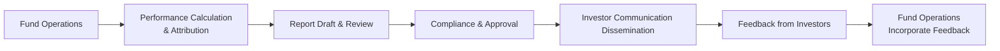

## Overview

Investor communications and transparency can make or break a hedge fund’s reputation—seriously, I’ve seen it firsthand. You’d be amazed how a small delay in sending out a performance report or failing to tell investors about a critical change in strategy can lead to chaos. In the context of hedge fund operational excellence, robust communication practices ensure investors receive timely, accurate information so they can consistently evaluate the risk and return profile of their continued involvement. Failure in this responsibility can undercut trust, invite regulatory scrutiny, and hamper a fund’s ability to retain—and attract—capital.

Fortunately, establishing a healthy and transparent dialogue doesn’t have to be rocket science. It mostly boils down to designing a regular reporting schedule, crafting detailed updates that align with investor needs, disclosing key strategy changes, and providing performance attribution insights with clear risk explanation. By combining these elements under a cohesive communications framework, hedge fund managers can effectively meet their fiduciary duty, enhance investor trust, and navigate complex relationships with diverse limited partners (LPs).

## The Role of Clear, Timely, and Consistent Reporting

Imagine you’re an LP in a hedge fund. You’ve allocated capital in the hope of achieving superior returns, often with limited liquidity and long lock-up periods. Now, how often do you expect to hear about how your money is doing? Monthly or quarterly distributions of financial data and commentary are fairly standard in the hedge fund world. But the real difference-maker is consistency. If a fund says it’s going to send investor letters at the start of each month, those letters must go out at the start of each month. Even a small delay without explanation—like an extra week or two—can have negative ripple effects, raising questions about operational competence or, worse, fueling suspicions that the fund is concealing losses.

### Monthly and Quarterly Insights

Monthly factsheets typically focus on key performance metrics: net asset value (NAV), monthly return, year-to-date return, risk statistics such as volatility, and maybe a brief market overview. Quarterlies tend to be more in-depth, including discussions on sector allocations, current holdings, top winners and losers, and forward-looking positioning. This approach allows investors—who might range from pension funds and insurance companies to family offices and high-net-worth individuals—to decide when and how to integrate hedge fund data into their broader asset allocation strategies (see also Chapter 8: “Asset Allocation Frameworks for Multi-Asset Portfolios”).

### Real-World Anecdote: Late Reporting Debacle

Without naming names, I once worked with a hedge fund that neglected to send investors a quarterly update on time. The email that was supposed to go out by April 15 somehow got stuck in a compliance approval loop until April 30. Investors began calling, concerned that the fund was experiencing losses or even operational meltdown. The entire fiasco could have been avoided if the fund had simply sent a short note explaining the delay. Instead, they said nothing, which caused minor panic and eventually led to a number of redemption requests. Lesson learned: consistent communication is essential.

## Customized Reporting Based on Investor Requirements

No two investors are exactly alike. Institutional investors may crave extensive, data-driven deep dives: they might want to see risk factor breakdowns, multi-year performance attribution, or exposure decomposition. Smaller individual investors may be content with a more modest overview—just the performance highlights and a short commentary. The rule of thumb is to tailor communication so that it is relevant, digestible, and helpful.

### How to Customize

• Frequency: Larger institutional investors often require monthly or even weekly emails summarizing key performance stats. Others accept quarterly or even semi-annual updates.  
• Depth: Some want “war-and-peace” length reports analyzing every trade. Others just want the big picture.  
• Format: PDF newsletters, web portals, or interactive dashboards are all viable. Some tech-savvy funds incorporate data rooms where investors can log in and generate bespoke reports.  

Of course, more detail is not always better. Too much complexity can obscure critical headlines and make it tough for investors to see the forest for the trees. The best reporting cuts to the chase while still offering a deep dive in appendices or via an online portal.

## Disclosing Material Changes to Maintain Trust

You’d be surprised how often a hedge fund experiences a major event—like the departure of a star portfolio manager or the addition of a new product line—and forgets or simply delays telling investors about it. This can create confusion and frustration. Think about the difference in how you’d feel if you found out through the grapevine that your fund manager left, versus hearing it directly from the hedge fund with a thorough explanation of the plan going forward. Transparent, proactive communication about material changes fosters trust and upholds the fund’s ethical obligations, in line with the CFA Institute’s Asset Manager Code of Professional Conduct.

### Examples of Material Changes

• Major shifts in investment strategy (e.g., pivoting from a long/short equity approach to a global macro strategy).  
• Departure or hiring of key personnel, such as the Chief Investment Officer (CIO).  
• Structural changes in the fund’s legal or regulatory status (e.g., redomiciling from an offshore location to an onshore jurisdiction).  
• Significant operational or compliance events, like a regulatory investigation.  
• Unforeseen gating procedures or modifications to redemption policies (see the “Glossary” below).

## Performance Attribution: Explaining Returns and Risks

Performance attribution is vital for demonstrating how a fund’s strategy delivered its returns—or, in some cases, its losses—across different market environments. In Chapter 2: “Alternative Investment Performance and Returns,” we discussed the mechanics of performance measurement extensively, but let’s recap the basics in the hedge fund context and highlight investor communication techniques.

### Components of Performance Attribution

• Allocation Effect: How did the fund’s allocation decisions across various asset classes or sectors contribute to overall performance?  
• Selection Effect: How did individual stocks, bonds, or other positions perform relative to a benchmark or the broad market?  
• Interaction Effect: Did market timing or dynamic rebalancing amplify or reduce returns?  
• Residual/Other Effects: Any leftover unexplained variance (like currency swings, structural factors, or off-benchmark bets).

### Presenting Attribution Data to Investors

Investors often appreciate tables and charts that illustrate performance drivers. For instance, you might show that 60% of returns came from healthcare sector picks, and an additional 25% from short positions in technology. If your strategy emphasizes factor investing, you might break out returns from value, momentum, or low-volatility exposures. Keep the explanation approachable: highlight which attributes are within the manager’s control (like skill in security selection) versus those driven by external factors (like broad market moves). A sense of transparency in explaining the “why” behind the returns often impresses investors more than the returns themselves.

## Disclosures on Fund Liquidity, Gating Procedures, and Side-Pocket Investments

Hedge funds can invest in illiquid instruments, from distressed debt to private shares. This can result in gating procedures, side-pocket investments, or other structures that limit investor redemption if the fund needs more time to liquidate certain holdings. From an investor’s perspective, these complexities are easier to accept if they’re well understood in advance and if any changes are immediately disclosed.

1. Liquidity Terms: Outline redemption frequency (monthly, quarterly, annual) and any notice periods.  
2. Gating Procedures: Clearly define triggers and how gating might affect the redemption timeline. For instance, a gating policy may be activated if cumulative redemption requests exceed, say, 25% of the fund’s net assets in a given quarter.  
3. Side-Pocket Investments: Provide clarity around which assets are side-pocketed (e.g., a convertible bond that’s extremely illiquid), how valuations are determined, and how these holdings will eventually be realized.

### Real-World Example: Side-Pocket Confusion

I recall an investor who tried to withdraw his entire stake from a hedge fund. To his surprise, a good chunk of his assets—somewhere around 15%—was stuck in a side pocket of illiquid private loans. He had apparently skimmed over the documentation that explained the potential for side pockets. This ignited frustration and, eventually, acrimonious calls between the investor and the fund manager. Transparency from the outset is essential; otherwise, even routine procedures can become fraught with tension.

## Diagram: Investor Communication Flow

Below is a Mermaid.js diagram illustrating a simplified communication workflow that a hedge fund might follow when disseminating information to investors:



In this cycle, fund operations continuously impact and update performance calculations. Compliance teams ensure that the disclosures meet regulatory and strategic objectives. Information then flows to investors, who might have questions or feedback. This feedback loop can further refine the fund’s communication policies or highlight data points that investors find especially valuable.

## Best Practices and Common Pitfalls

### Best Practices

• Consistency: Publish reports and updates on a predictable schedule.  
• Clarity: Use straightforward language, avoiding excessive technical jargon.  
• Proactivity: Disclose material changes early, rather than waiting for investors to ask.  
• Alignment: Customize communication to different investors’ sophistication levels.  
• Documentation: Keep records of what was disclosed and when, as part of a robust audit trail.

### Common Pitfalls

• Overcomplicating Communication: Handing out 200-page reports with deep analytics can alienate or confuse investors who need concise summaries.  
• Delayed Disclosures: Failing to mention a major event in a timely manner indicates questionable governance.  
• Opaque Strategies: Refusing to share reasonable detail on strategy or risk exposures can trigger red flags for investors.  
• Underestimating Minor Errors: Small typographical mistakes or inconsistent data references can raise red flags about data integrity.  

## Personal Perspective

I remember my own time as a junior analyst at a mid-sized hedge fund when I got a call late on a Friday afternoon from an anxious investor. He’d noticed that our monthly factsheet posted an expense ratio that didn’t match the prior quarter’s report. It turned out we’d made a calculation error in one of the line items—a relatively minor slip, but significant enough for a watchful LP. He was worried that we’d messed up performance numbers too. I had to spend a chunk of the weekend verifying the entire chain of calculations, then drafting an “oops letter,” explaining exactly where we goofed up and how we were going to fix it. That experience really drove home how vital it is to double-check every figure, even those that seem mundane.

## Practical Example: Python for Basic Performance Reporting

For smaller funds that produce their reports in-house, a simple Python script can help organize monthly performance data. Below is a short snippet that demonstrates how a fund might calculate rolling returns for monthly updates:

```python
import pandas as pd

df['cumulative_return'] = (1 + df['returns']).cumprod() - 1

df['rolling_3m_return'] = df['returns'].rolling(window=3).apply(lambda x: (1 + x).prod() - 1)

print(df.tail())
```

In a real hedge fund environment, of course, the script would be part of a more complex system integrating with data feeds, compliance checks, and external risk management tools.

## Exam Relevance for CFA Candidates

From a Level III perspective, investor communications and transparency cut across multiple domains of the curriculum: ethics, performance attribution, portfolio management, and professional conduct. Candidates should be able to articulate:

• How hedge funds structure their reporting.  
• Why consistent disclosures are part of good governance.  
• The role of performance attribution in explaining alpha.  
• How liquidity management structures like gating and side-pockets inform risk and redemption policies.

These insights are directly testable in constructed-response (essay) questions. You might be given a mini-case describing a hedge fund that fails to disclose a new gating policy or introduces illiquid side-pocket investments. Your task could be to propose best practices for managing investor relations or identify ethical violations in the manager’s communications.

## Glossary

• **Performance Attribution:** The analysis that breaks down a portfolio’s returns into components such as asset allocation, security selection, and market timing.  
• **Gating Procedures:** Policies allowing a hedge fund to limit or restrict investor redemptions during times of market stress or illiquidity, often triggered by large or simultaneous redemption requests.  
• **Side-Pocket Investments:** A mechanism used by hedge funds to segregate illiquid or hard-to-value assets from the main portfolio. Investors often can’t redeem the portion of their capital held in these side pockets until the positions are liquidated.

## References

• CFA Institute’s “Asset Manager Code of Professional Conduct.”  
• Managed Funds Association (MFA), “The Importance of Transparency in Hedge Funds.”  
• Chapter 2: “Alternative Investment Performance and Returns” in this volume.  
• Chapter 8: “Professional Skills and Best Practices” in this volume.

## Final Exam Tips

• Look for keywords like “timing of disclosures,” “performance attribution,” “gating procedures,” or “reporting frequency” in item-set or essay questions.  
• Use real or hypothetical case studies in your answers. Cite potential outcomes if a fund fails to disclose material changes promptly.  
• Connect your discussion of investor communications to ethics, referencing the CFA Institute Code and Standards or the Asset Manager Code.  
• Practice writing short, clear explanations of performance attribution. This skill often shows up in constructed-response questions where you have to parse return drivers in a limited amount of time.

---

## Test Your Knowledge: Investor Communications and Transparency



### Which of the following is the MOST critical factor in fostering investor trust through communications?  
- [ ] Providing extremely detailed 200-page reports.  
- [x] Maintaining consistency and timeliness in reporting.  
- [ ] Sending annual reports with minimal performance metrics.  
- [ ] Relying on ad-hoc and informal verbal updates.  

> **Explanation:** Consistent and timely reports help establish credibility. Overly detailed or overly sparse disclosures are less effective at building trust.

### A fund that segregates illiquid or hard-to-value assets from the main fund portfolio is using:  
- [ ] Gating procedures.  
- [x] Side-pocket investments.  
- [ ] Special Purpose Vehicles.  
- [ ] Waterfall distributions.  

> **Explanation:** Side-pocket investments are a mechanism to separate assets that are illiquid or difficult to value, ensuring they do not affect the fund’s liquid portion.

### When disclosing fund strategy changes, hedge fund managers should:  
- [ ] Wait until the next annual investor report.  
- [ ] Include a single line in a footnote with minimal explanation.  
- [x] Provide timely and clear details on how and why the strategy is changing.  
- [ ] Avoid any reference to changes to preserve confidentiality.  

> **Explanation:** Transparency about material changes not only upholds ethical standards but also helps maintain investor confidence.

### Which of the following best describes an investor’s right when a “gate” is activated?  
- [x] The investor’s redemption request may be limited or deferred to the extent allowed by fund policies.  
- [ ] The investor can immediately redeem all capital at a premium.  
- [ ] The investor is automatically sent a full redemption in cash with no penalties.  
- [ ] The fund must distribute illiquid assets in-kind to the investor.  

> **Explanation:** Gating procedures limit or defer redemptions in times of stress, protecting the fund and remaining investors.

### A typical monthly hedge fund factsheet might include the following EXCEPT:  
- [ ] Net asset value (NAV) per share.  
- [ ] Month-to-date and year-to-date returns.  
- [x] Highly detailed transaction-level data for every trade.  
- [ ] Commentary on market conditions.  

> **Explanation:** While factsheets include key performance metrics and commentary, they usually do not disclose each individual trade.

### To demonstrate the sources of performance to investors, a hedge fund typically uses:  
- [x] Performance attribution analysis.  
- [ ] A schedule of top fees paid to service providers.  
- [ ] The net asset value chart only.  
- [ ] The Statement of Additional Information (SAI).  

> **Explanation:** Performance attribution is an analytical method that breaks down returns into their constituent components, helping investors understand where alpha is generated.

### Which of the following is a critical compliance function in investor communications?  
- [ ] Maintaining silence on administrative changes to reduce confusion.  
- [x] Reviewing reports to ensure they comply with regulatory and ethical standards.  
- [ ] Distributing marketing material only as an afterthought.  
- [ ] Providing unlimited daily risk analyses to every investor.  

> **Explanation:** Compliance review ensures that investor communications are accurate, not misleading, and adhere to relevant regulations and professional ethics.

### A hedge fund’s side-pocket arrangement poses which key challenge to investors?  
- [ ] They can redeem the side-pocket portion any time, but only at a premium.  
- [x] They generally cannot redeem or withdraw the assets in the side pocket until liquidation.  
- [ ] They must pay a penalty fee for the side-pocket to remain in place.  
- [ ] It permanently removes the investor’s right to any gain from the asset.  

> **Explanation:** Investors typically must wait until the illiquid assets are converted into liquid form before they can access that portion of their investment.

### In the event of an unexpected performance decline, hedge funds should:  
- [x] Promptly explain the reasons for the decline, along with a plan going forward.  
- [ ] Wait to see if the performance recovers before raising alarm.  
- [ ] Avoid discussing performance to maintain investor confidence.  
- [ ] Cite general market conditions as the only factor.  

> **Explanation:** Proactive and open communication about performance drops helps preserve credibility and shows that the manager is forthright about challenges.

### True or False: Overly complex or jargon-heavy reports can sometimes reduce transparency instead of enhancing it.  
- [x] True  
- [ ] False  

> **Explanation:** Excessively technical or unwieldy documents can confuse investors, making key information harder to discern and thus undermining transparency.


