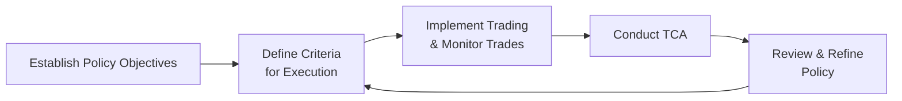

## Overview

Striking that balance between cost, speed, and reliability can feel tricky, right? When I was first learning about hedge fund operations, I remember feeling a bit overwhelmed by all these factors. It wasn’t just about chasing the lowest commission—though that’s part of it—but also about ensuring the trade actually happens at a good price, in a timely manner, and with minimal market impact. This is where “best execution” comes in.

In the hedge fund space, best execution isn’t just a buzzword. It’s a fundamental principle that guides how trades are placed, how broker relationships are managed, and how costs, including those less obvious market charges, are scrutinized. If you’re running or advising a hedge fund, you really want to be able to say to your investors: “We got the best possible terms on the market, and here’s how.”

Below, we’ll dig into creating a formal best execution policy, evaluating broker capabilities, and weaving in on-the-ground operational considerations—like rotating brokers, documentation, and transaction cost analysis (TCA). We’ll wrap up by offering some practical tips and real-world scenarios to illustrate these concepts.

## Key Components of Best Execution

Effective best execution means that every facet—price, speed, certainty of execution, and settlement efficiency—gets its fair share of attention. Let’s break it down.

• Price: This is often the first element folks think about. However, best price doesn’t always mean the rock-bottom commission. It’s about whether you receive an execution price that is in line with or better than current market conditions. A broker might charge a slightly higher commission but can simultaneously offer advantageous fill prices by using advanced technology or by actively working the order.

• Speed: How quickly can trades be executed? Speed often matters when you’re implementing short-term strategies or dealing with rapidly moving markets. A broker that can’t fill your trades on time might wind up costing you more in opportunity loss than you’d save in commissions.

• Likelihood of Execution and Settlement: If your trade simply doesn’t get executed—or if the security doesn’t settle properly—you’re stuck. Especially in less liquid markets or alternative asset classes, you want a broker skilled at navigating complexities of settlement and custodial processes.

• Market Impact: Sometimes referred to as slippage, market impact can be just as significant as commissions. Large orders or illiquid instruments can move the price unfavorably if trades aren’t carefully worked or timed.

## Formal Best Execution Policy

A formalized best execution policy is like a recipe that ensures consistent outcomes, even when the market environment is anything but consistent. The policy typically covers:

• Statement of Principles: Clarify that the hedge fund places investor interests first, adhering to fiduciary standards and any relevant regulations (e.g., MiFID II in Europe, SEC/FINRA rules in the U.S., or other global equivalents).  
• Methodology for Assessing Execution Quality: Outline your approach—do you weigh price most heavily? Or do you also emphasize research quality, speed, or the broker’s reputation?  
• Documentation Requirements: Mandate that traders record the rationale behind broker selection for each trade or set of trades. This might sound tedious, but in my opinion, it’s a lifesaver when you need to justify decisions later.  
• Review and Monitoring Cycle: Plan periodic reviews—quarterly, semi-annually, or annually—where you reevaluate the policy’s effectiveness and adjust it based on TCA findings, changing market conditions, or new broker capabilities.  

A simplified schematic of a best execution policy framework could look like this:



This loop ensures your policy isn’t a set-it-and-forget-it document. It evolves alongside the markets and your fund’s strategy.

## Transaction Cost Analysis (TCA)

TCA is one of those metrics that, once you get into it, you wish you had started using it sooner. TCA offers insights into the hidden costs—like slippage or the impact of partial fills—that can erode portfolio returns. Let’s highlight some points:

• Implementation Shortfall: One key measure captures the difference between the price at the time you decide to place the trade (decision price) and the actual execution price once the trade is completed. Using KaTeX, we can show it succinctly:


\text{Implementation Shortfall (IS)} = \sum_{i=1}^{n} \left( Q_i \times (P_{\text{execution}, i} - P_{\text{decision}}) \right)


where \\(Q_i\\) is the quantity executed in each tranche, \\(P_{\text{execution}, i}\\) is the price achieved for that tranche, and \\(P_{\text{decision}}\\) is the prevailing market price when the trading decision was made.

• Market Impact vs. Timing Costs: TCA helps differentiate whether negative performance might be due to aggressive order placement (market impact) or delayed execution (timing). If you break down each trade, you can spot patterns in where you’re losing out.

Here’s a tiny taste of what TCA could look like in code form—just conceptual, so don’t worry if you’re not a Python guru:

```python
import pandas as pd

data = {
    'decision_price': [100.0, 100.0, 101.5],
    'execution_price': [100.2, 99.8, 102.0],
    'quantity': [1000, 1500, 500]
}

df = pd.DataFrame(data)

df['partial_IS'] = df['quantity'] * (df['execution_price'] - df['decision_price'])
implementation_shortfall = df['partial_IS'].sum()

print(f"Total Implementation Shortfall: ${implementation_shortfall}")
```

While this code is simplistic, it illustrates how you might collect raw trade data in a day-to-day environment and then measure shortfall. Once you’ve got TCA in place, you can figure out if certain brokers or trading approaches consistently cost or save you money.

## Assessing Broker Capabilities

Broker selection goes well beyond, “Hey, who’s cheapest?” Different funds have different execution requirements. A high-frequency trading strategy calls for advanced technology infrastructure with direct market access, while a distressed debt strategy might need brokers with specialized operational capabilities.

• Research and Coverage: Some brokers produce industry-leading research tailored to certain asset classes—great if your fund strategy leans heavily on macro or sector analyses.  
• Technology and Connectivity: Algorithmic trading tools, direct market access, and robust order management systems can reduce market impact. If your broker’s technology stack is slow or prone to outages, your positions and your fund’s reputation are at risk.  
• Trading Costs and Margins: Commission rates, prime brokerage fees, and margin financing terms must be competitive. But keep your eyes on the bigger picture—always weigh the total cost of trading, not just the posted commission.  
• Settlement and Custody Arrangements: If your strategy involves frequently trading in multiple currencies or specialized instruments (e.g., certain derivatives), your broker’s back office must handle those assets reliably and with minimal error risk.  

## Maintaining a Rotating Panel of Approved Brokers

Concentrating too much volume with a single broker raises counterparty risk. Also, if a broker becomes complacent—knowing it has most of your business—you might suffer from suboptimal pricing or less responsive service. That’s why many hedge funds keep a rotating panel of approved brokers:

• Diversification of Counterparty Risk: In the event that one broker experiences financial or operational distress, your trading activities won’t grind to a halt.  
• Competition and Pricing: Giving order flow to multiple brokers encourages them to earn your business with better terms.  
• Specialized Expertise: One broker might be better at equity trades, while another excels at certain derivative products. A panel approach lets you pick the best match for each trade.  

Yes, it can be a headache to manage relationships with multiple brokers, but the risk management benefits are well worth it.

## Documenting Broker Due Diligence

Broker due diligence is not just about scanning a website or asking a few random questions. It requires collecting evidence that your broker is stable, reputable, and aligned with your fund’s objectives. Typical documentation might include:

• Financial Statements: Check the broker’s capital adequacy, liquidity, and overall financial stability.  
• Regulatory History: Any major fines or compliance breaches can be a red flag, indicating potential internal control weaknesses.  
• Reputation Checks: Scrutinize media reports, talk to industry contacts, see what kind of track record they might have.  
• Technology and Operational Assessment: Sometimes, you’d do an on-site visit (virtual or physical) to see how robust their systems and processes are.  

Many funds keep a table or database rating each broker on metrics such as “Financial Strength,” “Execution Speed,” “Algos and Tools,” “Research Quality,” and so forth. If you’re in a region subject to stringent regulations (like MiFID II in the EU), you’ll want to ensure your due diligence process meets or exceeds those rules.

## Periodic Transaction Cost Analysis (TCA) and Broker Performance Reviews

It’s not enough to have TCA on paper. You also want a regular regimen to interpret those TCA results and take action:

• Benchmarking: Compare each broker’s trading costs to industry standards, or measure them against a “VWAP (Volume Weighted Average Price)” or “implementation shortfall.” If a broker consistently performs below par, it may be time to shift order flow elsewhere.  
• Refining Criteria: Maybe your fund’s strategy changed from plain-vanilla equity long/short to an option-based approach. Revisit your broker checklist so you don’t miss crucial capabilities.  
• Ongoing Documentation: Keep records of broker performance reviews, TCA findings, and any resulting changes to your approved broker list. In the event of a compliance inspection, you’ll have a defensible audit trail.

## Practical Financial Example

Let’s imagine a hedge fund that trades an equity long/short strategy focusing on mid-cap U.S. equities. Over a six-month period, the fund uses two brokers:

• Broker A: Offers low commissions but no advanced algorithms (basically, you get a standard limit or market order).  
• Broker B: Charges higher commissions but provides sophisticated algorithmic trading with some decent liquidity-sourcing capabilities.

After analyzing trades capturing real-time and historical data, the fund sees the following results in TCA:

• Broker A: Commission of $0.003 per share. However, slippage from the decision price is averaging $0.07 per share, particularly for larger trades in more thinly traded stocks.  
• Broker B: Commission of $0.005 per share, but slippage is only $0.02 per share thanks to better internal crossing networks and flexible order slicing over time.

If you crunch these numbers, you realize that paying more in explicit commissions but saving on market impact often yields a lower overall cost structure—meaning better outcomes for the fund and, ultimately, for its investors.

## Potential Pitfalls and Challenges

• Overemphasis on Commissions: Focusing purely on explicit costs can be a trap. Slippage and other hidden costs can dwarf commission savings.  
• Lack of Ongoing Monitoring: Even if you start with the right approach, the market environment changes. Without periodic TCA, your best execution policy can become stale.  
• Underestimating Operational Risks: A broker’s front-end might be slick, but if their settlement or middle/back-office processes are a mess, you’re in trouble.  
• Conflicts of Interest: When brokers offer research or other “soft” items, be mindful of how that might skew your order flow decisions. In many jurisdictions, regulations require you to strip out research costs or provide full transparency to your clients.

## Integrating Ethical and Professional Standards

Under the CFA Institute Code of Ethics and Standards of Professional Conduct, investment professionals have a duty to place client interests above their own. This extends to achieving best execution. Standard III(A)—Loyalty, Prudence, and Care—guides us to exercise diligence and thoroughness in analyzing investment actions. This includes carefully selecting and reviewing brokers to ensure that the total transaction cost to clients is minimized and that the fund’s strategies are executed efficiently.

Additionally, abiding by Standard I(D)—Misconduct—requires that we undertake thorough due diligence so that we are not knowingly participating in or assisting with fraudulent, deceptive, or manipulative trades. Conducting robust broker reviews and TCA processes can help mitigate those risks.

## Final Exam Tips

• Know the Key Metrics: If you see a question about best execution, be prepared to talk about market impact, slippage, velocity of execution, broker fees, etc.  
• Discuss Real-World Trade-Offs: The CFA exam often includes scenario-based questions. You might be asked to evaluate whether paying higher commissions for specialized algorithms is justified by lower market impact.  
• Document Everything: From a compliance and exam standpoint, citing an audit trail of broker due diligence, TCA results, and policy updates is a best practice.  
• Don’t Forget the Code and Standards: Examiners love to connect best execution or broker selection to ethics vignettes. Show you understand how these standards guide operational decisions.  

## References

- Best Execution and Order Handling, CFA Institute.  
- Broker Selection and Due Diligence, AIMA (Alternative Investment Management Association).  

---

## Test Your Knowledge: Best Execution & Broker Selection Quiz



### What is the primary goal of a formal best execution policy?

- [ ] Maximizing the number of trades executed per day.  
- [x] Achieving the most favorable overall terms for client orders.  
- [ ] Minimizing paperwork and administrative tasks.  
- [ ] Complying with internal guidelines only.  

> **Explanation:** A best execution policy aims to secure the most favorable terms for clients by considering price, speed, probability of execution, and settlement factors.

### Which of the following elements is NOT typically part of Transaction Cost Analysis (TCA)?

- [ ] Impact of Slippage.  
- [ ] Explicit Commission Costs.  
- [ ] Timing Costs.  
- [x] Post-trade Dividend Capture Rate.  

> **Explanation:** TCA usually focuses on execution quality measures (slippage, commissions, timing costs). Dividend capture is a separate strategy consideration.

### Why might a hedge fund use multiple brokers in a rotating panel?

- [x] To manage counterparty risk and encourage better pricing.  
- [ ] To increase operational complexity.  
- [ ] To limit the flow of orders to just one broker.  
- [ ] To reduce regulations required by each broker.  

> **Explanation:** Spreading trades among multiple brokers diversifies counterparty risk and can promote competition, leading to better overall execution quality.

### Which of the following is an example of an implicit trading cost?

- [ ] Exchange fees.  
- [ ] Broker commissions.  
- [x] Market impact (slippage).  
- [ ] Flat transactional taxes.  

> **Explanation:** Implicit costs refer to those hidden or indirect costs of trading, such as slippage or market impact, which do not appear as line items on a brokerage statement.

### While setting a best execution policy, which factor is least likely to concern a hedge fund dealing with illiquid alternative assets?

- [x] Commission rebates for high-frequency trading.  
- [ ] Settlement procedures for complex instruments.  
- [x] Probability of trades not finding counterparties promptly.  
- [ ] Broker’s ability to handle cross-border transactions.  

> **Explanation:** In illiquid alternative assets, speed or frequency-based rebates typically matter less than the broker’s ability to navigate settlement complexities. (Note that illiquid contexts can reduce the relevance of some HFT-related rebate structures, but extremely limited counterparties can be a concern. This question highlights that frequent trading rebates are often irrelevant for an illiquid strategy.)

### When evaluating technology provided by a broker, which aspect is most critical for algorithmic trading strategies?

- [ ] Volume discount on prime brokerage fees.  
- [x] Reliable direct market access with low latency.  
- [ ] High commission rates.  
- [ ] Limited coverage of equity markets.  

> **Explanation:** Algorithmic trading requires fast, stable connectivity to markets (often direct market access) to minimize latency and slippage.

### Which of the following is an example of a formal measure used in evaluating execution price versus decision price?

- [ ] Time-Weighted Return.  
- [x] Implementation Shortfall.  
- [ ] Money-Weighted Return.  
- [ ] Bid-Ask Spread Only.  

> **Explanation:** Implementation shortfall tracks the difference between the price when the manager decides to trade and the final execution price, reflecting both timing and market impact costs.

### Under the CFA Institute Code of Ethics, which Standard primarily addresses placing client interests first in trade execution?

- [x] Standard III(A)—Loyalty, Prudence, and Care.  
- [ ] Standard II(B)—Market Manipulation.  
- [ ] Standard V(A)—Diligence and Reasonable Basis.  
- [ ] Standard VI(B)—Priority of Transactions.  

> **Explanation:** Standard III(A) mandates that CFA charterholders place client interests above their own, which is central to the pursuit of best execution.

### Which of the following is a valid reason for periodic broker reviews?

- [x] To reevaluate the broker’s fit with the fund’s evolving strategy.  
- [ ] To permanently discontinue the use of TCA studies.  
- [ ] To eliminate prime brokerage relationships altogether.  
- [ ] To avoid updating compliance documentation.  

> **Explanation:** As market conditions and fund strategies change, reviewing brokers ensures an ongoing alignment between execution services and the fund’s needs.

### True or False: Slippage only occurs when you pay a higher price than the quoted bid or ask.

- [x] True  
- [ ] False  

> **Explanation:** Slippage refers to any difference between the intended execution price and the actual execution price, including cases where you end up trading at a higher ask or receiving a lower bid in the market.


