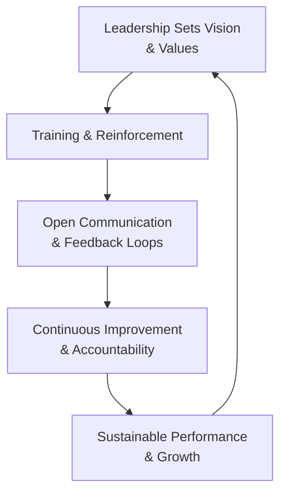

## Introduction

Leadership and culture in fund management can often feel like abstract concepts—like, who hasn’t heard advice about building “strong teams” or “effective communication”? But here’s the thing: hedge funds live or die by how people behave, whether that’s the portfolio manager sizing trades or the junior analyst checking data integrity. Achieving “operational excellence,” which we’ve been discussing throughout this chapter, isn’t just about robust risk controls (though those matter, too). It’s about leaders who model accountability, teams that communicate openly, and a set of shared values guiding everyone toward the fund’s overarching goals.

In this section, we’ll look at how leaders—like the Chief Investment Officer (CIO)—steer the cultural ship, making sure these values remain front and center. We’ll discuss practical steps for creating an environment that prioritizes integrity and performance, encouraging employees to share ideas, voice concerns, and bring their best to the table. Along the way, we’ll slip in a few anecdotes (some personal, some from industry lore) to keep things real.

## The Role of Leadership in Shaping Culture

You might be wondering: “Aren’t folks mostly concerned with meeting performance benchmarks?” Absolutely, but numbers don’t come out of thin air. They come from people motivated to do their best in a supportive environment. As we saw in earlier sections of this chapter—particularly in 15.1’s emphasis on risk monitoring and governance—culture is the invisible scaffolding that supports or undermines all those quantitative processes.

Leadership sets the tone. At many hedge funds, the CIO or even the founding partners function as the moral compass. Their actions—how they handle pressure, how they respond to mistakes, how they treat teams—resonate across the entire firm. If they rush to blame or, worse, ignore breaches of ethics, it doesn’t matter how many compliance checklists you draft; you’ll have a culture that quietly condones corner-cutting. If they openly admit mistakes, champion the Code of Ethics, and encourage dialogue, you’ll see the opposite effect.

### A Quick Anecdote
A friend of mine once joined a burgeoning hedge fund as an analyst. On day one, the CIO walked everyone through the fund’s mission statement. But more importantly, he admitted a significant error that had occurred two years prior—a trade that went sour because the team had neglected a key risk factor. He explained how they addressed the shortcoming, how the entire team owned the mistake, and how they improved their process. By baring that vulnerability, the CIO fostered a culture where no one was too afraid to bring up potential pitfalls. And guess what? That friend said it boosted her confidence to speak up in investment committee meetings—leading to sharper discussions and, yes, healthier returns.

## Fostering Integrity and Accountability

Fostering integrity is not about memorizing a rulebook; it’s about creating an environment where people feel personally invested in doing the right thing. Accountability flows naturally when employees trust one another and know that mistakes will be handled constructively. If someone tries to hide errors or shirk responsibility, it spells trouble for both compliance and performance.

• Written And Unwritten Rules: You can have explicit compliance guidelines hammered into an employee handbook, but you also need intangible but powerful norms—like “Don’t keep quiet if you see something suspicious,” or “Ask for help the moment a red flag appears.”

• Ethical Decision-Making: The CFA Institute’s Ethical Decision-Making framework is a great tool to share with everyone, from junior associates to senior traders. Regular “ethics huddles” are more effective than a once-a-year training session. And let’s face it: we might remember those mandatory compliance videos—where you're basically trying not to doze off. Well, frequent, shorter interactive sessions tend to stick better.

• Konsequenz, Konsequenz, Konsequenz: In some organizations, the word “consequences” has a negative connotation. But accountability is about consistent follow-up, so that everyone, including senior managers, is subject to the firm’s guiding principles. No one is exempt, period.

## Training and Reinforcement

Here’s a question: how on Earth do you ensure everyone knows the ethical roadmap and follows it, especially in high-pressure trading environments? One approach is frequent training—on ethics, team communication, and professional standards.

### Ethics Training
Fund managers often worry that employees will see this just as a checkbox. But well-designed programs use real scenarios and interactive quizzes that keep folks engaged. Buddies of mine in compliance love employing role-play scenarios, which can be comedic yet enlightening. For instance, they stage a hypothetical where a star trader uses questionable data about a company’s supply chain. The twist: how do employees respond? Do they speak up, or do they rationalize the behavior because “He’s the star?” You learn a lot about your culture in the debrief.

### Culture Cascading
Remember that old management saying, “Culture cascades from the top”? The best training plans succeed when managers themselves commit time and energy, not just the compliance officer. If your CIO leads or attends these sessions, employees understand that it’s truly a priority.

## Open Communication and Continuous Improvement

A hallmark of high-performing hedge funds is the willingness to share knowledge—and mistakes—rapidly. Encouraging open communication means bridging the gap between portfolio managers, research analysts, trading desk operators, risk managers, and operational support staff. When the back office can freely ask portfolio managers about suspicious wire transfers or trade anomalies, issues get caught early.

• No-Fault Postmortems: After a big trade or the end of a quarter, conduct a “postmortem” or “deal autopsy” to parse what went well, what flopped, and what can be improved. The idea isn’t to point fingers; it’s to glean insights for the next time.

• The All-Hands Meeting: Some funds do monthly or even weekly alls-hands where leadership encourages Q&A about anything from “What’s our stance on emerging markets?” to “Why are we adopting a new compliance software system?” This signals that no subject is off-limits.

• Feedback Loops: You can formalize feedback via surveys or keep it organic by encouraging spontaneous 1:1 chats. Either way, feedback is crucial for continuous improvement: it’s the hedge fund equivalent of that iterative product development approach used in tech startups.

## Aligning Compensation with Long-Term Performance

We all know compensation can shape behavior. Hedge funds often tie a big chunk of pay to annual or even quarterly performance. This might result in short-termism, where employees chase flashy trades that could blow up in uncertain markets. Enforcing a more measured perspective can be done by:

- Deferring a portion of bonuses over several years to see how trades pan out.  
- Linking compensation to a multi-year performance metric (e.g., a rolling three-year Sharpe ratio).  
- Creating explicit penalties or clawback provisions if excessive risks come home to roost a year or two down the line.

An anecdote: A well-known hedge fund introduced a compensation tweak—paying out half of any performance bonus immediately, and deferring the other half over a three-year vesting schedule. The result? Folks who once took big swings in search of short-term gains pivoted toward strategies with more stable risk/return profiles. That shift, plus a more rigorous approach to risk management, led to more consistent performance.

## Diversity and Inclusion Initiatives

Maybe you’re thinking, “Diversity is a nice buzzword, but does it matter for portfolio returns?” Practically, yes. A variety of backgrounds can help reduce groupthink, spur innovative approaches, and strengthen risk assessments. For example, a team with wide-ranging cultural experiences might see red flags in foreign market trades that a homogenous group would miss.

### Recruiting and Retention
• Active Outreach: Some hedge funds partner with universities or organizations specifically to attract underrepresented candidates.  
• Mentorship Programs: Pair newcomers with experienced mentors to help them navigate the nuances of the hedge fund world.  
• Inclusive Policies: This includes flexible work arrangements, equitable parental leave, and resources that help ensure everyone feels genuinely welcomed.

### Measuring D&I Performance
You can’t just say “We’ll hire more diverse candidates” without measuring progress. Some funds set internal targets or measure representation at each level of seniority. Not to get too numeric, but data matters. If your junior ranks are diverse but the leadership suite isn’t, you might have a pipeline or promotion-equity issue.

## A Mermaid Diagram of a Culture-Building Cycle

Below is a simple illustration of how leadership and culture connect to operational outcomes:

This cycle emphasizes that leadership is not a one-and-done event; it’s iterative. Effective culture building can feed into real improvements—better operational outcomes, better risk management, and hopefully better performance.

## Best Practices to Remember

• Lead By Example: If the CIO or senior partners abide by ethical guidelines, yep, everyone else will follow suit.  
• Shared Responsibility: Culture is everyone’s job, not just a compliance or HR box to check.  
• Frequent Check-Ins: Culture is fluid. Keep revisiting it, keep refining it, and keep reinforcing it.  
• Systemic Alignments: Make sure the processes (compensation, performance reviews, promotion track) are consistent with the values you claim to hold. Otherwise, you send mixed signals.

## Potential Pitfalls

• Overreliance on Star Performers: Letting star traders bend the rules can quickly erode trust and moral standards.  
• Lip Service: Declaring that you value ethics but punishing employees who speak up or question decisions.  
• Neglecting Diversity of Thought: A homogenous team might inadvertently engage in groupthink, missing out on better solutions.  
• Resistance to Feedback: If leadership doesn’t handle criticism well, employees will clam up, letting problems fester.

## Practical Examples and Real-World Scenarios

1. Conflicts of Interest: Suppose a senior trader is part owner of a specialized data analytics provider that the fund uses. If cultural norms encourage transparency, that trader discloses the conflict immediately, compliance weighs the situation, and if it’s permissible, they set boundaries. Otherwise, it’s a quick path to insider dealing accusations if handled poorly.  
2. Ethical Crossroads: Imagine you’re the risk officer and your boss pressures you to sign off on a questionable valuation. Sound leadership means you can escalate your concerns to the CIO or a compliance committee without retaliation.  
3. Diversity for Problem-Solving: A cross-cultural team analyzing an emerging market might uncover local business customs or regulatory nuances that keep them from jumping into a potential fiasco.  

## References and Further Reading

- “Building a Culture of Compliance,” CFA Institute’s Ethical Decision-Making Framework.  
- “Diversity and Inclusion in Asset Management,” The Investment Association (IA).  
- Various sections from earlier chapters in this volume, especially 15.1 (Best Practices in Risk Monitoring and Governance) and 15.6 (Counterparty and Clearinghouse Relations), for holistic context.

## Final Exam Tips

• Show Your Process: On exam questions around leadership and culture, explicitly mention how leadership actions trickle down. Use terms like “tone at the top,” “accountability,” and “feedback loops.”  
• Integrate with Ethics: Expect scenario-based questions linking leadership culture to potential ethical dilemmas.  
• Link to Risk Management: If the exam question references a short-term vs. long-term performance trade-off or compensation structure, mention how these can encourage or discourage excessive risk-taking.  
• Diversity: The exam might ask about decision-making improvements from inclusive teams. Demonstrate you understand how broader perspectives enhance risk assessment and strategy innovation.  
• Time Management: For essay-style questions, be concise but thorough. Provide examples if asked to illustrate how leadership fosters or undermines culture.

--------------------------

## Test Your Knowledge: Leadership and Culture in Fund Management



### Effective culture building in a hedge fund is primarily driven by which factor?

- [ ] The strength of the back-office systems
- [x] The tone set by senior leadership and the CIO
- [ ] Regular pitch meetings to prospective clients
- [ ] Strictly enforced dress code

> **Explanation:** While robust systems, client relations, and even job attire signal professionalism, it’s ultimately the consistent actions and ethical stance of the leaders that shape the firm’s core culture.

### Which approach best aligns employee behavior with a longer-term view?

- [x] Deferring a significant portion of bonus payouts over multiple years
- [ ] Issuing performance bonuses every two weeks
- [ ] Eliminating all bonuses and shifting entirely to base salary
- [ ] Offering promotions based solely on immediate revenues generated

> **Explanation:** Multi-year deferrals help ensure employees remain invested in sustained performance outcomes, discouraging short-term and potentially reckless strategies.

### Why are diversity and inclusion efforts considered critical in hedge fund culture?

- [ ] They shorten compliance reviews.
- [ ] They automatically increase short-term profits.
- [x] They broaden perspectives and reduce the risk of groupthink.
- [ ] They replace the need for rigorous risk management processes.

> **Explanation:** A range of viewpoints and experiences improves decision-making quality, identifying risks and opportunities that might be overlooked by a uniform group.

### Frequent ethics training sessions at a hedge fund are designed to:

- [x] Reinforce moral conduct and professional standards regularly
- [ ] Fulfill a regulatory requirement without practical benefit
- [ ] Discourage open communication on sensitive issues
- [ ] Replace the need for a compliance department

> **Explanation:** Good ethics training is interactive and focuses on real-world applications, consistently reinforcing professional standards and open discussion around ethical scenarios.

### In a "no-fault postmortem," team members:

- [x] Analyze wins and losses without pointing fingers
- [x] Identify improvement opportunities in a collaborative manner
- [ ] Issue formal reprimands to those who made errors
- [ ] Avoid mention of mistakes to preserve morale

> **Explanation:** A well-run postmortem is a learning exercise, not a blame-fest. It helps strengthen processes and fosters a culture of continuous improvement.

### A key feature of compensation structures that promote accountability is:

- [x] Clawback provisions for excessive risk-taking
- [ ] Guaranteed payouts regardless of performance
- [ ] Bonuses based solely on monthly performance
- [ ] Prizes for the largest single trade of the quarter

> **Explanation:** Clawback provisions tie compensation to responsible decision-making, disincentivizing unchecked risk-taking or unethical conduct.

### Leadership that encourages open communication typically:

- [x] Holds all-hands meetings for cross-team dialogue
- [ ] Restricts information flow to senior-level staff only
- [x] Welcomes questions regarding operational changes
- [ ] Prioritizes short-term results over anything else

> **Explanation:** When leaders actively open lines of communication to all staff, issues are identified faster and improvements often happen more fluidly thanks to collective input.

### When a firm’s star trader openly violates a compliance policy, the best leadership response is to:

- [x] Enforce the same penalties as for any other team member
- [ ] Make an exception due to the individual’s contribution to profits
- [ ] Quietly warn them without any formal record
- [ ] Transfer the individual to a new trading desk

> **Explanation:** Firm culture depends on consistency. If star performers are exempt from accountability, it sends the message that ethics and rules are flexible for high earners, undermining the entire compliance structure.

### Which structure best helps a hedge fund reduce the risk of short-termism?

- [x] Long-term vesting for key investment professionals
- [ ] Immediate lump-sum bonuses
- [ ] Zero-bonus structure with only base pay
- [ ] Monthly performance-based promotions

> **Explanation:** A vesting schedule that aligns rewards with multi-year performance keeps professionals focused on sustainable, lower-risk strategies rather than short-term gain.

### True or False: The CIO’s personal example in adhering to ethical standards has little influence on the rest of the hedge fund staff.

- [x] True
- [ ] False

> **Explanation:** A fund’s ethical culture often mirrors the actions of its leaders, especially the CIO. Employees take cues from how leaders handle mistakes, compliance rules, and daily interactions, so leadership conduct shapes overall culture significantly.


