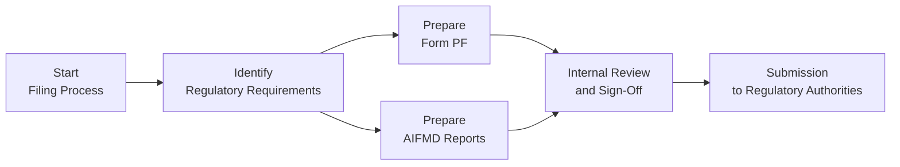

## Introduction

Let’s be honest: nobody wakes up in the morning all excited to file regulatory documents. But when you’re managing a hedge fund, ensuring regulatory compliance is like brushing your teeth—definitely necessary, and if you skip it too often, the consequences could be painfully unpleasant. I remember a former colleague calling me in a panic about missing a single filing deadline. It might have seemed minor at first, but that oversight eventually led to an eye-watering penalty and a thorough regulatory review. Yikes.

Across different jurisdictions, hedge funds must address a web of regulatory filings (like U.S. SEC Form PF, CPO-PQR for the CFTC/NFA, and AIFMD in the EU). Altogether, these requirements help shield investors from undue risk, strengthen market transparency, and hold managers accountable. In this section, we’ll explore the practicalities of reviewing and updating key regulatory filings, establishing best practices for internal documentation, and building a robust compliance culture that keeps your fund’s operations nimble and squeaky clean.

## The Regulatory Landscape

Hedge funds often operate under multiple regulatory regimes, especially if your investor base or portfolio spans different regions. For instance, a fund headquartered in New York may attract institutional investors from Europe, sparking AIFMD requisites on top of domestic filings. Let’s touch on a few of the big players:

• SEC Form PF: In the United States, SEC-registered investment advisers file Form PF to disclose data on private funds—like portfolio mix and leverage—to help regulators assess systemic risk.  
• CPO-PQR: Commodity Pool Operators (CPOs) and Commodity Trading Advisors (CTAs) must report to the CFTC and NFA about pool assets, trading strategies, and related operational details.  
• AIFMD: The EU’s Alternative Investment Fund Managers Directive sets disclosure thresholds related to liquidity, risk profiles, and investor protection measures.  

Staying on top of these filings is critical. And oh—I can’t tell you how many times I’ve heard folks say, “We’ll just do it next quarter.” That’s kind of like saying you’ll deal with a cavity next year. It’ll grow into a far bigger problem.

## Maintaining a Regulatory Calendar

A simple but powerful tool for planning timely submissions is a regulatory calendar. Even small hiccups—like a large deal closing on the same day your filing is due—can throw everyone off if you haven’t coordinated your timelines. Maintaining a live, up-to-date calendar is usually a combination of:

• Deadlines for each required form (e.g., quarterly, semiannual, or annual).  
• Internal deadlines for data collection from different departments (front office, risk management, finance).  
• Staff responsibilities and sign-off checkpoints, ensuring accountability across functions.

Many funds now integrate automated reminders—like an email from your compliance software or a project management tool that pings key individuals a couple of weeks before each major deadline. This approach helps avoid last-minute chaos and fosters an ongoing compliance mindset.

## Internal Documentation Review

Maybe you’ve got your regulatory filing schedule locked in, but have you actually revisited your documentation to confirm it’s correct? It’s no fun discovering hours before submission that your offering memoranda or subscription agreements are outdated. A thorough internal documentation review typically covers:

• Offering Memoranda (OM): Are all the risk disclosures accurate and aligned with your investment strategy and risk appetite? Has your strategy changed since the last version?  
• Subscription Agreements: Confirm consistency with your compliance manuals and any conditions imposed by local regulators.  
• Compliance Manuals and Policies: Are they reflecting the latest regulatory guidance? Do they align with your day-to-day operational processes?  

You’d be surprised how easily these documents get out of sync with reality. Check them periodically—quarterly is ideal, but semiannually might suffice if your fund’s strategy is more stable.

## Integration of Compliance Software

Given the complexity of hedge fund operations, bridging the gap between regulations and real-world processes can be a headache. That’s where compliance software enters the picture. The right system may offer:

• Automated Reporting: Generate prepopulated forms by pulling trade, position, and risk data directly from your portfolio management system.  
• Real-Time Tracking: Identify potential compliance breaches or irregular trades before they escalate into bigger issues.  
• Regulatory Alerts: Compliance platforms often incorporate news feeds or updates on rule changes, so you don’t get caught off-guard by new or amended requirements.  

It’s a lot easier to stay ahead of deadlines if your compliance team has immediate visibility over data points that feed into filing obligations. Plus, automation reduces the risk of human error—like that time an intern typed in the wrong counterparty identification number, which took weeks to correct. True story.

## Conducting Regular Compliance Reviews

So we’ve got a calendar, integrated software, and updated documentation—but do your operational processes genuinely reflect regulatory expectations? An annual (or more frequent) compliance review is invaluable for bridging any lingering gaps. This review can include:

• Sample Testing: Pull random selection of transactions and confirm they comply with the stated strategy, portfolio constraints, or any other regulatory limitations.  
• Audit Trails: Verify that your recordkeeping systems are robust, especially for data that might be scrutinized in an on-site exam (like trade execution logs, risk models, or KYC checks).  
• Third-Party Verification: Some funds hire external compliance consultants to evaluate policies or processes. This independent assessment can highlight blind spots an internal team might overlook.  

Think of it as a “health check” for your operations—much like visiting the dentist, except hopefully less fear-inducing.

## Common Pitfalls and Best Practices

There’s a reason compliance can feel intimidating. From inconsistent data to plain old confusion about which rule applies where, these are just a few of the pitfalls we see:

• Data Inconsistency: A mismatch between risk calculations in your portfolio management system versus what you report on Form PF or AIFMD.  
• Overlooking Minor Strategy Tweaks: Even small expansions into new markets or instruments can change your classification under certain regulatory regimes.  
• Relying Solely on One Person: If only one staff member knows how to produce your filings, you risk major disruptions if that person becomes unavailable.  

You can mitigate these pitfalls through cross-training (so more than one team member can handle the regulatory tasks), frequent data reconciliation, and a robust feedback loop with your risk, operations, and investment teams.

## Visualizing the Filing Process

Below is a simple diagram of a typical hedge fund regulatory filing workflow, from start to submission. The aim is to highlight key steps where data verification and internal sign-offs usually happen:

While this is a simplified overview, it captures the essential compliance checkpoints and approvals.

## Building a Culture of Compliance

All the fancy software and rigorous calendars in the world won’t fully solve your compliance challenges if your fund’s culture doesn’t emphasize accountability. Senior leadership sets the tone: If an executive simply glazes over compliance presentations or shows little interest in reporting deadlines, the rest of the firm may follow suit. Instead, a robust compliance culture should involve:

• Regular Training: Keep staff aware of both high-level obligations and day-to-day best practices.  
• Open Dialogue: Encourage team members to ask questions or flag suspicious activity.  
• Transparent Governance: Make sure important issues get escalated to the board or appropriate committees in a timely fashion.  

In the end, compliance is not just about avoiding penalties. It’s also about brand reputation, investor confidence, and the operational stability of your fund.

## Glossary of Key Terms

Form PF (Private Fund): A U.S. SEC filing for private fund advisors to report data on risk profiles, portfolio exposures, and liquidity.  
CPO-PQR: Reports required by the CFTC/NFA for Commodity Pool Operators (CPOs) and Commodity Trading Advisors (CTAs) to disclose operational, financial, and risk metrics.  
AIFMD (Alternative Investment Fund Managers Directive): EU directive governing managers of alternative investment funds, imposing requirements on transparency, leverage limits, and investor protection measures.  

## Conclusion and Final Exam Tips

Keeping track of hedge fund regulatory filings and maintaining up-to-date documentation really requires a teamwork mentality, an organized approach, and a willingness to adapt to new rules as jurisdictions tighten oversight. If you leave your filings to the last minute, you risk messy errors, potential fines, and the dreaded “compliance scramble” that can distract from real value creation for your investors.

As you prepare for exams—or real-life compliance tasks—focus on how these filings interlock: Form PF, CPO-PQR, and AIFMD each have unique requirements, but they all revolve around consistent and accurate data reporting. Be sure you:

• Understand the key sections of each filing and the logic behind them.  
• Know how filings fit into broader governance frameworks like risk management, investor disclosures, and marketing materials.  
• Realize that compliance is an ongoing effort, not a one-and-done assignment.

Embrace the discipline of a strong compliance routine now, so you can keep your hedge fund on a stable—and profitable—path.

## References

• SEC Form PF FAQs by U.S. Securities and Exchange Commission:  
  <https://www.sec.gov/>  

• AIFMD Reporting in Practice by ESMA (European Securities and Markets Authority):  
  <https://www.esma.europa.eu/>

• CFA Institute Standards of Practice Handbook:  
  <https://www.cfainstitute.org/en/ethics-standards/Code-of-Ethics-Standards-of-Conduct>  

• “Managing Hedge Fund Risk and Financing” – CFA Institute Publication  

• “Practitioner’s Guide to Form PF” – Industry White Paper, available on various financial compliance platforms  

## Test Your Knowledge: Review of Regulatory Filings and Documentation



### Which of the following statements about regulatory filing deadlines is most accurate?

- [x] Maintaining a live regulatory calendar is essential for avoiding missed deadlines. 
- [ ] Filing announcements are typically made only once a year, so daily updates are unnecessary.
- [ ] Regulators rarely penalize late filings, so timeliness is not critical.
- [ ] Deadlines only matter if you manage more than one type of fund.

> **Explanation:** A live regulatory calendar helps ensure timely submission of required forms and can prevent costly delays or penalties.

### Which document is specifically designed to disclose a private fund’s risk profile to the SEC?

- [ ] CPO-PQR.
- [x] Form PF. 
- [ ] NFA Self-Examination Checklist.
- [ ] FINRA FOCUS Report.

> **Explanation:** Form PF is the go-to filing for private fund advisors in the U.S. to report risk profiles and exposures to the SEC.

### What is one key difference between CPO-PQR and Form PF?

- [x] CPO-PQR is specific to commodity pool operators and CTAs, while Form PF targets private fund advisors.
- [ ] CPO-PQR collects only investor demographic data, whereas Form PF only collects performance statistics.
- [ ] CPO-PQR is never required by the CFTC or NFA.
- [ ] Form PF applies only to registered broker-dealers.

> **Explanation:** CPO-PQR focuses on commodity pools and CTA data for the CFTC/NFA, while Form PF covers private funds registered with the SEC.

### Why might a fund adopt compliance software for meeting filing obligations?

- [x] Automation reduces human error and centralizes data tracking.
- [ ] Regulators require all funds to purchase the same software to level the playing field.
- [ ] Software replaces the need for internal compliance staff entirely.
- [ ] Compliance software only applies to funds with more than $5 billion in AUM.

> **Explanation:** Compliance software helps consolidate data, automates filing processes, and reduces errors, making it beneficial for funds of all sizes.

### Which of the following actions best supports a culture of compliance?

- [x] Providing ongoing training to staff at all levels of the fund.
- [x] Ensuring open dialogue and encouraging questions about potential issues.
- [ ] Allowing only senior managers to handle compliance procedures behind closed doors.
- [ ] Keeping compliance matters secret to protect proprietary information.

> **Explanation:** Training staff and maintaining transparent communication channels are crucial for fostering a robust compliance culture.

### What is the potential consequence of relying on a single person for all filing processes?

- [x] Operational disruption if that person is unavailable or leaves the firm.
- [ ] More consistent filings due to a single perspective.
- [ ] Permanent exemption from AIFMD disclosures.
- [ ] Automatic approval from all regulators.

> **Explanation:** Over-reliance on one individual can lead to catastrophic knowledge gaps if they depart, fall ill, or are otherwise unavailable.

### Which best practice can help ensure accurate data across multiple regulatory filings?

- [x] Frequent data reconciliation between the fund’s internal systems and required forms.
- [ ] Relying on guesswork to fill missing data points for submissions.
- [x] Cross-training multiple team members on how to generate the same data.
- [ ] Using the same historical figures for each new filing to save time.

> **Explanation:** Regular reconciliation and cross-training help maintain consistent data quality across the various filings.

### What is the primary goal of a thorough internal documentation review?

- [x] To ensure offering memoranda, subscription agreements, and compliance manuals are up to date and accurate.
- [ ] To eliminate all written disclosures in favor of verbal agreements.
- [ ] To avoid having to file any forms with the SEC or CFTC.
- [ ] To reduce the number of existing investors.

> **Explanation:** Internal audits ensure that official documents accurately reflect your fund’s current strategy and regulatory requirements.

### In many jurisdictions, how do regulators typically respond to significant filing errors or omissions?

- [x] They may impose penalties, fines, or conduct reviews of the fund’s compliance procedures.
- [ ] Filing errors are overlooked if the fund has strong past performance.
- [ ] Regulators only check for asset size, ignoring errors as immaterial.
- [ ] They provide indefinite extensions without repercussions.

> **Explanation:** Errors or omissions can result in penalties and an increased level of regulatory scrutiny.

### Form PF, CPO-PQR, and AIFMD rules collectively emphasize which core principle?

- [x] Enhanced transparency to regulators and investors.
- [ ] Restricting hedge funds to a single geographic market.
- [ ] Eliminating all forms of alternative investing.
- [ ] Excluding institutional investors from hedge funds.

> **Explanation:** All these filings serve to increase transparency in the alternative investment space, ensuring regulators and investors have a full view of the fund’s risk and operations.


