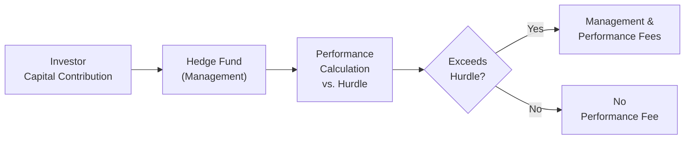

## Introduction

When it comes to hedge fund operational excellence, fee optimization is, well, a pretty big deal. After all, fees can create or erode alignment between the manager and the investor. On one hand, managers need enough revenue to stay in the game, cover costs, and attract the right talent. On the other hand, investors want to ensure they’re not paying too much for subpar returns. So is there a “perfect” formula? Not exactly—but there are well-tested approaches that tend to bring everyone closer to that sweet spot.

In this section, we’ll explore ways to strike a balance between fueling manager motivation and satisfying investor preferences. We’ll get a little informal along the way—imagine you and I are chatting over a cup of coffee, discussing how you might structure fees if you were about to launch your own hedge fund. But don’t worry: we’ll still cover all the key concepts and best practices you’d expect to see in your CFA studies.

## The Objectives of Hedge Fund Fee Design

The core objectives in hedge-fund fee design usually revolve around:

• Ensuring the manager is incentivized to generate superior risk-adjusted returns.  
• Protecting investors from excessive fees or undue risk-taking behaviors.  
• Maintaining fee structures that are competitive yet sustainable in the industry.  

Achieving these objectives involves a combination of management fees, performance fees, hurdle rates, and high-water marks. Let’s take a look at each.

## Understanding Key Concepts
Before diving deeper, let’s define the big terms that pop up all the time in this topic:

• Hurdle Rate: A pre-determined return level that must be met or exceeded before performance fees can be charged.  
• High-Water Mark: The highest net asset value (NAV) previously achieved by the fund; performance fees can only be earned on net profits above this mark.  
• Clawback Provisions: Allow the fund (or its investors) to recoup previously paid performance fees if the fund eventually underperforms or experiences drawdowns.  

When designed carefully, these features help align incentives between the manager and the investor, making sure fees are tied to actual value creation.

## Core Components of the Fee Structure

### Management Fees
Management fees are typically quoted as a percentage of assets under management (AUM). They cover recurring expenses such as salaries, rent, technology infrastructure, and other overheads. Here’s what to keep in mind:

• Rate Setting: Industry norms vary, but management fees often range from 1% to 2% of AUM. A lower base fee may appeal to cost-conscious investors, though managers need enough coverage to meet fixed costs.  
• Tiered Fee Schedules: Larger institutional investors sometimes negotiate a lower management fee rate because of their sizable commitments. This tiered structure can foster stronger relationships and encourage larger investments.  
• Trade-Off with Performance Fee: Sometimes managers reduce the management fee in exchange for a higher performance fee. The rationale is, “Don’t pay me as much if I don’t perform, but if I perform really well, I’m entitled to a bigger piece of the upside.”

### Performance (Incentive) Fees
Performance fees (often around 20% of the net profits) are designed to reward the manager for strong performance. But as you might guess, there’s more nuance than just collecting 20% of returns:

• Hurdle Rate: The fund might require, say, a 5% annualized return before performance fees kick in. If the manager doesn’t clear the hurdle, no performance fee is earned.  
• High-Water Mark: Protects investors from paying performance fees multiple times on the same gains. Once that high-water mark is set, the manager must surpass it in subsequent periods before charging more fees.  
• Clawback Provisions: If the manager receives performance fees but then the fund experiences losses, clawback provisions can force the manager to return a portion of previously earned fees—or forgo future performance fees until the portfolio recovers.

## Aligning Fees with Value Creation

### Hurdle Rates
In my opinion, a well-calibrated hurdle rate can make or break fee optimization. Maybe you’ve seen management teams lowball the hurdle so they can collect performance fees even if the fund does just barely better than T-bills. Investors, of course, usually demand something more reflective of the fund’s actual risk factor. A well-set hurdle might be a short-term interest rate plus a spread to account for the strategy’s inherent risk. This ensures that returns above the hurdle represent genuine alpha, not mere market beta.

### High-Water Marks
High-water marks are a critical idea for fairness. If a hedge fund’s NAV climbs from 100 to 110, the manager earns incentive fees on that 10-point gain. If the NAV then drops to 105 the next year, it’s not fair to pay fees on the new rise from 105 to 109 unless the fund surpasses the previous high of 110. The high-water mark ensures fees are only paid on net gains.

### Clawbacks and Deferral Mechanisms
These might feel unwieldy, but they can really smooth out manager incentives by discouraging short-term risk taking. If managers know they’ll have to return a portion of fees if they lose money in a subsequent period, they’re less likely to load up on excessively risky positions just to lock in short-term performance fees. Plus, deferring a portion of performance fees over a set lock-up period can align with the fund’s long-term investment horizon and reduce downside risk for investors.

## Tiered Fee Schedules
Tiered fee schedules reduce the management fee rate for higher levels of committed capital. For instance, you might see something like:

• 2% management fee on the first $50 million,  
• 1.75% on the next $50 million, and  
• 1.5% on commitments above $100 million.

This structure rewards institutional investors for larger capital allocations, while still ensuring the manager’s fixed costs are covered. It can deepen your relationship with big ticket investors and encourages them to allocate more capital to your strategy.

## Benchmarking and Market Comparisons
Benchmarking your fees against broader industry norms is essential. Just as investors compare your fund’s returns to an appropriate benchmark, they also compare your fees to other funds with a similar mandate. A 2-and-20 structure may seem commonplace in some equity long/short strategies but could be high for a simpler fixed-income approach. What you charge and how you structure those fees should be justifiable compared to your peers’ track records, not purely “We’ve always done it this way.”

## Quick Numerical Example
Let’s walk through a hypothetical scenario to illustrate some of these concepts. Assume:

• $100 million in AUM.  
• 1.5% annual management fee.  
• 20% performance fee with a 5% hurdle rate and a high-water mark.  
• The fund’s net return in Year 1 is 10%.  

In Year 1, gross profit is $10 million (10% of $100 million). First, the manager takes the management fee of 1.5% ($1.5 million). The 5% hurdle is $5 million. That means the fund exceeded the hurdle by $5 million. The performance fee is 20% of that $5 million “excess,” which is $1 million. So the manager receives a total of $2.5 million in fees ($1.5 million management fee + $1 million performance fee). The new high-water mark is set at a NAV of $110 million.

In Year 2, assume the NAV drops from $110 million to $105 million. The manager still receives their management fee of 1.5% on $105 million (i.e., $1.575 million), but no performance fee is owed since the fund is below the high-water mark. This also means the fund’s NAV must climb above $110 million in subsequent years before the manager is eligible for performance fees again.

## Practical Case Study: A Quick Anecdote
I once talked to a CFO of a mid-sized hedge fund who explained that after adopting a 1.5-and-20 fee structure with a 3% hurdle rate, they saw fewer investor complaints. It wasn’t so much the absolute fee levels that made folks happy, but the transparency and fairness—everyone knew what they were paying for, and they saw a clear link between performance and fees. This anecdote, while unscientific, underscores how clarity and fairness can go a long way in building investor trust.

## Diagram: Fee Flow Visualization

Below is a simple flowchart showing how capital flows lead to fee payouts, including the influence of a hurdle rate:

## Potential Pitfalls and How to Avoid Them
• Inadequate Hurdle Rate: Setting a hurdle rate too low can lead to “easy” performance fees and disgruntled investors.  
• Complex Fee Structures: Overly complicated fee structures might confuse investors, reducing transparency and trust.  
• Lack of Emerging Manager Incentives: If fees are too punitive, smaller or newer fund managers may struggle to attract capital. Striking a fair balance is key.  
• Short-Term Risk Taking: Without clawback or deferral provisions, managers might chase near-term gains to maximize performance fees—potentially harming longer-term returns.

## Final Exam Tips
• Be prepared to calculate management and performance fees under multiple structures (with or without hurdle rates, high-water marks, tiered fees).  
• Understand how clawback provisions work in both theory and practice. You may need to explain how fees could be returned if the fund hits a rough patch.  
• Practice writing short answer responses that articulate the rationale behind hurdle rates, high-water marks, and deferral mechanisms.  
• If you see a scenario or item set question about fees, pay attention to the exact wording on whether the fund has a high-water mark or uses the net asset value after management fees.  
• Time management is key—don’t get bogged down in the minutiae of complex calculations. Do the math step by step.

## References
• AIMA (Alternative Investment Management Association), “Structuring Hedge Fund Manager Compensation.”  
• CFA Institute, “Performance Fees for Investment Firms.”  
• CFA Institute Code of Ethics and Standards of Professional Conduct  

## Practice Questions on Management and Incentive Fees



### Which of the following best describes a high-water mark?
- [ ] A performance fee that is subordinate to a minimum hurdle rate.
- [ ] A clawback provision that reduces fees during periods of negative returns.
- [x] The highest previously attained fund NAV above which performance fees are payable only on new net profits.
- [ ] The percentage of fees earned by the manager after crossing a threshold.

> **Explanation:** A high-water mark ensures that performance fees are accrued only on net gains above the peak net asset value previously achieved, preventing double-charging on the same profits.

### Which of the following is a primary purpose of a hurdle rate?
- [ ] To incentivize early redemption by investors.
- [x] To require a minimum return before performance fees are earned.
- [ ] To reduce management fees in a tiered structure.
- [ ] To simplify reporting requirements for a hedge fund.

> **Explanation:** A hurdle rate is a threshold that must be surpassed before the hedge fund manager can collect performance fees, aligning compensation with meaningful outperformance.

### What is one benefit of a tiered management fee structure?
- [x] Encouraging larger commitments by providing lower fees on higher asset allocations.
- [ ] Ensuring fees are earned even if the fund underperforms.
- [ ] Eliminating the need for high-water marks.
- [ ] Simplifying the overall fee calculation for the manager.

> **Explanation:** Tiered structures help attract institutional investors through lower fees for more substantial commitments, potentially strengthening the manager–investor relationship.

### Which of the following best describes a clawback provision?
- [ ] A mechanism that allows managers to invest only half of their personal capital.
- [ ] A pre-set performance threshold for collecting fees.
- [x] A contractual right for the fund or investors to recover previously paid performance fees in case of underperformance or loss.
- [ ] A “waterfall” schedule that prioritizes certain returns to senior lenders.

> **Explanation:** Clawback clauses reduce the risk of unjust enrichment and discourage managers from taking excessive short-term risks by allowing the fund to reclaim fees if certain performance conditions are not met over time.

### If a hedge fund has a 10% net return but only achieves 3% above a 7% hurdle, and the performance fee is 20%, how much of the return (on a per-dollar basis) is allocated to the performance fee?
- [ ] $0.10
- [x] $0.006
- [ ] $0.03
- [ ] $0.02

> **Explanation:** The performance fee is paid only on the excess return above 7%. That excess is 3%. With a 20% incentive fee, the fee is 0.20 × 0.03 = 0.006 (i.e., $0.006 per dollar invested).

### Which of the following is the clearest indication that a fund’s fee structure aligns with true value creation?
- [x] The manager only receives performance fees after exceeding both a hurdle rate and the high-water mark.
- [ ] The manager charges a flat 5% fee on all returns, regardless of performance.
- [ ] The management fee is variable depending on the fund’s internal costs.
- [ ] The fund merges management and performance fees into a single rate.

> **Explanation:** Combining a hurdle rate and an appropriate high-water mark fosters a structure in which fees reflect genuine outperformance rather than market-driven returns alone.

### Which of the following statements about deferral mechanisms is correct?
- [x] Deferral allows part of the performance fee to be postponed, aligning manager incentives with longer-term performance.
- [ ] Deferral makes fees payable in each quarter regardless of total returns.
- [x] Deferral ensures immediate clawbacks in periods of negative performance.
- [ ] Deferral automatically resets the high-water mark each year.

> **Explanation:** When performance fees are deferred, managers have a greater stake in ensuring sustained performance, because fees are released after certain longevity or performance criteria are met.

### Why might some hedge funds opt for a lower management fee paired with a higher performance fee?
- [ ] To discourage large institutional investors from increasing capital allocations.
- [x] To link the bulk of manager compensation more tightly to actual fund returns.
- [ ] To eliminate the use of clawback provisions.
- [ ] To make the hurdle rate unnecessary.

> **Explanation:** Reducing the management fee while raising the performance fee portion increases the manager’s focus on achieving positive returns to earn compensation.

### Which of the following is a potential downside of an overly complex fee structure?
- [x] It may reduce transparency and deter investors who seek clarity in costs.
- [ ] It always leads to higher returns for the fund manager.
- [ ] It ensures simpler performance calculations.
- [ ] It eliminates the need for regulatory oversight.

> **Explanation:** Complexity can obscure actual costs and hamper investor comprehension, potentially harming investor trust and deterring allocations.

### A new investor is evaluating fund A with a 2% management fee and a 20% performance fee plus a 5% hurdle rate. Which of the following best describes the function of the 5% hurdle rate in this context?
- [x] True
- [ ] False

> **Explanation:** The hurdle rate determines the minimum annualized return that the fund must exceed before awarding performance fees, ensuring compensation is tied to real value creation.


