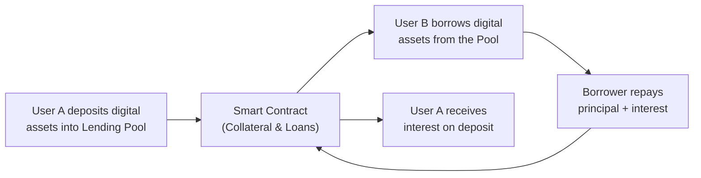

## Overview and Context

Digital assets are no longer just a sci-fi-inspired curiosity; they're rapidly becoming an integral part of modern investing. If you'd told me a few years back that I'd be discussing “smart contracts” in the same breath as “private equity due diligence,” I might have scratched my head and said, “Um, are you sure?” But here we are. Cryptocurrencies, utility tokens, stablecoins, and non-fungible tokens (NFTs) have not only created new markets but are forcing us to rethink traditional approaches to asset management. On top of that, we have something called Decentralized Finance (DeFi)—a technology-driven ecosystem of lending, borrowing, trading, and yield generation that strips away many of the typical middlemen.

In this section, we’ll explore the rapidly evolving world of digital assets and DeFi, their defining characteristics, and how they are influencing alternative strategies. We’ll look at the key challenges, the unique risks, and the significant upside potential—plus, we’ll share best practices for weaving these new vehicles into a professional investment framework.

## Unique Characteristics of Digital Assets

Digital assets differ from traditional securities in several ways:

• Transferability: Most digital assets can be transferred 24/7 around the globe. Traditional securities are often constrained by market hours and heavier administrative processes.  
• Divisibility: A digital token can be split into fractional units, sometimes into tiny pieces like 0.00000001 of a coin (in the case of Bitcoin). Traditional securities can’t generally be fractioned out this easily.  
• Global Reach: Digital assets can cross borders with minimal friction, making them accessible to a diverse pool of investors.  
• Programmability: Using blockchain-based smart contracts, digital assets can be embedded with certain rules that automatically execute (e.g., releasing funds once certain conditions are met).

It’s almost like one big unstoppable, borderless marketplace. But with that convenience and flexibility comes a fresh set of challenges, like finding secure custody solutions and navigating a patchy international regulatory landscape.

## DeFi: The New Frontier

Decentralized Finance (DeFi) is an umbrella term for a variety of financial applications built on blockchain networks (often Ethereum, but not exclusively), enabling peer-to-peer transactions without centralized intermediaries such as banks or brokers. If you’ve ever used a decentralized exchange or staked tokens in a lending pool, you’ve touched a piece of DeFi.

### Core DeFi Components

• Decentralized Exchanges (DEXs): Platforms like Uniswap or SushiSwap allow users to trade tokens directly from their wallets, using automated market maker (AMM) smart contracts.  
• Lending and Borrowing Protocols: Users can lend their digital assets to a pool (e.g., Aave, Compound) and earn interest, or borrow against collateral.  
• Yield Farming and Liquidity Mining: Individuals provide liquidity to a protocol and get rewarded with fees or additional tokens. It’s akin to “earning yield on your yield,” but watch out for “impermanent loss.”  
• Stablecoins: Assets such as USDC, DAI, or USDT attempt to peg their value to a fiat currency (typically the U.S. dollar), reducing volatility and making DeFi more practical for day-to-day transactions.

### Key DeFi Opportunities

Fans of DeFi love its accessibility. Anyone with an internet connection and a compatible wallet can lend, borrow, or trade. Yields can be significantly higher than many traditional savings products—especially in a low interest rate environment—because the platforms might be capturing previously unbanked or under-banked markets.

That said, DeFi can be a bit like the Wild West: high potential returns, but bigger risks: untested code, smart contract exploits, volatile tokens, and fleeting liquidity. For those of us in institutional asset management, it requires a very deliberate risk-management approach.

## The Role of Smart Contracts

A smart contract is self-executing code on a blockchain that carries out a set of instructions when specific conditions are met. Think of them as tiny legal agreements with zero human intervention—once it’s deployed, the contract can’t be changed easily (unless there’s a governance mechanism that allows updates).

### Example Flow: Lending in DeFi

Let’s visualize a simple lending-borrowing process on a DeFi platform using a flowchart:



1) User A deposits assets (e.g., stablecoins).  
2) The smart contract recognizes the deposit, updates the liquidity pool, and sets interest rates algorithmically.  
3) User B can borrow by providing collateral (possibly a different token).  
4)Borrower repays the loan (plus interest).  
5) Lender receives interest accrued in real-time.

It’s fairly straightforward—at least from a user’s perspective. Yet, behind the scenes, a complex interplay of oracles, governance tokens, and reward incentives is in motion.

## Decentralized Autonomous Organizations (DAOs)

DeFi protocols often rely on DAOs, where governance decisions—like fee structures or upgrading the smart contract code—are voted on by those who hold governance tokens. If you hold tokens in a platform’s DAO, you can propose changes or vote on other proposals. That’s a real shift from the top-down management we see in many traditional firms.

Some DAOs operate more like digital co-ops, where the entire community has a say in protocol direction. Others concentrate decision-making power in a smaller circle, though they still brand themselves as DAOs. Either way, the decentralization can be beneficial (everyone participates) and risky (decisions can be slow or can be swayed by large token holders).

## Integrating DeFi into Alternative Portfolios

### Potential Benefits

• Enhanced Yield: Instead of leaving idle cash or stablecoins in a zero-interest environment, DeFi lending can provide yields ranging from 2% to 20% or more.  
• Diversification: Digital assets may display low correlation to traditional equities—though “may” is the operative word because correlations can spike in times of crisis.  
• Instant Liquidity: Many DeFi markets are open 24/7, providing near-instant liquidity for certain tokens.  

### Potential Pitfalls

• Smart Contract Vulnerabilities: A single coding bug could lead to a massive loss of capital.  
• Liquidity Risks: DeFi markets can dry up quickly, especially if whales (huge token holders) remove liquidity.  
• Regulatory Uncertainty: National agencies are still figuring out how to classify and oversee DeFi.  
• Permanent or Impermanent Loss: Liquidity providers to certain pools can lose asset value if token prices shift significantly.

From a vantage point of alternative investment managers—think private equity, hedge funds, real estate funds—these features might introduce new sources of alpha and diversification. However, manager due diligence must expand to include the DeFi side: analyzing code, developer team backgrounds, protocol governance, treasury reserves, and so on.

## New Risk Considerations

Digital assets introduce fresh risk elements that might be less common in a typical equity or bond portfolio:

• Price Volatility: Certain tokens can move 20–30% (or more) in a single day.  
• Counterparty Risk Within Peer-to-Peer: Who’s on the other side of the trade? In purely on-chain transactions, the “counterparty” is sometimes just a smart contract.  
• Custody Risk: Holding private keys is essential, and losing them means losing your assets.  
• Hacking & Fraud: Smart contract exploitations and phishing attacks happen all the time.  
• Governance Risks: If a DAO is poorly structured, big token holders can override decisions or push through self-serving proposals.

### Quick Math: Impermanent Loss Calculation

Impermanent loss (IL) can surprise new liquidity providers. A simplified formula for IL when you provide liquidity in a 50/50 pool with two tokens that change in price is:


\text{IL (\%)} = 1 - \sqrt{\frac{p_0}{p_1}} \times \frac{2}{\left(1 + \sqrt{\frac{p_1}{p_0}} \right)}


Where \\(p_0\\) is the initial price ratio of Token A to Token B, and \\(p_1\\) is the new price ratio after a certain period. The loss is “impermanent” because if prices revert, you gain it back—though if you withdraw at that moment, the loss is realized.

## Operational Due Diligence for Digital Assets and DeFi

When evaluating digital assets or a DeFi protocol, a robust due diligence framework might include:

• Code Audits: Looking at third-party or community audits. Has the code been formally verified?  
• Protocol Usage Metrics: TVL (Total Value Locked), daily active users, and liquidity depth.  
• Governance Structure: Is it a DAO? How transparent is it?  
• Insurance or Coverage: Some DeFi protocols partner with decentralized insurance providers (e.g., Nexus Mutual) to insure against smart contract bugs.  
• Developer Reputation: Does the dev team have a history of successful projects?  
• Security Record: Past hacks, exploits, or vulnerabilities.  
• Regulator-Acknowledged Features: For example, a protocol might explicitly block certain geographic regions to stay in compliance with local laws—or it might not.

## Case Study: A Hypothetical Yield Farming Strategy

Let’s imagine a scenario to make this more concrete. Suppose an alternative investment manager, Oakbridge Capital, wants to allocate a small portion (say 2%) of its fund to DeFi yield opportunities to generate returns in a near-zero interest rate environment.

1) Oakbridge identifies a stablecoin-based lending pool with an average annual percentage yield (APY) of 7%.  
2) Oakbridge deposits $2 million worth of stablecoins to the protocol, collects interest, and also earns governance tokens as a bonus reward.  
3) Meanwhile, Oakbridge’s risk team constantly monitors daily liquidity levels and the protocol’s smart contract audits for signs of issues.  
4) They place a stop-loss rule: if protocol’s TVL or liquidity ratio drops below a certain threshold, or if the governance token’s price becomes extremely volatile, they exit positions.  

This approach might yield returns that are uncorrelated with the rest of the portfolio—yet it also demands specialized knowledge. The manager must stay up-to-date with the protocol’s governance changes, code upgrades, and community sentiment. It’s not the typical “buy-and-hold” scenario.

## Example Python Snippet: Estimating Impermanent Loss

Below is a short Python snippet illustrating a quick calculation for impermanent loss for a 50–50 pool when the price ratio changes:

```python
import math

def impermanent_loss(initial_price_ratio, new_price_ratio):
    # IL(%) = 1 - (2 * sqrt(p1/p0) / (1 + sqrt(p1/p0)))
    # We'll invert the ratio if new_price_ratio < 1 for demonstration
    ratio = new_price_ratio / initial_price_ratio
    numerator = 2 * math.sqrt(ratio)
    denominator = 1 + math.sqrt(ratio)
    il = 1 - (numerator / denominator)
    return il * 100

p0 = 1.0   # initial ratio
p1 = 1.2   # new ratio (token A becomes 20% more expensive vs token B)
loss = impermanent_loss(p0, p1)
print(f"Impermanent loss is approximately {loss:.2f}%")
```

This script outputs the approximate percentage loss a liquidity provider would experience if they added equal amounts of two tokens to a pool, and Token A’s price rose by 20% relative to Token B.

## Regulatory and Compliance Challenges

From the perspective of compliance officers and portfolio managers, digital assets and DeFi remain a regulatory gray area. Different countries have different interpretations of tokens—some classify them as securities, others as commodities, and some as something else entirely. And when you’re dealing with a permissionless system on a global blockchain, well, the lines get blurry.

Many DeFi projects rely on disclaimers stating participants are responsible for obeying local laws. This “buyer beware” stance can be risky for institutions that have to abide by strict KYC/AML (Know Your Customer and Anti-Money Laundering) frameworks. Hence, managers need to track ongoing legislative developments and possibly seek external legal counsel.

## Best Practices for Incorporating Digital Assets into Portfolios

• Start Small and Learn: Allocate a modest portion of your AUM to test the waters without jeopardizing the entire fund.  
• Diversify Within Crypto: Spread exposure across different protocols, stablecoins, or tokens.  
• Rely on Expert Partners: Use specialized custodians, code audit firms, and possibly aggregator platforms that gather DeFi yields.  
• Stress Testing: Evaluate how these assets behave under black swan events.  
• Continuous Monitoring: Because things move so fast, you’ll need near real-time data.  

## Exam Tips and Pitfalls

• Understand the Terms: Don’t mix up a utility token with a governance token. Clarify the token’s function in a DeFi ecosystem.  
• Evaluate Risk Properly: If you see abnormal yields (e.g., 100% APY), ask yourself if it’s sustainable or just a short-term promotional incentive.  
• Scenario Testing: For the CFA exam, you may get a scenario question about selecting a DeFi yield strategy. Expect to perform scenario-based risk analysis.  
• Ethical Considerations: The CFA Code and Standards encourage thorough due diligence and accurate representation of risk to clients. Don’t get blinded by hype.  
• Time Management: DeFi questions can be loaded with complexities. On exam day, watch your time and approach systematically.

## Summary

Digital assets and DeFi protocols are reshaping alternative investments, offering new avenues for yield, liquidity, and global participation. Yet with opportunity comes heightened risk—be it from hackers, volatility, regulatory crackdowns, or complicated governance structures. Managers must adopt robust due diligence practices and remain agile as the technology—and the rules—evolve in real-time. While it can be a game-changer, especially in a low-yield environment, it’s wise to approach DeFi with both optimism and caution.

## Additional References

• CFA Institute: “Cryptoassets: The Guide to Bitcoin, Blockchain, and Cryptocurrency for Investment Professionals.”  
• DeFi Pulse: https://defipulse.com/ (Real-time data on DeFi protocols)  
• Werbach, K. (2018). “The Blockchain and the New Architecture of Trust.”

---

## Test Your Knowledge: Digital Assets & DeFi Quiz



### Which of the following characteristics best differentiates digital assets from traditional securities?

- [x] High divisibility and 24/7 transferability.
- [ ] Tighter regulatory constraints.
- [ ] Guaranteed long-term price stability.
- [ ] Complete immunity from fraud and hacking.

> **Explanation:** Digital assets can be traded globally at any time and often allow fine fractional ownership, distinguishing them from traditional securities that generally have set trading hours and limited divisibility.

---

### In a typical Decentralized Finance (DeFi) lending protocol, the interest rates paid to lenders are primarily determined by:

- [ ] Central bank monetary policy.
- [x] Automated smart contracts that adjust based on supply and demand.
- [ ] The inflation rate set by token issuers.
- [ ] Insurance companies that back collateral.

> **Explanation:** DeFi protocols typically use algorithms (smart contracts) to balance supply and demand, setting lending and borrowing rates dynamically without a central authority’s involvement.

---

### A DAO (Decentralized Autonomous Organization) most commonly does which of the following?

- [ ] Represents a centralized technology firm that sets all decision-making rules.
- [ ] Maintains a traditional board of directors for governance.
- [x] Uses token holder voting to influence protocol upgrades and fee structures.
- [ ] Avoids all forms of community input and stakeholder involvement.

> **Explanation:** DAOs allow token holders to propose and vote on protocol changes, effectively transferring governance power to the community rather than a single entity.

---

### Impermanent loss in a liquidity pool context is best described as:

- [ ] A permanent financial loss from fraudulent DeFi protocols.
- [x] A temporary reduction in the value of pooled assets when token prices fluctuate.
- [ ] A fee charged by centralized exchanges for high-frequency trading.
- [ ] A guaranteed outcome whenever two tokens are paired in a liquidity pool.

> **Explanation:** Impermanent loss is the difference between holding tokens in a liquidity pool versus simply holding them in a wallet. The loss is “impermanent” because it can reverse if prices move back to the initial ratio.

---

### Which of the following is a key advantage of using stablecoins in DeFi protocols?

- [x] Lower price volatility and reduced market risk.
- [ ] Automatic elimination of smart contract vulnerabilities.
- [x] Ability to serve as collateral for lending and borrowing.
- [ ] Guaranteed compliance with all national regulations.

> **Explanation:** Stablecoins reduce volatility by pegging to fiat currencies, making them suitable as collateral in lending/borrowing, but they don’t fix code vulnerabilities or ensure full regulatory compliance.

---

### A primary regulatory concern about peer-to-peer DeFi transactions is:

- [x] Potential absence of KYC/AML verification.
- [ ] Excess reliance on large commercial banks.
- [ ] Overregulation by local governments.
- [ ] Inability of stablecoins to hold a peg.

> **Explanation:** DeFi often bypasses centralized institutions, meaning KYC or AML checks can be lax or nonexistent, which raises concerns for regulators and compliance officers.

---

### What is one reason an institutional investor might conduct a code audit on a DeFi protocol?

- [x] To verify that the smart contract doesn’t contain vulnerabilities that could be exploited.
- [ ] To ensure it meets a government mandate for open-source software.
- [x] To confirm that the protocol is built using widely accepted programming languages.
- [ ] To push the code onto a centralized server for data backup.

> **Explanation:** Code audits can uncover potential exploits in smart contracts. Investors who handle large sums of capital want these risks minimized before committing funds.

---

### Which of the following best captures the role of governance tokens in some DeFi ecosystems?

- [x] They allow holders to vote on protocol changes and upgrades.
- [ ] They represent equity stakes in a centralized bank.
- [ ] They are always pegged 1:1 to a specific fiat currency.
- [ ] They eliminate the need for any token staking or liquidity provision.

> **Explanation:** Governance tokens grant voting rights, enabling decentralized decision-making in many DeFi protocols.

---

### For an alternative investment manager, a key benefit of incorporating DeFi strategies might be:

- [x] Access to potentially higher yields and diversified returns.
- [ ] Elimination of the need to provide investor disclosures.
- [ ] Complete replacement of traditional fixed-income securities.
- [ ] Immunity from general market downturns and liquidity events.

> **Explanation:** DeFi can offer new yield opportunities with relatively low correlation to conventional assets, but it does not eliminate compliance obligations, nor does it guarantee protection from market volatility.

---

### True or False: Decentralized exchanges guarantee no risk of price slippage due to automated market makers.

- [ ] True
- [x] False

> **Explanation:** While decentralized exchanges use automated market makers to facilitate trades, price slippage can still occur if there is insufficient liquidity or a large order size relative to the pool.


