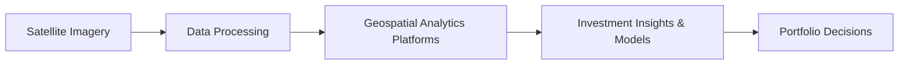

## Introduction

Have you ever wondered if there’s a sneaky way to confirm industrial production figures before official data is released? Or maybe you heard that some clever hedge funds track the number of cars parked at big-box retail stores to gauge consumer demand? Well, that’s the magic of satellite and geospatial data in modern investment research. In this section, we’ll walk through how alternative asset managers tap into geospatial intelligence—like images from orbiting satellites or signals from smartphones—to gain novel insights into the real economy. I still remember the first time I saw satellite images of farmland in Brazil showing surprisingly robust crop yields, and how it contradicted many “official” forecasts. Let’s see how and why that might happen, and what it means for those of us knee-deep in alternative investments.

## Harnessing Satellite Imagery for Investment Insights

Broadly speaking, geospatial data provides location-based insights on physical and human activities across the globe. So, let’s imagine we’re analyzing farmland in the Midwest to estimate future corn yield. Instead of relying solely on government reports or self-reported data from local producers, we can look at seasonal changes in vegetation density, soil moisture levels, and other variables gleaned from satellite imagery. In practice, this can help commodity-focused hedge funds or farmland investors (see Chapter 5 on Natural Resources) position their portfolios ahead of any big swings in yield or price.

### Commodity Price Forecasting

Commodity traders often work with geospatial intelligence to estimate supply and demand before official statistics are released. For instance, say you’re dealing with soybeans:

• Vegetation Indices: By processing satellite data that measures vegetation health (e.g., Normalized Difference Vegetation Index or NDVI), you can estimate how well crops are growing.  
• Soil Moisture Analysis: Satellite sensors evaluate the water content in soil, giving you clues about upcoming yield.  
• Observation of Harvest Progress: Real-time imagery can show how quickly farmland is transitioning from lush green fields to harvested rows, indicating activity level and potential weather disruptions.

And it’s not just farmland we’re talking about. Industrial commodity traders might look at satellite snapshots of mining sites or ports to gauge production and export capacity. One manager I chatted with used imagery of a major copper mine’s stockpiles to confirm that production was running ahead of schedule. When combined with fundamentals, this gave them the confidence to short copper futures ahead of an unexpected inventory glut.  

### Retail Foot Traffic Analysis

Satellite images and geospatial data from mobile devices also help measure shoppers’ presence at malls and stores—essentially foot traffic. If you notice significant changes in traffic patterns near certain retail outlets (and you line it up with data from prior quarters), you might predict shifts in company revenue well before the quarterly earnings announcement. “Wow, there are more cars parked at the chain store than last year,” you think. That might be a bullish signal—assuming some portion translates into actual sales rather than window shoppers.  

Although foot-traffic analysis doesn’t assure you that every person leaving the store is carrying two bags of merchandise, aggregated geolocation data can still be surprisingly accurate in capturing consumer trends. For those investing in specialized real estate or REITs, foot traffic data can signal which retail assets might be delivering stronger rental income to landlords (see Chapter 4 on Real Estate and Infrastructure).

## Validating Official Economic Data

There’s another layer that I personally find quite thrilling: using geospatial data to verify official stats. Governments might report a certain figure for industrial output or new housing projects, but satellites might tell you a different story. For example:

• Industrial Activity: By observing night-time lights in certain regions or tracking changes in the intensity of light from factories, investors can detect whether industrial sites are truly ramping up production or if official numbers are inflated.  
• Infrastructure Development: Space-based imaging can reveal progress on major construction projects—like highways, bridges, or dams—often long before official agencies announce completion.  
• Deforestation and Mining: This includes analyzing changes in forest coverage or open-pit mine expansions. Such insights also tie into ESG-related objectives (Chapters 5 and 13 highlight the environmental dimension).

In one instance, a firm used satellite images of a major port’s container yard to verify a reported spike in exports. As it turned out, the satellite data showed the docks were significantly emptier than government statements suggested, prompting them to reevaluate their macro bet on that region’s currency.

## Ethical and Legal Considerations

Now, all this might sound super exciting, but it raises a few eyebrows. “Wait, am I allowed to track people’s phones or peer into their farmland from space?” In principle, such data is generally public domain if captured from orbit (many countries don’t restrict overhead satellite imaging to the same degree they protect ground-level photography). That said, there are some crucial considerations:

• Privacy: While high-level satellite imagery that identifies big trends is usually permissible, analyzing individual home details or personal phone locations can push into precarious territory. Regulations like the GDPR (General Data Protection Regulation) in Europe can impact how you process geolocation data from personal devices.  
• Sovereignty: Nations can object if satellite data reveals sensitive infrastructure or is used to circumvent local data security regulations.  
• Personal Consent: If you’re extracting location data from, say, smartphones, you need user consent in most jurisdictions. Collecting foot traffic data might be legal at aggregate levels but unethical if it reveals personally identifiable behaviors.

Ethical guidelines from the CFA Institute Code and Standards also encourage us to consider the potential for investor misuse, particularly around sensitive personal data. You don’t want to inadvertently cross lines, so always ensure your data providers have robust consents in place and that your usage is strictly aggregated to avoid privacy breaches.  

## Merging Geospatial Intelligence with Fundamental or Macro Analysis

By itself, satellite data is just one puzzle piece. Let’s be honest: a few extra cars in a parking lot or a new railroad track near a mine won’t automatically guarantee alpha. The real power emerges when you integrate geospatial intelligence with strong fundamental or macro frameworks.

### Data Fusion

Data fusion is about layering different sources:  
• Economic Data: Combine official data releases (industrial production, CPI, etc.) with real-time geospatial insights to test for anomalies.  
• Fundamentals: Match satellite observations of farmland conditions with fundamental supply-demand metrics, such as the USDA’s (U.S. Department of Agriculture) official crop projections or futures market open interest.  
• Crowd-Sourced or Alternative Data: Overlap text analytics (e.g., from social media or news flows) to see if there’s a narrative mismatch with what you see on the ground.  

When done right, you end up with a multi-dimensional perspective on an asset or region, much richer than what you’d get from any single input. Let’s illustrate with a quick flowchart:



Above, you can think of each node as a step in the pipeline: from raw images (A) to processing (B), analytics (C), and eventually insight generation (D). The final step is where investment professionals decide how to tilt portfolios in response.

## Specialized Skill Sets and Technology Platforms

In the last few years, the skill sets required to handle geospatial data have exploded. Fund managers, especially in the alternatives space, often hire data scientists, remote-sensing specialists, and geoengineers. So, let’s break down some of the crucial roles:

• Remote Sensing Analysts: They interpret raw satellite images, correct for atmospheric conditions, and produce consistent data sets.  
• Geospatial Data Scientists: They code in Python, R, or specialized geospatial libraries like GDAL or GeoPandas, building machine-learning models that integrate location-based signals.  
• Domain Experts: Agriculture specialists, shipping route analysts, or energy historians who can decode subtle patterns in the imagery.  

Here’s a tiny snippet of Python code showing how an analyst might load and explore geospatial data using GeoPandas:

```python
import geopandas as gpd

fields = gpd.read_file('fields.shp')

print(fields.head())

total_area = fields['geometry'].area.sum()
print(f"Total farmland area: {total_area} square meters")
```

Of course, software is only half the story. Often, you need advanced cloud infrastructure to store and process terabytes of satellite images. Platforms like AWS, Google Earth Engine, or specialized map-based solutions let you query data at scale, run machine learning models, and generate real-time alerts.

## Competitive Advantages in Alternative Investments

So, why go through all this trouble? Because geospatial data can provide that elusive edge in markets:

• Early Detection of Trends: As we discussed, you can see supply-demand mismatches in real time (or at least faster than official sources).  
• Granular Insights: Instead of broad national stats, you can zoom in on a particular region, store, or mining site.  
• Diverse Strategy Applications: Hedge funds, private equity, farmland investors, macro managers—everyone can find some angle to incorporate geospatial intelligence into their strategies.  

In many ways, this mirrors the broader shift toward alternative data sets: Instead of waiting for official numbers, you gather your own proprietary data to make more proactive decisions. That’s huge in today’s hyper-competitive environment, where market participants are all looking for an “information advantage.”

## Integrating ESG Conventions and Geospatial Data

We can’t talk satellite data without tiptoeing into ESG territory. Let’s say you’re assessing deforestation risks for a palm oil plantation or reviewing the carbon footprint of a major steel factory. Satellite imagery can directly measure the destruction of rainforest, identify harmful mining expansions, or evaluate the presence of illegal logging. Both investors and regulators are increasingly demanding transparency, and geospatial data is a perfect ally for verifying sustainability claims on the ground.

It’s not uncommon for an ESG-focused private equity fund to say, “We’ll commit capital only if we can confirm no illegal deforestation.” With a series of images capturing changes in land cover over the past five years, it becomes easier to track compliance. No more taking an operator’s word for it—there’s actual, visible evidence from orbit.

## Potential Challenges and Common Pitfalls

While we’ve sung the praises of this technology, it’s only fair to note the pitfalls:

• Noise in the Data: Satellite images can be distorted by cloud cover, shadows, or seasonal changes. If you don’t adjust for these factors, you might misinterpret the signals.  
• Overfitting: One might see patterns in geospatial data that don’t really exist or are too small to be predictive.  
• High Cost of Implementation: Quality satellite imagery and robust analysis platforms can be expensive.  
• Regulatory Shifts: Governments might change laws around data privacy, restricting how foot traffic or mobile signals can be collected. This can limit your ability to replicate historical studies.

Also, one interesting phenomenon is the so-called “canceled launch risk” if you rely on a particular satellite that goes offline or fails to launch. That might not be huge, but it’s a reminder that your data pipeline can break if your primary source fails.

## A Simple Quantitative Framework

If you’re aiming to incorporate satellite data into a fundamental or macro model, you might use a weighted combination of signals. Let:


\text{Satellite-Based Score} = \sum_{i=1}^{n} w_i \times M_i


where \\(M_i\\) represents each geospatial metric (e.g., NDVI vegetation index, foot traffic density, etc.) and \\(w_i\\) is the assigned weight based on historical predictive power. Combining that Satellite-Based Score with your fundamental score (like discounted cash flow valuations or Real Options analysis) could give you a more holistic signal for your investment decision, something like:


\text{Total Score} = \alpha \times \text{Fundamental Score} + \beta \times \text{Satellite-Based Score}


where \\(\alpha\\) and \\(\beta\\) might be chosen via backtesting or cross-validation. It’s important you interpret these results with caution—satellite data is messy, so a robust training period is typically required to refine weights and ensure consistency in your signals.

## Practical Examples and Real-World Scenarios

• Shipping Routes: For a global macro fund, tracking the positions and utilization of cargo ships can shed light on trade flows. If you see an unusually large number of ships anchored off the coast of a major oil exporter, that might indicate a backlog or a storage glut.  
• Tourism Counts: By analyzing the foot traffic around theme parks or popular resorts, one might deduce changes in discretionary spending. This can help inform positions in hospitality REITs or consumer discretionary stocks.  
• Disaster Response Investing: After a major hurricane, satellite data can measure the extent of property damage. Property insurance or reinsurance markets (refer to Hedge Funds in Chapter 6 for event-linked instruments) might then adjust premiums or coverage based on real-time damage assessments.

## Exam Relevance and Final Tips

From the CFA exam perspective, especially at advanced levels, you might see scenario-based questions testing your understanding of alternative data utilization in portfolio management. They might ask you to compare two funds using satellite data for farmland yield projections, or request an analysis of the ethical implications. Remember a couple of key points:

• Know the basic data sources and their strengths/weaknesses.  
• Be prepared to cite standards of practice regarding privacy and confidentiality (CFA Institute Code and Standards references).  
• Show you can evaluate cost-benefit trade-offs: Is the data accurate, timely, and worth the investment?

When tackling constructed-response questions, emphasize the role of verification and cross-checking with official or fundamental data—examiners often want to see that you can incorporate geospatial intelligence responsibly, not just chase hype.

## References and Further Reading

• NASA Earth Observatory: Articles on Satellite Remote Sensing for Investors  
• SDA Community: https://www.spatialdata.gov for updates on geospatial techniques  
• ESG + Geospatial Data: World Resources Institute’s materials on environmental data verification  
• Relevant chapters in this text:  
  - Chapter 5 (Natural Resources) for farmland and commodities  
  - Chapter 6 (Hedge Funds) on event-linked instruments  
  - Chapter 4 (Real Estate) for foot traffic and retail REITs  
  - Chapter 13 (Advanced Real Estate and Infrastructure Analysis) to see how large-scale projects can be monitored via satellite

## Satellite and Geospatial Data in Research: Test Your Knowledge



### Which of the following best describes a key advantage of satellite imagery for commodity analysis?

- [x] It provides real-time or near-real-time observations of farmland health.
- [ ] It offers fully transparent personal-level data for deeper analytics.
- [ ] It completely replaces official agency forecasts for agricultural commodities.
- [ ] It circumvents the need for any in-field crop inspection.

> **Explanation:** Satellite imagery helps investors detect real-time patterns in farmland conditions, so they can anticipate yield changes faster than official sources. However, official forecasts and on-site inspections still have value.

### What is the primary ethical concern when using foot traffic data from mobile devices?

- [ ] The data visualization isn’t accurate enough.
- [x] Potentially collecting or using personally identifiable information without consent.
- [ ] It is typically too expensive for smaller hedge funds to obtain.
- [ ] Government permits are hard to secure for each store location.

> **Explanation:** Collecting foot traffic from mobile devices can infringe on privacy if personal data is not properly anonymized or if user consent is missing.

### How can “data fusion” improve the reliability of geospatial investment insights?

- [x] By combining multiple datasets (official econ data, social media, satellite imagery) to create a more comprehensive signal.
- [ ] By eliminating human judgment from the investment decision process.
- [ ] By ensuring every data source has the same update frequency.
- [ ] By focusing exclusively on one country’s data to ensure consistency.

> **Explanation:** Data fusion enhances accuracy by blending different types of data; no single source is all-powerful. Adequately combining them can reduce noise and biases.

### Which statement about sovereignty issues in satellite data collection is most accurate?

- [x] Countries may object when sensitive infrastructure is revealed without their permission.
- [ ] All countries allow unrestricted satellite imaging of any area.
- [ ] Sovereignty has no relevance to global data providers.
- [ ] Satellites cannot capture images beyond national borders.

> **Explanation:** Sovereignty matters because some nations restrict or object to the disclosure of strategic infrastructure, presenting potential legal and ethical dilemmas for data users.

### In integrating satellite data with traditional macro analysis, which is a recommended best practice?

- [x] Cross-validate satellite findings with official or fundamental data before trading.
- [ ] Automatically double the satellite-derived price forecasts.
- [x] Disregard all official data releases for fear of mismatch.
- [ ] Only trust geospatial intelligence if it contradicts the fundamental narrative.

> **Explanation:** Satellite data can be powerful but must be cross-referenced with fundamentals or official releases to confirm accuracy and significance.

### From a CFA Code of Ethics perspective, which principle is most relevant to the use of satellite data?

- [x] Protecting client confidentiality and privacy when using potentially sensitive data.
- [ ] Manipulating data so that performance looks better.
- [ ] Ensuring you actively spread client data among as many providers as possible.
- [ ] Bypassing securities regulations through advanced data collection methods.

> **Explanation:** The Code and Standards emphasize client confidentiality and privacy, relevant here if personal or sensitive data is involved.

### An accurate measure of farmland yield from satellite NDVI data typically requires:

- [x] Adjusting for weather effects, cloud coverage, and seasonal variations in the image.
- [ ] Using only one day’s worth of imagery to infer the entire growing season.
- [x] Relying solely on anecdotal local witness accounts.
- [ ] Zero calibration against historical yield data.

> **Explanation:** NDVI signals can be obscured by clouds, seasonal cycles, or sensor discrepancies. Calibrating and adjusting for these variables is crucial for accuracy.

### When an investment manager sees a discrepancy between official government export figures and satellite images of supposedly empty container ports, what is a prudent next step?

- [x] Investigate further by checking additional data sources or on-the-ground observations.
- [ ] Immediately file a lawsuit against the government data agency.
- [ ] Fully ignore all official releases going forward.
- [ ] Double leverage on the short side with no further analysis.

> **Explanation:** Prudent investment decision-making requires triangulating data sources before acting. Discrepancies may reflect errors, delays, or exceptions that need cross-checking.

### Which challenge is commonly associated with integrating satellite-derived analytics into an investment process?

- [x] Processing large volumes of data and ensuring the resulting signals are accurate and timely.
- [ ] The complete lack of any real-time satellite imagery sources.
- [ ] The uniform and trivial cost structure of all geospatial data.
- [ ] Zero issues with shelf life since satellites never degrade.

> **Explanation:** One of the biggest issues is handling immense datasets and ensuring they deliver actionable, accurate signals in time to be useful for trading or investment decisions.

### True or False: Satellite data can sometimes reveal environmental or social factors (like illegal deforestation) that may not appear in official documentation or corporate statements.

- [x] True
- [ ] False

> **Explanation:** This is a key advantage; satellite imagery can uncover real environmental damage or social impacts that official sources either omit or fail to disclose in a timely manner.


