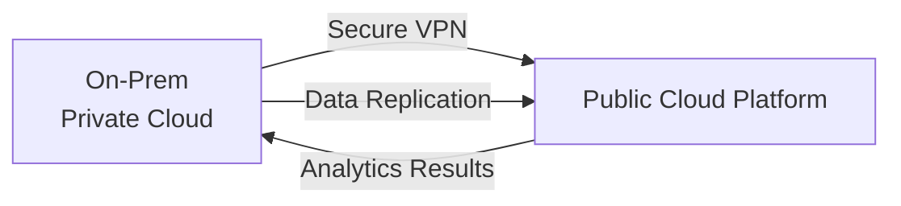

## Introduction

Cloud computing has reshaped countless industries, and the alternative investments space is no exception. By shifting away from costly, on-premises IT infrastructure and moving to cloud-based environments, alternative managers are finding new ways to optimize resource use, manage data, and keep operational overhead low. It’s like renting a well-equipped office rather than owning and maintaining the whole building. You just pay for what you need, when you need it. And yes, you’ll occasionally hear folks rave about how flexible it can be.

However, cloud adoption isn’t all warm and fuzzy. If you misjudge your vendor choice or gloss over security protocols, you can wind up with compliance headaches or face data breaches. On top of that, every fintech or alt-manager I know who’s tried moving their entire operation to the cloud has had to weigh the pros and cons of vendor lock-in, performance trade-offs, and data locality rules.

This discussion aims to walk you through the key concepts and best practices, while keeping the vibe slightly informal. We’ll dig into concepts like scalability, hybrid clouds, microservices, and containerization. Let’s also add a dash of real-world anecdotes, where managers discovered that high-performance computing in the cloud enabled them to run more simulations—and faster—than they ever dreamed possible.

## The Value Proposition of Cloud in Alternatives

For most alternative investment strategies—be it hedge funds, private equity, or real estate—flexibility and speed can generate significant alpha. If we think about private equity managers who need real-time analysis on potential acquisitions or hedge fund managers crunching time-series data for thousands of assets, it’s easy to see why you’d want on-demand computational power.

• Cost-Effectiveness: Traditional data centers incur capital expenses for hardware, real estate, electricity, and staff. Under a cloud model, you shift those costs to an operational expense (pay-as-you-go).  
• Rapid Deployments: Cloud platforms let you spin up new servers or data pipelines in minutes rather than weeks. No more waiting for shipping, rack-and-stack, or network cables.  
• Stabilized Infrastructure: Selldown or scale-up quickly depending on market conditions, investment inflows, or analysis needs. It’s especially handy during times of extreme volatility.

That said, it’s wise to do a thorough cost-benefit analysis. There’s a well-known risk for new adopters who spin up a large cluster of cloud resources, only to forget about them. That can lead to monstrous bills, overshadowing potential savings. Essentially, cloud environments reward you if you keep a close eye on usage.

## Key Components Behind Cloud Scalability

Cloud computing’s elasticity is a significant draw for alternative investment managers. But how does the magic happen?

• Virtualization: Multiple virtual machines reside on a single physical server. This arrangement helps isolate workloads, improves resource utilization, and simplifies provisioning.  
• Containerization: Tools like Docker bundle an application, runtime, and dependencies into a single container. Then orchestration platforms like Kubernetes coordinate and scale these containers.  
• Microservices: Rather than building one gigantic application, you break it down into smaller services that each handle specific tasks (e.g., reconciliation, new investor onboarding, performance analytics).

Think of microservices like a team of basketball players: Each athlete has a distinct role, and the team can still function if you sub one person out. If one microservice is overwhelmed (like your risk analytics service), you just spin up more instances of that microservice instead of ballooning the entire monolithic application.

## A Closer Look at Hybrid Cloud Architectures

Some alternative managers keep certain data or applications in a private cloud (i.e., an environment fully controlled by the firm—often on-site or via a specialized vendor). That’s typically done for regulatory or policy reasons, especially for compliance with local data residency requirements (and for the comfort of knowing you have direct physical control). Meanwhile, other parts of the process—like heavy-duty computational tasks—might be farmed out to a public cloud service from providers such as AWS, Microsoft Azure, or Google Cloud Platform.

This is the essence of a hybrid cloud: a mix of public and private environments linked together for seamless data transfer. You can replicate or transfer data as needed, turning on the public cloud “turbo boost” only when your portfolio analytics ramp up. Then, once the job is done, you spin down those resources, with minimal ongoing costs. Not too bad, right?

Below is a simple Mermaid diagram illustrating how a hybrid cloud might look for an alternative investment management shop:

You can see how data flows back and forth between the private environment (where sensitive data might remain) and the public cloud resources that handle complex analytics. This structure helps managers mitigate risk while leveraging the scalability and cost benefits of public cloud solutions.

## Containerization and Microservices in Practice

Let’s say you run a hedge fund with multiple strategies—long/short equity, global macro, and event-driven trading. Each strategy might need slightly different data feeds, analytics, or risk modules. So, you could build separate microservices for each function (input validation, data aggregation, alpha modeling, risk analysis, etc.), package them in containers, and orchestrate them with Kubernetes.

### Deployment Workflow Example

• Develop: Each microservice is coded independently.  
• Bundle: Using Docker, you package each microservice with its dependencies.  
• Orchestrate: Using Kubernetes, you deploy, auto-scale, and manage containers across a cluster of servers (physical or virtual).  
• Scale: If your global macro strategy sees a surge in trading volume, Kubernetes automatically spins up more containers dedicated to that strategy’s analytics, ensuring top performance.

Plenty of real-world examples exist of successful containerization. One frequently cited study from a global investment bank found that their average time to deploy new risk models decreased from several months to just a couple of weeks after migrating to microservices. Development teams love it because it fosters collaboration while reducing friction. Meanwhile, the front-office folks appreciate reliably faster analytics.

## Risk Considerations and Vendor Lock-In

But let’s not kid ourselves. Cloud computing has a few downsides:

• Data Security: Public clouds are big targets for hackers. Even with robust encryption and security controls, there’s an inherent risk that data might be compromised.  
• Vendor Lock-In: Once you’ve built everything for AWS, you can’t easily pick up and move to Azure. Migrating workloads between cloud providers is possible—but often expensive.  
• Compliance & Regulations: Finance is heavily regulated. You must ensure your cloud environment satisfies data governance, privacy, and local residency requirements. Ignoring these can lead to hefty fines.

In my experience, the best approach is to pick the right cloud partner that aligns with your strategy and risk tolerance. Before you sign that multi-year contract, examine the vendor’s track record, how they handle security incidents, and whether they can provide relevant compliance certifications (e.g., SOC 2, ISO 27001).

## Best Practices for Successful Cloud Integration

It’s easy to read about the wonders of cloud computing but still fumble the execution. Here are some tips:

• **Automate Everything**: Adopt Infrastructure as Code (IaC) tools (e.g., Terraform, AWS CloudFormation). This ensures reproducible infrastructure and fast spin-ups/spin-downs.  
• **Perform Cost Analyses**: Implement cost-reporting dashboards to keep an eye on usage. If you leave test environments running over the weekend, your CFO will not be pleased.  
• **Implement Role-Based Access Control**: Don’t give every user carte blanche. Use the principle of least privilege so people only have access to the data and processes they need.  
• **Design for Resilience**: Use well-architected frameworks and load balancers. If one region goes down, your systems can fail over to another region seamlessly.  
• **Disaster Recovery Planning**: Always test backups and failover procedures. Alternative managers deal with large amounts of sensitive data (like investor records). You can’t afford to lose it.

## Real-World Anecdote

A friend of mine used to work at a mid-sized private equity firm that specialized in distressed debt. They had a big, physical server farm in their Chicago office. Cooling costs, management overhead, and hardware failures were driving everyone nuts. One day, a motherboard short-circuited, destroying a bunch of real-time analytics. They literally lost two days reconstructing the data. It wasn’t a direct financial hit—more a massive headache.

So they migrated their modeling to Microsoft Azure using virtual machines, with containerized microservices handling smaller tasks. Were there hurdles? Sure. They had to rewrite old scripts, retrain staff, and get used to new security procedures. But in the end, they were able to spin up powerful data pipelines on demand and pay per hour. They also discovered that by strategically using spot instances, they saved quite a bit on computing costs. No more emergency server shipments. No more meltdown from a single hardware crash. They never looked back.

## Cost-Benefit Analysis of Scaling

Cloud economics revolve around operational (OPEX) costs, predictable usage patterns, and an ability to rapidly adjust resources. If you have a steady workload that rarely fluctuates, you might discover that building your own data center with a stable infrastructure is financially smarter over the long term. On the other hand, if your workload is spiky—like a quant shop that does overnight batch computations, or a real estate PE fund that runs big models only during acquisition periods—paying for cloud resources only when you use them makes sense.

A simplified equation for a total cost comparison might look like this:

Let  
• C_onprem = On-premises total cost (amortized, includes hardware, maintenance, data center overhead)  
• C_cloud = Cloud-based total cost (e.g., usage fees, storage, data transfer, overhead for management tools)

Your decision framework references whether:  
C_cloud - C_onprem < 0

If negative, the cloud might be cheaper and more flexible. But you also have intangible benefits to consider, like not having to physically manage servers.

## Regulatory Compliance in Cloud Environments

In the CFA environment, compliance with ethical and professional standards is paramount. When you store investor data in the cloud, you must ensure compliance with relevant data-protection laws. For instance:

• **Local Residency Requirements**: Some jurisdictions demand that data from local investors remains in the same country.  
• **Audit Trails**: Regulators may request logs and system changes. Good cloud vendors offer advanced logging features, but your operations team needs to configure them.  
• **GDPR/CCPA**: If you operate globally, you might be subject to privacy regulations for European or Californian residents.

Hybrid clouds often solve partial compliance concerns by allowing you to keep specific data behind your own firewall. Meanwhile, you route only less-sensitive workloads to the public cloud.

## Exam Tips and Strategies for CFA Candidates

• **Link Cloud Computing to Risk Management**: Cloud-based solutions can facilitate real-time risk measurements, letting you keep better track of your market, credit, and liquidity exposures. This is relevant for portfolio managers or analysts who require up-to-date reporting.  
• **Memorize Key Definitions**: Terms like hybrid cloud, containerization, and microservices might appear in item set questions. Know them cold.  
• **Scenario Analysis**: You may face case study questions disclosing a manager who’s evaluating a cloud migration. Be prepared to discuss cost, scalability, security, and compliance trade-offs.  
• **Ethics Overlaps**: The CFA Institute Code and Standards place heavy emphasis on protecting client data and confidential information. Expect potential essay-based or multiple-choice questions.  

Ultimately, it’s not about memorizing every single technical nuance but understanding how cloud computing can shape an effective and trustworthy investment platform.

## References & Further Reading

• Microsoft Azure, AWS, and Google Cloud Documentation (Financial Services Sections)  
• Gartner’s “Cloud Computing for Finance” Research Reports  
• IBM White Papers on Hybrid Cloud Implementations for Regulated Industries  
• Official Terraform and Kubernetes tutorials for best practices in container orchestration  
• CFA Institute Code of Ethics and Standards of Professional Conduct

---

## Test Your Knowledge: Cloud Computing and Scalability in Alternatives



### Which of the following best describes the key advantage of cloud computing for alternative investment managers?

- [ ] It increases the total cost of ownership through hardware acquisitions.
- [x] It enables on-demand scalability to handle volatile or spiking workloads.
- [ ] It allows managers to avoid all compliance regulations.
- [ ] It guarantees zero data breaches and total security.

> **Explanation:** Cloud computing offers "elastic" resources that scale up or down based on usage. This is especially valuable for alternative managers dealing with market volatility and dynamic data requirements.

### What is a main benefit of hybrid cloud adoption?

- [ ] Storing all sensitive data on a public cloud server.
- [ ] Eliminating all vendor dependencies completely.
- [x] Combining private cloud security with public cloud scalability.
- [ ] Transferring data residency obligations to the public cloud provider.

> **Explanation:** A hybrid cloud approach allows you to keep sensitive data in a private environment while leveraging the public cloud for its elastic resources and cost efficiency.

### Which statement is true regarding containerization in cloud environments?

- [ ] Containers primarily increase hardware requirements for each application.
- [x] Containers package applications with dependencies, making them portable and easy to deploy.
- [ ] Containers eliminate the need for microservices.
- [ ] Containers prevent organizations from using third-party clouds.

> **Explanation:** Containerization bundles apps and their dependencies in an isolated environment, improving portability and consistency across different infrastructures.

### In a cost-benefit analysis for cloud migration, which cost primarily shifts from a capital expense (CAPEX) to an operating expense (OPEX)?

- [ ] Data scientist salaries.
- [x] Server and hardware acquisition costs.
- [ ] Auditor fees for regulatory filings.
- [ ] Manager performance bonuses.

> **Explanation:** Cloud services convert the large upfront hardware costs typical of on-premises infrastructure into pay-as-you-go operational expenses.

### In the context of cloud services, vendor lock-in is best described as:

- [ ] The ability to easily transition between different cloud vendors without cost or complexity.
- [ ] A guarantee offered by cloud providers to keep data within a certain jurisdiction.
- [x] The situation where a firm’s applications and workflows are strongly tied to one platform’s services and features.
- [ ] The mandatory multi-cloud requirement typical of highly regulated sectors.

> **Explanation:** Cloud providers often have proprietary tools and features that aren’t straightforward to replicate on another platform. This situation can “lock” an organization into their chosen vendor.

### Which is a critical security feature to implement when migrating to the cloud?

- [x] Role-based access control (RBAC) and least privilege principles.
- [ ] Unencrypted public data buckets for easy sharing.
- [ ] Eliminating all use of encryption to speed performance.
- [ ] Disabling multi-factor authentication to reduce login friction.

> **Explanation:** RBAC, encryption, and multi-factor authentication are essential pillars of secure cloud operations, especially in a heavily regulated environment like finance.

### What is an example of a microservice-based approach?

- [x] Splitting a large application into smaller, independent services communicating via APIs.
- [ ] Disabling auto-scaling and container orchestration.
- [ ] Centralizing all services into a single monolithic codebase.
- [ ] Replicating the entire legacy data center architecture on one virtual machine.

> **Explanation:** Microservices decompose a monolith into smaller pieces, each handling a specific function within the overall system.

### Which of the following is a reasonable motivation to keep a private cloud in a hybrid model?

- [ ] Reducing all operational overhead by deleting the public cloud environment.
- [x] Storing highly confidential data on-premises to meet regulatory or compliance requirements.
- [ ] Outsourcing all compliance controls to the public cloud vendor.
- [ ] Avoiding encryption to simplify data management.

> **Explanation:** In a hybrid model, a private cloud can adhere to stricter security or compliance mandates, while public cloud resources are used for flexible workloads that don’t require the same level of control.

### The best approach to avoid sudden, unexpected cloud costs is:

- [x] Implementing monitoring and automated alerts for resource usage.
- [ ] Relying on manual checking once a year.
- [ ] Using the largest possible cloud servers at all times.
- [ ] Eliminating governance and budget processes.

> **Explanation:** Frequent monitoring and automated cost alerts help you spot runaway workloads or leftover resources, preventing surprises in your billing reports.

### True or False: Cloud computing environments allow a complete abdication of ethical and professional responsibilities under CFA Institute Standards.

- [x] True
- [ ] False

> **Explanation:** This is a trick question! It’s actually false. Alternative investment managers must still observe all ethical and professional responsibilities regardless of whether they are on-premises or in the cloud.


