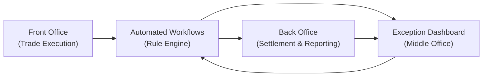
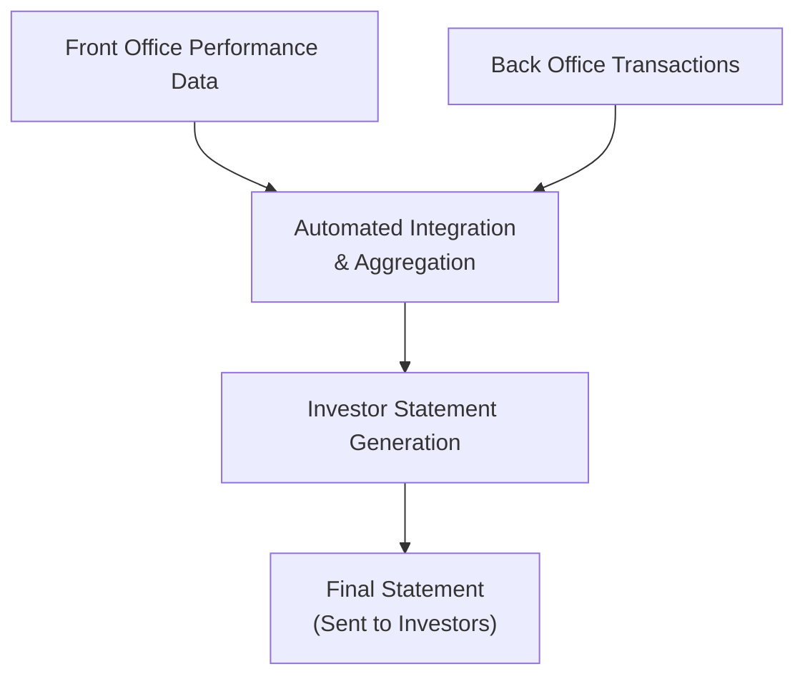

## Setting the Stage: Why Automation?

It’s strange (and sometimes a bit mind-boggling) how many investment funds have historically relied on spreadsheets, manual checklists, or even, dare I say, sticky notes for their daily operations. I remember visiting a mid-sized hedge fund years ago and seeing a roomful of analysts hunched over multiple screens—some were simultaneously checking settlement statements from custodians while reconciling trades in spreadsheets stored on a local server (scary, I know). That was their “automation.” And sure, it worked—until it didn’t. Errors piled up, compliance updates got missed, and client reporting was often late. 

But fast-forward to now, and we have a completely new landscape where automation is no longer a “nice to have” but a fundamental requirement for any serious player in alternative investments. The aim is simple: process data swiftly, reduce errors, and maintain a robust compliance posture. This is where the middle office shines—linking the front office’s ambitions with the back office’s settlement duties, ensuring a smooth flow of data and oversight.

## The Role of the Middle Office

Before we dive headfirst into the shiny new toys—like advanced software solutions and straight-through processing—let’s clarify what the middle office does. The middle office sits smack in the middle (hence the name) between the front office (portfolio managers, traders, strategists) and the back office (accountants, settlement specialists, legal, etc.). Essentially, the middle office is responsible for:

• Risk management  
• Trade support  
• Data reconciliation  
• Compliance and regulatory reporting  

Whenever a trade is executed in the front office—say, an equity swap or a commodity futures trade—the middle office ensures that the correct details flow to the back office for settlement. They also manage position limits, reconcile trade data with counterparties, and monitor compliance restrictions. In other words, the middle office is the guardian of accurate and timely data. If that data is wrong, well, everything else topples.

## Straight-Through Processing (STP) and the Race for Efficiency

Manual checks are slow, prone to human oversight, and can be expensive. Straight-through processing (STP) is an approach that eliminates or heavily reduces manual intervention from initial trade capture all the way through settlement and, eventually, to book and record. STP is made possible by data standards, fully integrated systems, and synchronized workflows. 

When a middle office embraces STP, trades flow through the pipeline with minimal friction:

• Execution details pass from the front office’s order management system directly into the middle office.  
• Real-time reconciliation engines match trades with broker or custodian confirmations.  
• Exceptions are flagged instantly, prompting immediate resolution.  
• Once verified, the transactions flow to the back office for accounting, custodial settlement, and reporting.  

### A Quick Example

Imagine a private equity fund initiating a capital call for a new portfolio company acquisition. With automation:

1. The front office logs the acquisition details in the fund accounting system.  
2. The system automatically generates capital call notices to investors.  
3. Funds received are matched automatically in the middle office, thanks to integrated bank feeds.  
4. Exceptions—like partial payments—are pushed into an exception management dashboard with real-time alerts.  
5. Final reconciled transactions update net asset value (NAV) calculations and investor statements.  

No more rummaging through emails or dealing with separate spreadsheets that track payments. Everything flows in a nearly seamless manner—reducing the time from days to hours or even minutes.

## Key Components of an Automated Middle Office

### 1. Centralized Data and Integration

All the fancy dashboards in the world won’t help if your data is siloed. Middle office automation starts with a centralized repository that captures data from trading platforms, risk systems, and compliance modules. From there, you need integration—application programming interfaces (APIs) that let your collaboration software talk to your enterprise resource planning (ERP), risk management system, or CRM (Customer Relationship Management) software. 

When everything is integrated, a single change in one system updates all dependent data fields across the organization, ensuring consistency. Trust me, nothing kills efficiency faster than discovering you have multiple sources of truth for the same trades.

### 2. Configurable Rule Engines

An automated workflow is driven by robust rules—these define how tasks progress from one step to the next. For example, you might configure a rule that says, “If the trade amount exceeds X million, route for additional compliance review,” or “If the net asset value changes by more than Y%, trigger an automatic email to the CFO for sign-off.”

This is especially vital in alternative investments, where funds often deal with complex transactions—like derivatives or special situation private equity deals—that each come with specialized checks.

### 3. Exception Management Dashboards

Automation doesn’t mean everything runs perfectly all the time—sometimes trades fail to match, or a client’s bank details are missing. This is where exception management kicks in. Instead of letting these issues get buried in an avalanche of trades, modern systems highlight them on a single dashboard. Middle office personnel can then manage these exceptions in real time, reducing the timeframe between detection and resolution.

Here’s a simplified diagram to illustrate how an automated STP environment might look:

In this diagram, the front office trades automatically trigger predefined workflows. If something goes amiss—maybe a trade is missing a broker confirm—an alert is directed to the exception dashboard. The middle office resolves the issue, then updates the workflow or re-runs the matching process. Meanwhile, correct trades flow straight through to the back office for final settlement and reporting.

### 4. Real-Time Alerts and Communication

Automation is most successful when combined with strong communication features. Real-time alerts—via emails, messaging apps, or the user interface—keep everyone in the loop. For instance, a risk manager might instantly see that an upcoming trade will breach a position limit, or a compliance officer gets a ping if a trade is flagged under internal restricted lists. 

These alerts allow quick decisions: either proceed with a trade after adjustments or block it to avoid regulatory headaches. In an age where minutes can matter to the bottom line, real-time communication is essential.

### 5. Cybersecurity and Access Controls

You know the feeling you get when you realize just how sensitive all this data is? It’s sort of like walking on a tightrope—but 100 feet off the ground. One slip, and you risk exposing client information, intellectual property, or worse. Middle office automation platforms handle massive amounts of sensitive data—trades, investor allocations, portfolio companies, compliance details—so robust cybersecurity is non-negotiable.

Best practices include:

• Multi-factor authentication (MFA) to ensure only authorized individuals can access systems.  
• End-to-end encryption, especially in data transfers between you and external partners.  
• Granular permissions to give each user only the level of access strictly required.  
• Regular penetration tests and audits, ensuring vulnerabilities are patched ASAP.  

Remember, it’s not just about digital security. Social engineering is real. Having strong protocols—like verifying wire instructions by phone for large sums—can save you from costly mistakes.

## Practical Examples and Real-World Scenarios

### Private Equity Data Reconciliation

In private equity, the middle office might ingest financial statements from portfolio companies or third-party administrators. With an automated approach, these statements are parsed using optical character recognition (OCR) or direct data feeds, then reconciled with the fund’s own internal accounting ledger. Any variance—like a mismatch in EBITDA or net working capital—throws an exception for further investigation. 

### Hedge Fund Multi-Prime Setup

Hedge funds often use multiple prime brokers, which can create complicated clearing and settlement flows. An automated system aggregates daily trade files from each prime broker, matches them to the fund’s internal order management system (OMS), and flags any anomalies. The moment a prime broker’s record doesn’t match the OMS trade blotter, the middle office sees it in an exceptions queue before the back office gets involved. This drastically reduces settlement fails and the risk of late collateral postings.

### Automated Reporting to Investors

Many alternative investment funds produce monthly or quarterly statements summarizing performance, fees, and distributions. An automation layer can pull data from both the front office (performance analytics) and the back office (account balances, subscription/redemption transactions), compile a polished PDF or user-friendly digital dashboard, and distribute it to investors—perhaps even with a personalized note. This ensures timely, consistent communications.

The key point is that each data feed flows into a centralized aggregator (R), which then produces the final statement. No frantic manual merges, no repeated copy-paste from multiple sources.

## Design Considerations for Automated Workflow Systems

Crafting a robust automated environment demands attention to detail:

• Scalability: As transaction volumes grow, the system should handle the increased load without sacrificing speed or reliability.  
• Configurability: Each alternative investment fund has idiosyncratic needs—like specialized deal structures, unusual fee calculations, or cross-border instruments. A flexible workflow engine ensures you can tweak rules without rewriting code.  
• Audit Trails: Every action—like changing a trade confirmation or adjusting a compliance parameter—should have a timestamped, immutable record. This is vital for regulatory compliance and internal audits.  
• Training and User Adoption: Even the best software fails when people aren’t trained properly. Build a culture where the team embraces new tech, and ensure the user interface is intuitive.  

## Potential Pitfalls and Overcoming Them

• Overreliance on Technology: Automation does not mean abdicating oversight. People still need to analyze exceptions and ensure the system is configured correctly.  
• Data Quality Issues: Make sure your upstream data is clean. Automating incorrect data only gets you to the wrong results faster.  
• Fragmented Solutions: Using too many separate tools or vendors can lead to integration headaches. Often, a single end-to-end solution or a well-orchestrated set of best-of-breed tools with robust APIs is preferable to patchwork.  
• Staff Resistance: Some staff might be used to manual processes or fear that automation could replace them. Communicate how automation frees them to work on higher-value tasks, like strategic analysis or relationship building.  

## Personal Anecdotes: Lessons Learned

I once helped implement an automated reconciliation system at a boutique private debt fund. Initially, the staff was extremely skeptical—everyone was protective of their spreadsheets and worried the system just wouldn’t “get” the nuances of each loan arrangement. But, ironically enough, once we got the system to handle the complexities (like variable interest rates and amortization schedules), the daily reconciliation went from a daylong chore to a 30-minute check. Glad to report, the team not only became fans but also championed further automation in other areas, such as fund-level compliance checks.

## Automation and the CFA Code of Ethics

Keep in mind that as technology helps us speed up processes, ethical and professional responsibilities remain. The CFA Institute Code and Standards require diligence, thoroughness, and accuracy—qualities that automation can bolster if used correctly. That said, a system is only as good as its inputs. If you set up flawed logic, you’ve inadvertently introduced a new risk. Always maintain a rigorous oversight process and carry out periodic audits of your automated workflows.

## Preparing for the Exam: Automation Insights

For exam success, be prepared to:

• Explain how automated workflows reduce operational risk and enhance data integrity.  
• Compare manual vs. automated processes in terms of error rates, cost, and time.  
• Discuss the role of exception management and how it aids in prompt issue resolution.  
• Tie automation back to portfolio performance and investor satisfaction by highlighting improved transparency and reporting.  
• Understand the cybersecurity footprint of automated systems—particularly relevant when dealing with sensitive investor data.  

Also, keep an eye on the synergy between STP and emerging technologies like artificial intelligence or blockchain, which might appear in strategic questions about the future of alternative investments.

## Putting It All Together

Automation is revolutionizing the middle office, bringing reliability, speed, and transparency to operations that once bogged down entire organizations with manual tasks. For alternative investment managers, adopting automated workflows is not just about shaving a bit of time off daily reconciliation routines—it’s about creating a robust, scalable platform that can handle rapid growth, increasingly complex investment strategies, and intense regulatory scrutiny.

So, if you’re like me (and many middle-office folks I know), the idea of never again cross-verifying a massive spreadsheet line-by-line is downright delightful. Adopting best-in-class automation might take persistent effort, but once you see the difference it makes—be it in risk reduction, cost savings, or investor confidence—you’ll never look back.

## References and Further Exploration

• SS&C Technologies: Whitepapers on automation trends in asset management  
• FIS Global: “Automation in Operations—Harnessing Technology to Drive Growth”  
• SimCorp Case Study: “Transforming the Middle and Back Office”  
• Broadridge: Investigative reports on post-trade automation best practices  

You may also find it useful to revisit Chapter 8 (Professional Skills and Best Practices) for a deeper look at managing change within an organization and Chapter 15 (Hedge Fund Operational Excellence) for advanced guidelines around risk controls and audits.

-------

## Exam Tips for CFA Candidates

• Be prepared to integrate automation themes into broader portfolio management questions. For instance, you might be asked how adopting STP influences operational risk or how real-time dashboards improve decision-making.  
• Highlight cost-benefit analyses if the question centers on whether or not to automate back-office tasks.  
• Provide examples (like the capital call or multi-prime scenario) to illustrate knowledge of processes.  
• Understand trade data flows thoroughly; exam prompts often explore unseen ramifications of mismanaged data.  
• Security is crucial. Always mention cybersecurity and risk mitigation strategies when discussing automation.  

## Automation of Fund Operations Quiz



### 1. Which of the following best describes Straight-Through Processing (STP) in fund operations?

- [x] Automated transaction processing from trade execution through settlement without manual intervention  
- [ ] A vendor-based reconciliation service performed after daily market close  
- [ ] A manual checking process that senior analysts perform on high-value trades  
- [ ] A frequent comparison of competitor fund activity data  

> **Explanation:** STP allows trades to be processed swiftly from execution to settlement with minimal manual input, reducing errors and operational costs.

### 2. In an automated middle office workflow, which of the following components typically flags mismatched trade details?

- [ ] The front office order management system  
- [ ] The regulatory authority’s compliance portal  
- [x] An exception management dashboard  
- [ ] A physical ledger maintained by the back office  

> **Explanation:** Exception management dashboards automatically highlight anomalies or mismatches in trade data, allowing middle office staff to quickly resolve issues.

### 3. A key advantage of centralized data repositories in automation is:

- [x] Consistent updates across integrated systems with minimal manual intervention  
- [ ] Redundancy of data storage for improved cybersecurity  
- [ ] Maintaining separate “islands” of data for flexibility  
- [ ] Prohibiting user access to real-time analytics  

> **Explanation:** When systems share a unified data repository, updates in one system flow to all integrated systems, improving accuracy and reducing manual input.

### 4. Which of the following is not typically a middle office responsibility?

- [ ] Risk management and limit checks  
- [ ] Compliance reporting  
- [ ] Trade support and reconciliation  
- [x] External auditing of financial statements  

> **Explanation:** While the middle office handles many internal auditing tasks, external audits are typically performed by third parties or specialized internal back-office teams.

### 5. What does the term “granular user permissions” refer to in an automated operational context?

- [x] Detailed control over system access at each functional level  
- [ ] Providing all employees with administrative system privileges  
- [ ] Restricting system access only to C-suite executives  
- [ ] Automated permission issuance based on market conditions  

> **Explanation:** Granular user permissions grant specific levels of system access to each user based on what they need to perform their jobs securely and effectively.

### 6. In an automated environment, if a capital call is partially funded by an investor:

- [ ] The system should ignore the shortfall and proceed with normal operations  
- [x] An alert or exception should be triggered for middle office follow-up  
- [ ] The transaction cannot be booked under any circumstance  
- [ ] The partial capital call is automatically refunded  

> **Explanation:** Automated systems flag partial payments as exceptions so the middle office can investigate and resolve the discrepancy.

### 7. When discussing automation in alternative investments, “OCR” typically refers to:

- [ ] Order Compliance Review  
- [x] Optical Character Recognition  
- [ ] Ongoing Commission Reconciliation  
- [ ] Overhead Cost Realignment  

> **Explanation:** OCR technology extracts and digitizes data from documents such as PDFs or scanned statements, facilitating easier and more accurate processing.

### 8. Which statement best illustrates the benefit of real-time alerts in an automated middle office process?

- [x] They expedite the detection and resolution of errors or compliance breaches  
- [ ] They are used primarily to inform clients of their daily P&L  
- [ ] They eliminate the need for an exception management dashboard entirely  
- [ ] They increase the likelihood of ignoring security breaches  

> **Explanation:** Real-time alerts allow immediate intervention when something goes wrong, preventing issues from festering unaddressed.

### 9. Which of the following is a major risk if incorrect or incomplete data enters the automated workflow?

- [ ] It drastically lowers the volume of trades  
- [x] Errors can propagate quickly throughout multiple systems  
- [ ] It results in zero compliance breaches, surprisingly  
- [ ] It eliminates the need for a middle office entirely  

> **Explanation:** Garbage in, garbage out. Automation accelerates processes, so if data is wrong at the onset, mistakes spread rapidly and can result in significant errors or losses.

### 10. True or False: Implementing automation in the middle office guarantees zero human oversight is needed.

- [ ] True  
- [x] False  

> **Explanation:** Automation streamlines processes but does not remove the need for human judgment, particularly for handling exceptions, overseeing configuration, and auditing.


