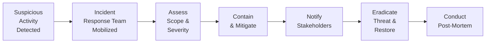
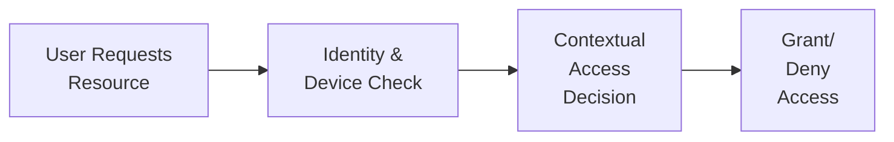

## Introduction

So, I’ll be honest: I used to think cybersecurity was all about fancy hackers in hoodies and dark rooms. I’d see news headlines about data breaches and kind of hope it never landed on my desk. But as I got deeper into the alternative investments space, I realized—and maybe you’ve noticed this too—that the stakes are so dang high. After all, you’re dealing with real people’s money, intricate deals across borders, proprietary trading algorithms, and huge reputational risk. If your system goes down or data leaks, the potential damage can be catastrophic. And guess what? Cyber threats are everywhere, constantly evolving, and targeting weaknesses in your security protocols.

In the alternative investments world (whether you’re operating a hedge fund, private equity fund, or managing real assets through REITs), the importance of robust cybersecurity cannot be overstated. Think about it—your entire operation is built on trust, especially if you handle other folks’ capital. A single malicious intrusion could compromise client data, disrupt transactions, or manipulate your trading models. This section aims to break down the basics and advanced layers of cybersecurity, illustrate common threats, and share best practices for building strong walls around your financial fortress.

## Evolving Threat Landscape

Let’s start with the big picture: the threat landscape is broader, more sophisticated, and more persistent than ever. Twenty years ago, attacks often took the form of random viruses or mass spam. Now, we see targeted phishing emails specifically crafted for CFOs or portfolio managers, “spoof” websites that look exactly like your private equity firm’s email login page, or malicious software specifically coded to rummage through your strategy files. And as alternative investments expand into digital assets—like decentralized finance (DeFi) protocols or tokenized real estate—hackers discover new vulnerabilities faster than you can say “zero-day exploit.”

### Common Attack Vectors

• Phishing and Spear-Phishing: It might be a simple email that says “Hey, update your password here,” but behind that link is a fraudulent site. If you’re raising large sums of money with institutional partners worldwide, you can bet that hackers know it.  
• Ransomware: Attackers infiltrate your network, encrypt critical files, and hold them hostage until you pay up—often in cryptocurrency. This can halt trading operations and degrade client trust like nobody’s business.  
• Trading Algorithm Attacks: If you’re developing proprietary trading algorithms or quantitative strategies, those codes become a prime target. Hackers may want to either replicate your advantage or sabotage it.  
• Supply Chain Exploits: A lot of alternative investment firms rely on third-party vendors—administrators, custodians, or specialized consultants. If a vendor’s network is compromised, it could create a pathway straight into your system.  
• DeFi Protocol Vulnerabilities: As discussed in the “Introduction to Digital Assets” chapter, DeFi platforms can have bugs in their smart contracts. Hackers exploit these code flaws to siphon off funds or manipulate token prices.

## Advanced Security Protocols

Anyway, let’s cut to the chase: how do we secure all this? It’s not just about installing antivirus software anymore—cybersecurity must be embedded in your firm’s DNA, from leadership priorities and compliance guidelines down to device-level endpoint security. Here’s a look at the advanced security protocols that leading firms adopt.

### Encryption

Encryption is about converting readable data into ciphertext so that only authorized parties with a matching key can decrypt and read it. We typically talk about two scenarios:

• In-Transit: Protects data as it moves across a network. For instance, when your staff logs into a secure website, or when internal servers communicate. Using TLS (Transport Layer Security) and VPNs are common practices.  
• At Rest: Protects stored data. This includes client lists, portfolio allocations, and critical deal documents. The data is encrypted on hard drives, cloud storage, or even USB devices so that if a disk is stolen or compromised, the data remains unreadable.

### Multifactor Authentication (MFA)

MFA ensures that a stolen password alone isn’t enough to compromise your system. You need at least two forms of identification: something you know (like a password), something you have (like a hardware token or smartphone app), or something you are (biometric data such as a fingerprint).

### Zero-Trust Architecture

This approach is kind of like being paranoid, but hey, in cybersecurity, that’s a virtue. Zero-trust architecture means you verify every user, every device, every time—no exceptions. Even if a computer is in your “trusted” local network, it must be authenticated and authorized before accessing files or applications.

### Secure Key Management

If you’re working with cryptographic assets, or simply using encryption extensively, key management is essential. Think about keys like you’d think about the combination to a vault: they need to be generated securely, stored in hardware security modules (HSMs) offsite or in specialized machines, rotated regularly, and destroyed when no longer needed.

## Incident Response Plans

Picture this: you come into the office Monday morning, turn on your computer, and you can’t open the fund’s portfolio model because every file is locked. A ransom note demands 2 BTC by next week. Well, the ultimate sign of professionalism isn’t “never being hacked” (because hackers evolve as we speak), but how quickly and effectively your organization responds.

An incident response plan should be formalized, regularly tested, and well-understood by every relevant stakeholder. Typically, it involves:

• Identification: How do you detect unusual network activity, unauthorized logins, or memory spikes in your servers?  
• Containment: Once you realize you’ve been breached, the immediate step is restricting the attacker’s lateral movement. You might segment portions of the network or shut down compromised endpoints.  
• Communication: You’ll need to mobilize an internal response team, notify leadership, possibly involve regulators, and contact law enforcement if necessary.  
• Eradication & Recovery: Remove the threat from all systems. Restore data from backups (which should be secured and tested frequently). Carefully ensure that the method of infiltration is not still hanging around.  
• Post-Mortem: Evaluate what went wrong, which security holes can be patched, and how the firm’s policies or training can be improved.

Below is a simplified visual overview:

In this flow, each step systematically ensures the problem is contained, remediated, and prevented from recurring. It’s crucial to outline responsibilities in your plan ahead of time—who calls the shots on business continuity, who updates your prime broker if you’re a hedge fund, who notifies clients, and so on.

## Regulatory and Industry Frameworks

Across the globe, regulators are stepping up cybersecurity guidance, especially in finance and asset management. If you’re in Europe, the GDPR imposes stringent data breach disclosure timelines and can levy massive fines for non-compliance. In the U.S., the SEC has published risk alerts about cybersecurity procedures at investment advisers and broker-dealers. Meanwhile, frameworks like ISO 27001 and the NIST (National Institute of Standards and Technology) Cybersecurity Framework offer structured guidance on risk management, identification of critical assets, and systems to secure them.

### NIST Cybersecurity Framework

Maybe you’ve heard your IT folks mention “CSF” or “Framework Core.” The NIST Framework is popular because it’s quite flexible and it organizes security practices into five main functions: Identify, Protect, Detect, Respond, and Recover. By mapping your firm’s controls and processes to these categories, you can see where you’re strong and where you might have glaring weaknesses.

### Industry Collaboration

You might also look into ENISA (European Union Agency for Cybersecurity) guidelines, which provide specialized resources for financial institutions. And if you want to train your team for worst-case scenarios, the SANS Institute offers well-known courses on incident response, intrusion detection, and so forth.

## Best Practices for Alternative Investment Firms

It’s one thing to understand general cybersecurity measures, but alternative investments come with unique challenges. Suppose you’re a real estate fund manager. You have property-specific data (like valuations and tenant details) that must remain confidential. Or you might be a private equity team investing in a biotech start-up with extremely sensitive intellectual property. Here are some tips:

• Segregation of Duties: Make sure your fund accountant, portfolio manager, and compliance lead all have distinct access levels. This helps reduce insider threats or accidental data leaks.  
• Regular Penetration Testing: Hire so-called “white-hat hackers” to attempt intrusions on your network, infrastructure, and cloud services. They’ll discover vulnerabilities before the bad guys do.  
• Ongoing Employee Training: We all know someone who’s clicked that weird link. Comprehensive security training helps staff spot social engineering schemes and promptly report anomalies.  
• Endpoint Security: Mobile devices, laptops, or specialized systems that handle algorithmic trading all need robust endpoint security software. This might include real-time threat detection, firewalls, and device encryption.  
• Board-Level Involvement: The board or top-level executives should treat cybersecurity as a strategic priority. Budget, resources, and accountability all flow from the top.

## Zero-Trust Mindset in Practice

Alright, let’s put a quick spotlight on zero trust, because some folks view it as an abstract concept that’s tough to implement. Actually, it’s quite straightforward once you break it down:

• Identity & Device Check: The system scrutinizes the user identity token (username/password + MFA), the device’s security posture (is it encrypted? does it have the latest patches?), and the network location.  
• Contextual Access Decision: The system consults dynamic rules (e.g., is the user connecting from a known location? Is it during normal business hours?).  
• Grant/Deny Access: Access is given only if everything aligns. Otherwise, the request is denied or flagged for additional verification.

This architecture can be extended to micro-segmentation of the network. So employees with no reason to access certain data won’t even see that data, ensuring that if one part of the network gets compromised, other critical areas remain secure.

## Case Study: Hedge Fund on the Brink

A few years ago, a small hedge fund that specialized in high-frequency trading discovered an intrusion that had happened months earlier. The attackers had installed keyloggers on crucial development servers, capturing staff credentials to access the firm’s proprietary trading algorithms. By the time the breach came to light, the algorithms had been stolen (and quite possibly used in a competing fund). The real kicker? The firm’s employees had grown complacent—they didn’t patch their servers for months, and they used a single sign-on approach without multifactor authentication. Ultimately, the fund lost significant alpha, a few major investors redeemed capital, and the firm’s brand was tarnished.

What can we learn here?  
• Patching and updating systems is essential—especially for sensitive servers.  
• Shortcuts in authentication (like relying on one password for multiple servers) can be a huge security gap.  
• Building a cult around “We’re so advanced in trading” can lead to ignoring cybersecurity fundamentals.

## Incident Response Example: Lives in the Balance

Let’s do a quick hypothetical to illustrate an incident response. Imagine a mid-market private equity firm. Suddenly, one of the associates reports that critical M&A documents are missing from their shared drive folder. The IT team discovers a hidden piece of malware that exfiltrates PDF files to an unknown domain. The firm immediately:  
1. Removed the compromised endpoint from the network.  
2. Blocked the suspicious IP addresses at the firewall level.  
3. Logged the intrusion with relevant timestamps.  
4. Began investigating logs to see if financial models or investor data were also stolen.  
5. Contacted a third-party incident response firm and alerted legal counsel.  

Sleep was lost, but they contained the threat swiftly and were able to recover from a secure backup. After a thorough post-mortem, they rolled out a new set of policies to lock down shared folders.

## Practical Security Measures

Below are just a few day-to-day steps that can protect your alternative investment firm. While they sound simple, they can mean the difference between a safe environment and a catastrophic breach:

• Email Filtering: Implement robust spam filters that detect suspicious attachments or links.  
• Principle of Least Privilege (PoLP): Give employees access only to the resources they absolutely need.  
• Continuous Monitoring: Use software tools that track unusual behavior, such as large data transfers or off-hours logins.  
• Rapid Patch Management: Deploy patches and security updates as soon as they’re verified stable.  
• Secure Backup Strategy: Store backups offline or in secure cloud vaults, not just on the same network that could be compromised.

## Forward-Looking Considerations

Threat actors evolve fast. With the rise of machine learning, hackers can automate the identification of vulnerabilities, orchestrate more convincing phishing campaigns, and quickly exploit zero-day weaknesses in DeFi protocols. This constant evolution also requires alternative investment firms to adapt. Artificial intelligence can be leveraged on the defense side, analyzing network traffic in real time to spot anomalies or automatically quarantining suspicious endpoints.

Additionally, the expansion of quantum computing, while still in early phases, could eventually undermine conventional encryption algorithms. Progressive firms might explore “post-quantum” cryptographic standards—though probably not mainstream yet, it’s wise to keep an eye on developments.

## Final Exam Tips for CFA Candidates

• Relate Cybersecurity to Portfolio Management: Expect scenario-based questions that link operational risks to investment outcomes. For example, a question might ask how an undetected ransomware attack could hamper a fund’s redemption process or distort reported returns.  
• Ethical Oversight: If a breach occurs, does the manager have a duty to disclose it to investors immediately? Refer to the CFA Institute Code of Ethics and Standards of Professional Conduct, focusing on duties to clients and transparency.  
• Risk Framework Integration: Be ready to show how cybersecurity fits into overall enterprise risk management. You might see an essay question about how to define risk tolerance for technology infrastructure.  
• Prioritize Understanding Over Memorization: The exam might present a practical situation, like “An email with an embedded link was sent to a portfolio manager. The manager’s system then displayed an unusual pop-up.” Then you might be asked for next steps in an incident response.  
• Time Management: In constructed-response questions, be crisp and direct. Outline your cybersecurity checklist or recommended steps. Examiners are looking for logical structure and relevant detail.

## References for Further Reading

• NIST Cybersecurity Framework – https://www.nist.gov/cyberframework  
• ENISA Guidelines for Financial Institutions – https://www.enisa.europa.eu  
• SANS Institute Training – https://www.sans.org  
• ISO 27001 Information Security Standard – https://www.iso.org  
• CFA Institute Ethics and Standards – https://www.cfainstitute.org/ethics

## Test Your Knowledge: Cyber Threats and Security Protocols in Alternative Investments



### Which of the following best describes zero-trust architecture?

- [ ] A system that grants automatic access to internal network users.
- [x] A security model requiring continual verification of users and devices.
- [ ] An approach that trusts blockchain technology above traditional systems.
- [ ] A method of trust only for employees with over five years of service.

> **Explanation:** Zero-trust architecture denies the assumption of trust within corporate networks. Instead, each user or device must be continually authenticated and validated.

### A hedge fund specialized in algorithmic trading discovers a hacking attempt aimed at their proprietary codes. What immediate action should they perform according to best practices?

- [ ] Pay the hackers to prevent data exfiltration.
- [ ] Warn investors of imminent returns shortfall.
- [ ] Acquire new algorithmic codes from an external vendor.
- [x] Contain and isolate compromised systems to limit further intrusion.

> **Explanation:** Once suspicious activity is identified, the first step in an incident response plan is containment. Isolating compromised endpoints prevents further lateral movement by attackers.

### Which of the following is the most effective method of ensuring data remains protected even if a storage drive is physically stolen?

- [ ] Regularly changing passwords.
- [x] Encrypting data at rest.
- [ ] Keeping the drive in a locked cabinet.
- [ ] Setting short account lockout timers.

> **Explanation:** Encrypting data at rest ensures that without the decryption keys, the data on the drive is unreadable, mitigating risks from physical theft.

### Which of the following frameworks is commonly referenced for developing an organizational cybersecurity strategy?

- [ ] GAAP
- [ ] GDPR
- [ ] IFRS
- [x] NIST Cybersecurity Framework

> **Explanation:** The NIST Cybersecurity Framework is widely used for structuring risk assessments and security controls across many industries, including alternative investments.

### If an alternative investment firm is implementing strong endpoint security, which of the following steps would it include?

- [x] Installing next-generation firewalls and real-time monitoring software.
- [ ] Eliminating all bring-your-own-device (BYOD) policies.
- [x] Enforcing encryption and patching on employee devices.
- [ ] Offering employees free personal laptops for home use.

> **Explanation:** Endpoint security encompasses ensuring that each device can protect against, detect, and contain cyber threats. Firewalls, patch management, and device encryption are key steps.

### What is a key difference between phishing and spear-phishing attacks?

- [x] Spear-phishing targets specific individuals with tailored content, while phishing is more generic.
- [ ] Phishing uses phone calls, spear-phishing uses text messages.
- [ ] Spear-phishing only occurs on public Wi-Fi networks.
- [ ] There is no difference; they are interchangeable terms.

> **Explanation:** Phishing casts a wide net, whereas spear-phishing is highly personalized to trick specific individuals in an organization.

### When designing an incident response plan, which action should occur first after detecting a potential breach?

- [x] Verify the breach and classify its severity.
- [ ] Inform the board of directors.
- [x] Isolate the compromised environment.
- [ ] Contact local law enforcement.

> **Explanation:** The initial actions generally involve confirming the incident’s authenticity, and then isolating the compromise to prevent further spread.

### What critical role does multifactor authentication (MFA) play in a security architecture?

- [x] It ensures that a stolen password alone cannot grant system access.
- [ ] It disables user privileges across the entire network instantaneously.
- [ ] It performs a complete system antivirus scan every hour.
- [ ] It anonymizes all user activity on the network.

> **Explanation:** MFA adds extra authentication layers, drastically reducing the success rate of attacks relying on compromised credentials.

### Which practice helps reduce the corporate insider threat in an alternative investment firm?

- [x] Enforcing the principle of least privilege among employees.
- [ ] Requiring employees to share passwords with supervisors.
- [ ] Allowing universal access to all deal documents for transparency.
- [ ] Disabling firewalls to increase speed of internal communication.

> **Explanation:** Restricting access rights to only what each individual needs decreases the potential damage from insider threats, whether malicious or accidental.

### True or False: Quantum computing poses potential risks to current encryption methods used by alternative investment firms.

- [x] True
- [ ] False

> **Explanation:** While still largely experimental, future quantum computing power may break certain widely used encryption algorithms, making post-quantum cryptography a growing area of research.


