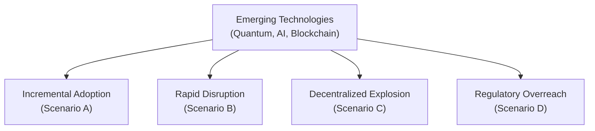

## Introduction
Sometimes when I think about the future of alternative investments, I can’t help but remember the moment I first came across the concept of blockchain. I was in a small conference room, gulping coffee at 8 p.m. while my colleague frantically explained a pilot project for tokenizing real estate assets. It sounded so futuristic at the time—a bit like tinkering with technology that belonged in a sci-fi novel. Well, that “futuristic” talk has quickly become mainstream.

But what if I told you that blockchain is just the tip of the iceberg? Over the next decade, we’re looking at huge leaps in quantum computing, advanced AI, and next-generation blockchain protocols. These technologies could fundamentally alter how we discover alpha, structure transactions, manage risk, and ensure regulatory compliance within alternative assets. In some ways, it might even redefine what “alternatives” mean. Below, we’ll explore just how disruptive these trends might become, why scenario planning can help you stay sane, and how you can continuously adapt and learn in this rapidly evolving space.

## The Ascent of Quantum Computing
Quantum computing uses qubits—essentially quantum bits—to perform calculations at speeds our classical computers can only dream of. In finance, this has direct implications on modeling complex portfolios, optimizing risk-return trade-offs, and running complex simulations like Monte Carlo methods. Traditional hardware might run these simulations in days, if not weeks; a quantum system could run them within minutes or even seconds, at least in theory.

The risk of quantum computing is also quite real. If encryption becomes trivial to break, everything from secure payments to DeFi protocols could be at risk. Some interesting solutions, known as post-quantum cryptography, are under development, but the next decade might force the global financial system to rewrite many encryption standards. If you’re investing in or building alternative assets reliant on secure digital transactions, well, quantum computing is something to watch closely.

### Potential Beneficial Applications
• Portfolio Optimization: Quantum systems might try trillions of portfolio combinations at lightning speed, potentially unlocking revolutionary ways to optimize capital allocation.  
• Algorithmic Trading: Quantum-enhanced algorithms could ingest enormous data sets (economic indicators, real-time AI signals, sentiment data) and discover non-linear correlations missed by today’s models.

### Risks and Challenges
• Security Threats: Advanced quantum machines might break existing encryption, imperiling everything from settlement systems to fund account statements.  
• High Costs: Quantum hardware remains expensive and specialized. Until that cost curve comes down, large-scale accessibility might be limited.

## AI and Machine Learning in Alternatives
You’ve probably noticed that artificial intelligence (AI) is popping up in everything from chatbots to real estate portfolio valuation models. In hedge funds (see Chapter 6 for Hedge Fund Strategies), advanced AI has begun to help managers sift through alternative data sets—like satellite images or Twitter feeds—to spot inefficiencies faster than any human. Over the next decade, we expect these systems to become even more autonomous, with natural language processing layering new insights onto data-driven decisions.

### Beyond Statistical Methods
Traditional machine learning often relies on backtesting and pattern recognition. Next-generation AI might be more proactive, leveraging reinforcement learning to adapt strategies in real time. Picture a system that automatically updates your hedge fund’s factor exposures when it detects a shift in macroeconomic data—no manual coding required.

### Potential Risks
• Model Overfitting: AI models can overfit historical data and deliver false confidence about future performance.  
• Operational Complexity: Integrating advanced AI into day-to-day asset management means higher operational risk—especially if you keep layering algorithmic solutions on top of each other.  
• Ethical Concerns: Automated systems might inadvertently perpetrate bias or unscrupulous trading behaviors if not carefully monitored.

## Next-Generation Blockchain
Blockchain, introduced primarily by cryptocurrencies, has branched out significantly in real assets, private debt, and more. Next-generation blockchain involves Layer-2 solutions, cross-chain interoperability, and drastically improved transaction speeds. We may see decentralized trading platforms, quickly settling billions in private markets, with countless microtransactions and tokenized real estate mechanisms.

### Key Innovations
• Interoperability Protocols: Next-gen blockchain solutions aim to enable seamless asset transfers across multiple blockchains, expanding liquidity sources and reducing fragmentation.  
• Programmable Assets: Think “smart assets” that automatically adjust coupon payments or prompt certain corporate governance actions if contract terms are met.

### Disruptive Scenarios
• Self-executing Contracts: Debt covenants or equity conversions might be enforced through autonomous smart contracts—no manual legal or custodian oversight necessary (barring certain regulated steps).  
• Fractional Ownership at Scale: Tokenized farmland or data centers, with near-instant secondary markets, could bring liquidity to historically illiquid sectors.

## The Emergence of Decentralized Autonomous Asset Managers
Decentralized autonomous organizations (DAOs) are already making headlines, but what happens if an entire asset manager runs on smart contracts? This means the “fund’s brain” is a piece of code that invests, rebalances, and reports performance according to a set of transparent, community-driven rules. The concept can feel a bit radical—where are the humans in the loop?

### Possible Benefits
• Lower Fees: Theoretically, there’s less overhead if everything is automated and managed by code.  
• Greater Transparency: Because performance, valuations, and holdings might be visible on a public ledger, the potential for misreporting is drastically reduced.

### Potential Drawbacks
• Lack of Human Judgment: Algorithmic decision-making can be blind to intangible factors like corporate culture.  
• Regulatory Void: While code can handle day-to-day operations, novel structures might defy existing categories of regulated entities, raising compliance headaches.

## Mainstream Adoption of CBDCs
Central bank digital currencies (CBDCs) have been piloted in various countries, with the People’s Bank of China among the high-profile examples. CBDCs could streamline monetary policy application—imagine a scenario where selective negative interest rates or direct stimulus programs are implemented on individuals’ digital wallets in real time. The implications for alternative investments are far-reaching. At a simple level, transacting in and out of alternatives could become significantly smoother, eliminating wait times and bridging multiple currencies.

But let’s be real: widespread CBDCs also raise questions of financial privacy, hacking risks (especially if quantum computing matures earlier than expected), and new forms of capital flow restrictions. If you’re planning multi-jurisdictional fund structures (as often discussed in Chapter 1.10 on Tax and Jurisdictional Structures), adopting or receiving CBDCs might require brand-new strategies and compliance measures.

## Scenario Planning for a Disruptive Future
Whenever I get excited—maybe a bit freaked out— about emerging tech, I remind myself that scenario planning is designed for precisely this. Scenario planning is a strategic tool where you craft multiple plausible futures, then map how you’d respond in each. In alternative investments, that could look like:

• Scenario A (Incremental Evolution): Quantum computing matures slowly, AI brings moderate improvements, and CBDCs remain niche.  
• Scenario B (Rapid Disruption): A breakthrough in quantum computing cracks conventional encryption, forcing a massive re-architecture of digital assets. Regulators mandate urgent transitions to quantum-safe standards.  
• Scenario C (Decentralized Explosion): DAOs become mainstream, drawing capital away from traditional structures, while CBDCs enhance cross-border flows.  
• Scenario D (Regulatory Overreach): Highly restrictive regulations hamper adoption of new technologies, leading to underground or gray-market alternatives.

Thinking through these scenarios—and offshoots thereof—helps you build agile strategies. Do you invest in quantum-safe encryption protocols now, or wait until regulators force your hand? If DAOs pick up steam, will your hedge fund incorporate some DAO-based structures to attract a new generation of investors?

## Regulatory Adaptations
Regulators face a balancing act. They’re tasked with protecting investors from fraud or meltdown, but also with fostering innovation that could genuinely benefit capital markets. Overly restrictive policies might choke off progress, while a laissez-faire approach could repeat historical missteps (think about some of the early misregulated bank products pre-2008).

Possible approaches:
• Sandboxing: Regulators might adopt “innovation sandboxes” where funds or fintech players can test new products under supervision.  
• Principles-Based Rulemaking: Instead of rigid rules, regulators might empower compliance by focusing on outcomes, leaving space for new technology to be tested responsibly.  
• International Coordination: If quantum computing or CBDCs become widely adopted, global coordination—especially at the BIS or IMF level—could unify standards.

At times, we might see different jurisdictions competing to attract decentralized funds, just like we saw with tax havens. This environment calls for constant watchfulness: cross-border compliance was never easy, and it’s about to get more complicated if regulators must account for quantum threats or AI-driven money-laundering detection.

## The Role of Agile Methodologies
Being nimble is the name of the game, especially when you’re dealing with technology that can pivot overnight. Agile methodologies—often associated with software development—focus on small iterations, frequent feedback loops, and course-corrections rather than monstrous, multi-year projects. In alternative investments, that might mean:

• Regular Strategy Sprints: Instead of setting a strategic direction once a year, some hedge funds or private equity teams might do a monthly or quarterly “strategy sprint” to incorporate fresh data, alpha signals, and regulatory updates.  
• Rapid Proof of Concept (PoC): Funding small-scale experiments with quantum-safe protocols or advanced AI. If they deliver results, scale them quickly. If not, pivot away.  
• Continuous Integration: Each tweak in AI or blockchain code can be systematically tested and integrated into the larger platform without massive system overhauls.

## Importance of Continuous Learning
Let’s face it: quantum computing, advanced AI, next-generation blockchain, and potential DAO-driven asset managers aren’t typical topics in current finance textbooks. And the half-life of knowledge in these areas is extremely short—what you learn this year could be outdated in the next. Continuous learning fosters your ability to pivot. You want to read up on new developments, attend specialized conferences, collaborate with tech-savvy start-ups, and maybe even sponsor hackathons to spot the next big disruptor. That might seem unorthodox from a traditional asset manager’s perspective, but in a world where entire investment strategies can be automated via lines of code, being the first to discover new solutions can be a major competitive advantage.

## Visualizing Disruption Paths
Below is a simple Mermaid diagram illustrating a few potential innovation trajectories and their possible branches:

In real-world scenario planning, you’d flesh out each node with further details—how your portfolio might respond, the impact on liquidity or fees, and how to comply with (or influence) evolving regulations.

## Final Exam Tips
• Stay Current on Emerging Tech: On the CFA Level III exam, scenario-based questions might include references to advanced AI or digital asset strategies. Familiarize yourself with these to address them confidently in constructed responses.  
• Master Basics of Encryption and Blockchain: Even if it’s not your main professional focus, basic cryptography knowledge might help you quickly interpret new regulations, custody requirements, or due diligence tasks.  
• Practice Scenario-Based Essay Responses: In the exam’s constructed-response sections, you could be asked how you’d adjust portfolio allocations or hedge strategies if quantum computing compromised existing risk models. Outline your thought process systematically.  
• Keep an Eye on Regulatory Updates: The Code and Standards always matter, but grasping how regulatory bodies might approach radical technologies can earn you extra points when explaining compliance strategies.

## References
• World Economic Forum’s “New Economy and Society” initiatives on emerging tech.  
• Bank for International Settlements (BIS) reports on CBDCs.  
• McKinsey & Company whitepapers on quantum computing in financial services.  
• CFA Institute’s Curriculum on Alternative Investments and Emerging Technologies (Chapters 7 and 16 in this volume).

## Test Your Knowledge: Potential Disruptions in Alternative Investments



### Which statement best describes one potential risk of quantum computing in finance?
- [ ] Longer settlement times for trades
- [ ] Reduced complexity of portfolio optimization
- [ ] Simpler cross-border transactions
- [x] Possible ability to break modern encryption protocols

> **Explanation:** Quantum computing can factor large numbers and solve complex problems much more rapidly than classical computers. One major concern in finance is that existing encryption protocols—such as RSA—could be compromised by quantum algorithms.

### Which of the following is a key advantage of decentralized autonomous asset managers?
- [x] Greater transparency due to public ledger records
- [ ] Guaranteed human oversight at all times
- [ ] Higher management fees
- [ ] Complete immunity from all regulatory oversight

> **Explanation:** Decentralized autonomous asset managers often rely on transparent smart contracts executed on a public blockchain, offering greater visibility into fund holdings and performance.

### What is scenario planning used for in a rapidly changing market environment?
- [ ] Predicting the single most likely outcome
- [x] Building flexible long-term strategies under multiple possible futures
- [ ] Avoiding risk by restricting investment ideas
- [ ] Preventing changes to current portfolio allocation

> **Explanation:** Scenario planning focuses on constructing various plausible future states and designing strategies for each, rather than attempting to predict one definitive outcome.

### In a future where CBDCs become mainstream, which statement is most accurate?
- [ ] CBDCs will eliminate foreign exchange risk completely
- [ ] CBDCs have no relevance to alternative investment fund structures
- [ ] Traditional banks will no longer exist
- [x] Regulatory compliance and new transaction protocols will likely require novel approaches to fund structuring

> **Explanation:** CBDCs could streamline digital transactions across borders, but they also come with new regulatory, technological, and operational considerations for fund managers.

### One potential risk of advanced AI in portfolio management is:
- [x] Overfitting historical data and generating poor future predictions
- [ ] Completely removing systematic risk
- [ ] Making fundamental analysis obsolete
- [ ] Eliminating the need for risk management models

> **Explanation:** Overfitting occurs when an AI system tailors itself too precisely to historical data, losing predictive power for unseen market conditions.

### Which aspect of quantum computing could drastically shorten the time required for portfolio optimization?
- [x] Quantum parallelism allowing exploration of numerous solutions simultaneously
- [ ] Reliance on classical Boolean logic
- [ ] Reduced dependence on big data analytics
- [ ] Inability to handle optimization tasks

> **Explanation:** Quantum systems can explore multiple states at once, enabling faster evaluation of complex optimization problems compared to classical computing.

### What is one potential drawback of a highly decentralized DAO-based asset manager?
- [x] Limited human judgment in certain strategic decisions
- [ ] Necessarily higher fees due to advanced technology
- [ ] Full immunity to hacking attempts
- [ ] Guaranteed regulatory approval

> **Explanation:** While DAOs can automate many processes, they can lack the nuanced, qualitative judgment that experienced human managers bring.

### In an agile project management framework, which practice aligns best with maintaining competitiveness amid rapid technological changes?
- [x] Conducting frequent “strategy sprints” to incorporate new data
- [ ] Setting fixed, multi-year commitments without re-evaluation
- [ ] Eliminating feedback loops to reduce costs
- [ ] Launching large-scale, complex implementations only once a decade

> **Explanation:** Agile frameworks stress frequent iterations, immediate feedback, and continual course-corrections based on evolving data and market conditions.

### Regulatory sandboxes aim to:
- [x] Allow innovative financial products to be tested under supervised conditions
- [ ] Completely bypass all regulations
- [ ] End the need for sector-wide compliance
- [ ] Discourage any new financial technology from launching

> **Explanation:** Sandboxing is a method regulators use to balance innovation and safety by permitting confined experiments with new financial technologies.

### True or False: Quantum-safe cryptography is an emerging area focused on creating encryption methods that could withstand attacks from powerful quantum computers.
- [x] True
- [ ] False

> **Explanation:** Quantum-safe cryptography aims to develop new encryption protocols that remain secure even if quantum computing breakthroughs make current methods obsolete.


