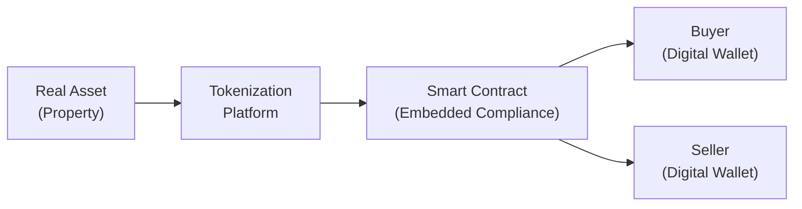

## Introduction
Well, remember a time when buying real estate felt like an intimidating commitment involving mountains of paperwork, financing juggling, and never-ending negotiations? The emergence of blockchain solutions is gradually changing that world. Today, we’re diving into how “tokenization” is transforming real assets such as property, art, and commodities into fractional digital tokens. By digitizing these physical assets and automating the processes with smart contracts, the idea is to reduce friction, broaden investor participation, and, in many cases, improve liquidity in traditionally illiquid markets.

At first glance, tokenization might sound just like a fancy word. But once you understand it, it’s sort of like turning a large pizza into many slices for multiple people—except each “slice” comes with immutable ownership records on a distributed ledger. That means you can theoretically buy or sell slices (ownership interests) of a real estate asset, an artwork, or even farmland, in a matter of minutes. Of course, there are plenty of technical and regulatory complexities, which we’ll carefully explore.

## Fundamentals of Tokenization
Tokenization is simply the process of representing an off-chain asset (like a building or a gold bar) as a digital token on a blockchain. If you’ve done any research into digital assets, you might have come across terms like ERC-20, ERC-721, or asset-backed tokens. These tokens essentially memorialize ownership, rights, and other characteristics of physical assets in a programmable format.

• Tokenization: The representation of an off-chain asset on a blockchain as a digital token.  
• Fractional Ownership: Each token can represent a smaller fraction of the total asset, allowing multiple owners to share in benefits (and possibly costs) associated with that asset.  

A key advantage is that these tokens can be bought, sold, and transferred in a liquid marketplace—ideally with fewer middlemen. In practice, tokenization opens doors for investors who otherwise might not have the substantial capital or specialized knowledge typically required for large-scale investments in real estate, art, or infrastructure projects.

## Smart Contract Automation
Smart contracts are self-executing agreements coded on a blockchain. Think of them like tiny software agents that enforce the rules of a contract automatically, without the need for manual intervention from a lawyer, broker, or escrow agent—at least in a perfect scenario. If you’ve ever used an automatic deposit or withdrawal system from your bank, you’re already familiar with the convenience that automated transactions bring. Smart contracts take this concept further by embedding various conditions (e.g., “transfer token only when funds are received”), compliance checks, or payout structures directly into the blockchain.

• Reduced Transactional Friction: By automatically verifying and settling transactions, smart contracts can reduce human error and cut intermediaries, lowering costs and time delays.  
• Embedded Compliance: Know-your-customer (KYC) and anti-money laundering (AML) checks can be integrated directly into the code, so only approved crypto wallet addresses can receive tokens or distributions.  
• Transparent Lifecycle Management: Everything from issuance to redemption can be tracked on-chain.  

### A Visual Snapshot
Below is a simple Mermaid flowchart illustrating how tokenized real estate might transfer from seller to buyer through a smart contract:



In words: (1) The real estate is brought onto a tokenization platform. (2) A smart contract is generated that includes compliance rules. (3) The smart contract handles issuance of fractionalized tokens to different digital wallets belonging to buyers. Ownership changes are recorded on the blockchain, streamlining what once might have involved weeks or months of traditional settlement processes.

## Governance and Compliance
When I first looked into tokenizing a property, I found the most challenging part wasn’t the technology—it was the compliance. Tokenization might reduce friction, but it doesn’t eliminate the need to adhere to regulatory frameworks. Here are some governance and compliance aspects to keep in mind:

• KYC/AML Policies: Investor onboarding must follow standard due diligence checks to prevent illicit financing. Smart contracts can automatically limit who can buy or sell tokens, based on whitelisted wallet addresses.  
• Security Laws and Licensing: Depending on local regulations, many tokenized real assets may be treated as securities. Issuers must comply with relevant securities laws (e.g., filing exemptions, disclosures).  
• Investor Protection: Smart contracts can embed investor protections, setting maximum ownership caps or restricting secondary transfers to qualified investors.  
• Legal Enforceability: The off-chain legal system still governs real-world disputes. If a property is sold illegally in the “real” world, the token alone might not suffice to enforce ownership rights unless legal frameworks fully recognize token-based ownership.

Regulatory bodies worldwide are actively developing frameworks to address ownership, tax considerations, and cross-border trading of tokenized assets. Some jurisdictions are more progressive in providing legal clarity, while others remain cautious, underscoring the need for continuous monitoring of evolving rules.

## Key Protocols for Digital Representation
No matter the asset, you need a consistent standard for how tokens are created and managed on the blockchain. Ethereum-based protocols have been the pioneers, though other blockchains offer similar functionalities.

• ERC-20: The go-to standard for fungible tokens. Think of these as identical units representing fractional equity in a tokenized asset. One ERC-20 token is the same as any other ERC-20 token of that same asset.  
• ERC-721 (non-fungible tokens, NFTs): Ideal for unique, indivisible items, such as a single painting or an exclusive piece of land. The distinctive nature of each token sets it apart.  
• ERC-1155: A multi-asset standard that allows both fungible and non-fungible tokens to coexist under one contract. This is handy if you need to tokenize multiple categories of items, say “units of farmland” plus “unique farmland rights” all in one place.

When deciding which token standard to use, an issuer weighs factors like whether each token must remain identical (fungible) or unique. Some real estate platforms might combine fungible tokens (for fractions of a building) with non-fungible tokens that represent unique usage rights or membership perks, bridging multiple token types to achieve a flexible investment structure.

## Practical Tools for Implementation
Let’s say you’re a fund manager or developer intrigued by the potential of tokenizing an office building. In a typical workflow:

• Legal Setup: You’ll set up a legal entity to own the physical asset.  
• Custodial Arrangements: A custodian might hold title to the property (or a special purpose vehicle) to ensure everything aligns with local laws.  
• Smart Contract Deployment: You’ll deploy the relevant smart contract on a chosen blockchain (Ethereum, Binance Smart Chain, etc.), specifying rules for ownership, transfers, distribution of income, and compliance checks.  
• Investor Onboarding: Investors pass KYC/AML checks and set up digital wallets to receive tokens.  
• Ongoing Management: The smart contract automates rental income distribution or corporate actions (like events in a real estate fund).  

Here’s a simplified snippet of how a basic smart contract function might look in Solidity (the native language for Ethereum). It’s definitely an oversimplification, but it gives you a feel for how one could code distribution logic:

```python

from web3 import Web3

w3 = Web3(Web3.HTTPProvider('http://127.0.0.1:8545'))

def distribute_monthly_rent(token_contract, total_rent):
    total_supply = token_contract.functions.totalSupply().call()
    # Basic rent distribution: rent per token times number of tokens each address holds
    rent_per_token = total_rent / total_supply 

    # Pseudo logic: for each token holder, transfer rent
    for holder in token_contract.functions.getAllTokenHolders().call():
        balance = token_contract.functions.balanceOf(holder).call()
        payout_amount = balance * rent_per_token
        # Execute transaction transferring payout_amount to holder
        # ...
    return True
```

In reality, you’d embed such logic within an ERC-20 or ERC-1155 contract or orchestrate it through a separate contract that interacts with the main token contract. Complexities arise with “distributing fiat-based rent through a blockchain,” requiring stablecoins or off-chain payment solutions integrated with oracles.

## Fractional Ownership and Liquidity
One of the coolest things about tokenization is fractional ownership. Instead of needing $10 million to buy an entire property, an investor might purchase tokens worth $5,000. This drastically lowers the minimum ticket size, democratizing access and letting more people diversify into historically exclusive asset classes.

That said, the liquidity story is nuanced. While tokens can be traded on secondary marketplaces, actual liquidity depends on market demand, regulatory constraints, and platform adoption. Without enough market participants, even the most elegantly tokenized asset can be illiquid. In some cases, restricted token holders or certain lock-up periods reduce short-term liquidity, so it’s more a matter of “potential liquidity” than guaranteed daily trading.

## Role of Custodians and Trustees
Let’s be honest: in the physical world, a property is worthless if you can’t legally enforce your ownership. Even if you hold 10,000 tokens that say you own a fraction of a building, you need an entity that legally ties this fractional ownership to recognized property rights. That’s where custodians or trustees come in. A custodian might:

• Maintain the property title on behalf of the token holders.  
• Ensure consistent compliance with local regulations.  
• Release ownership or manage liquidation in the event the asset is sold.  
• Act as a gatekeeper to settle disputes if conflicts arise among token holders.  

While blockchains provide digital transparency, the legal system still decides who can physically enter a property and who gets to manage it. Proper trust arrangements ensure the on-chain and off-chain realities align.

## Challenges and Risks
Despite the promise of improved efficiency and broadened access, tokenization has its hurdles:

• Regulatory Uncertainty: The legal classification of tokens differs by jurisdiction, leading to confusion over investor rights and potential preemption by securities laws.  
• Technological Complexity: Smart contract bugs or exploits can jeopardize investor funds.  
• Custodial Risks: If the custodian fails or is fraudulent, the real estate or asset itself might be at risk.  
• Market Volatility: Tokens can introduce new forms of volatility if the secondary market behaves more like a cryptocurrency market than a stable real asset market.  
• Investor Education: Many potential participants remain unfamiliar or uncomfortable with blockchain-based solutions, so broad adoption is still developing.

## Future Outlook
So, is tokenization the magic key to unlocking liquidity in real assets? Possibly. Growing acceptance of blockchain technology by institutional players is pushing the boundaries of what’s feasible. Central banks, large asset managers, and regulators are looking seriously into digital securities. Over time, the synergy between real assets and tokenization is expected to expand. We might see more advanced fractional ownership models—for instance, tokenization of intangible aspects like brand rights or data streams. Or even large real estate funds migrating to purely digital issuance, from capital calls to final distributions.

Still, many of us in the field believe the technology will evolve hand in hand with standardization initiatives and integrated compliance solutions. Protocols like ERC-3643 or ERC-1400 specifically address security tokens, bridging the gap between blockchain-based and traditional finance norms.

## Summary and Exam Tips
Tokenization aims to simplify ownership of real assets by splitting them into digital slices that anyone can trade—provided compliance is embedded, custodians are in place, and local laws are met. Smart contracts deliver automation and transparency, theoretically reducing overhead and friction. Yet the balancing act between on-chain automation and off-chain legal enforceability remains delicate. 

When preparing for the exam:
• Know the key token standards (ERC-20, ERC-721, and ERC-1155) and how they differ in fungibility.  
• Illustrate how KYC/AML can be integrated into smart contracts.  
• Evaluate pros and cons of fractional ownership, focusing on liquidity illusions vs. real market depth.  
• Understand how custodial structures maintain real-world legitimacy for tokenized holdings.  
• Think about potential pitfalls in regulation, compliance, and technology that exam questions often highlight.

Remember to practice scenario-based questions: for example, how you’d handle partial exits for tokenized farmland or how you’d structure distributions for a tokenized real estate fund. The exam might require you to piece together multiple perspectives—legal, technological, and financial—just as real-world practitioners do.

## References
• International Token Standardization Association (ITSA). Resources on token classification and standards.  
• Voshmgir, Shermin. “Token Economy: How the Web3 Reinvents the Internet.” BlockchainHub, updated edition.  
• BIS Working Papers on tokenization and digital assets: https://www.bis.org/  
• CFA Institute Code of Ethics and Standards of Professional Conduct.  
• Select IFRS and GAAP provisions on digital asset reporting (varies by jurisdiction).  

## Mastering Real Asset Tokenization: 10 Sample Exam Questions



### Which of the following best describes fractional ownership in the context of tokenization?

- [ ] It represents partial ownership of intangible assets but no real asset.
- [x] It allows multiple parties to own a smaller stake in a larger asset represented by tokens.
- [ ] It ensures that every token holder owns the entire asset outright.
- [ ] It primarily applies to intellectual property assets, not real estate.

> **Explanation:** Fractional ownership involves multiple investors holding smaller digital “slices” of a real asset. Tokenization uses blockchain tokens to represent these slices, enabling shared ownership.

### Tokenization of an office building using ERC-20 tokens typically implies:

- [ ] Each token is unique and non-fungible.
- [ ] Each token is backed by cryptocurrency reserves.
- [ ] Each token can only be traded among accredited investors.
- [x] Each token is interchangeable (fungible) with any other.

> **Explanation:** ERC-20 tokens are fungible, meaning one token is effectively identical to any other token of the same type. This supports fractional ownership structures where each token represents the same proportion of the underlying asset.

### A smart contract helps reduce transactional friction primarily by:

- [ ] Eliminating the need for legal contracts entirely.
- [x] Automating settlement and enforcing pre-coded rules without manual intervention.
- [ ] Blocking all transactions unless approved by a central authority.
- [ ] Guaranteeing that no compliance steps are necessary.

> **Explanation:** Smart contracts automate labor-intensive processes (e.g., trade settlement, distribution of proceeds) by executing rules encoded in the contract, reducing the scope of manual coordination.

### Which of the following is a primary role of a custodian in a tokenized real estate offering?

- [ ] To automatically execute all token-based transactions online.
- [x] To maintain and safeguard the off-chain title or physical asset backing the tokens.
- [ ] To bypass local property regulations via blockchain technology.
- [ ] To keep investor details private from all regulatory bodies.

> **Explanation:** Custodians (or trustees) ensure that a real-world link to the off-chain asset remains valid, holding title or records so that digital-token ownership reflects a legitimate, enforceable claim.

### How does KYC/AML compliance typically integrate with smart contracts in a tokenized environment?

- [x] Smart contracts can restrict token transfers to whitelisted wallet addresses meeting compliance checks.
- [ ] Smart contracts permanently freeze all transactions until regulators provide written consent.
- [x] Smart contracts can incorporate automated identity checks before allowing certain transactions.
- [ ] KYC/AML procedures are generally not relevant for tokenized assets.

> **Explanation:** KYC/AML checks can be coded into the contract logic, restricting transactions exclusively to addresses that meet regulatory requirements or whitelisted investor statuses.

### What is the key difference between ERC-721 and ERC-1155?

- [x] ERC-721 deals with unique Non-Fungible Tokens; ERC-1155 can handle both fungible and non-fungible tokens.
- [ ] ERC-721 focuses on fungible tokens; ERC-1155 is purely for stablecoins.
- [ ] ERC-1155 tokens cannot be traded on the secondary market, while ERC-721 tokens can.
- [ ] There is no real difference; they are interchangeable token standards.

> **Explanation:** ERC-721 tokens are non-fungible, each representing a unique asset. ERC-1155 is a flexible standard that combines fungible and non-fungible capabilities in a single contract.

### When might tokenized assets fail to be more “liquid” than traditional assets?

- [x] When there are few market participants or restrictions on secondary trading.
- [ ] When the tokens are physically backed by gold rather than real estate.
- [x] When there are regulatory lock-ups hindering trading or a limited investor base.
- [ ] Tokenized assets cannot be illiquid by definition.

> **Explanation:** Liquidity depends on robust market participation and legal freedoms to trade. Even tokenized assets may see low liquidity if demand or market infrastructure is limited.

### If a fraudster illegally sells a tokenized property’s underlying real estate off-chain, which might limit the protection provided by tokens?

- [x] Legal systems may not fully honor on-chain tokens if the property title is transferred off-chain improperly.
- [ ] Once tokenized, it’s impossible to perform any fraudulent off-chain sale.
- [ ] Smart contracts instantly revert any changes to real-world property registries.
- [ ] The token automatically self-destructs, protecting investors from all losses.

> **Explanation:** Tokens rely on legal recognition of their claims to the real-world asset. If official property records are manipulated, token holders may need to assert their rights in court, and blockchain records alone might not suffice.

### Which of the following best captures the essence of asset-backed tokens?

- [x] They are digital representations of an underlying physical or intangible asset that confers certain rights.
- [ ] They are stablecoins pegged to a national currency.
- [ ] They always represent purely intellectual property, not real estate or art.
- [ ] They allow the token holder to avoid any regulatory oversight.

> **Explanation:** Asset-backed tokens, by definition, tie a digital token to a real-world asset such as real estate, art, or commodities, conferring specified economic or governance rights.

### True or False: A successfully deployed smart contract for tokenized real estate guarantees global legal enforceability of ownership rights.

- [x] True
- [ ] False

> **Explanation:** This statement is actually false. Even an impeccably designed smart contract cannot unilaterally override local property laws. Legal enforceability of ownership still depends on broader regulatory and legal frameworks within the relevant jurisdiction.


