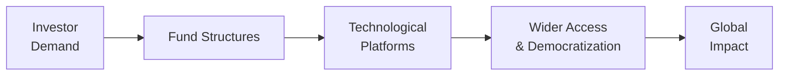

## Macroeconomic Shifts and Globalization

It’s funny how quickly the world can change, right? One moment, globalization seems inevitable—capital flowing freely across borders, multinational corporations operating everywhere, and emerging markets growing at a breakneck pace. Then suddenly, you hear talk of “deglobalization,” a push for self-sufficiency, and new trade blocs forging their own paths. This ebb and flow of globalization affects every corner of the alternative investment space, whether you’re investing in private equity funds, real estate, hedge funds, or farmland.

Now, recall that globalization is the increasing integration of economies, industries, and cultures. When globalization is on the upswing, private equity managers might find lower barriers to cross-border acquisitions—cheaper financing, a broader investor base, and access to larger pools of talent. Hedge funds could exploit opportunities in new markets, playing arbitrage trades between different regulatory regimes. Meanwhile, real estate developers may follow the hot money in fast-growing regions, and farmland investors might diversify across continents to reduce weather or commodity-price risk.

But if the pendulum swings toward deglobalization, or if new trade blocs emerge among specific countries, cross-border deals might slow. Regulatory approval may become trickier, and regional fundraising could be limited within certain alliances. Those shifts will force alternative managers to fine-tune strategies, localize partnerships, and possibly pay closer attention to political risk—something that’s not exactly new but becomes more pronounced as policies tighten or shift unpredictably.

### Global Megatrends in Action
As a quick illustration: imagine a North American private equity firm wanting to acquire a tech startup in Southeast Asia. Under a globalized regime, the route is fairly straightforward: consistent trade treaties, minimal capital controls, and robust local advisors. Under deglobalizing conditions, the firm might face new import tariffs on the target’s supply chain or unknown restrictions on foreign ownership. Consequently, managers and investors should keep scanning the horizon for these tectonic changes, ensuring that their portfolios are agile.

## Digitization and Technology

I remember a time when a friend of mine was looking to invest in a private real estate project but found the entire process too intimidating: legal docs printed out (dozens of pages), multiple phone calls with advisors, plus the dreaded wire transfer instructions. Today, many of these steps can be streamlined—sometimes with just a few clicks on a digital platform.

Technology is reshaping the alternative investments industry in more ways than just convenience, though:

• Crowdfunding Platforms  
  – These online portals allow smaller—and sometimes first-time—investors to participate in opportunities formerly reserved for large institutions. This democratization of finance (another big term in our glossary) widens the pool of potential LPs (Limited Partners) and fosters community-driven investing.  

• Tokenization of Assets  
  – By digitizing ownership and fractionalizing it, a real estate property or a private equity stake can become more liquid and transparent. Secondary markets can facilitate trades of these tokenized assets around the clock, bridging the gap between traditional illiquid alternatives and the demands of investors for easier entries and exits.

• Data Analytics and AI-Driven Insights  
  – Hedge fund managers and private equity investors now leverage advanced machine learning algorithms to predict pricing inefficiencies, perform micro-targeted credit evaluations, or model the potential success of new ventures. Tools that used to be the domain of only the largest hedge funds are now far more accessible.

This shift is so fundamental that many are calling it the digitization wave, a tidal force that’s likely to continue reshaping how fund managers source deals, conduct due diligence, and drive operational efficiencies. Of course, it’s not all sunshine: technology burn-in can lead to cybersecurity vulnerabilities; smaller managers might struggle to keep pace with the capital expenditures needed for cutting-edge data solutions; and regulations around tokenized securities remain somewhat hazy in many jurisdictions.

### A Quick Python Example
Below is a tiny snippet to illustrate how managers might use Python’s pandas for correlation analysis—something that can be crucial when selecting asset classes or looking at cross-border diversification:

```python
import pandas as pd

# df columns: ['HedgeFund1', 'PrivateEquity1', 'RealEstateIndex', 'CommodityIndex']

correlation_matrix = df.corr()
print(correlation_matrix)

```

Armed with such data, a manager might confirm that real estate has a slightly lower correlation with the broader commodity index, or that two hedge funds are almost perfectly correlated—hugely important insights when constructing multi-asset portfolios.

## ESG and Sustainability Megatrends

It’s no longer a niche phenomenon to talk about environmentally responsible investing. ESG and impact investing demands have soared, driven by unprecedented public awareness about climate change, social justice, and corporate governance. Investors—particularly millennials and Gen Z—are no longer content with returns alone; they want to see a tangible positive impact from their capital.

For alternative asset managers, this shift can take many forms:

• Private Equity  
  – Targeting growth in renewable energy startups, or decarbonizing existing portfolio companies.  
• Hedge Funds  
  – Factoring carbon footprint data into security selection or shorting “stranded asset” industries susceptible to new regulations.  
• Real Estate  
  – Aligning with green building standards like LEED (Leadership in Energy and Environmental Design) or BREEAM.  
• Natural Resources  
  – Prioritizing sustainable forestry and farmland with minimal environmental impact, or focusing on regenerative agriculture practices.

Clients are increasingly performing ESG audits when they do due diligence on prospective fund managers. And from a risk management perspective, ignoring sustainability factors can lead to severe reputational harm or actual losses if the underlying assets get hammered by climate legislation. Meanwhile, brand-building around strong ESG compliance can attract new pools of capital.

As an example, philanthropic investors might gravitate toward “impact-first” funds that specifically measure and report the social or environmental impact of their investments. In farmland, that might mean employing drip irrigation to conserve water or focusing on organic produce lines that align with health and environmental priorities. For the manager, positioning a fund as “ESG-friendly” often requires robust metrics, transparent reporting, and a commitment to ongoing improvements.

## Shifting Demographics and Investor Preferences

We’ve all heard that younger investors—millennials, Gen Z, and so on—have different tastes in just about everything. Investing is no exception. Some prefer conveniently investing through apps, minimal human contact, and near real-time data. Many also place a higher emphasis on social justice, climate responsibility, or local community development.

• New Products & Channels  
  – Micro-investing platforms, tokenized “mini-funds,” and robo-advisor solutions are springing up to cater to smaller check sizes and digitally savvy clients. Over time, such changes could reshape fee structures, as cost sensitivity grows.  

• Portfolio Structures  
  – We might see new forms of closed-end funds with partial liquidity windows, or specialized vehicles that revolve around thematic strategies like climate tech or health tech.  

• Tapping Into Values  
  – Some managers realize that embracing ESG or philanthropic returns can create an instant rapport with younger backers. Even established names are now offering “green-labeled” versions of flagship products.  

One personal anecdote comes to mind: a college friend recently asked me about farmland investing, but not from a purely speculative angle—he was curious about supporting sustainable agriculture in his home state. He used a digital crowdfunding platform to invest in partial ownership of farmland, earning both financial returns (the farmland operator sells organic grains) and the sense that he’s contributing to better stewardship of resources. That’s precisely the kind of synergy we’re talking about when we discuss investor preferences evolving alongside technology.

## Case Study: Tokenized Real Estate

For a concrete micro-example, consider a real estate project in a major urban center. Traditionally, you’d have a few large investors come together, an LLC, and a big check. Today, a sponsor could “tokenize” the property—issuing digital tokens that represent fractional ownership. This process can be set up so that each token holder receives proportionate rental income or capital gains upon exit. Because these tokens are recorded on a blockchain, sales on secondary markets can be instantaneous (in theory, at least, once regulations align). You can imagine how that might make real estate more accessible to, say, a 25-year-old with a few thousand dollars to invest.

Below is a simplified Mermaid diagram illustrating how technology-driven platforms connect investor demand to the end asset:



In practice, such an ecosystem can help smaller investors diversify geographically, while also providing sponsors with fresh capital from a more diverse crowd. One big caveat is regulatory compliance—it can be complicated to manage securities laws across multiple jurisdictions. But the potential to democratize finance in this manner is huge.

## Potential Pitfalls in the Path Ahead

All these changes—globalization, technology, evolving preferences—sound promising, but there are pitfalls:

• Regulatory Uncertainty  
  – Tokenization might clash with existing securities regulations. Many regulators aren’t moving as fast as the technology.  

• Overreliance on Data and AI  
  – Hedge funds or private equity funds that rely heavily on automated decision-making risk missing the nuanced “human element.” If the data is garbage, the outputs will be too.  

• Liquidity Mismatch  
  – Just because you can tokenize an illiquid asset doesn’t mean it’s instantly liquid. Market depth might be shallow, leading to pricing inefficiencies or major volatility.  

• ESG “Greenwashing”  
  – With everyone jumping on the ESG bandwagon, some might inflate (or fabricate) their sustainability claims. Investors need to do thorough due diligence.

• Cross-Border Complexities  
  – Shifts in geopolitical alliances, sanctions, or tariffs could hit supply chains and hamper cross-border fundraising.  

• Complexity for New Investors  
  – Democratization is wonderful, but many first-time investors lack financial literacy or risk awareness. More education is needed to avoid unscrupulous players or naive allocations.

A balanced approach is key. You want to stay on the cutting edge to capture alpha, but you don’t want to chase fads blindly or ignore sound risk management. The future belongs to those who can adapt to new realities, but remain grounded in proven principles.

## Future of Product Innovation

We’re seeing a proliferation of innovative structures:

- Multi-Asset Impact Funds, blending farmland, climate tech private equity, and even certain commodity offsets.  
- Thematic Hedge Funds that revolve around future-of-work, cybersecurity, or decarbonization strategies.  
- Hybrid “Liquid Alternatives,” which attempt to offer daily or weekly liquidity by packaging alternative strategies under a mutual fund or ETF wrapper.  

It’s possible that as millennials and Gen Z accumulate more wealth, these specialized funds will grow in popularity. Additionally, calibration of fees might shift: Instead of the traditional “2 and 20,” we may see performance-based tiers that reward long-term capital formation. Investors might want lower management fees and are willing to pay more only when managers truly outperform.

Underpinning much of this is the concept of impact investing, which intentionally seeks a measurable, positive social or environmental impact. Allocators—both institutional and retail—will likely place more emphasis on standardized metrics for impact measurement. That in turn pushes managers to adopt consistent frameworks like IRIS+ or the UN’s Sustainable Development Goals (SDGs).

## Key Considerations for Practitioners

1. Stay Flexible and Agile  
   – Economic realignments—like shifts from globalization to deglobalization—require flexible investment policies. Introduce triggers for rebalancing or sector rotation.

2. Embrace Tech, but Don’t Overdo It  
   – Big data analytics are powerful, but validate the data sources and keep a team of researchers for quality checks.

3. Manage ESG Diligently  
   – Investors are scrutinizing claims. Have third-party audits or standardized impact reports to demonstrate credibility.  

4. Engage New Demographics through Education  
   – Younger investors love accessibility, but they also want authenticity. Provide transparent performance dashboards, friendly user interfaces, and real-time communication.  

5. Hedge Against Geopolitical Risks  
   – Diversify geographically. Monitor sanctions or trade barriers that could hamper portfolio companies.  

6. Evaluate Liquid vs. Illiquid Structures  
   – Sometimes an illiquid structure is actually more protective for the manager and the investor, preventing forced sales in times of crisis. If you market partial liquidity, ensure your portfolio can handle redemption requests.

7. Maintain Robust Risk Management  
   – Factor analysis, scenario testing, and advanced stress testing are crucial. This is especially relevant in alternative investments, where normal market assumptions often don’t apply.

## A Note on Exam Relevance and Final Tips

For CFA Level III candidates, you might see essay (constructed-response) questions that ask you to propose a portfolio allocation strategy incorporating ESG factors, or item set vignettes about how new technologies (e.g., tokenization) affect liquidity risk. You may be asked to evaluate performance measurement in a cross-border private equity scenario with references to shifting trade policies.

• Familiarize yourself with the nuances of global regulation around digital assets.  
• Be ready to integrate ESG metrics into asset allocation or manager selection.  
• Practice scenario planning for different macroeconomic outcomes (e.g., trade wars, climate policy changes).  
• Stay concise and targeted in your responses—remember, Level III often tests your ability to evaluate, recommend, and justify a decision in the context of portfolio management.

A quick formula relevant to analyzing private equity fund performance over multiple cash flows is the money-weighted rate of return, also referred to as the Internal Rate of Return (IRR). It solves for \\( r \\) in the equation:


\sum_{t=0}^{N} \text{CF}_{t} \times (1 + r)^{-t} = 0


You might see a question in which you’re given multiple cash flows at different points in time and asked to compute the IRR or interpret its implications when choosing between funds.

## References and Further Reading

• World Economic Forum’s reports on Global Investment Trends:  
  http://www3.weforum.org/  

• BlackRock’s “Future of Alternatives” publications (periodically updated on their website)  

• The Economist Intelligence Unit’s reports on global megatrends affecting capital markets  

• IRIS+ (for impact measurement): https://iris.thegiin.org/  

• CFA Institute Code and Standards (especially for guidance on ethics in new technologies and ESG)  

---

## Test Your Knowledge: Future of Alternative Investments Quiz



### Which of the following best describes the term "democratization of finance"?

- [ ] The process of merging two financial institutions under strict regulations
- [x] The opening of capital markets to smaller investors through technology and regulatory innovations
- [ ] A top-down approach by governments to impose capital controls on investors
- [ ] The increase in foreign direct investment through large institutional funds only

> **Explanation:** Democratization of finance refers to expanding access to financial markets for everyday investors, often via new technology (like crowdfunding) and evolving regulatory policies.

### Which statement about globalization and deglobalization is most accurate?

- [ ] Globalization has no impact on cross-border investments
- [x] Deglobalization can limit cross-border capital flows and complicate transactions for alternative funds
- [ ] Deglobalization always lowers tariffs, making foreign acquisitions quicker
- [ ] Globalization has no effect on fundraising strategies

> **Explanation:** Deglobalization can lead to stricter capital controls, higher tariffs, and regional trade blocs that slow or complicate cross-border deal-making.

### Which factor is driving an increased focus on ESG and sustainability in alternative assets?

- [ ] Solely higher tax benefits from government programs
- [ ] Avoidance of negative press exposure
- [x] Rising investor demands for responsible and impactful investing
- [ ] Lack of other profitable opportunities

> **Explanation:** While tax benefits and reputation matter, the primary force is the substantial increase in demand from investors who want to align capital with social and environmental priorities.

### Why might a hedge fund employing advanced AI tools still need human oversight?

- [ ] AI tools are not permitted by many central banks
- [x] AI tools can produce flawed outputs if fed poor-quality or biased data
- [ ] Human oversight always produces higher returns
- [ ] Machine learning regulations ban fully automated investment decisions

> **Explanation:** AI depends on the inputs and assumptions. If the data is poor or the training is flawed, the models will produce unreliable or biased results—hence the need for human judgment.

### What is an example of how technology platforms change the structure of alternative investments?

- [x] Crowdfunding portals that allow smaller investors to co-invest in private deals
- [ ] Banking portals that only accept large institutional wire transfers
- [ ] Brokers that offer traditional margin loans
- [ ] Government websites that issue real estate licenses

> **Explanation:** Crowdfunding platforms now enable smaller investors to participate in deals once reserved for large institutional LPs, thus changing the structure and distribution channels of alternatives.

### How might ESG “greenwashing” specifically threaten an alternative investment manager’s reputation?

- [x] Overstated claims about sustainability efforts can lead to legal and ethical scrutiny
- [ ] It usually guarantees better returns, which reduces fees
- [ ] Investors typically prefer greenwashing because it sounds positive
- [ ] It removes the element of due diligence from the investment process

> **Explanation:** Misleading or overstated claims regarding ESG compliance can damage trust and expose the manager to legal, ethical, and reputational risks.

### What is a likely outcome of investor demand for partial liquidity within a traditionally illiquid structure?

- [x] Creation of hybrid vehicles that allow limited redemption windows
- [ ] Complete daily liquidity for real estate ownership
- [ ] Full reclassification of all hedge funds as mutual funds
- [ ] Permanent elimination of lock-up periods in private equity

> **Explanation:** Demand for some level of liquidity has led to hybrid structures that blend illiquid positions with scheduled or limited liquidity windows, bridging investor preferences and traditional constraints.

### Why might tokenization of real estate be considered a breakthrough in democratizing the asset class?

- [x] It allows fractional ownership and easier transferability through digital tokens
- [ ] It eliminates any need for property management
- [ ] Returns become risk-free once tokenized
- [ ] It is mandated by all major regulators worldwide

> **Explanation:** Tokenization offers smaller-scale entry and potentially more liquid secondary trading, broadening access beyond the traditional accredited or institutional investor base.

### Which statement best captures the essence of impact investing?

- [ ] Seeking purely philanthropic returns with zero financial upside
- [ ] Prioritizing leveraged buyouts over social outcomes
- [x] Pursuing measurable social or environmental benefits alongside financial returns
- [ ] Restricting investments to only local community initiatives

> **Explanation:** Impact investing aims to generate positive social/environmental impact without dismissing financial performance. It does not mandate a zero-return approach.

### True or False: Deglobalization always benefits alternative asset managers by reducing competitive pressures.

- [x] True
- [ ] False

> **Explanation:** In some cases (for instance, where foreign market entrants face higher regulatory hurdles), local managers might face less competition. However, outcomes can vary widely depending on specific market conditions, political actions, and sector dynamics.


