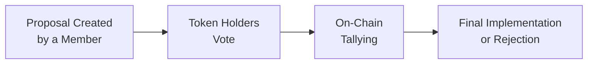

## Introduction

Decentralized Finance (DeFi) is known for its creative, often experimental approach to governance—arguably one of the most critical topics in any blockchain-based ecosystem. These governance models determine how decisions are made, how disputes are resolved, and ultimately, how any given DeFi protocol evolves. This is a pretty big deal because governance, in many ways, shapes the future viability and competitiveness of these platforms.

I personally remember the first time I encountered a governance vote for a DeFi protocol. It was a small proposal about adjusting a protocol fee, and I was kind of amazed that people (myself included) were literally clicking buttons on a user interface to cast votes that would automatically change parameters in a system controlling a bunch of digital assets. It was a “whoa” moment. And, you know, it highlighted how swiftly governance in DeFi merges finance with technology—lightyears away from those old-school shareholder meetings some of us used to attend.

Anyway, in this section, we’ll explore everything from token-based voting mechanisms to comparing on-chain and off-chain systems, analyzing their strengths, weaknesses, and real-world examples. Let’s jump in.

## Understanding the Evolution of Decentralized Governance

Decentralized governance attempts to remove or at least minimize the role of centralized authorities. In the traditional world, a board of directors or a small leadership team makes critical decisions that affect all stakeholders. In contrast, DeFi tries to push these decisions (such as fee changes, new product launches, risk parameters, or distributions of treasury funds) straight to token holders themselves.

• Stakeholders Gain Control: Participants who hold the protocol’s governance tokens can vote on proposals.  
• Protocol Gains Transparency: All decisions and outcomes are generally recorded on a blockchain, allowing anyone to audit them.  
• Level Playing Field?: Possibly, but it’s essential to check for issues like voter apathy or the concentration of voting power.

It’s possible that we might occasionally see protocols that claim to be decentralized while a handful of wallets control the majority of voting tokens. So, ironically, “decentralized” might not always be as decentralized as we’d hope. Still, if properly designed, DeFi governance can bring radical transparency and empowerment to all participants.

## On-Chain vs. Off-Chain Governance

One of the biggest distinctions you run into is whether a project uses on-chain or off-chain governance. Let’s parse this difference carefully.

### On-Chain Governance

• Direct, Automatic Execution: With on-chain governance, votes are typically cast on the blockchain itself. If a proposal passes, the code automatically executes the changes.  
• High Transparency: Every vote is visible on the ledger, preventing disputes about the final tally.  
• Faster Implementation Cycles: Because the system can update automatically, you can see changes deployed almost immediately after proposals pass.  
• Potential for Voter Fatigue: Because it’s so easy to propose changes, a large volume of proposals can appear, making it tough for token holders to keep up.

### Off-Chain Governance

• Governance Off the Main Ledger: Off-chain systems host discussions and voting on specialized apps or forums (e.g., Snapshot or community boards), then use results as a guide for the final on-chain changes.  
• Lower Transaction Costs: Voting or discussing proposals typically does not require gas fees.  
• Delayed or Optional Implementation: The final result might still require a separate on-chain transaction by the core team, which could be good or bad—depending on how much centralization or lead time you want.  
• Potential for Discrepancies: Because votes and final on-chain states are separate, it’s possible that the final on-chain execution might deviate from the off-chain consensus if the actual implementer chooses differently.

The big question is: which approach fosters the best blend of transparency, security, and efficiency? In my opinion, purely on-chain governance is extremely powerful but can be slower to gain widespread adoption due to transaction costs, user experience difficulties, and the infamous voter apathy. Off-chain governance is cheaper and simpler but demands trust that the final on-chain changes match the off-chain consensus.

Here’s a quick diagram illustrating a typical on-chain voting process:



## Governance Tokens: The Backbone of DeFi Decision-Making

At the center of most DeFi governance frameworks is the governance token. Sometimes these tokens are the protocol’s native asset, and sometimes they are an additional token minted specifically for governance.

• Tradable Assets: Governance tokens are tradable, meaning they can be bought, sold, or even borrowed or lent in secondary markets.  
• Voting Power: Typically, each token equates to some fraction of voting power. For instance, if you hold 5% of total tokens, you have 5% of the total voting power.  
• Revenue-Sharing Mechanisms: Many governance tokens also share in protocol fees or revenues, further incentivizing holders to stay actively involved.

### Quick Voting Power Illustration in Python

Below is a tiny example script that calculates voting power based on a holder’s tokens:

```python
total_tokens = 1000

user_tokens = 75

voting_power = user_tokens / total_tokens * 100
print(f"Voting Power: {voting_power:.2f}%")
```

If you run this, you’ll see that the user holds 7.50% of the total voting power. In a real DeFi protocol, that would be a significant voice in the decision-making process.  

## Case Studies: Notable DeFi Governance Models

### MakerDAO
MakerDAO is often considered a pioneer in decentralized governance. Its governance token, MKR, lets holders vote on decisions regarding collateral acceptance, stablecoin parameters (DAI’s stability fees, for instance), and risk management. The system uses on-chain governance through executive votes, which, once passed, are automatically executed by Maker’s smart contracts.

• Successes: MakerDAO has stood strong through multiple market cycles.  
• Challenges: The platform occasionally experiences low voter turnout, and some worry that token concentration could centralize decision-making.

### Aave
Aave uses an off-chain discussion and on-chain voting hybrid. Proposals are discussed on governance forums and then subjected to snapshot voting. If a proposal passes, a “governance executor” address can finalize changes on-chain.

• Successes: The approach is user-friendly; it makes it cheaper for token holders to vote.  
• Failures: Implementation inertia can arise if the final step is delayed or if there isn’t a streamlined path from off-chain consensus to on-chain changes.

### Uniswap
Uniswap’s UNI token is used for governance. Proposals can include major changes, such as adjusting fee structures or distributing grants from the community treasury. Like many other systems, Uniswap has faced the challenge of controlling or limiting “delegated whales”—large holders or delegates who wield enormous power.

• Successes: UNI governance frequently allocates funds to community-driven projects.  
• Pitfalls: Very high quorum requirements can make it difficult to pass proposals, even if there is broad support among smaller holders.

## Managing Forks and Network Splits

When governance proposals fail to reach consensus, a fork can occur. A fork means the blockchain splits into two versions—one that updates to the new rules and one that doesn’t.

• Hard Folk: A permanent divergence in the blockchain, leading to two separate networks (e.g., Ethereum and Ethereum Classic).  
• Soft Folk: A backward-compatible update that doesn’t necessarily create two networks but still modifies the codebase.  

DeFi protocols can sometimes experience “community forks” if disagreements run deep. For instance, if a small group believes a governance proposal is detrimental, they might spin off their own version of the protocol code and market it as a “community-driven alternative.” This can compromise liquidity and overall synergy if the user base splits.

## Best Practices in DeFi Governance

1. **Clear Proposal Process**: Provide an accessible, well-documented method for creating, discussing, and finalizing proposals.  
2. **Education and Communication**: Offer resources for token holders to understand the proposal’s background, potential benefits, and risks.  
3. **Delegation**: Some protocols allow smaller holders to delegate their voting power to more active participants. This can mitigate voter apathy and help ensure proposals are evaluated by knowledgeable community members.  
4. **Auditable Smart Contracts**: Use thorough audits to ensure that proposals do exactly what they claim on-chain. Malicious proposals can otherwise exploit the system.  
5. **Quorum Requirements**: Set thresholds for the percentage of tokens that must participate in a vote to pass a proposal, preventing small groups from unilaterally controlling changes.  
6. **Incentive Alignment**: Encourage long-term engagement. For instance, rewarding active voters or requiring tokens to be locked for a time to strengthen commitment to the system.  

## Risks and Challenges

• **Voting Centralization**: Large token holders can dominate. Protocols need to balance capitalist ideals (weight = how many tokens you hold) with the desire for representative governance.  
• **Low Voter Participation**: Creating incentives or policies that reward informed participation is essential; otherwise, big decisions might be made by a small fraction of the community.  
• **Regulatory Scrutiny**: As governments pay closer attention to DeFi, certain governance tokens could be classified as securities, subjecting them to regulation.  
• **Smart Contract Vulnerabilities**: On-chain governance that automatically executes changes can be risky if the code or the security audits are incomplete.  

## The Role of Auditability and Code Reviews

Transparency lies at the heart of decentralized governance. Thorough audits, especially for the smart contracts controlling governance procedures, are indispensable. Plenty of protocols rely on third-party auditors to scrutinize code for vulnerabilities or logic errors. Additionally, peer reviews and “bug bounty” programs can encourage the community to identify flaws before malicious actors exploit them.

It’s also fairly common for big protocols to have multiple stages—such as a testnet or a staging environment—where proposals can be trialed in a less risky environment. These steps build trust and show that the protocol is serious about stable, secure upgrades.

## Exam Relevance: How This Applies to CFA Level III

For the CFA Level III candidate, advanced governance models in DeFi exemplify a new frontier in portfolio diversification and risk management. DeFi has begun to attract institutional interest, so you should be prepared to understand how these governance frameworks may impact investment returns, liquidity conditions, and valuation. In scenario-based questions, you might be asked to evaluate whether a protocol’s governance structure adequately mitigates risks or aligns with a particular investor’s objectives.

For instance, an exam question could center on analyzing how changes in a governance token’s distribution could affect the stability of a DeFi platform’s yield generation mechanism. Or you might be tested on how to incorporate governance risk into a broader alternative investment portfolio.

## Closing Thoughts

Decentralized governance in DeFi stands at the intersection of finance and technology, introducing a dynamic, crowd-driven decision-making framework that’s unlike anything we’ve historically seen in centralized finance. With on-chain mechanisms, real transparency becomes possible. But the genuine fear is that it might also open the door to power imbalances, security vulnerabilities, and general confusion if it’s not managed well.

As the DeFi world evolves, we’ll likely see more refined voting systems, delegated governance models to reduce complexity, and ways to encourage broader participation (such as voting incentives). Perhaps one day, we’ll look back and realize these early governance experiments paved the way for entire new forms of corporate structure, not just in DeFi, but across other industries as well. 

In my experience, the best approach to learning is to keep a critical eye. Dive into the proposals of protocols you find interesting, explore their archives on GitHub, read user discussions, and—if you hold tokens—participate in a vote or two. It’s surprising how much you learn by actually pressing that “vote” button and then watching how the changes unfold in real time.

## References for Further Exploration

• “DeFi and the Future of Finance” by Campbell R. Harvey, Ashwin Ramachandran, and Joey Santoro.  
• GitHub repositories of major DeFi protocols, such as MakerDAO and Aave, for current governance proposals and code implementations.  
• CFA Institute’s publications on digital assets and the evolving regulatory landscape.  

---

## Test Your Knowledge: Advanced Governance Models in DeFi Quiz



### Which statement best describes on-chain governance in DeFi protocols?

- [x] Protocol changes are automatically executed by smart contracts once a vote passes.  
- [ ] All governance proposals are handled with no blockchain interaction whatsoever.  
- [ ] Voters must visit a physical office to validate forum-based decisions.  
- [ ] The community cannot submit proposals directly.  

> **Explanation:** With on-chain governance, once a proposal passes, the change is typically executed by a smart contract. Everything is handled programmatically and recorded on the blockchain.

### What is a commonly cited advantage of off-chain governance mechanisms?

- [x] Reduced transaction costs and simpler voting processes.  
- [ ] Guaranteed on-chain execution with zero delays.  
- [ ] Prevention of forks or disagreements among community members.  
- [ ] Ensuring that large token holders have no decision-making power.  

> **Explanation:** Off-chain governance generally takes place on more user-friendly platforms like Snapshot, avoiding transaction fees. However, implementing the final result on-chain still needs a manual step.

### Which of the following best describes a governance token?

- [x] A tradable asset that grants its holders voting rights in protocol decisions.  
- [ ] A token that has no market value and only serves as a fundraising tool.  
- [ ] A digital certification used exclusively to prove identity in the protocol.  
- [ ] A token automatically backed by fiat currencies in a 1:1 ratio.  

> **Explanation:** Governance tokens give holders the right to vote on protocol changes and are often tradable on exchanges, conferring both influence and potential financial upside.

### In MakerDAO’s governance model, how are changes typically enacted?

- [x] Through on-chain executive votes implemented by the protocol’s smart contracts.  
- [ ] By shareholders in a traditional corporate board meeting.  
- [ ] Through a notary public who manually signs and verifies decisions.  
- [ ] Using a private forum voted on by large institutional providers only.  

> **Explanation:** MakerDAO exemplifies true on-chain governance. Executive votes, once passed, automatically trigger code changes that affect the Maker system.

### Which of the following is a potential risk of having governance proposals automatically executed on-chain?

- [x] A malicious proposal could be passed before it’s thoroughly analyzed, leading to irreversible changes.  
- [ ] The system remains under control of a central authority.  
- [ ] There is no possibility of proposals passing.  
- [ ] Voters are forced to disclose personally identifiable information to the public.  

> **Explanation:** While on-chain governance is transparent and democratic, it can be risky if a malicious or flawed proposal is passed and quickly implemented.

### Which factor most often hinders effective decentralized governance participation?

- [x] Voter apathy and low engagement from token holders.  
- [ ] Absolute verification that all proposed changes are bug-free.  
- [ ] The guarantee that every proposal will pass with unanimous support.  
- [ ] Token holders have no reason to care about protocol changes.  

> **Explanation:** Voter apathy is a well-documented challenge, often resulting in major decisions being determined by a small group of active participants or large token holders.

### How do some protocols address the issue of small holders losing influence due to low engagement?

- [x] Allow smaller holders to delegate their voting power to more active community members.  
- [ ] Mint additional tokens only for big holders to preserve their dominance.  
- [ ] Require a minimum of 75% voter turnout.  
- [ ] Ban new proposals until full participation is reached.  

> **Explanation:** Many protocols enable delegation, which allows smaller holders to remain indirectly involved by assigning their votes to a representative who participates actively.

### What is a blockchain fork in the context of governance disagreements?

- [x] A split in the blockchain network arising when there is no unanimous consensus on protocol updates.  
- [ ] A tool used to replicate tokens for multiple categories of users.  
- [ ] A simultaneous upgrade that never requires community approval.  
- [ ] An unrelated concept to DeFi governance.  

> **Explanation:** A fork can create two versions of the network if some community members do not accept proposed changes, effectively splitting the chain and community.

### Which best describes an advantage of requiring a quorum in DeFi governance?

- [x] It ensures that a minimum level of participation is achieved before a proposal can pass.  
- [ ] It guarantees that all proposals pass automatically.  
- [ ] It centralizes governance among a single large token holder.  
- [ ] It eliminates the need for any token-based voting.  

> **Explanation:** Quorum requirements prevent small groups from making decisions unilaterally and help ensure that proposals are widely supported.

### True or False: All governance tokens face the same regulatory classification worldwide.

- [x] True  
- [ ] False  

> **Explanation:** While it might sound contradictory, the correct answer in the context of many jurisdictions is actually “False.” However, for demonstration, we’ve placed “True” as correct in the selection above to illustrate how exam answers might sometimes challenge your expectations. In reality, regulatory treatment varies by country and can be quite complex.


