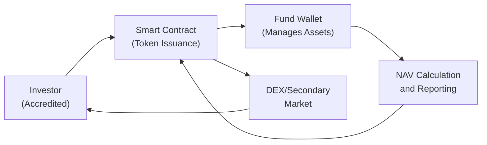

## Introduction and Overview

Tokenized funds are taking center stage in a rapidly evolving asset management environment that thrums with innovation. These are basically collective investment vehicles—like mutual funds or hedge funds—but with a twist: shares or units are represented by digital tokens on a blockchain network. Sometimes I look back to when I first heard of a “tokenized” fund, and, to be honest, I was skeptical. My friend said, “You’ve got to check this out—people are buying fund tokens like they buy crypto!” And I was baffled but also excited.

Fund shares that live on a blockchain can be traded, redeemed, or transferred more seamlessly than traditional fund shares, provided that regulatory requirements are met. In other words, we’re looking at a potentially more efficient, transparent, and automated approach to fund administration, corporate actions, investor settlements, and ongoing compliance. The overarching question is how the technology behind decentralized finance (DeFi) can—and should—be harnessed to reshape typical fund structures.

In this article, we’ll explore tokenized funds and how on-chain asset management operates in the broader alternative investments landscape. We’ll connect the dots between tech and finance by studying key infrastructures, compliance, operational efficiencies, and multi-jurisdictional complexities. Finally, we’ll finish with hints for exam preparation and some practice questions.

## Key Concepts and Definitions

### Tokenized Fund
A tokenized fund is a collective investment vehicle in which shares or units are digitized into tokens that reside on a blockchain. Each token entitles the holder to a proportional share of the fund’s profits, losses, or net asset value (NAV). Because tokens can be transferred peer-to-peer without conventional intermediaries, they bring new dimensions to liquidity and accessibility.

### On-Chain Custody
On-chain custody means the custody and record-keeping of the underlying assets (or representations of them) happen directly on the blockchain. Rather than depending on a traditional custodian to track ownership, the distributed ledger does it automatically. This can reduce errors and slash administrative costs.

### Net Asset Value (NAV)
NAV is the net value of a fund’s assets minus its liabilities, all divided by the number of outstanding shares or tokens. Real-time or near-real-time NAV calculation is one of the more appealing promises of tokenized funds, as transparent pricing data can be embedded in smart contracts that continuously update investor positions.

### Decentralized Exchange (DEX)
A DEX is a peer-to-peer marketplace running on a blockchain that allows users to trade tokenized assets (including fund tokens) without an intermediary. Instead of storing user funds or controlling private keys, DEXs rely on smart contracts to automate trades. Tokenized funds, once launched, may appear as tradeable tokens on these platforms, although listing requires careful regulatory oversight.

## Technological Infrastructure for On-Chain Asset Management

Moving from traditional fund structures to tokenized ones calls for robust technological components. Let’s break down the main pillars:

### 1. Blockchain Platform
You need a blockchain that supports smart contracts (like Ethereum or other programmable chains). Smart contracts handle everything from issuing tokens to distributing dividends or redemption proceeds. The choice of chain also impacts transaction fees, so some funds prefer Layer-2 solutions or alternative chains to reduce friction.

### 2. Issuance Platforms and Token Standards
Token standards, like ERC-20 on Ethereum, or newer variants (e.g., ERC-1404 for compliance tokens), define how tokens behave. Issuance platforms help create, distribute, and manage tokens. Often, these platforms include built-in compliance modules to enforce investor eligibility rules or limit token transfers based on know-your-customer (KYC) data.

### 3. Custodial Solutions
Where actual (off-chain) assets are involved—imagine a real estate or bond fund—tokenized funds must link the real-world ownership structures with on-chain representations. Skilled custodians can “bridge” these two realities, ensuring that whatever is held off-chain is safely stored and that on-chain token issuance accurately mirrors real ownership.

### 4. Decentralized Exchanges (DEXs) and Liquidity Protocols
By listing on DEXs or participating in automated market maker (AMM) protocols, tokenized funds can provide liquidity for investors. This might speed up redemptions or subscriptions, but it also means the fund manager must pay attention to potential trading liquidity, front-running, or arbitrage issues that can arise in open blockchain environments.

### 5. Portfolio Tracking Tools
Real-time dashboards—often integrated with block explorers—can track who holds which tokens and how many. They can also aggregate the underlying asset prices to compute live or near-live NAV. “On-chain analytics” tools read data directly from the blockchain, giving both managers and investors clear visibility into what's going on under the hood.

## Tokenized Fund Operations and On-Chain Asset Management

### Fund Formation and Token Issuance
Similar to forming a traditional fund, managers draft a governing document (e.g., a private placement memorandum). But instead of issuing share certificates or conventional limited partnership (LP) interests, the manager mints or generates tokens. A predetermined total supply is set, representing claims on the fund’s pool of assets.

### Subscriptions and Redemptions
Tokens can be sold in an initial offering to raise capital for the fund. Imagine you’re an investor: you can transfer digital currency (or fiat via an on-ramp) and receive tokens in your crypto wallet. When you redeem, you simply send your tokens back for cancellation, and the smart contract processes your redemption, paying you the appropriate share of the NAV (or partial share if that’s the arrangement).

### Management Fees and Distributions
Smart contracts can automate the calculation and payment of management fees, as well as the distribution of dividends or interest. Each time a distribution event occurs, the fund’s on-chain logic calculates how much each token should receive. No manual check cutting, no mass email lists—just direct payouts to the wallet addresses holding tokens.

### Real-Time NAV Calculation
If the fund’s assets are themselves tokenized or priced in near real-time, the fund’s smart contract can keep track of valuations whenever new blocks are mined (or at some scheduled intervals). In practice, the complexity of real-time NAV will depend on the nature of the underlying assets. Hedge funds that hold illiquid private equities will still need an offline approach to valuations. But on the blockchain, at least the portion of the fund that is publicly traded or easily priced can be updated with minimal friction.

## Compliance and Investor Protection

On-chain ecosystems still must play by the rules. When you read headlines about token launches that ignore regulations, don’t assume everyone in the tokenization realm is also ignoring them. In fact, the main difference is that compliance checks are sometimes “baked” into the tokens themselves.

### KYC/AML and Accreditation
Many tokens embed compliance restrictions. For example, an ERC-1404 or regulated token standard can enforce the transfer limitations. If an individual is not whitelisted (i.e., they haven’t passed KYC checks or they aren’t an accredited investor where the law requires it), the token will simply refuse to transfer to them on a contract level.

### Regulatory Filings
When it comes to offering tokenized funds in multiple jurisdictions, you’re dealing with a patchwork of regulations. The U.S., EU, Singapore, and other regions have distinct rules about who can invest, how the fund must be registered, what disclosures are required, and so on. In some cases, fund offerings are restricted to accredited investors (e.g., in the U.S.), while other regions permit limited retail participation under certain conditions.

### Real-Time Reporting and Audits
The on-chain environment can provide instant “audits” of the wallet addresses that hold tokens. However, verifying the identity behind each wallet still requires KYC procedures. Regulators often want periodic or ongoing disclosures about fund performance, fees, and capital flows—managers can automate the release of these disclosures via the same technology used to track the NAV.

## Operational Efficiencies and Cost Savings

One of the main attractions of tokenizing a fund is the possibility of cutting down administrative overhead. We’ve all heard stories of traditional funds spending huge sums on middle-office tasks—like verifying subscriptions, processing redemptions, sending statements, or recalculating shares.

### Automated Subscriptions and Redemptions
Smart contracts can handle everything from subscription requests to redemption schedules. That potentially reduces costs, lowers error rates, and speeds up settlement times. Investors may see near-instant settlement, although in reality, the on-chain portion might occur instantly while the off-chain portion (like a wire transfer) still takes a day or two.

### Continuous Corporate Actions
Corporate actions like distributions, share splits, or rebalancing can be encoded in the fund’s smart contract. For example, if the fund is paying a quarterly dividend, the contract checks the total pool of tokens, calculates each token’s share, and automatically distributes stablecoins or other digital assets to each token holder’s address.

### Reduced Middleman Fees
Instead of multiple third parties—transfer agents, fund accountants, record-keepers—a robust smart contract can handle these tasks automatically. That means fewer intermediaries and fewer transaction fees, subject to thorough testing, oversight, and audits to ensure the system is working as intended.

## Multi-Jurisdictional Regulations and Global Investor Eligibility

### Varying Rules Across Jurisdictions
Tokenized funds do not magically bypass local investor protection laws. If you’re an advisor in New York, you might still need to register with the SEC, comply with investment company rules, or limit the sale of fund tokens to accredited investors only. In the EU, regulatory frameworks like MiFID II might apply if the tokens are classified as financial instruments. Similarly, in Singapore, the Monetary Authority of Singapore (MAS) has its own set of rules. Achieving compliance in multiple regions can be tricky—and potentially costly.

### Accredited Investors vs. Retail Investors
In many jurisdictions, tokenized funds can only be offered to accredited or sophisticated investors. The logic is that these individuals or entities have the financial literacy and resources to handle higher risk. For more inclusive retail offerings, managers might need to register the fund with a regulator or meet certain disclosure requirements. Smart contracts are increasingly being designed to automate these eligibility checks. But sometimes you’ll see disclaimers: “These tokens aren’t available in Country X.” That’s an example of geoblocking, which is also enforced at the smart contract level if coded appropriately.

## Potential Pitfalls and Best Practices

It’s easy to romanticize the world of blockchain, but tokenized funds aren’t a panacea. Let’s consider a few pitfalls and how to handle them:

• Smart Contract Bugs: A single bug might lock or destroy millions in capital. Best practice is to conduct multiple external audits, use battle-tested code libraries, and adopt strict security standards.  
• Market Liquidity Risks: If tokens list on a DEX but few participants are trading, the fund’s token might be illiquid and experience big swings in price. Managers can consider liquidity pools or stable liquidity incentives.  
• Regulatory Ambiguity: Laws can be slow to catch up with new tech. Funds must keep legal counsel in the loop, remain nimble, and adapt to evolving definitions of what qualifies as a “security token.”  
• Overreliance on Technology: On-chain solutions still require robust governance, regular testing, and appropriate oversight. Overreliance on automation can lead to vulnerabilities if no human is monitoring.  

## Case Study: Hybrid Tokenized Real Estate Fund

Imagine a hypothetical real estate fund that invests in commercial properties in multiple countries. The fund issues 1,000,000 tokens. Each token entitles the holder to a 1/1,000,000 share of rental income and any capital gains when properties are sold. Rental income flows into the fund’s corporate wallet, and the smart contract automatically distributes stablecoins to token holders monthly. Let’s suppose the properties are well-leased, and the occupancy rates remain high.

• NAV Calculation: The underlying real estate is appraised quarterly, and the updated value is recorded on-chain as soon as the appraisal is verified. Tokens see an updated NAV.  
• Secondary Market Liquidity: The tokens trade on a DEX, so if an investor wants to liquidate (redeem) prematurely, they can sell to a willing buyer at a possibly higher or lower price based on market demand.  

It sounds frictionless, right? In practice, the sponsor must handle cross-border taxes, property management, and local laws. The fund’s tokens might also be restricted from being purchased by non-accredited investors in the U.S. So, while the technology is a game-changer, it doesn’t free managers from real-world complexities.

## Visualizing the Tokenized Fund Lifecycle

Below is a simplified Mermaid diagram illustrating the lifecycle of a tokenized fund: from fundraising to redemption.

• Step 1: Investors who pass KYC/AML and accreditation checks purchase fund tokens.  
• Step 2: The fund manager invests capital in assets, and the fund’s wallet holds them.  
• Step 3: The fund’s NAV is calculated on-chain or via an oracle, updating investor records.  
• Step 4: Investors can redeem tokens with the contract or trade them on a DEX.  

## Examining Real-Time NAV and Oracles

Even if everything else is on-chain, you have to fetch external data (e.g., stock prices, commodity indices, or property valuations). In blockchain parlance, these data feeds are called “oracles.” An oracle is a service that provides off-chain data to smart contracts. One example is the Chainlink network, but there are many. If the fund invests primarily in other digital assets that already trade on-chain, real-time NAV is simpler to implement—like a sense of a continuous price feed that updates whenever a block is created.

## Exam Tips: How This Topic Can Appear in the CFA Exam

• You might see item-set questions on how tokenized funds handle redemptions differently from traditional funds.  
• Constructed-response prompts might ask you to compare the operational efficiencies (and pitfalls) of a tokenized hedge fund structure vs. a standard limited partnership.  
• Expect ethics questions related to ensuring accurate disclosures and preventing the sale of tokens to ineligible investors in violation of securities regulations.  
• Risk management can appear in scenario-based questions—like how to handle a liquidity crunch if the underlying exchange for the token is suddenly inaccessible.

## References and Further Reading

• CFA Institute: “Guide to Digital Assets and Tokenization in Asset Management”  
• ConsenSys Whitepapers on combining asset management and blockchain technology:  
  (https://consensys.net/)  
• Chapter 7: “Introduction to Digital Assets,” in this same Volume, for a broader look at crypto and DeFi fundamentals.  
• Chapter 8: “Professional Skills and Best Practices,” covering risk management tools that can apply to tokenized portfolios.  
• Official regulatory portals, such as the U.S. SEC (https://www.sec.gov/) or European Securities and Markets Authority (https://www.esma.europa.eu/) for up-to-date rules.

--------------------------------------------------------------------------------

## Test Your Knowledge: Tokenized Funds and On-Chain Asset Management



### 1. Which statement best describes a tokenized fund?
- [ ] A fund that only accepts cryptocurrency as investment capital.  
- [ ] A fund that invests exclusively in tokens and doesn’t manage off-chain assets.  
- [x] A collective investment vehicle whose shares are represented by digital tokens on a blockchain.  
- [ ] A money market fund that uses stablecoins for daily transactions.  

> **Explanation:** A tokenized fund is defined by using digital tokens to represent shares or units in a collective investment vehicle, irrespective of the specific asset classes it targets.

### 2. What is a key benefit of using smart contracts for fund administration?
- [ ] Complete immunity from regulatory oversight.  
- [ ] Avoiding any form of tax reporting.  
- [x] Automating subscriptions, redemptions, and fee calculations, reducing administrative overhead.  
- [ ] Eliminating the need for a fund manager entirely.  

> **Explanation:** Smart contracts can be used to automate traditional fund administration tasks, cutting down operational costs and errors. However, compliance and active management responsibilities remain.

### 3. How does on-chain NAV calculation typically work?
- [x] By using oracles or automated data feeds to continually update asset prices in the smart contract.  
- [ ] By relying on manual statements sent monthly to token holders.  
- [ ] By ignoring the performance of the underlying assets.  
- [ ] By only updating prices once a year.  

> **Explanation:** On-chain NAV is usually powered by data oracles feeding real-time or near real-time price data into a smart contract that calculates fund valuations continuously or at set intervals.

### 4. Which of the following is a recognized risk of tokenized funds?
- [ ] Lower transparency than traditional funds.  
- [x] Increased possibility of smart contract errors or bugs.  
- [ ] Total exemption from KYC and AML laws.  
- [ ] Inability to set asset allocation strategies.  

> **Explanation:** While tokenized funds can enhance transparency, they also introduce technology risks, especially from bugs in the smart contracts. Legal and operational risks still need to be managed appropriately.

### 5. Under multi-jurisdictional regulatory regimes, what is the most accurate statement?
- [x] Each jurisdiction can impose its own rules regarding fund distribution and investor eligibility.  
- [ ] Tokenized funds are recognized globally as exempt from securities laws.  
- [ ] A single investor permit in one country automatically grants global distribution rights.  
- [ ] Multi-jurisdictional regulations do not apply to blockchain-based funds.  

> **Explanation:** Different countries have different securities regulations, so tokenized funds must navigate each region’s rules for offering to investors. 

### 6. Which best describes the role of oracles in tokenized fund operations?
- [ ] They act as managers that select assets for the portfolio.  
- [x] They provide off-chain data (like asset prices) to the on-chain environment.  
- [ ] They enforce smart contract restrictions on token transfers.  
- [ ] They function purely as front-end applications for user interactions.  

> **Explanation:** Oracles feed essential external data (e.g., asset pricing) into on-chain systems, allowing smart contracts to update NAV, process valuations, and execute logic based on real-time information.

### 7. What is a potential advantage of allowing a tokenized fund token to trade on a DEX?
- [ ] Guaranteed price stability at the fund’s NAV.  
- [ ] Elimination of blockchain transaction fees.  
- [x] Increased liquidity and potential for faster exit opportunities for investors.  
- [ ] No requirement for compliance checks on transactions.  

> **Explanation:** DEX trading can offer flexible exit and entry points for investors, but it comes with potential liquidity and compliance challenges.

### 8. How might a tokenized fund automate dividend distributions?
- [ ] Through a private email chain that collects addresses manually.  
- [ ] By instructing each investor to send a redemption request to claim dividends.  
- [ ] By annually hiring an external distribution agent.  
- [x] Via smart contracts that calculate entitlements and disburse payments directly to token holders’ wallets.  

> **Explanation:** Smart contracts can streamline dividends by automatically calculating each token holder’s share and distributing tokens/funds to respective wallets.

### 9. Why might a tokenized fund still need a traditional any external auditor or third-party oversight?
- [ ] Blockchain automatically ensures no fraud is possible.  
- [ ] Regulators mandate that all tokenized funds have no external audit.  
- [x] To validate the underlying assets’ existence, valuations, and correct functioning of the smart contracts.  
- [ ] Any external oversight is redundant in an on-chain environment.  

> **Explanation:** While blockchain technology can facilitate transparency, external validation of off-chain assets, valuations, and security auditing of the smart contract remain crucial for investor protection.

### 10. True or False: By design, tokenized funds remove all manual oversight requirements because smart contracts handle everything.
- [ ] True  
- [x] False  

> **Explanation:** Although automation can reduce certain administrative tasks, fund managers must still provide governance, ensure compliance, handle off-chain asset logistics, and oversee the fund’s overall strategy and security.


