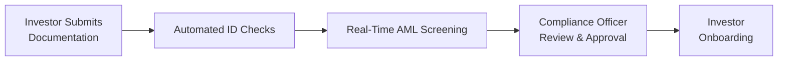
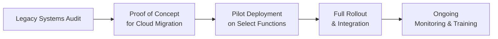

## Introduction

So, I remember chatting with a colleague who was dealing with those huge binders of fund documents—like, literally thousands of pages sprawled out on a conference table. We had an unexpected deadline, and I could almost sense the panic rising because every single page needed to be scanned, reviewed, and then validated. Talk about being stuck in the old school, right? Well, that stressful moment was actually a big wake-up call. It showed just how desperately the alternative investment world needed to go more digital.

Welcome to our discussion on digital transformation in alternative investment operations. This is a realm that’s traditionally been heavy on manual processes, physically printed documentation, and sometimes, let’s face it, plenty of inefficiencies. But not anymore. Over the last decade, we’ve seen an incredible shift toward adopting secure data rooms, AI-powered analytics, and automated compliance checks. It’s been a game-changer, and in this section, we’ll explore all the ways that technology is shaping the future of private equity, real estate, hedge funds, and the broader alternative investment space.

## Why Digital Transformation Matters in Alternatives

In earlier chapters of this volume—like when we touched on due diligence in Private Capital (Chapter 3) or risk management tools in Hedge Funds (Chapter 6)—we explored how crucial it is to keep track of multiple streams of data, control for operational risks, and satisfy a web of regulations. Performing these tasks manually can be riddled with errors and delays. So, going digital is not just about being trendy; it actually reduces compliance risks, improves accuracy, and speeds up processes so managers can focus on adding real value instead of wading through paperwork.

## Streamlining Due Diligence with Virtual Data Rooms

One of the first areas where digital transformation has had a massive impact is the due diligence process. Historically, it meant physically inspecting piles of contracts, performance reports, and legal documents—a setup that is prone to errors and lost pages. Virtual Data Rooms (VDRs) have emerged as a powerful solution.

### Easing the Burden of Document Management

A Virtual Data Room is a secure online repository. It lets fund managers, investors, and advisors upload sensitive documents and then set permission rules so that each stakeholder only sees what they really need to see. Think of it as a dynamic version of a pinned bulletin board—but it’s behind a locked, alarmed door with a high-tech fingerprint reader, ensuring data confidentiality.

By implementing VDRs:
• We reduce physical paperwork and storage costs.  
• We track who has viewed or edited documents, enhancing accountability.  
• We accelerate the time required to complete due diligence.  

If you cross-reference Chapter 3's discussions on investor protections and term sheet analysis, you’ll see how critical it is to distribute standardized documentation quickly and accurately. Virtual Data Rooms address this requirement perfectly.

### Automating KYC/AML Compliance

Today’s regulatory environment demands robust Know Your Customer (KYC) and Anti-Money Laundering (AML) checks. Gone are the days of rummaging through color-coded file folders or manually cross-checking ID documents. With integrated workflows, automated solutions can quickly verify investor identities and alert compliance officers to potential red flags.

A typical digital KYC workflow might look like this:



This automation not only saves hours of manpower but also reduces the risk of human error. Plus, many providers integrate seamlessly with Virtual Data Rooms, so all relevant compliance documents stay in one digital ecosystem. And—trust me—once you’ve dealt with a major KYC backlog, you’ll see how invaluable that synergy is.

## Enhancing Portfolio Monitoring and Real-Time Performance Updates

### Centralized Dashboards

In the realm of alternative investments, portfolio monitoring can be quite an adventure. You’re tracking illiquid assets, private equity holdings, real estate valuations, hedging strategies, and more. Before digital transformation, managers might rely on monthly or quarterly updates, often received by email in Excel files. That’s a serious time lag.

Digital dashboards have accelerated things dramatically. Now you can log in and see your entire portfolio’s performance with real-time updates. These dashboards often pull data from multiple third-party administrators, prime brokers, or property managers. The result? A single source of truth for performance metrics, correlation analyses, and other risk indicators. 

### Advanced Analytics for Risk Profiling

It doesn’t stop at fancy graphs. Many platforms nowadays incorporate AI-driven insights to detect anomalies or emerging risks. For example, an AI model might notice that a real estate portfolio's occupancy rates are trending downward in a specific region, prompting deeper investigation. Or it might spot that a hedge fund’s factor exposures have unexpectedly shifted since the last rebalancing date.

Python-based analytics libraries like pandas and scikit-learn can be coupled with data ingestion layers for real-time risk analysis. Here’s a simplified snippet of how one might parse daily performance data from a CSV, perform a quick anomaly detection, and then output flagged data points:

```python
import pandas as pd

df = pd.read_csv('hedge_fund_performance.csv')

window_size = 20
df['rolling_mean'] = df['daily_return'].rolling(window_size).mean()
df['rolling_std'] = df['daily_return'].rolling(window_size).std()

threshold = 3  # number of standard deviations
df['is_anomaly'] = abs(df['daily_return'] - df['rolling_mean']) > (threshold * df['rolling_std'])

flagged_anomalies = df[df['is_anomaly'] == True]
print(flagged_anomalies)
```

Of course, real-world systems take a far more sophisticated approach, but you get the idea: automation and advanced analytics can provide immediate warnings so that portfolio managers can act before a minor issue becomes a major headache.

## Automating Back-Office Functions

### Reducing Manual Errors in Accounting and Valuations

Back-office teams handle a lot of essential tasks—like accounting, valuations, payroll, compliance checks, and record keeping. Mistakes here can lead to misstatements, regulatory fines, and even reputational damage (and that’s no small matter in the alternative investments space).

By integrating AI tools and cloud-based applications, we’re seeing:
• Automated compilation of investment valuations across portfolios.  
• Real-time alignment between general ledger systems and front-office performance analytics.  
• Reduced double data entry across multiple spreadsheets.

In the old days, I’d see entire teams basically re-enter the same data from one PDF statement into multiple Excel files. Possibly re-enter it again (and again) for a separate system. Now, thanks to APIs and integrated data feeds, those manual processes can be replaced with real-time updates that flow through your entire operation in seconds.

### Seamless Investor Relations and Reporting

Let’s say you’re an LP in a private equity fund, and you want to know how your capital is being deployed. Would you rather:
- Wait for the quarterly letter and manually email the IR team for more details?
- Or log in to a custom investor portal where you can see real-time capital call updates, portfolio company performance, and exit timelines?

If you chose the latter—you’re on board with digital transformation. Investor communication platforms let GPs share performance metrics, handle capital calls, and even generate personalized statements on demand. That level of transparency can be a major trust-builder, especially in more opaque segments like private equity or distressed debt (see Chapter 10 for more on special situations).

## Building Trust Through Compliance Automation

### The Value of Transparent Reporting

Regulatory filings have never been a walk in the park. Across different jurisdictions, you may need to comply with SEC regulations, AIFMD in Europe, or more specialized rules for certain asset classes. This used to be done by compliance teams, manually collecting data from varied sources. The margin of error was large, and you’d better believe those compliance folks were stressed out all the time.

Digital transformation means that data can be tapped automatically from centralized sources and mapped into standardized filing formats (think eXtensible Business Reporting Language, or XBRL). So, updating regulatory documents is no longer a dreaded multi-week scramble. It’s a routine push of a button. You can cross-check how Hedge Funds (Chapter 6) handle prime brokerage and counterparty data, for instance, and see how automated systems might integrate that info directly.

### Enhancing Security and Audit Trails

Security in digital environments is paramount. So let’s address the elephant in the room: "Is cloud-based technology safe enough for multi-billion-dollar transactions?" Yes—if implemented properly. Many firms adopt multi-factor authentication, encryption, and granular access controls to ensure only the right people see the right data. 

Built-in audit trails can reveal exactly who accessed or changed a particular data point. This fosters accountability and can help in forensic investigations if something goes astray. It also ensures that independent auditors can quickly verify logs and transaction histories.

## Migrating Legacy Systems: Best Practices and Challenges

### Planning and Phasing the Migration

While digital transformation sounds great, the transition from legacy to modern, cloud-based (or even distributed ledger) environments isn’t always straightforward. You can’t just flip a switch. It often requires a phased plan, potentially starting with non-critical workloads. Here’s a rough overview:



1. Legacy Systems Audit: Begin by identifying key dependencies, data structures, and compliance constraints in your old environment.  
2. Proof of Concept (PoC): Test small workloads—like a single investor reporting module—to gauge performance and ease of integration onto new platforms.  
3. Pilot Deployment: Expand the solution to a bigger subset of your operations, ensuring minimal disruption and building confidence among staff.  
4. Full Rollout: Eventually migrate the entire system, ensuring all security protocols and failover safeguards are in place.  
5. Ongoing Monitoring & Training: Provide training for your staff so they embrace the new workflows, and keep an eye on performance or security vulnerabilities.

### Overcoming Operational Resistance

Sometimes, the toughest challenge isn’t the technology—it's the people. In some organizations, teams have used the same processes for years, if not decades. They might be hesitant to trust new platforms or fear they’ll lose their jobs to technology. This is where strong leadership, transparent communication, and training programs come into play. Make it crystal clear that technology aims to equip them with better tools, not replace them entirely.

## Integrating Distributed Ledger Technologies

Though still evolving, distributed ledger technologies (DLTs) such as blockchain hold promise for future applications in alternative investments. Conceptually, a permissioned blockchain could host real-time trade settlements and robust investor identity management (KYC), drastically reducing the chance of fraud or operational error. There are even experiments with tokenizing real assets (see Chapter 7 on Introduction to Digital Assets), effectively letting you fractionalize ownership of real estate or private equity stakes.

One cautionary note: implementing these solutions at scale can be complex, and regulatory clarity varies by region. Still, the potential cost savings and transparency benefits are huge. So, expect to see more adoption as these technologies become more mature and standardized.

## Real-World Case Studies

### Case Study 1: Private Equity Firm Upgrading Fund Administration

A mid-sized private equity manager realized that using spreadsheets and emails to coordinate capital calls and investor distributions was a liability waiting to happen. They implemented a cloud-based fund administration system with integrated AML checks and a seamless VDR. The result? The time to complete each capital call shrank from a week to a single day. Investors praised the transparency of the entire process, leading to smoother subsequent fundraising rounds.

### Case Study 2: Hedge Fund Automating Risk Management

A hedge fund with a global macro strategy integrated advanced analytics software that pulled in real-time data from multiple prime brokers, clearinghouses, and data vendors. Automated alerts let portfolio managers know if exposures exceeded risk thresholds. According to the fund, they avoided at least two serious drawdowns simply by catching them earlier. This improved not just returns, but also their reputation among prospective investors.

## Potential Pitfalls and Tips for Success

• Overreliance on Technology: Automation is great, but it can fail if the underlying data is inaccurate or if systems go offline. Always maintain contingency plans.  
• Cybersecurity Risks: Expanding digital operations can broaden the attack surface. Adopt robust cybersecurity frameworks, employ encryption, and train staff on safe online behavior.  
• Data Overload: Digital systems can produce massive amounts of data. Be sure you have the analytical capabilities (including staff expertise) to make sense of it.  
• Regulatory Compliance: Emerging tech can outpace regulations. Keep dialogues open with regulators and ensure that any new platform meets all compliance standards.

## Conclusion and Exam Tips

Digital transformation is redefining what it means to manage alternative investments efficiently and transparently. From streamlined due diligence with Virtual Data Rooms to real-time portfolio updates and automated compliance checks, the old-fashioned ways of doing things are getting a digital facelift. Embracing these technologies can not only reduce operational costs and errors but also build stronger trust with investors and regulators.

If you’re preparing for exam questions, you’ll want to understand:
• How these digital tools integrate with traditional processes (and which parts are being replaced).  
• The role of AI and advanced analytics in risk management—think factor exposures, stress testing, etc.  
• Critical success factors for technology adoption.  
• How these solutions fit within the ethical and fiduciary standards that run throughout the CFA Program—streamlining processes should not overshadow the imperative to act in the client’s best interest while safeguarding data.  

Also, be prepared for scenario-based questions where you’ll have to propose how a hedge fund or private equity firm might implement digital transformation. Make sure you can speak to potential security risks, compliance considerations, and stakeholder buy-in strategies.

## References & Further Reading

• Deloitte. “The Future of Alternative Investments: Embracing Digital Transformation.”  
• PwC. Various Reports on Digital Technologies in Private Equity and Hedge Fund Operations.  
• McKinsey & Company. Research on Automation in Financial Services.  
• For background on Virtual Data Rooms and best practices, see Chapter 3 regarding due diligence and Chapter 6 on operational due diligence in hedge funds.  
• Continue exploring the potential of distributed ledger technology in Chapter 7 (Introduction to Digital Assets).  

## Test Your Knowledge: Digital Transformation in Alternative Investments



### Which of the following best describes a Virtual Data Room (VDR) in alternative investment operations?
- [x] A secure online repository for storing and accessing due diligence documents.
- [ ] An open-access platform for retail investors to download fund NAV data.
- [ ] A public website that publishes hedge fund contracts.
- [ ] A communication platform for social media investors.

> **Explanation:** A Virtual Data Room is a secure, online environment for sharing confidential documents during due diligence. It’s often used by private equity, real estate, and hedge funds to streamline the review process.

### What is the primary benefit of automated KYC/AML checks in hedge funds?
- [x] They reduce manual effort and streamline compliance checks.
- [ ] They increase the amount of paperwork required.
- [ ] They replace the need to conduct background checks of any kind.
- [ ] They only apply to high-net-worth individuals.

> **Explanation:** Automated KYC/AML checks reduce manual errors, speed up compliance, and ensure that regulatory requirements are consistently met by verifying identities in real time.

### Which component of digital transformation is most directly responsible for unifying data from various back-office tools and systems?
- [ ] Manual data entry
- [ ] Spreadsheet macros
- [x] Application Programming Interfaces (APIs)
- [ ] Printed performance summaries

> **Explanation:** APIs facilitate seamless data exchange, allowing different software platforms to “talk” to each other and eliminate the need for multiple rounds of manual data entry.

### How can AI-driven risk analysis most effectively enhance hedge fund operations?
- [x] By identifying unusual patterns in portfolio performance before they become severe.
- [ ] By automatically replacing all human traders.
- [ ] By ensuring a guaranteed annual return.
- [ ] By removing the need for compliance reporting altogether.

> **Explanation:** AI models can spot anomalies in real-time, flagging potential risks and enabling portfolio managers to take proactive corrective measures. It doesn’t replace human oversight, but it speeds up and refines it.

### In the context of migrating legacy systems, which of the following is a crucial first step in ensuring minimal disruption?
- [x] Conducting a thorough audit of existing infrastructure and dependencies.
- [ ] Switching all operations to the cloud without testing.
- [ ] Removing all data security protocols.
- [ ] Focusing only on front-office systems and ignoring the back office.

> **Explanation:** Migrating critical tasks to new platforms requires a comprehensive understanding of current processes, data dependencies, and compliance challenges so disruptions can be minimized and managed.

### What is a key advantage of cloud-based investor portals over static quarterly PDF reports?
- [x] They provide real-time access to performance and capital call status.
- [ ] They are only accessible via smartphone apps.
- [ ] They replace the need for fund managers entirely.
- [ ] They do not require any security measures.

> **Explanation:** Cloud-based investor portals give investors on-demand access to performance metrics, capital call notices, and other real-time updates that enhance transparency and trust.

### In which way does digital automation most significantly reduce operational failures in accounting for alternative investments?
- [x] By eliminating repetitive manual entries across multiple systems.
- [ ] By allowing all parties to submit data on paper.
- [ ] By removing oversight from compliance teams.
- [ ] By replacing audit trails with manual logs.

> **Explanation:** Automation eliminates repetitive data input tasks, lowering the chance of transcription errors and freeing up staff time to focus on oversight and analysis.

### Why is cybersecurity particularly critical in digital transformation for alternative investments?
- [ ] Because digital tools never fail unless they are hacked.
- [ ] Because regulators do not require any data protection measures.
- [ ] Because limited partners rarely care about data security.
- [x] Because large sums of capital and sensitive investor data are at stake.

> **Explanation:** With huge investments and confidential data on the line, a successful cyber-attack can cause reputational, financial, and regulatory damage. Thus, robust safeguards are vital.

### Which of the following describes a primary challenge of distributed ledger (blockchain) adoption in private equity?
- [ ] Unlimited regulatory approvals facilitate easy adoption.
- [x] Evolving and sometimes unclear regulatory frameworks may inhibit large-scale implementation.
- [ ] Immediate integration with legacy systems without any converters.
- [ ] Scarcity of interest among institutional investors.

> **Explanation:** Despite the promise of blockchain, many jurisdictions have evolving or unclear regulations. This lack of clarity can slow adoption until industry standards emerge.

### True or False: Digital transformation in alternative investment operations is solely about replacing human employees with AI systems.
- [x] True 
- [ ] False

> **Explanation:** This is a trick question. Actually, the statement is false. Digital transformation focuses on complementing human expertise with technology and streamlining operations, not outright replacing human oversight.


