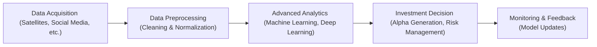

## Introduction

So, let’s say you’re a hedge fund manager scouring for that elusive edge in a fiercely competitive market. You might’ve heard the buzz about Big Data—everything from credit card purchase records to social media sentiment. Perhaps you’re intrigued by the idea that real estate occupancy can be measured by troves of satellite images. Or maybe you’re exploring farmland productivity estimates by analyzing sensor data from tractors. The truth is, Big Data has become an integral part of the investment management process—especially in alternative investments—helping managers generate alpha and mitigate risk in ways that seemed downright unimaginable just a decade ago.

In traditional finance, you typically rely on historical price data, corporate filings, and macroeconomic indicators. Meanwhile, Big Data leaps beyond these common data sources by tapping into a much larger, more diverse pool of information. Sure, it all sounds exciting, but let’s be honest: it can be messy. Data wrangling, privacy regulations, computing infrastructure, and specialized skill sets pose major barriers to entry. But carefully harnessed, Big Data can reveal signals hidden from a purely fundamental or technical approach.

Before we dive in, let’s define Big Data. At its simplest, Big Data typically refers to data sets so large or complex that conventional software tools can’t easily handle them. Maybe it’s thousands of satellite images capturing port activity around the globe, or billions of daily social media posts dissected for brand sentiment. The scale and variety push you to adopt non-traditional data processing strategies, advanced analytics techniques, and a sturdy data governance framework. This path is challenging but—if you do it right—potentially transformative.

## Data Collection and Sourcing

One of the biggest draws of Big Data is the diversity of sources available. Alternative investment managers have started collecting data from places we never thought belonged in a financial analysis deck:

• Satellite Imagery: Real estate investors analyze snapshots of parking lot traffic at malls or industrial zones to gauge occupancy levels. Farmland specialists examine crop imagery to project yields.  
• Web Traffic & Social Media: Hedge funds parse trending tags, brand mentions, and consumer reviews to anticipate earnings surprises. They might even track web traffic into retail websites to predict holiday sales.  
• Credit Card Transactions: Gathering huge amounts of anonymized purchase data helps managers assess retail performance in near real time, a significant advantage over waiting for quarterly reports.  
• Internet of Things (IoT) Sensors: Farmland sensors measure soil moisture, temperature, and nutrient levels. Infrastructure managers might use sensor data on energy consumption to refine forecasts for utility demand.  

I recall one conversation with a boutique private equity manager who used geolocation data from cell phones to see how active certain retail hubs were. He discovered that one newly opened location was drawing foot traffic far above expectations. He quickly took a position in the parent company’s stock, anticipating a rosy earnings call—and indeed, that position paid off handsomely. The point is, these alternative data sets can help you get ahead of slow-moving, conventional sources.

### Data Governance and Privacy Considerations

Of course, in this era, we can’t discuss data collection without remarking on user privacy and regulatory concerns. Global jurisdictions impose a variety of data-protection rules—think General Data Protection Regulation (GDPR) in the EU or the California Consumer Privacy Act (CCPA) in the U.S. As soon as you delve into credit card data or phone location signals, you must address how that data was obtained, anonymized, and stored. A slip-up here can lead to compliance headaches, reputational damage, or even lawsuits.

This is where data governance steps in. Data governance sets forth standardized policies around how data is handled throughout its lifecycle—acquisition, storage, processing, sharing, and disposal. A robust governance framework helps ensure data quality, integrity, and regulatory compliance. For instance, instituting strong encryption protocols for personally identifiable data, restricting access to authorized personnel only, and periodically auditing data usage can help managers protect themselves from compliance nightmares.

## Data Cleaning and Integration

If you’ve ever tried to piece together random data sets, you know it’s not just about amassing a mountain of data. The real challenge lies in transforming that raw, unstructured data into a coherent, consistent format suitable for analysis. Without thorough data cleaning and normalization, advanced analytics could yield misleading results.

Data cleaning typically involves:

• Removing duplicates or irrelevant fields.  
• Handling missing values—either by imputation or discarding problematic rows.  
• Dealing with outliers.  
• Ensuring consistent labeling (for example, “CA” vs. “California” vs. “Calif.”).  

Data normalization goes a step further, aiming to standardize values across different sources. Suppose you have farmland yield data from multiple sensor vendors; each might be using different metrics (pounds per acre vs. kilograms per hectare). You need to reconcile these variations or else you risk huge errors in any farmland productivity model.

Data integration ties multiple structured or unstructured sources into a composite data “palette.” In an alternative investments context, you might want to combine geospatial data, macroeconomic indicators, and consumer sentiment data for a broader angle on a real estate market. Achieving this single unified view is difficult, so well-defined processes are essential—even for small to mid-sized funds.

### Example: Merging Satellite Imagery with Credit Data

Let’s consider a real-world scenario. Imagine you want to forecast the occupancy rates of shopping malls:

1. You gather monthly credit card transaction data for the retailers inside the mall.  
2. You’ve also purchased weekly satellite images of the mall’s parking lot.  
3. Next, you align the two data sets by dates and location.  
4. You run correlation tests, controlling for weather and local events that might skew results.

By merging satellite imagery with credit transaction data, you might identify patterns that better predict the mall’s traffic than either data set would provide on its own. If these patterns hold consistently, you’re one step closer to generating alpha by anticipating earnings or identifying neglected assets with strong fundamentals.

## Advanced Analytics Techniques

All that cleaned, integrated data means little if we can’t glean meaningful insights from it. This is when advanced analytics—ranging from classical statistical methods to cutting-edge deep learning—becomes pivotal.

• Regression Analysis and Statistical Methods: Classical regression can spotlight relationships between variables (e.g., farmland yield and rainfall patterns). Clustering techniques can group data by similarity, which might help you spot pockets of outperformance in, say, venture capital deals.  
• Machine Learning: Techniques like random forests, gradient boosting, and support vector machines are widely used to detect patterns or predict outcomes. Hedge funds frequently rely on these models to forecast short-term price movements or to classify companies that might be undervalued relative to fundamental and alternative data inputs.  
• Deep Learning: A subset of machine learning that uses multi-layered neural networks, deep learning can handle unstructured data such as images and speech. For asset managers, it might mean scouring thousands of satellite images for changes in shipping container stacks at ports, or analyzing audio from earnings calls to detect emotional tone shifts.  

### A Simple Python Example

Below is a snippet that demonstrates how you might conduct a quick regression in Python using a hypothetical data set. Obviously, in practice, your feature space could be massive, and your data pipeline more elaborate:

```python
import pandas as pd
from sklearn.linear_model import LinearRegression

df = pd.read_csv("mall_data.csv")

df.dropna(inplace=True)

X = df[["parking_lot_traffic", "credit_card_sales"]]
y = df["quarterly_revenue"]

model = LinearRegression()
model.fit(X, y)

print("Coefficients:", model.coef_)
print("Intercept:", model.intercept_)

sample_data = [[500, 1000000]]  # Traffic of 500 cars, sales of $1,000,000
predicted_revenue = model.predict(sample_data)
print("Predicted Quarterly Revenue:", predicted_revenue)
```

This is an oversimplified demonstration, but it captures the idea of combining different data points for predictive analytics. In an actual production environment, you might have thousands of features and employ robust cross-validation, hyperparameter tuning, or even deep learning approaches.

## Challenges in Infrastructure, Talent, and Data Reliability

With Big Data, you can’t just store everything in an Excel spreadsheet and call it a day. High-quality data and advanced algorithms demand considerable computational heft. This can mean investing in distributed computing frameworks (like Hadoop or Spark) or cloud-based solutions to accommodate large volumes of data. Similarly, staff with expertise in data science, programming, and quantitative finance are in high demand—so be ready for some serious competition in talent acquisition.

### Infrastructure Costs

Building or renting data infrastructure can be expensive. A single deep learning model might require hours—or even days—of GPU time to train. For smaller funds, that can be a major budgetary limitation. Many turn to cloud providers like AWS, Google Cloud, or Azure for on-demand computing, paying only for what they use. Hybrid setups are also common, where sensitive or proprietary data is stored on-premises while cloud services handle computationally intensive tasks.

### Ensuring Data Reliability and Timeliness

Another big obstacle is getting high-quality data streams in a timely manner. Some alternative data providers only update monthly or even quarterly, which might be too slow for certain hedge fund strategies. Others might deliver daily or near real-time data but only for a narrower sample. When your investment thesis hinges on quickly spotting new trends, the reliability and frequency of data flows can make or break your strategy.

## Best Practices for Big Data Analytics in Alternatives

Drawing from the experiences of practitioners, both successful and not-so-successful, here are a few guidelines:

• Start Small and Define Clear Hypotheses: Don’t chase every shiny data set you see. Begin with specific hypotheses—like “social media sentiment influences short-term stock price movements”—and find data that addresses that question.  
• Focus on Data Governance: As privacy regulations tighten worldwide, robust governance and compliance frameworks protect you from reputational and legal repercussions.  
• Automate Data Pipelines: Manual data wrangling is error-prone and time-consuming. Automated workflows that clean, standardize, and integrate data daily (or hourly) can help maintain a consistent view of the world.  
• Validate Findings with Domain Expertise: Sometimes, data scientists discover patterns that are purely spurious. Win over subject-matter experts—like seasoned portfolio managers—to see if a discovered pattern even makes intuitive sense.  
• Monitor Model Drift: The market environment changes. Macroeconomic conditions shift, consumer preferences evolve. A machine learning model could degrade over time if you’re not recalibrating or retraining it regularly.  

## Diagram: Leveraging Big Data for Investment Insights

Below is a simple process flow to show how Big Data might be integrated into the investment decision workflow:



The cycle loops back as continuous feedback from monitoring real-world performance informs further data updates and model refinements.

## Conclusion

Big Data is reshaping the way alternative investment managers identify opportunities, evaluate risks, and execute strategies. And let’s be honest: it’s not going away. The next wave involves even more sophisticated techniques—like deep reinforcement learning or advanced natural language processing—for gleaning insights from massive, unstructured data sets.

Yet the buzz and promise don’t mean guaranteed success. It’s not uncommon to sink substantial resources into data infrastructure or highly paid “quants” only to end up overwhelmed by infrastructure pitfalls, regulatory tangles, or anomalies disguised as signals. Even so, embracing Big Data, with a healthy dose of caution and robust processes, can pave the path to alpha. In the end, it’s about harnessing the right data, building the right models, and acting on the right insights.

### Final Exam Tips  
• Expect scenario-based questions where you must evaluate the suitability of certain data sets for a given strategy.  
• Be prepared to articulate how you’d address issues like missing data or outliers and connect these to real-world investment implications.  
• Practice short answers on data governance issues (e.g., privacy, compliance) to demonstrate awareness of ethical considerations.  
• You might see constructed-response items that ask you to interpret the output of a regression or clustering analysis using hypothetical Big Data.  
• Keep in mind that exam questions may blend Big Data with ESG, factor analysis, or risk management.  

## References and Further Reading

• “Big Data and AI Strategies: Machine Learning and Alternative Data” by CFA Institute.  
• Provost, Foster, and Tom Fawcett. “Data Science for Business,” O’Reilly.  
• Kaggle (https://www.kaggle.com/) for hands-on machine learning problems and data sets.  
• “Alternative Data in Investment Management” by the CFA Institute Research Foundation.  

## Big Data Analytics Quiz: Test Your Knowledge



### Which of the following best describes Big Data in an investment context?

- [ ] A small curated data set derived from official government releases
- [x] Extremely large or complex data sets analyzed computationally to reveal hidden patterns
- [ ] Data confined to corporate filings and balance sheets only
- [ ] High-frequency trading data restricted to broker-dealers

> **Explanation:** Big Data typically involves extensive, often unstructured or semi-structured data sets. Managers analyze these using computational models to uncover correlations and predictive signals that traditional data may miss.

### What is one major advantage of using satellite imagery in real estate investing?

- [ ] It eliminates the need for on-the-ground property visits
- [x] It can provide real-time or near real-time occupancy and construction progress data
- [ ] It guarantees higher returns than comparable data sources
- [ ] It is free of privacy or regulatory concerns

> **Explanation:** Satellite imagery can offer timely insights into property activity, such as parking lot traffic or ongoing construction. However, it still requires compliance with regulatory guidelines and proper data processing.

### Which of the following is NOT a typical phase in data cleaning?

- [ ] Removing duplicates and irrelevant fields
- [ ] Handling missing values
- [ ] Standardizing formats
- [x] Multiplying all values by a constant to inflate the data set

> **Explanation:** Removing duplicates, handling missing values, or standardizing data formats are standard cleaning tasks. Arbitrary multiplication by a constant is not a conventional cleaning step.

### An investor wants to integrate social media sentiment with credit card transaction data. Which challenge is most likely to arise?

- [ ] Excessive correlation that eliminates volatility
- [x] Difficulty in matching data frequencies and aligning time periods
- [ ] Guaranteed violation of IFRS standards
- [ ] All results automatically become publicly available

> **Explanation:** Social media sentiment might operate in real time, while credit transactions could be released daily or weekly. Aligning these different frequencies is often a tricky but crucial step in data integration.

### Which statement about deep learning is TRUE?

- [x] It uses multi-layered neural networks capable of handling complex patterns.
- [ ] It is a purely statistical method limited to structured data only.
- [ ] Lack of large data sets makes it more effective than simpler models.
- [ ] It cannot analyze non-numeric data sources like images or text.

> **Explanation:** Deep learning is well-suited for unstructured data such as images, text, or audio and typically relies on abundant data to find patterns.

### When building out Big Data infrastructure, which of the following is a key consideration?

- [ ] Maintaining older Excel versions for compatibility
- [ ] Only storing the oldest data while discarding new data
- [x] Ensuring sufficient computational power and scalable storage solutions
- [ ] Disabling encryption to improve data retrieval speed

> **Explanation:** Big Data analytics often require flexible, high-performance infrastructure—cloud or on-premises—to handle large volumes of data. Data security measures like encryption are also critically important.

### Which of these best defines alpha generation in the context of Big Data analytics?

- [ ] The gain realized by indexing to a benchmark
- [ ] Achieving risk-free returns in all market conditions
- [ ] Determining the net asset value for regulatory reports
- [x] Extracting excess returns beyond a risk-adjusted benchmark by leveraging unique data insights

> **Explanation:** Alpha refers to returns above a specified benchmark. By integrating non-traditional data sources, managers can potentially identify opportunities or risks ahead of other market participants.

### An effective data governance framework will most likely include which component?

- [ ] Selling personal data to third parties without consent
- [x] Policies outlining data usage rights, anonymization, and security controls
- [ ] No monitoring of how data is collected or utilized
- [ ] A single password shared among all analysts for easy database access

> **Explanation:** A robust data governance framework sets policies for data collection, storage, usage, and security, aiming to protect privacy, maintain quality, and ensure compliance.

### A machine learning model’s performance degrades over time. What is this phenomenon commonly called?

- [ ] Hyperparameter tuning
- [ ] Risk-neutral valuation
- [x] Model drift
- [ ] Data poisoning

> **Explanation:** Model drift happens when the statistical properties of the target variable (and often its environment) evolve in ways that render previous model assumptions less accurate.

### True or False: Automated data pipelines help reduce manual errors and enhance the consistency of Big Data analysis.

- [x] True
- [ ] False

> **Explanation:** Automated pipelines minimize manual intervention and standardize the flow of raw data into cleaned, ready-to-use formats, greatly reducing errors and improving efficiency.


