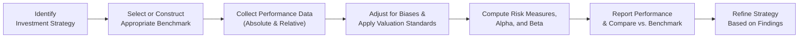

## Introduction
Performance measurement might sound straightforward—just figure out how much money you made and call it a day, right? Well, not exactly. In the realm of alternative investments, performance can be surprisingly tricky to pin down with precision. When I first started working with a small hedge fund, I remember how excited I was to see monster returns. But oh boy, once I dug into the details, I realized that interpreting performance without a solid benchmark could lead to illusions of success (or overshadow real pitfalls) in no time. In this section, we’ll explore the nuanced approaches that investors employ to gauge performance in alternative investment strategies, focusing both on “absolute” and “relative” return concepts. We’ll also wrestle with the complexities of selecting proper benchmarks, understanding the role of beta in alternatives, and dealing with biases that often plague performance data.

Our journey here targets both novices and seasoned practitioners. So if you’re someone who has a vague recollection that “performance measurement is important,” trust me—we’re going to lay it all out, from fundamental definitions to advanced real-world applications. And we’ll do it in a way that hopefully feels a bit like a friendly chat rather than an intimidating monologue.

## Distinguishing Absolute and Relative Performance
Performance measurement in finance can be broadly categorized into absolute performance and relative performance. Although these terms might seem super simple, they define two distinct frameworks for interpreting outcomes.

### Absolute Performance
Absolute performance refers to an investment’s raw return over a specific period. It takes no external metric into consideration; it merely tells you whether your investment went up 10% or down 5%. In more formal terms:

Let:
• V₀ be the initial value of the investment,  
• V₁ be the ending value of the investment, including any distributions.

Then the absolute return (Rₐbₛ) over the period can be written as:


R_{\text{abs}} = \frac{V_{1} - V_{0}}{V_{0}}


In many alternative investment contexts—like some hedge fund strategies, private equity, or direct real estate deals—the focus is often on generating positive absolute returns under various market conditions. This is sometimes referred to as a “target return” approach. But just because you made a 5% absolute return, for instance, doesn’t necessarily mean you did better or worse than the broader market or some specialized peer group. That’s where relative performance comes in.

### Relative Performance
Relative performance compares an investment’s return against a reference point, typically a benchmark or market index. So if your private equity fund clocked a 10% return in a given year, and a relevant private equity index returned 8%, then your fund has a relative outperformance (or alpha) of 2% versus that index. The same 10% would look less impressive if alternative market benchmarks showed +15% in that same period.

Relative performance is especially vital when you want to measure the value added—commonly referred to as alpha—by a portfolio manager. If you’re paying high fees for a hedge fund that’s designed to capture market inefficiencies, you’re probably curious whether that extra cost is translating into higher returns above a comparable benchmark or replicating strategy.

## Selecting the Right Benchmark
Choosing an appropriate benchmark for an alternative strategy isn’t always as simple as picking a general market index like the S&P 500. Alternative strategies, by their very nature, can have multiple sources of return (e.g., a real estate fund might earn income from rental yields, property appreciation, and even interest rate swings if there’s underlying leverage). Benchmark alignment must fit each investment’s risk profile, sector focus, liquidity terms, and time horizon.

Consider the challenge in measuring performance for a hedge fund that invests in distressed debt. A broad high-yield bond index might be too general, while a more specialized distressed debt index—if it exists—may better capture the truly relevant beta exposures. Alternatively, custom benchmarks or blend indexes can be created that weigh different asset classes or factors to match the fund’s distinctive exposures.

### Benchmark Categories
• Broad Market Indexes: These represent an entire market segment, such as Russell 3000 (equity) or Bloomberg US Aggregate (fixed income).  
• Strategy-Specific Indexes: For example, the HFRI Distressed/Restructuring Index or the Cambridge Associates Private Equity Index.  
• Custom or Factor-Based Benchmarks: If an investment has exposures across multiple risk factors (e.g., interest rates, credit spreads, equity market risk), a custom blend might be constructed to better reflect these underlying risks.

## Role of Beta in Alternative Investing
Beta (β) in traditional finance measures an asset’s sensitivity to movements in the overall market. But in alternative investing, you might have multiple betas—exposure to equity, interest rates, credit spreads, commodities, or even behavioral factors.

• A long/short equity fund? It might have partial equity beta plus some intangible factor exposures like momentum or value.  
• A commodity trading advisor (CTA)? Possibly has exposure to backwardation or contango in futures markets.  
• A real estate fund employing leverage? Could be sensitive to bond market movements.  

Measuring a single overall beta in alternatives can be tricky. Instead, factor-based models can help break down the exposures, providing a more detailed relative performance assessment. For instance, suppose a global macro fund consistently invests in emerging market debt and gold. A single equity benchmark would reveal little about its true exposures and risk. A factor-based approach would incorporate, say, an EM sovereign debt beta plus a gold or commodity factor to evaluate whether the fund is outperforming the combined, relevant baseline.

## Common Biases in Alternative Investment Benchmarks
Benchmarking alternative investments is complicated by several well-known biases:

• **Backfill Bias:** Occurs when performance data for a new fund is added retroactively to a database—often only after the manager knows how well (or poorly) the fund has done. This can skew overall historical returns upward if poorly performing periods remain unreported.  
• **Survivorship Bias:** Funds that go out of business or cease reporting typically vanish from performance databases, leaving only “survivors” that usually display stronger track records.  
• **Self-Reporting Bias:** Some private funds or hedge funds self-select when to report data, or they may report only to certain databases. Positive results tend to be reported more frequently and thoroughly than negative results, leading to artificially enhanced historical averages.  

These biases can distort how a benchmark or database portrays reality. This is especially problematic when comparing your manager’s performance to an “industry average” that might have already selectively filtered out the poor performers. Many large financial data providers attempt to adjust for these biases, but it remains an imperfect science. As a best practice, always read the fine print on how an alternative database is compiled.

## Consistent Reporting Standards
Transparent and consistent performance reporting is not just a regulatory mantra: it’s the bedrock of trust between managers and investors. Maybe you’ve heard about the Global Investment Performance Standards (GIPS) from the CFA Institute. GIPS guidelines aim to standardize how firms calculate and present performance, making it easier for investors to compare apples to apples. While GIPS compliance is prevalent among traditional asset managers, a growing number of alternative managers have also adopted these standards to demonstrate credibility.

### Documenting the Performance Measurement Policy
Establishing a clearly written policy is crucial. This document would typically outline:

• How returns are calculated (e.g., time-weighted vs. money-weighted)  
• Valuation principles (especially important if portfolios hold illiquid securities)  
• Frequency and methodology for appraisals or third-party valuations (e.g., real estate appraisals once a year)  
• Treatment of fees, carried interest, and other costs  
• Internal control checks and balancing procedures  

Not only does a robust policy make sure numbers are reliable, but it also helps maintain consistency over time—even if staff or vendors change.

## Performance Measurement Challenges in Alternatives
### Infrequent Pricing
Many alternative assets—like private equity, real estate, timberland, or farmland—aren’t priced daily. They might only be appraised quarterly (at best!). This can create price smoothing effects, artificially reducing volatility in the reported returns. The resulting performance numbers might look steadier than they actually are. Plus, if the valuations happen on different cadences, comparing two private equity funds—one that updates monthly and one that updates quarterly—can be tricky indeed.

### Leverage Considerations
Leverage can magnify returns and also magnify losses. If a real estate fund uses moderate leverage and outperforms, that outperformance could be partly due to taking more risk. Performance measurement might incorporate risk-adjusted measures such as the Sharpe ratio or a more thorough factor-based decomposition to clarify whether performance stems from manager skill or simply from leveraged beta.

### Unrelated Factors
Even if your goal is to measure a manager’s skill, real-world returns can reflect a myriad of unintentional exposures—oil prices, currency fluctuations, or regulatory changes. Filtering out these extraneous factors requires advanced analytics, often involving multi-factor regression or scenario testing.

## Putting It All Together: A Small Example
Let’s say you’re evaluating a small hedge fund that invests in distressed debt and also trades equity options. The manager claims to produce returns “in excess of 15% a year.” You note that:

1. The manager’s absolute returns are indeed around 16% annually.  
2. A broad high-yield bond index returned 10%, and an equity options benchmark returned 12%.  

But a more refined factor-based approach might reveal that the manager is systematically selling put options (which does great in stable markets but suffers if volatility spikes) and invests mostly in segments of distressed debt that mimic a high-beta exposure to the equity market. Once all the betas get accounted for, you might find that the “true alpha” is only about 2%. The manager is still producing positive alpha, but the story is less sparkling than the raw 16% might suggest. Understanding these nuances is core to robust performance measurement.

## A Mermaid Diagram of the Performance Measurement Flow
Below is a simple diagram illustrating how performance measurement often fits within an alternative investment management process:



## Python Snippet: Demonstrating a Simple Return vs. Benchmark Calculation
Here is a quick, super-basic illustration of how one might programmatically compare a fund’s monthly returns against a benchmark using Python. This snippet might be overkill for many managers who rely on commercial software, but it’s nice to see how these comparisons can happen under the hood:

```python
import pandas as pd

# Fund CSV columns: Date, FundReturn

fund_df = pd.read_csv('fund_returns.csv', parse_dates=['Date'])
bm_df = pd.read_csv('benchmark_returns.csv', parse_dates=['Date'])

df_combined = pd.merge(fund_df, bm_df, on='Date', how='inner')

# (1 + monthly_return) ^ 12 - 1 for annualization
df_combined['Fund_Annualized'] = (1 + df_combined['FundReturn']).pow(12) - 1
df_combined['BM_Annualized'] = (1 + df_combined['BMReturn']).pow(12) - 1

fund_avg = df_combined['Fund_Annualized'].mean()
bm_avg = df_combined['BM_Annualized'].mean()

print(f"Average Fund Annualized Return: {fund_avg:.2%}")
print(f"Average Benchmark Annualized Return: {bm_avg:.2%}")
print(f"Difference (Fund - Benchmark): {(fund_avg - bm_avg):.2%}")
```

Again, real-life practice will involve more intricate risk-factor attribution, volatility measures, and thorough statistical significance testing. But hopefully this snippet gives some insight into how quickly a manager’s performance can be benchmarked in code.

## Glossary
• **Absolute Return:** The total return of an investment without reference to any benchmark or risk-free rate.  
• **Relative Return:** The return of an investment compared to a benchmark or market index.  
• **Benchmark:** A standard (market index, strategy index, or custom blend) for measuring investment performance.  
• **Backfill Bias:** Occurs when new funds add historical performance data retroactively, possibly inflating average performance.  
• **Survivorship Bias:** Arises when underperforming or defunct funds are excluded from databases, leading to an upward bias.  
• **Strategy-Specific Index:** An index that follows a particular strategy, such as global macro or equity long/short.  
• **Self-Reporting Bias:** Distortion that happens when funds only voluntarily self-report returns, often highlighting better performance.  
• **Beta:** A measure of volatility and risk relative to a broader market or specific factors.

## Recommendations and Best Practices
1. **Match the Benchmark to Strategy:** Avoid apples-to-oranges comparisons. If you invest in a real estate value-add strategy, pick a real estate value-add index or custom blend, not the S&P 500.  
2. **Address Biases Head-On:** Recognize that data from certain databases might be riddled with survivorship or backfill bias. Adjust your analysis or track broad sets of data over time.  
3. **Maintain a Documented Policy:** Keep a well-documented performance measurement policy so that potential clients, auditors, or regulators can easily follow your methodology.  
4. **Use Risk-Adjusted Tools:** Single metrics like total return can’t assess the true skill (alpha) of a manager. Complement raw returns with Sharpe ratios, factor-based analyses, or up/down capture ratios.  
5. **Stay GIPS-Compliant Where Possible:** The GIPS framework can bolster credibility. Even if not fully compliant, adopting GIPS best practices in performance measurement is beneficial.

## Exam Tips for CFA Level I (and Beyond)
• **Know Your Definitions:** Be crystal clear on the differences between absolute and relative performance. It’s a frequent exam question.  
• **Focus on Biases in Databases:** Be prepared to describe how backfill bias, survivorship bias, and self-reporting bias inflate returns.  
• **Benchmark Selection Criteria:** The CFA exam often asks you to propose the “best” benchmark. Master the concept of valid benchmarks for each strategy.  
• **Understand the Impact of Illiquidity:** Real estate, private equity, and other illiquid investments can distort standard performance measures; the exam might ask you to discuss how or why.  
• **Time vs. Money-Weighted Returns:** Although we’ll dive deeper in 2.7 of this volume, it’s helpful to understand that each has a different interpretation, especially when cash flows are irregular.  
• **Risk-Adjusted Performance:** The exam may test your ability to compute or interpret alpha, beta, Sharpe ratio, and other measures.  

## Further Reading
• CFA Institute, “Global Investment Performance Standards (GIPS) Handbook.”  
• Philip Lawton, “Investment Performance Measurement: Evaluating and Presenting Results.”  
• Carl R. Bacon, “Practical Portfolio Performance Measurement and Attribution.”  

## Test Your Knowledge: Performance Measurement & Benchmarking



### Which of the following best describes absolute return?

- [x] It is the total return of an investment over a time period, without reference to any benchmark or market index.
- [ ] It is the return that exceeds a specified market benchmark.
- [ ] It is the difference between a fund’s return and the risk-free rate.
- [ ] It is a measure that accounts for both volatility and investment style.

> **Explanation:** Absolute return focuses purely on the raw increase or decrease in an investment’s value, independent of external references.

### What is one common pitfall of using a narrow equity index as a benchmark for a global macro hedge fund?

- [x] It fails to capture multiple factor exposures the fund might have (e.g., fixed income, currencies).
- [ ] It automatically adjusts for survivorship and backfill biases.
- [ ] It is always more volatile than the global macro fund.
- [ ] It guarantees a higher Sharpe ratio for the hedge fund.

> **Explanation:** A narrow equity index won’t reflect the multi-asset exposures typical of a global macro strategy, leading to misleading performance comparisons.

### Among the following, which bias specifically arises when underperforming or defunct funds are removed from a performance database?

- [ ] Backfill bias
- [ ] Self-reporting bias
- [x] Survivorship bias
- [ ] Selection bias

> **Explanation:** Survivorship bias occurs when only surviving funds remain in the dataset, giving an upward skew to historical returns.

### A hedge fund posts a 20% return for the year. A relevant benchmark is up 17%. Which of the following statements describing the fund’s performance is correct?

- [ ] The fund achieved positive absolute returns but negative relative returns.
- [x] The fund outperformed the benchmark by 3% in relative terms.
- [ ] The fund’s 20% return is purely alpha.
- [ ] The fund’s performance is meaningless without factoring in the risk-free rate.

> **Explanation:** The hedge fund delivered a 3% outperformance on a relative basis (20% – 17%). This outperformance may or may not all be alpha, depending on risk exposures.

### If a manager “backfills” performance data after joining a database, which outcome would most likely be observed?

- [x] The overall historical returns in the database become artificially inflated.
- [ ] The manager’s earlier returns are completely removed from analysis.
- [x] The database is unaffected because it instantly excludes older returns.
- [ ] The manager’s fund is automatically flagged and delisted from the database.

> **Explanation:** “Backfill” means prior performance is inserted retroactively, typically if it’s favorable, thus inflating the database’s average return.

### Which is a critical reason for adopting global investment performance standards (GIPS)?

- [x] To standardize performance reporting and facilitate comparative analysis.
- [ ] To inflate returns by excluding defunct funds.
- [ ] To reduce the need for audits on manager performance.
- [ ] To comply with a specific local regulation in the U.S. only.

> **Explanation:** GIPS provides a standardized set of guidelines, making it easier for investors to compare different managers globally and ensure consistency in performance measurement.

### An alternative manager invests heavily in equity long/short strategies, commodity futures, and real estate. What kind of benchmark is most likely to capture the performance accurately?

- [ ] A single equity market index.
- [x] A custom blend that includes equity, commodity, and real estate components.
- [ ] A broad-based debt index.
- [ ] Any risk-free rate, such as T-bills.

> **Explanation:** A custom or blended benchmark reflecting the underlying exposures is the most accurate representation of multi-asset strategies.

### Infrequent valuation in private equity funds often leads to which statistical effect on reported returns?

- [x] Smoothing of returns, making volatility appear lower.
- [ ] Increased day-to-day churning of net asset values.
- [ ] Elimination of net asset value tracking errors.
- [ ] Inflated Sharpe ratios due to daily repricing.

> **Explanation:** Because private equity assets aren’t priced daily, returns tend to appear smoother, reducing reported volatility and potentially overstating risk-adjusted metrics.

### You have two funds that produce the same total return, but Fund A has a higher standard deviation. Which statement is correct regarding their risk-adjusted performance?

- [x] Fund B likely has superior risk-adjusted performance due to lower volatility.
- [ ] Fund A must have better risk-adjusted performance because it is more volatile.
- [ ] Both have identical risk-adjusted performance since total return is the same.
- [ ] Only the absolute return matter, so risk adjustment is irrelevant.

> **Explanation:** Risk-adjusted performance (like Sharpe ratio) considers volatility in conjunction with returns. A lower standard deviation with the same return tends to produce a better risk-adjusted result.

### In the context of survivorship bias, which statement is true?

- [x] Funds that close or stop reporting are excluded from datasets, artificially boosting average returns.
- [ ] Funds that have negative returns must remain in the dataset.
- [ ] It only affects relative returns, not absolute returns.
- [ ] It has no impact on hedge fund performance measurement.

> **Explanation:** When weaker or defunct funds are removed from the dataset, performance data skews higher, leading to inflated historical averages.


