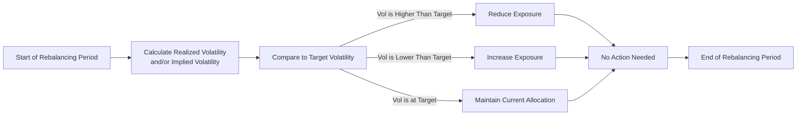

## Introduction
Volatility targeting is about striving to keep your portfolio’s risk level consistent. Maybe you’ve experienced those moments when markets swing wildly, and you think, “Ah, I wish I could smooth out the ride just a bit.” That’s precisely the pitch behind volatility targeting strategies: managers adjust leverage (or shift allocations) to maintain a pre-set volatility level, aiming to reduce drawdowns and help investors sleep better at night. Even though it sounds great (who doesn’t want consistent performance?!), there are a few tricky bits that might trip folks up, like forced selling into a plunging market or missing out on some upside when the going is good. Let’s take a deeper look at how this approach is structured, why it can work, where it might stumble, and how you might incorporate a volatility target in your own investment strategies.

## Basic Principles of Volatility Targeting
In a nutshell, volatility targeting is the process of dynamically adjusting a portfolio’s exposure so that the actual volatility stays around a target level—like 10% annualized or 15% annualized, or whatever is appropriate for your risk appetite. You can also apply these techniques to discrete sub-portfolios (like an equity sleeve or a commodity bucket) or at the total portfolio level, depending on your goals and constraints.

One common formula for scaling exposure based on volatility is:


\text{Target Exposure} = \frac{\text{Target Volatility}}{\text{Realized Volatility}} \times \text{Current Exposure}.


So if your realized volatility recently spiked to 12%, and you’re aiming for 8%, you might dial down your position size. Conversely, if realized volatility dipped to 5%, you might lever up just a little to get closer to 8%. This approach is sometimes referred to as “variance scaling.” Practically, though, you would embed some smoothing or look-back windows to avoid crazy whipsaws.

## The Rationale Behind Volatility Targeting
A major attraction of volatility targeting is how it can help manage the depth and frequency of portfolio drawdowns. If you’re reining in your exposures when volatility rises, you naturally have less capital at risk when the market is stormy, which might lessen your losses. Then, when the clouds clear and markets calm down, you’re free to scale up again, hopefully capturing returns in a more stable environment.

Not everyone has the same reason for adopting volatility targeting. Some might see it as a sharp risk-control lever, some might incorporate it into a “risk parity” or “systematic macro” approach, and others might just want to market their funds with the phrase “smooth returns.” In all these instances, though, the idea is the same: Keep your standard deviation of returns near a chosen level, so your portfolio doesn’t whipsaw as drastically as an unlevered (or unadjusted) version of the same exposures.

## Approaches: Dynamic vs. Discrete Rebalancing
If you’re running a volatility targeting strategy, you’ll generally pick between a dynamic approach (where you adjust exposures frequently, often daily or weekly) or a discrete approach (where you only rebalance at pre-set intervals, say monthly or quarterly). Let’s walk through each approach briefly:

• Dynamic Volatility Targeting (Variance Scaling): In this method, the manager calculates realized or implied volatility in real time and adjusts the portfolio’s leverage (or weighting) accordingly. So if the realized volatility jumps, the manager dials down risk the very next day—or even the same day, depending on the trading infrastructure.

• Discrete Rebalancing: Instead of constantly adjusting exposures, discrete rebalancing sets a schedule. Maybe every month, you measure the realized (or prospective) volatility and adjust the portfolio back to the target. This approach won’t respond as fast as dynamic targeting to big market shifts, but it can be simpler to implement and may incur lower transaction costs.

Either way, the underlying concept is the same: scale up or down based on your chosen volatility metric. A dynamic approach might keep you closer to your target at any given time, but it also opens the door to whipsaw if you keep adjusting your exposures during short-lived volatility spikes. Meanwhile, discrete rebalancing has the risk of letting your volatility drift for a while, especially if the markets change quickly.

## Forced Selling into Falling Markets and Other Pitfalls
Volatility targeting can create what many folks in the market call “procyclical behavior.” If dashboards flash red, telling you volatility spiked, you might be forced to reduce your position sizes exactly at times when markets are already heading lower—potentially locking in losses just before a bounce. This is sometimes jokingly referred to as “buy high, sell low,” though that’s obviously not the intended outcome.

Moreover, such forced selling could amplify market swings when many volatility-targeting strategies do it at the same time. This phenomenon is sometimes linked to systematic trend-following or risk-parity strategies. If correlation spikes during a crisis (think 2008, 2020, or 2022 in certain segments), even different “uncorrelated” assets suddenly move in tandem, pushing your total portfolio volatility above the desired threshold. You may become a net seller of everything precisely when you’d prefer not to. That can exacerbate downward trends and leave you with less exposure when the market rebounds.

## Role of Correlation Shifts
When designing a volatility targeting approach, you might initially assume that different asset classes don’t move in lockstep. But as we just mentioned, correlations often rise significantly in stressed markets. That means your well-diversified risk exposures can still balloon in overall volatility if every asset starts dropping at once. If you wait until the correlation jump is obvious, your portfolio might have already taken a heavy hit. Hence, a big challenge is to incorporate correlation estimates—along with volatility estimates—into your scaling decisions. Some managers might keep a capital cushion or maximum leverage ratio to avoid extremes in either direction.

Here’s a quick example to illustrate the issue:
• Assume you hold an equity bucket and a commodity bucket with historically low correlation, say 0.2.  
• You allocate to each with an assumption that overall volatility will remain moderate.  
• A crisis arises, correlations spike to 0.9, and both buckets tumble together.  
• Your total portfolio volatility shoots way above your target, and you scramble to cut exposures across the board.

It’s no fun. So next time you model your portfolio using historical data, remember: correlation is not always stable, especially in a crisis.

## Practical Examples in Hedge Funds
Volatility targeting is popular in the hedge fund world, particularly in strategies like risk parity, systematic macro, and certain multi-strategy platforms. Let’s consider risk parity for a moment: the strategy tries to make each asset class contribute equally to total portfolio risk. Under normal conditions, government bonds might get levered up because they’re historically less volatile, while equities might be partially dialed down. If volatility in bonds picks up unexpectedly, the strategy systematically reduces bond positions. That ensures the contribution to total volatility from bonds doesn’t overshoot the target. Meanwhile, if equity volatility falls, the strategy may increase equity exposures.

In systematic macro strategies, managers often rely on signals derived from economic data or price-trend indicators. A volatility targeting overlay can keep the portfolio’s risk from drifting too high or too low as signals evolve. For instance, if a manager has a big position following a strong upward trend in equities, but the equity market’s volatility starts climbing, a volatility targeting overlay might trim the position while still keeping the original trend-following signal in place.

## Using Historical, Implied, and Forward-Looking Measures
An important question is: “Which measure of volatility do we base our decisions on?” People approach it differently:

• Historical Volatility: Some managers rely on realized (actual) volatility from the past 20 to 60 trading days. It’s relatively straightforward to calculate but can lag behind sudden changes in the market environment.  
• Implied Volatility: Others prefer implied volatility from options markets. This taps into the collective market expectation of future volatility, but it might be noisy or artificially high if markets are panic-buying options for hedging.  
• Forward-Looking Statistical Models: Some sophisticated shops use factor models or GARCH-type models to forecast volatility. This can be more accurate in capturing volatility shifts, though it might be complex to implement and subject to model risk if assumptions break down.

Sometimes managers will mix these data points to get a more robust estimate. They might average realized historical figures with implied readings or overlay discretionary views (like “the Fed is about to pivot; we’d better keep an eye on that!”).

## Advantages and Trade-Offs
Stabilizing your volatility over time can give clients a smoother ride. But it’s not free. One big trade-off? In a big bull market where volatility stays low, a volatility targeting strategy might keep adding leverage to maintain a stable risk profile. Then, if there’s a sudden spike in volatility, it may reduce exposure at an unfortunate time, capping your upside and ironically locking in some losses.

Another cost is transaction cost. More frequent rebalancing means more trading, and that can suck up returns through spreads and fees. There’s also the potential to miss out on risk premia that require patience. If you scale down your positions every time volatility flares up, you might exit too early from an otherwise profitable position that’s simply going through a short-term rough patch.

In short, the desire for stable volatility might reduce your maximum drawdown, but it can also reduce your maximum potential gains. It’s always a balancing act.

## Implementation Steps and Best Practices
When you set up a volatility targeting program, you might consider these steps:

• Define Your Target: Decide on a volatility level that aligns with your or your client’s risk tolerance.  
• Choose Your Measurement Window: Decide whether you’ll rely on daily data, weekly data, monthly data—a rolling 20-day or 60-day window is typical.  
• Select Rebalancing Frequency: Dynamic daily rebalancing or monthly discrete rebalancing? More frequent rebalancing can be more precise yet costly.  
• Add Guardrails: Many managers set maximum leverage or a “minimum position size” so that you can’t ramp leverage to dangerously high levels or dial it down to near zero in a short period.  
• Stress Test & Scenario Analysis: Evaluate how your portfolio behaves in hypothetical crises, especially periods with correlation spikes.  
• Communication with Clients: Let your investors or stakeholders know how your strategy might respond in times of market stress. This helps align expectations and hopefully prevents panic.

And hey, if you’re anything like me, you might be tempted to rely too heavily on neat historical data. But markets can always surprise us, so building in some resilience (or “antifragility,” as Nassim Taleb might put it) is crucial.

## Illustrative Mermaid Diagram
Below is a simple diagram to visualize the decision flow in a dynamic volatility targeting process:



## Sample Python Snippet
Below is a minimal Python snippet for calculating a simple daily volatility scale factor based on historical volatility. This is just an illustration and not investment advice, obviously.

```python
import numpy as np

def calculate_volatility_scale_factor(returns, target_vol=0.10, window=20):
    """
    returns: array-like of daily returns
    target_vol: target annualized volatility, e.g. 0.10 for 10%
    window: look-back window for realized volatility calculation
    """
    # Compute standard deviation of daily returns for the last 'window' days
    historical_vol = np.std(returns[-window:], ddof=1)
    
    # Convert daily vol to annualized (approx using sqrt(252))
    annualized_vol = historical_vol * np.sqrt(252)
    
    scale_factor = target_vol / annualized_vol if annualized_vol > 0 else 1.0
    return scale_factor
```

In a real-world scenario, you’d want to integrate transaction cost models, apply smoothing, handle outliers, and so forth. The essence here is that when annualized_vol is higher than target_vol, the scale factor is less than 1, prompting you to reduce exposure.

## Glossary of Key Terms
• Volatility Targeting: Adjusting portfolio exposures to maintain a desired level of volatility.  
• Variance Scaling: Periodically updating leverage based on realized variance (or volatility) trends.  
• Risk Parity: A portfolio strategy allocating so that each asset class contributes a similar proportion of total risk.  
• Implied Volatility: The market’s forecast of likely asset price movement, extracted from option prices.  
• Correlation Spike: A phenomenon where assets that normally swing independently start moving together in a crisis.  
• Systematic Trend-Following: An algorithmic approach that buys assets showing positive momentum and shorts negatively trending assets.  
• Leverage Adjustment: The process of raising or lowering borrowed funds or derivatives exposures to maintain target volatility.  
• Drawdown Management: Methods to reduce the magnitude of losses from top to bottom in a portfolio’s value.

## Conclusion and Exam Tips
Volatility targeting might sound almost too good to be true—“stabilize returns, reduce downside risk, stay in the game”—but real life can be messy. Shifts in correlation, sudden jumps in volatility, forced selling, and potential for missing out on big upside moves are just a few complications. Nonetheless, many professional investors find it a useful tool for controlling risk, especially in alternative investment strategies where unbounded volatility can be a nightmare.

If you’re preparing for the CFA exam, consider how volatility targeting might show up in item set questions or constructed-response prompts. You could be asked to evaluate the appropriateness of a volatility targeting approach for a pension plan, weigh the benefits and pitfalls for a hedge fund manager, or compare dynamic vs. discrete rebalancing approaches. Common exam pitfalls include focusing only on the “pros” and overlooking the “cons,” and forgetting to consider correlation spikes in risk modeling.

Good luck, and remember that the best risk model is always about balancing the quantitative signals with a healthy dose of real-world skepticism.

## References for Further Study
• Qian, Edward E. “Risk Parity Fundamentals.”  
• Taleb, Nassim Nicholas. “Antifragile: Things That Gain from Disorder.”  
• AQR Research on Volatility Targeting:  
  https://www.aqr.com/

## Test Your Knowledge: Volatility Targeting Strategies



### Which of the following best describes volatility targeting in portfolio management?

- [ ] Allocating all capital to a single asset class to amplify returns.  
- [x] Dynamically adjusting exposure to maintain a desired volatility level.  
- [ ] Holding volatile assets only during market downturns.  
- [ ] Completely eliminating leverage in all market environments.  

> **Explanation:** Volatility targeting focuses on dynamic adjustments to keep the portfolio’s standard deviation near a target level, often by scaling positions up or down as volatility changes.

### Which of the following is a potential downside of volatility targeting?

- [x] Forced selling into declining markets.  
- [ ] Eliminating downside risk altogether.  
- [ ] Guaranteed outperformance of passive benchmarks.  
- [ ] Immunity to correlation spikes.  

> **Explanation:** In stressed markets, volatility spikes can force a manager to downsize exposures right as markets are falling, possibly locking in losses.

### When correlations among asset classes increase sharply in a crisis:

- [ ] Volatility targeting becomes unnecessary.  
- [ ] The strategy can hold larger exposures safely.  
- [x] The strategy may suffer since total portfolio risk can spike.  
- [ ] The need for dynamic rebalancing completely disappears.  

> **Explanation:** Correlation spikes can raise overall portfolio volatility, causing the strategy to reduce positions (and potentially lock in losses).

### What best describes a “variance scaling” approach?

- [x] Adjusting leverage based on realized volatility over a particular look-back period.  
- [ ] Selling options to profit from implied volatility exceeding realized volatility.  
- [ ] Constructing a portfolio that equally weights each asset’s notional value.  
- [ ] Eliminating positions any time they exceed a 2% daily swing.  

> **Explanation:** Variance scaling periodically updates leverage (or position size) in response to changes in measured volatility, aiming to keep overall volatility near the target.

### In discrete rebalancing:

- [x] Exposure adjustments occur only at scheduled intervals (e.g., monthly).  
- [ ] The portfolio is rebalanced automatically every day.  
- [ ] There is no set timetable, and changes are made randomly.  
- [ ] Overall correlations do not affect the strategy.  

> **Explanation:** Discrete rebalancing sets specific periods (like monthly or quarterly) to recalibrate the portfolio rather than reacting daily.

### A systematic macro strategy that uses volatility targeting might:

- [x] Combine trend signals with frequent risk adjustments.  
- [ ] Avoid the use of any derivatives or leverage.  
- [ ] Never reduce positions in a drawdown situation.  
- [ ] Implement only discretionary trades.  

> **Explanation:** Systematic macro managers typically run algorithmic signals (like trend-following) and overlay them with volatility-based exposure adjustments.

### Implied volatility is particularly useful in volatility targeting because:

- [x] It provides a market-based expectation of future volatility.  
- [ ] It is never affected by supply and demand in the options market.  
- [ ] It is always more accurate than historical volatility.  
- [ ] It is free to obtain and not sensitive to market sentiment.  

> **Explanation:** Implied volatility is gleaned from current option prices, reflecting the market’s forecast of future volatility (though it can be influenced by demand for hedging and market sentiment).

### One primary goal of volatility targeting is:

- [x] Stabilizing the portfolio’s risk level over time.  
- [ ] Generating only short-term capital gains.  
- [ ] Guaranteeing a zero drawdown environment.  
- [ ] Eliminating the need for diversification.  

> **Explanation:** Volatility targeting tries to keep exposures appropriately scaled so that the portfolio experiences consistent risk, not too high and not too low.

### In a risk parity approach that uses volatility targeting:

- [x] Less volatile assets may be levered to match the risk of more volatile assets.  
- [ ] More volatile assets receive all the capital.  
- [ ] Only equities and bonds are included, ignoring other asset classes.  
- [ ] There is never any rebalancing once allocations are set.  

> **Explanation:** Risk parity aims to balance risk contributions across assets; volatility targeting is applied by increasing/decreasing leverage of lower/higher volatility assets to achieve that balance.

### True or False: Correlations between asset classes remain constant, irrespective of market conditions.

- [ ] True  
- [x] False  

> **Explanation:** Correlations can and do change, particularly spiking upward during market stress, which can challenge volatility targeting approaches.


