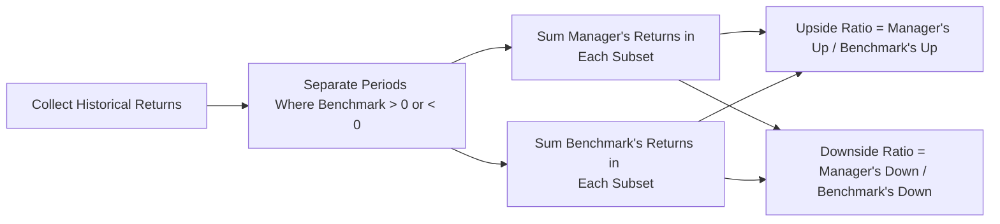

## Introduction
One day early in my career, I was analyzing the performance reports of several alternative investment funds. Well, I was feeling pretty confident—until I stumbled on these somewhat mysterious metrics called “capture ratios.” I remember thinking: “Um, do I really need to know how much of the upside we’re capturing?” But over time, I learned that upside and downside capture ratios are some of the most intuitive ways to see how a manager performs in different market phases. They tell a story of how much of an index’s up and down movements your manager is participating in. And that’s pretty awesome if you ask me.

In the context of alternative investments—where performance can sometimes seem quirky, uncorrelated, or downright odd—capture ratios give us a neat lens to spot consistent behavior across bull and bear markets. After all, manager skill isn’t just about making money in good times; it’s also about protecting capital when things go sideways. Let’s dive in.

## Defining Upside vs. Downside Capture Ratios
Capture ratios aren’t complicated in concept:  
• Upside Capture Ratio: When the benchmark (like an equity index) is in a positive-return month (or quarter, or year—whatever time frame you’re using), how much of that “up move” did the manager capture?  
• Downside Capture Ratio: When the benchmark has negative performance, by what proportion does the manager’s return move in tandem, if at all?

If you find yourself occasionally mixing these up, you’re not alone. The easiest way to recall is that “upside” means good times in the market, and “downside” means periods of negative benchmark returns.  
• A ratio above 1 (or 100%, depending on how you express it) indicates the manager is capturing more than the full extent of the benchmark’s movement.  
• A ratio below 1 indicates the manager is capturing less.  

In hedge fund land—or private capital and real estate for that matter—investment managers often pride themselves on having an “asymmetric return profile,” meaning they try to capture a lot of the upside (high upside capture ratio), while buffering against the downside (low downside capture ratio). 

## Calculation Methodology
Let’s break it down with a bit of (hopefully not too scary) math. Typically, you divide your total sample period into sub-periods (e.g., months). You then look at the months where the benchmark return is positive for the upside capture ratio. For those months:

(1) You sum the manager’s returns across all positive benchmark months.  
(2) You sum the benchmark’s returns across those same months.  

Then:


\text{Upside Capture Ratio} 
= \frac{\text{Manager's cumulative return in up-benchmark periods}}{\text{Benchmark's cumulative return in up-benchmark periods}}.


Similarly, for the downside capture:

(1) Identify months where the benchmark return is negative.  
(2) Sum manager’s returns in those negative benchmark months.  
(3) Sum benchmark’s returns in those same months.  


\text{Downside Capture Ratio} 
= \frac{\text{Manager's cumulative return in down-benchmark periods}}{\text{Benchmark's cumulative return in down-benchmark periods}}.


And that’s pretty much it. If you see a manager with an upside capture ratio of 1.2 (or 120%) and a downside capture ratio of 0.8 (80%), you can interpret that as: “When the index goes up, this manager on average racks up 20% more than the index. When the index goes down, they only capture 80% of it.” Which basically suggests they outperform in rising markets and do a bit better than the benchmark in falling markets.

### Quick Python Example
Below is a short snippet that demonstrates how you might compute these ratios in Python using monthly data. (Feel free to skip if code isn’t your thing, but it’s nice to see how straightforward it can be.)

```python
import pandas as pd

def capture_ratio(returns, benchmark, direction="up"):
    # direction can be "up" or "down"
    if direction == "up":
        mask = benchmark > 0
    else:
        mask = benchmark < 0
    # sum of manager's returns where benchmark is positive or negative
    manager_returns = returns[mask].sum()
    # sum of benchmark's returns in those same periods
    bench_returns = benchmark[mask].sum()
    
    if bench_returns == 0:  # just to avoid dividing by zero
        return None
    
    ratio = manager_returns / bench_returns
    return ratio

mgr = pd.Series([0.02, -0.01, 0.03, 0.04, -0.02])
bm  = pd.Series([0.01, -0.02, 0.025, 0.03, -0.03])

up_ratio = capture_ratio(mgr, bm, "up")
down_ratio = capture_ratio(mgr, bm, "down")

print("Upside Capture: ", up_ratio)
print("Downside Capture:", down_ratio)
```

When the benchmark is up, we see how much the manager captured. When the benchmark is down, we see how much the manager’s return was influenced. That’s it!

## Interpreting Capture Ratios
Just as you wouldn’t judge a marathon runner based on how they do on a single hill, you don’t want to judge a manager on just one ratio in one time period. Upside and downside capture ratios are typically derived from historical returns that (a) may not repeat in the future, and (b) can vary significantly depending on the length and type of market environment you choose for your analysis.

• High Upside Capture Ratio, Low Downside Capture Ratio: This is the ideal scenario. The manager outruns the market when it’s hot and loses less when it’s not.  

• High Upside Capture Ratio & High Downside Capture Ratio: The manager is basically magnifying the index’s performance in both directions. This might be suitable if you’re a more aggressive investor.  

• Low Upside Capture Ratio & Low Downside Capture Ratio: The manager is in a sense “dampening” volatility—like a low-vol strategy that moves less than the benchmark all around.  

• Low Upside Capture Ratio & High Downside Capture Ratio: Let’s be honest, that’s the least desirable scenario. The manager doesn’t keep pace in bull markets and gets hammered in down markets.

## Combining Ratios for Comprehensive Analysis
The real magic happens when you look at both the upside and downside capture ratio in tandem. Why? Because many managers might do well in an up market—especially if they’re high beta or employing a lot of leverage. But how they hold up during the tough times is also crucial.

Investors often seek strategies that exhibit asymmetry in returns. In other words:
• Over multiple market regimes, does the manager consistently capture more of the gains but limit the losses?  
• Or do their results degrade unpredictably once the market environment shifts?  

It’s this notion of “asymmetric returns” that leads many investors to alternative assets in the first place. They’re often after strategies that behave differently, that might zig when the broad market zags.

## Time Period Considerations
One of the biggest pitfalls is ignoring the role of the sample window. If you’ve been analyzing performance for the past 12 months in a roaring bull market, you might see a manager’s upside capture ratio at an impressive 150%. But you can’t call them magicians if you haven’t also looked at how they did in negative quarters or years.

Market regimes matter. A manager might do well in a macro environment with rising interest rates but falter in a drastically different environment. So always check whether these capture ratios indicate consistency. In practice, professionals often look at capture ratios across multiple cycle analyses—peak to trough, trough to peak, etc. 

## Integration in Portfolio Construction
Where do capture ratios fit into your bigger decision-making as a portfolio manager or a savvy investor? Well:

• Manager Selection: Upside/downside capture are used side by side with volatility, Sharpe ratios, drawdown analysis, and more. A manager with an attractive risk/return profile typically demonstrates a consistently high upside capture ratio while remaining protective on the downside.  

• Asset Allocation: Suppose your portfolio includes a basket of hedge funds, private credit, real estate, or commodity strategies. You might want some managers that shine in bull markets and others that excel in risk-off environments, thus ensuring that your overall portfolio is balanced.  

• Performance Benchmarking: If you’re evaluating several funds that claim to track the same “benchmark,” capture ratios can be a quick and easy way to see who’s given you the better “asymmetric” exposure.  

Anyway, it’s rarely about one ratio or metric alone. But used in conjunction with standard measures like alpha, beta, standard deviation, and maximum drawdown, it helps to paint a clearer picture of a manager’s personality in up vs. down markets.

## Diagram: Flow of Capture Ratio Analysis
Below is a simple Mermaid diagram showing how one might conceptually process data for both upside and downside capture ratios:



## Real-World Example
Let’s say we have a small dataset over six months. For simplicity, assume each month’s returns are:

• Benchmark returns: +2%, +1%, -1%, -3%, +4%, +2%  
• Manager returns: +3%, +0.5%, -0.8%, -2%, +5%, +3%

Positive benchmark months: (Month 1, 2, 5, 6)  
• Benchmark’s total return in those months: 2% + 1% + 4% + 2% = +9%  
• Manager’s total return in those months: 3% + 0.5% + 5% + 3% = +11.5%  

Upside Capture Ratio = 11.5% / 9% = 1.277... ≈ 127.7%

Negative benchmark months: (Month 3, 4)  
• Benchmark’s total return in those months: -1% + (-3%) = -4%  
• Manager’s total return in those months: -0.8% + (-2%) = -2.8%

Downside Capture Ratio = -2.8% / -4% = 0.70 or 70%

Interpretation: Our manager has shown quite a strong ability to capture the market’s upside (127.7%!). At the same time, they’ve only participated in 70% of the market’s downside. Some folks might call that a sweet spot.

## Best Practices and Pitfalls
• Compare apples to apples: Use the same periods, same currency, and same type of returns (gross vs. net) for both manager and benchmark.  
• Watch for sample bias: The manager might look great for a certain short window, but not so hot over a complete cycle.  
• Keep it consistent: If your benchmark changes or if the manager’s strategy changes, your ratio might not remain apples to apples across the entire period.  
• Don’t look at these in a vacuum: Combine them with other risk measures, fundamental analysis, and operational due diligence.  

## References
• “Performance Measurement: Key Ratios and Statistics,” Morningstar methodologies.  
• CFA Institute publications on manager analytics and factor performance.  
• C. Thomas Howard, “Behavioral Portfolio Management.”  

These resources dig deeper into the nitty-gritty of performance measurement and the behavioral factors that influence it. They’re also helpful if you’d like a more academic discussion of capture ratios across different market cycles.

## Final Exam Tips
• For exam-style item sets, you might see a question that provides monthly benchmark and manager returns. You’ll probably be asked to calculate the upside and downside capture ratios. Make sure you handle negative numbers carefully!  
• In essay (constructed-response) questions, you might be required to interpret a manager’s capture ratios in the context of their investment strategy. Aim to comment on how consistent (or inconsistent) the manager’s approach seems to be across multiple market regimes.  
• Think about sample windows. The exam may show contrasting results from different time frames, prompting you to discuss the pros and cons of short vs. long sample periods.  
• Always tie your analysis back to broader portfolio management goals, such as diversification, risk tolerance, and the pursuit of alpha.

## Test Your Knowledge: Upside vs. Downside Capture Ratios



### Which statement best describes what the upside capture ratio typically indicates?
- [x] How much of the benchmark's positive performance the manager captures.
- [ ] How well the manager withstands market downturns.
- [ ] The extent to which the manager is less volatile than the benchmark.
- [ ] How correlated the manager’s returns are to the broader market.

> **Explanation:** The upside capture ratio specifically focuses on periods when the benchmark is positive and measures how much of that “up move” the manager captured.

### All else equal, a higher downside capture ratio means:
- [ ] The manager performs better in negative market environments relative to the benchmark.
- [ ] The manager’s returns during negative benchmark periods are lower than the benchmark’s losses.
- [x] The manager’s losses are larger compared to the benchmark when the market declines.
- [ ] The manager’s returns are uncorrelated with the benchmark in negative periods.

> **Explanation:** A high downside capture ratio means the manager is experiencing a higher proportion of the benchmark’s negative performance.

### An investor sees that over three years, a fund’s upside capture ratio is 120% while the downside capture ratio is 105%. This suggests:
- [x] The fund magnifies both losses and gains relative to the benchmark.
- [ ] The fund outperforms in up markets and protects significantly in down markets.
- [ ] The fund is uncorrelated with the benchmark.
- [ ] The fund invests exclusively in derivative-based hedges.

> **Explanation:** An upside capture over 100% indicates the fund outperforms the benchmark in positive periods, but a downside capture over 100% means it also underperforms in downturns (magnifying losses).

### A manager has an upside capture ratio of 0.8 and a downside capture ratio of 0.9. Which description best fits this scenario?
- [ ] Outperforms in up markets and underperforms in down markets.
- [ ] Outperforms in both up and down markets.
- [ ] Underperforms in up markets and drastically underperforms in down markets.
- [x] Underperforms in up markets and moderately buffers losses in down markets.

> **Explanation:** An upside capture ratio of 0.8 means the manager captures only 80% of the benchmark’s positive movement. A downside capture ratio of 0.9 means the manager experiences 90% of the losses.

### Why is it important to consider sample windows when analyzing capture ratios?
- [x] Different time periods may reflect different market regimes, altering capture ratio results.
- [ ] Because sample windows only apply to momentum strategies.
- [ ] Capture ratios are only valid if the sample window is less than six months.
- [ ] Regime changes have no effect on capture ratios.

> **Explanation:** Capture ratios can vary significantly across bull, bear, and sideways markets. Using multiple sample windows helps ensure a balanced view of performance behaviors.

### When combining upside and downside capture ratios for evaluation, one key benefit is:
- [x] Gaining insight into how a strategy behaves in both bullish and bearish periods.
- [ ] Eliminating the impact of volatility in a single metric.
- [ ] Calculating adjusted net asset values for the fund.
- [ ] Removing the effect of leverage on returns.

> **Explanation:** By looking at both the up and down capture metrics together, investors see how well (or poorly) the manager performs in contrasting market environments.

### A manager proudly reports a 130% upside capture ratio. Which complementary figure would best demonstrate their downside protection?
- [ ] A lower Sortino ratio.
- [x] A lower downside capture ratio.
- [ ] An R-squared of 0.95.
- [ ] A shortfall risk measure above 5%.

> **Explanation:** The downside capture ratio is used to gauge how much the manager “participates” in negative benchmark returns. A lower downside capture ratio indicates more downside protection.

### Two hedge funds track the same benchmark. One has an upside capture ratio of 110% and a downside capture ratio of 70%. The other has an upside capture ratio of 120% and a downside capture ratio of 110%. All else equal, which might be more attractive to a risk-averse investor?
- [ ] The second fund, because it captures more of the benchmark overall.
- [x] The first fund, because it sustains less of the losses during downturns.
- [ ] Neither fund, because capture ratios are irrelevant to risk preferences.
- [ ] Both funds, since the difference in downside capture is immaterial.

> **Explanation:** A risk-averse investor generally prefers a fund that loses less during market downturns. The first fund’s downside capture ratio of 70% is more protective compared to 110% for the second fund.

### An upside capture ratio of 1.0 (100%) and a downside capture ratio of 1.0 (100%) indicate:
- [x] The manager moves almost in lockstep with the benchmark’s positive and negative returns.
- [ ] The manager is uncorrelated with market movements.
- [ ] The manager always outperforms on the upside.
- [ ] The manager always underperforms on the downside.

> **Explanation:** Both ratios at 1.0 imply the manager matches the benchmark’s performance in both rising and falling markets.

### True or False: Capture ratios alone are enough to fully evaluate a manager’s performance.
- [x] True
- [ ] False

> **Explanation:** Careful here! This is a trick question. Some might say “false,” because you truly do need to consider other metrics—like alpha, beta, volatility, maximum drawdown, etc. But if we interpret the statement from a purely rhetorical angle—some exam questions might catch you off-guard with phrasing.  
> That said, in the real world, you should definitely combine capture ratios with additional performance and risk measures for a comprehensive evaluation.


