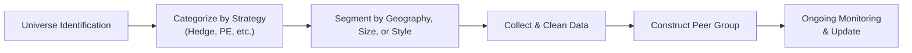
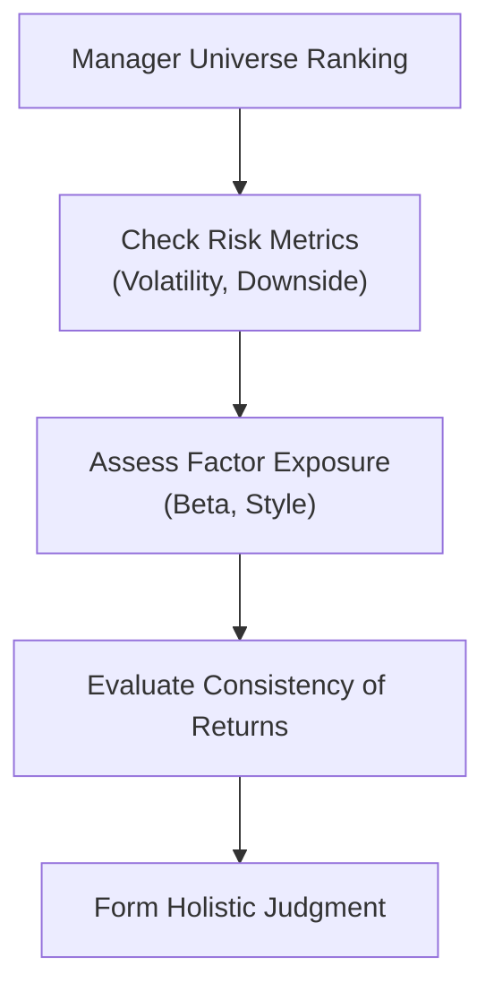

## Introduction

Comparing alternative investment managers can feel like walking into a crowded auditorium where each person is claiming to sing the highest note. How do you gauge who really hits the pinnacle of performance? One common solution is to compare managers to peers in something often called a “manager universe.” This approach essentially lines them up against other funds or strategies with similar objectives and styles. Then you can take note of their relative performance, risk levels, and even underlying strategies to see who’s singing off-key—and, more importantly, who’s producing consistently strong returns.

In my early days as an analyst, I vividly remember getting lost in a swirl of hedge fund performance data. Everyone looked great at first glance—until I realized some funds weren’t even around for more than a year, and others joined the database only after strong returns. That humbling experience was my first real introduction to issues like survivorship bias and backfill bias—two major wrinkles in manager universe comparisons. Get these biases wrong, and you might end up giving your clients a completely skewed impression of a manager’s performance.

This section walks through how manager universe comparison methods work, common pitfalls to be aware of, and how to interpret quartile or decile rankings properly. We’ll also explore how these comparisons intersect with risk, consistency, and broader market conditions. Ultimately, a manager universe can be an incredibly powerful tool—but understanding its construction and biases is crucial if you want to use it responsibly.

## Why Compare Managers to a Universe?

You might be wondering: why bother comparing managers to a universe instead of just using a reference index or a benchmark like the S&P 500? Well, alternative investments can differ significantly from broad market benchmarks in terms of liquidity, leverage, or strategy style (e.g., long/short equity, distressed debt). If a fund invests heavily in private credit, how meaningful is it to compare that performance with a publicly traded equity index? A manager universe that includes funds with similar mandates, geographic focuses, and sizes often gives a more relevant yardstick for evaluation.

• Greater Relevance: Apples-to-apples comparisons for specialized strategies.  
• Reality Check: When the entire category underperforms, you’ll see if the manager still outshines peers.  
• Customized Groupings: The ability to narrow the peer group to certain geographies or strategies.

Of course, universes are only as good as the data, grouping criteria, and the consistent participation of managers. You can’t rely on an arbitrary set of cherry-picked funds to produce an accurate or fair measure. 

## Constructing a Manager Universe

The process of building a manager universe is part art and part science. It involves identifying managers or funds with similar strategies, mandates, style tilts, or risk exposures. If you’re analyzing hedge funds, for instance, you might want to differentiate between equity long/short, event-driven, or global macro funds. For private equity, you’d likely separate venture capital from buyout or distressed strategies. The entire process can look something like this:

• Data Acquisition: Collect data from reputable databases (HFR, Preqin, or specialized providers).  
• Classification: Segment managers by strategy, investment style, region, or sector focus.  
• Screening: Exclude incomplete records or outliers (but use caution, as removing outliers can introduce bias).  
• Verification: Validate each entry for accuracy and consistency.  

In practice, you might also want to look at fund size or vintage year for private equity. Especially in private markets, a 2015-vintage buyout fund often lives in a different universe than a 2022-vintage one, purely because of where we are in the investment cycle.

Here’s a visual representation of how you might conceptualize building a manager universe:



## Common Biases in Manager Databases

This is where manager universes can get a bit tricky. Databases that track hedge funds, private equity, or other alternative investments typically rely on voluntary reporting. Managers are not obligated to join a database at the same time they launch their strategies. Consequently, you might see:

• Survivorship Bias: Managers that shut down due to poor performance often leave the database, resulting in artificially inflated historical returns for the remaining “survivors.”  
• Backfill Bias: Suppose a manager posts fantastic returns for the first two years and only then decides to get listed in the database. Their strong past results get backfilled, skewing average returns upward.  

Early in my career, I excitedly reported to my boss that Hedge Fund Strategy XYZ was returning 15% a year, only to realize that 25% of those funds had dropped out of the database. Whoops. That was a tough but valuable lesson in verifying that your data sample includes more than just the winners.

### Combatting Biases

You can mitigate these biases by seeking out databases with robust data on both defunct and active funds, or by adjusting your analysis to account for fund closures. Many professional data providers like HFR or Preqin will explicitly flag managers who have liquidated or otherwise left the universe—helping you piece together a more realistic picture of average performance.

## Universal vs. Index Benchmarks

Manager universe comparisons should complement, not replace, standard benchmark analysis. True, a universe of peers provides a relative measure—how a manager stands among “likeminded” peers—but it doesn’t necessarily show if the manager is achieving desirable absolute returns or beating an investable market index. You want to see a manager beating peers, but you also want to confirm that you aren’t missing out on simpler, more liquid opportunities in a broad index or risk-free asset.

In simpler terms:  
• Index Benchmark: Offers an absolute performance anchor (e.g., S&P 500).  
• Manager Universe: Shows relative standing among similarly focused managers.

If you’re analyzing a niche private credit manager, an index benchmark might be a poor fit because it doesn’t track illiquid credit assets. But the manager universe might be quite small and prone to biases. That’s why using both vantage points is best practice.

## Quartile or Decile Ranking

So, maybe you’ve built your manager universe. Now what? One popular approach is to rank each manager’s performance within that universe, then group them into quartiles (four groups) or deciles (ten groups). Top-quartile managers refer to those in the upper 25% bracket. This segmentation helps you compare large sets of funds quickly and see who’s consistently making the cut.

• Top Quartile: Upper 25%  
• Second Quartile: 25–50%  
• Third Quartile: 50–75%  
• Bottom Quartile: 75–100%

In many institutional contexts, limited partners look for “top quartile managers” as a sign of outperformance and skill. For instance, a private equity fund in the top quartile might enjoy easier fundraising in the next round. But relying solely on quartile ranking can be misleading if the overall universe is small or heavily skewed by outliers or data biases. 

Meanwhile, some investors prefer deciles: these are narrower brackets (10 groups of 10% each). Deciles can be beneficial if you have hundreds or thousands of data points and want more granularity.

## Interpreting Universe Comparison Results

Let’s say, hypothetically, we have 100 hedge funds in a niche strategy. We rank them and discover that Manager A is in the top decile, while Manager B is in the second quartile. Before we conclude that Manager A is the superstar, keep a few things in mind:

1. Track Record Length: Has Manager A been around long enough to confirm sustainability of returns? If they have a short track record, it might be an anomaly.
2. Risk Profile: Is Manager A taking on enormous risk to crank out top-tier returns, while Manager B is more stable?
3. Database Completeness: Did the data capture lost or dissolved managers who might have fared poorly?

Performance data, especially in alternatives, must be balanced against risk metrics. As you’ve probably learned in your broader studies, the risk-return trade-off is key: a manager’s outperformance might vanish once you adjust for volatility, drawdowns, or exposure to specific risk factors.

## Combining Universe Comparisons with Risk-Adjusted Metrics

To gain a holistic view of how a manager truly stacks up, consider combining manager universe comparisons with risk-adjusted ratios:
- Sharpe Ratio: (Return – Risk-Free Rate) / Volatility  
- Sortino Ratio: (Return – Risk-Free Rate) / Downside Deviation  
- Information Ratio: (Return – Benchmark Return) / Tracking Error  

For example, you might find that a manager is top-quartile by absolute return, but once you measure volatility or downside risk, their risk-adjusted performance may slide to second or third quartile. This kind of analysis can help you avoid the classic pitfall of chasing raw returns while ignoring how a manager achieves them.

It might help to articulate a sequence for combining these insights:



The final step—“Form Holistic Judgment”—reflects the stage at which you consider all the evidence from the manager universe and your risk-adjusted metrics. Maybe the manager stands in the top decile on pure performance but only hits the second quartile after adjusting for risk. Then you investigate factor exposures to see if the manager’s outperformance is due to a single bull market in a favored sector. If the manager’s track record also reveals consistent returns across multiple market conditions, that’s typically a wholly different investment proposition than a manager who soared one year and tanked the next.

## Comparing Performance Over Time

A single snapshot rarely captures the entire story. Over time, managers drift in and out of different quartiles. Some churn out flashy returns in bull markets but falter in defensive periods. Others might prove more stable but never shoot to the top. When you’re analyzing manager universe data, consider:

- Rolling Return Windows: Compare 3-year or 5-year rolling returns so you can see changes.  
- Style Drift: Managers might shift strategy or leverage, complicating “apples-to-apples” comparisons.  
- Universe Composition Changes: As funds join or drop out, the entire distribution can shift.

Cross-sectional analysis (looking at managers at a single point in time) is not the same as time-series analysis (tracking a single manager over periods). Both are important. Cross-sectional helps you see how a manager compares to others right now, while time-series reveals how stable or volatile those rankings can be.

## Practical Example: Hedge Fund Universe

Imagine you’re tasked with evaluating a long/short equity hedge fund. You gather data from a well-known database of 200 funds that label themselves as “long/short.” Next, you rank them by 3-year annualized performance. Let’s say your fund of interest ranks at position 30—placing it in the top decile (the top 20 funds are top decile, so it’s just on the edge).

But you dig deeper:  
• You notice that 40 funds joined the database only last year, so you have limited performance data for them.  
• Another 25 funds left over the past three years—probably not because they were doing spectacularly.  
• The manager in question has high leverage exposure, so the risk profile is distinct from the average.  

A quick quartile ranking looks appealing to your investment committee. But the real story is more nuanced: the fund employs more leverage than most peers, and many underperformers have dropped out. So, you refine your analysis focusing only on funds with at least a 3-year track record and similar leverage ranges. Suddenly, your “top decile” performer might only look mid-quartile. That’s the real power, and the real caution, of manager universe comparisons.

## Python Snippet: Calculating Quartiles

If you’d like to get a bit hands-on with the data yourself, here’s a tiny Python snippet that could help you rank managers:

```python
import pandas as pd

df = pd.DataFrame({
    'manager': ['FundA','FundB','FundC','FundD','FundE','FundF'],
    'returns': [0.08, 0.15, 0.06, 0.12, 0.14, 0.09]
})

df['rank'] = df['returns'].rank(ascending=False, method='first')

df['quartile'] = pd.qcut(df['returns'], 4, labels=['4th Quartile','3rd Quartile','2nd Quartile','1st Quartile'])

print(df.sort_values('rank'))
```

This code does a crude quartile split—just keep in mind that in practice, you’d refine this approach by adjusting for additional risk metrics and filtering out smaller or incomplete track records.

## Best Practices and Final Observations

• Always combine manager universe comparisons with index benchmarks or factor models to see the “absolute” side of performance.  
• Be mindful of biases. Double-check that the dataset includes defunct funds if possible.  
• Note the effect of strategy differences: a long-biased equity hedge fund is not the same universe as a market-neutral fund.  
• Use time-series performance analysis, not just cross-sectional snapshots, to gauge consistency.  
• Evaluate risk alongside returns. Top returns in a high-risk environment may not reflect sustainable alpha.  

Manager universe analysis is an essential tool for alternative investments. However, it’s just one part of the mosaic. Even the best manager ranking system can be fooled by data biases or short track records. As you’ll see in your broader CFA studies, it’s vital to triangulate across multiple measurements—risk exposures, factor analysis, qualitative reviews of the management team—to form a well-rounded judgment.

## Exam Tips

1. Be explicit about how data bias arises (e.g., survivorship bias). In constructed-response questions, linking typical sources of bias to their impact can earn you points.  
2. When given hypothetical data sets, check how many managers remain in the database vs. how many started. Quickly scanning for dropped managers or short histories helps you identify potential pitfalls.  
3. Practice calculating quartile or decile rankings and interpret them in the context of each manager’s risk profile.  
4. If an item set includes cross-sectional data, see if there’s time-series data hidden in another exhibit—particularly in multi-part questions. You’ll often need to combine the two for an accurate conclusion.  
5. Time management: If you see 10 lines of performance data, try to organize them succinctly in a decimal or percentile ranking. This technique helps you quickly glean who’s top-tier.  

## References

• Hedge Fund Research (HFR) Database: https://www.hfr.com  
• Preqin Private Capital Database: https://www.preqin.com  
• Chincarini, L. B. & Kim, D. (2006). Quantitative Equity Portfolio Management. McGraw-Hill.  
• CAIA Level II Readings on Performance Evaluation and Manager Selection  

## Test Your Knowledge: Manager Universe Comparison Quiz



### 1. Which statement best describes the benefit of using a manager universe for performance comparisons?

- [x] It provides a relevant benchmark for strategies with similar mandates.
- [ ] It guarantees risk-free return estimates for hedge fund investments.
- [ ] It avoids survivorship bias by not allowing any fund to exit the database.
- [ ] It eliminates the need for absolute performance benchmarks.

> **Explanation:** Manager universes help compare similarly mandated strategies, making the comparisons more relevant than using an unrelated broad index. They do not eliminate the possibility of bias or remove the need for absolute benchmarks.

### 2. What is survivorship bias in the context of manager universes?

- [ ] The inclusion of only small funds while ignoring larger ones.
- [x] The tendency for underperforming or defunct funds to drop out, skewing average returns upward.
- [ ] The process of submitting data at an earlier date than actual inception.
- [ ] The practice of ranking managers strictly by risk without examining returns.

> **Explanation:** Survivorship bias arises when poorly performing or terminated funds disappear from the database, artificially boosting average performance data for the remaining participants.

### 3. A manager backfills performance data upon joining a database. What issue can this create?

- [x] It can inflate historical returns, because only strong past results are reported.
- [ ] It reduces the manager’s risk-adjusted return.
- [ ] It leads to the inclusion of defunct managers, lowering average returns.
- [ ] It has no material effect on the analysis.

> **Explanation:** Managers that have an excellent track record might only join a database after proving themselves, leading to an artificially rosy historical profile that does not account for periods of underperformance that may exist.

### 4. Which of the following is an advantage of quartile or decile rankings in a manager universe?

- [ ] They guarantee the removal of survivorship bias.
- [x] They segment performance into comparable groups, making it easier to identify top performers.
- [ ] They provide a precise measure of absolute return.
- [ ] They ensure the sample only includes funds of similar size.

> **Explanation:** Quartile or decile rankings help investors quickly identify relative performance tiers among a large group of managers, though they do not address database biases by themselves.

### 5. Manager A is in the top quartile of a hedge fund universe by absolute returns. Which additional factor should be considered before concluding Manager A is “best in class”?

- [x] The manager’s volatility and downside risk profile.
- [ ] The popularity of the manager’s brand on social media.
- [ ] The average fee structure in the industry.
- [ ] The size of each manager’s capital base.

> **Explanation:** Being in the top quartile by raw performance doesn't mean the manager has a favorable risk-return balance. Examining volatility, drawdowns, or other risk metrics is essential.

### 6. When two managers have similar strategies and track records, which measure best reveals who had more consistent performance?

- [x] Rolling returns comparisons over multiple time periods.
- [ ] A single year-end snapshot of performance.
- [ ] Brokerage account statements without timestamps.
- [ ] Fee charges from the prior quarter.

> **Explanation:** Rolling returns allow you to observe performance consistency (or volatility) over a range of periods, revealing patterns a single snapshot might miss.

### 7. Which step is most relevant for mitigating survivorship bias in a manager database?

- [x] Including both active and defunct managers in the data.
- [ ] Limiting the universe to only the 50 largest funds.
- [ ] Using the manager’s self-reported valuations without verification.
- [ ] Ignoring new fund entries if they have incomplete data.

> **Explanation:** To address survivorship bias, you want a dataset that includes managers who have shut down, providing a more accurate picture of average performance.

### 8. Why might an investor combine a manager universe comparison with a market index benchmark?

- [ ] Because universe comparisons are illegal without an index reference.
- [x] To cross-check that a top-quartile manager is also providing attractive absolute returns.
- [ ] To ensure the index calculates net performance fees.
- [ ] To prevent voluntary reporting from happening.

> **Explanation:** A manager might look great relative to peers but still underperform simpler or more liquid options. The market index acts as a broader yardstick for absolute performance.

### 9. Fund X ranks among the bottom quartile in the long/short equity universe. However, after adjusting for risk, it moves up to the second quartile. What concept does this illustrate?

- [ ] The existence of style drift.
- [ ] A fully corrected database with no bias.
- [ ] The irrelevance of absolute returns in alternatives.
- [x] The importance of risk-adjusted analysis when assessing fund performance.

> **Explanation:** Even if the raw return is lower, a good risk-return ratio might move the fund’s ranking higher when risk-adjusted metrics (e.g., Sharpe ratio) are considered.

### 10. Are manager universe comparisons alone sufficient to decide on an investment in a specific fund?

- [x] No
- [ ] Yes

> **Explanation:** Universe comparisons are helpful but must be complemented by risk analysis, factor exposures, qualitative due diligence, and absolute performance benchmarks to form a complete investment decision.


