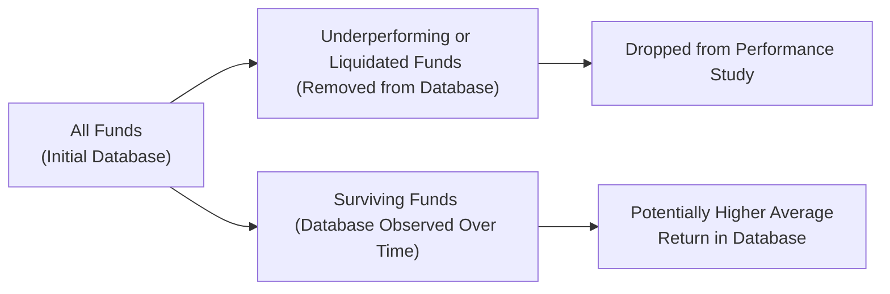

## Persistence of Returns: An Overview
There’s something almost magical about finding a top-performing manager—someone who consistently delivers impressive returns and seems to have that “knack” for picking the right opportunities. Yet the crucial question is whether this outperformance lasts. Do these managers genuinely have a repeatable investment skill? Or is it mostly luck, soon to fade?

When we speak of “persistence of returns,” we’re basically asking if historical performance—particularly strong performance—offers any predictive value for future returns. That’s important if you’re deciding whether to invest in a fund with a history of top quartile returns. In many cases, it’s not so straightforward. Some quantitative studies find evidence of persistence, particularly in certain alternative strategies like trend-following, while others reveal that performance can mean-revert, leading the once-hot manager to fall in rank.

Investors, especially those allocating to hedge funds or private equity funds, must be aware of how random fluctuations, cyclical market phases, and rebalancing can all affect the observed “persistence.” By taking a closer look at strategy-specific nuances and adjusting for an infamous data distortion known as survivorship bias, we can gain a more transparent view of whether or not a manager’s track record is truly repeatable.

## Causes of Return Persistence
Understanding what drives any sticking power in performance starts with examining the underlying strategy. Certain investment styles appear more prone to persistence or, at least, to more stable outcomes:

• Skill-Based Strategies: Managers relying heavily on specialized skill sets (e.g., credit risk assessment in distressed debt) might exhibit modest persistence if they consistently apply that expertise.

• Trend-Following Approaches: Some systematic funds show periods of positive returns that can appear fairly consistent, especially in trending markets.

• Illiquidity Premium Exploitation: Private equity or direct lending strategies can occasionally deliver consistent outperformance if they harness illiquidity premiums effectively.

• Non-Replicable Strategies: Funds relying on proprietary models, niche market segments, or unique deal flow could, in theory, create pockets of consistent outperformance.

But it’s never so simple. Even a skilled strategy can face significant headwinds, including macroeconomic shocks, competitive imitation, and plain-old bad luck. Persistence might not hold when markets shift, or when a manager deviates from their original approach. So, while some pockets of the alternative investment world can exhibit continuity, verifying genuine persistence requires careful data analysis—preferably over multiple market cycles.

## Strategy Dependency and Rolling Period Analysis
If you’ve ever tried to evaluate a manager just by looking at a single year’s returns, you might get a skewed picture. Markets have seasons too, so performance that looks stellar in a rising equity market might crumble in a recession. This is where rolling, overlapping periods become essential.

• Rolling Windows: A rolling approach means shifting your evaluation window—say, monthly or quarterly—so you capture overlapping timeframes. For instance, you could look at 3-year rolling returns, re-measured quarterly. This often reveals consistency (or lack thereof) in performance across changing market conditions. If a manager remains in the top quartile year after year, that’s strong (though not conclusive) evidence of skill.

• Multi-Year Analysis: Beyond rolling windows, we also look across full market cycles—upturns and downturns. One year is never enough. Two years may still be inadequate. Sometimes, an “extended track record” covering five years or more, combined with rolling analysis, is the gold standard when assessing alternative investment managers.

Indeed, some alternative strategies attempt to shield investors from broad market swings (e.g., market-neutral strategies). Others, like event-driven approaches, rely heavily on unique corporate actions—mergers, bankruptcies, or spinoffs. It’s quite possible that a few “winning trades” might propel a manager’s returns for a limited period, only to see them revert closer to the mean over time.

## Hot Hand Effect vs. Manager Skill
We sometimes call the phenomenon of recent winners continuing to win the “hot hand effect.” It’s borrowed from sports where a basketball player who’s “on fire” is expected to keep hitting shots. In investing, many folks assume that a manager with a great short-term record is set to remain in the top bracket. But as with sports, it’s tough to tell genuine skill from a lucky streak.

• Random Variations: Even random processes produce consecutive successes from time to time. One of the early finance studies by Eugene Fama and Kenneth French pointed out how random chance can create illusions of skill among a fraction of the manager population.

• Mean Reversion: Performance outliers often revert toward the average outcome over time. That can make “hot hands” appear ephemeral. The skillful part might be overshadowed by more powerful macro factors.

• Behavioral Biases: Investors—and even managers themselves—can get trapped by confirmation bias, seeing only successes and ignoring accidental good fortune or underlying risk.

In my opinion, it’s crucial to approach the “hot hand effect” with a bit of skepticism. A great run over 12 months might be partly skill, but it could just as easily fade if the market environment changes. Instead, a sustained positive record across different conditions—verified with robust analytics and qualitative due diligence—makes a stronger case for manager skill.  

## Survivorship Bias: Definition and Impact
As you build a dataset to analyze how managers fare over time, something sneaky happens: poor performers (or those who close their doors) quietly leave the database. This concept is “survivorship bias.” If a hedge fund or private equity fund fails or merges, it often disappears from standard performance records. That means the dataset is left with only win-and-continue managers—the survivors.

Consider a scenario: if 20% of funds vanish after a bad quarter or two, the database might overstate average performance by including only those funds that remain. Taking the results at face value could lead to dangerously optimistic conclusions about the level of “persistence.” 

### Mermaid Diagram: Survivorship Bias Flow



In that visualization, you can see how measurement is skewed upwards when underperforming or defunct funds no longer contribute data. This is especially dramatic in private equity analyses, where unsuccessful managers can vanish without leaving many performance traces.

### Adjusting for Survivorship Bias
Accurately representing the entire universe requires adjusting for those missing funds. You do this by trying to include data points for funds (or manager accounts) that closed or withdrew from the database before your evaluation date. Sometimes that information is available from industry data providers who track defunct funds, but it can be incomplete or hard to verify.

Failing to account for survivorship bias can lead to:

• Overstated average returns and Sharpe ratios.  
• False confidence in manager selection decisions.  
• Inaccurate estimates of a strategy’s risk profile.

You might also see “backfill bias,” where only the performance numbers from the manager’s best months or years are (selectively) included in the database. The combination of survivorship and backfill bias makes it extra tricky to interpret hedge fund or private equity fund performance.

## Multi-Year Analysis and Market Environments
One time, I saw an investment committee get all excited because a long–short equity manager had three consecutive years of double-digit returns. Impressive, right? But they’d only looked at a bullish equity environment. When the market turned choppy, that same strategy tumbled—and with it the illusions of skill-based persistence.

Thus, the environment matters. Persistence can fluctuate with economic cycles, interest rate regimes, or even volatility levels. For example, a manager specialized in merger arbitrage might do extremely well during times of high M&A activity. Once conditions tighten, their pipeline dries up, and performance might lag. Therefore, analyzing multiple market environments is key:

• Normal Growth vs. Recession  
• High Volatility vs. Low Volatility  
• Rising Interest Rates vs. Falling Interest Rates  
• Sector Booms vs. Sector Busts

Comparing performance across these varied environments—alongside the relevant risk exposures—often provides a more honest assessment of genuine persistence.

## Manager Turnover and Performance Persistence
People matter. Many alternative investment funds revolve around the expertise of key individuals, especially in smaller or specialist shops. If a star portfolio manager leaves, the fund might struggle to replicate past performance. Conversely, a junior analyst with fresh thinking can reinvigorate a fund’s approach.

High turnover—whether it’s staff or the investment portfolio—can create ephemeral performance patterns. Sudden manager or team changes can undermine any consistency you’d expect from historical numbers. This is why thorough operational due diligence must go hand in hand with performance analysis. Look beyond the performance line; investigate who’s behind the trades, how they approach research, and whether the fund’s investment philosophy is truly stable.

## Real-Life Examples and Case Studies
Let’s consider two examples:

1. Hedge Fund XYZ with 10 Years of Strong Returns:  
   • For nearly a decade, Hedge Fund XYZ reported above-average returns. But crucially, it managed a relatively stable, uncorrelated strategy (say, a type of “global macro” approach) through both the 2008 crisis and the post-2009 bull market.  
   • Further investigation into the constituent returns for each year revealed that the fund utilized robust risk management and had minimal leverage.  
   • Even in the face of manager rotation—where a co-portfolio manager left halfway through—the fund adhered to a stable process. The result? Reasonably consistent returns.  
   • That scenario suggests some real manager skill, though no fund is guaranteed to avoid future pitfalls.

2. Private Equity Fund ABC with Attractive IRRs, But…  
   • On the surface, Fund ABC had multiple consecutive “top-quartile” IRRs. However, they used a short performance window that captured only booming conditions in the biotech sector.  
   • Notably, the data excluded several smaller funds that folded. Many of those had begun raising capital around the same time but failed to exit their investments profitably when market sentiment shifted.  
   • Once you factor in the missing data from liquidated peers, you see that the entire biotech private equity subset had a less rosy outlook.  
   • Indeed, a dramatic shift in biotech valuations hammered many invests. Fund ABC’s track record still looked decent, but it became clear that the perceived “persistence” of top-tier performance had been inflated by survivorship bias.

## Python Snippet for Survivorship Bias Illustration
Below is a simplified Python code snippet that simulates a set of fund returns, then “removes” the underperformers from the dataset, showing the difference in average return before and after survivorship bias.

```python
import pandas as pd
import numpy as np

np.random.seed(42)

num_funds = 100
years = 5
returns_matrix = np.random.normal(loc=0.08, scale=0.10, size=(num_funds, years))

fund_avg_returns = returns_matrix.mean(axis=1)

survivors = fund_avg_returns >= 0

overall_avg_before = fund_avg_returns.mean()

overall_avg_after = fund_avg_returns[survivors].mean()

print(f"Average return (all funds): {overall_avg_before:.2%}")
print(f"Average return (survivors only): {overall_avg_after:.2%}")
```

The difference between `overall_avg_before` and `overall_avg_after` can be significant if the proportion of underperforming funds is large. This example highlights, in a simplified way, how survivorship bias can inflate the perceived returns of the “remaining” cohort.

## Best Practices for Performance Evaluation
So how can you guard against illusions of persistent returns and the hidden traps of survivorship bias? Here are some key takeaways:

• Use Comprehensive Databases: Try to find data providers who track defunct funds. If they’re missing, at least acknowledge the gap.  
• Perform Rolling and Multi-Year Analyses: Short snapshots can lie. Look across overlapping periods and full market cycles.  
• Assess Manager Changes: Check for key-person risk. A stable investment team can be crucial to consistent performance.  
• Adjust for Selection Bias: If performance data was backfilled (i.e., only added after a fund performed well), your sample is biased from day one.  
• Study Style and Strategy: Understand whether a manager’s approach is cyclical. If you spot that strong runs correspond to a very specific macro environment, proceed with caution.  
• Evaluate Risk Measures: Don’t just look at returns in isolation—look at volatility, drawdowns, and correlation with broader markets.  
• Consider “Hot Hand” as Potentially Fleeting: The hot hand might cool off fast if the underlying environment changes.

## Common Pitfalls and Strategies to Overcome
It’s easy to fixate on top-tier return rankings. But that’s precisely how investors can get led astray. Some pitfalls:

• Relying Exclusively on Historical Quartile Rankings: Great for initial screening, but not enough.  
• Ignoring Fund Closures: If you only see the “winners,” your perspective is incomplete.  
• Overconfidence in “Hot” Sectors: Tech, crypto, biotech—some of these see large booms, but also big busts. A short data history might mislead you.  
• Neglecting Qualitative Factors: Manager turnover, investment style drift (“style creep”), or changes in risk appetite can drastically alter a performance track record.

To overcome these pitfalls, combine thorough quantitative checks (rolling performance windows, robust risk analysis, peer comparisons, factor attribution) with in-depth qualitative due diligence (manager interviews, on-site visits, operational reviews).

## Practical Implications for Investors
From an investor standpoint, the main question is: “Can this manager replicate last year’s success in the future?” While a track record of consistent outperformance is never a guarantee, it is one clue of potential skill—but only if you strip out illusions like survivorship bias and “lucky streak” phenomena.

For instance, endowment funds or pension funds, which often invest in private equity or hedge funds, typically have multi-year capital commitments. They cannot easily switch managers if performance falters. That’s why these institutional investors conduct rigorous analysis before committing capital. They also track changes in performance rigorously to avoid doubling down on strategies past their prime.

## Conclusion
Persistence of returns in alternative investments is a nuanced concept. While certain strategies and skilled managers might exhibit some degree of consistent outperformance, the data is often muddied by random variations, cyclical booms, manager turnover, and survivorship bias. The “hot hand” effect may arise more from luck or short-term anomalies than from sustainable skill.

Thus, for any serious evaluation of an alternative investment manager’s returns, you’ll want to adopt robust methodologies: look at rolling time periods, account for defunct funds, examine multiple market cycles, and factor in people changes. In the end, the objective is to discern whether a manager’s success is meaningfully persistent—or just a bright flare that’s soon to fade.

## Final Exam Tips
• Remember that exam questions often present you with partial performance databases. Be mindful of funds that have disappeared or not reported all returns.  
• You might see item sets focusing on distinguishing “luck” from genuine skill using rolling returns analyses or correlation tests across time.  
• Scenario-based prompts could ask you to perform a quick calculation of average returns before and after removing certain funds or illustrate how ignoring (or including) defunct funds affects results.  
• Practice explaining how a thorough due diligence process could mitigate the pitfalls of survivorship bias and ephemeral “hot hand” managers.

## References
• CFA Institute Blog: “What is Survivorship Bias?”  
• AIMA Research on Hedge Fund Performance Persistence (available at www.aima.org)  
• Carhart, M. (1997). “On Persistence in Mutual Fund Performance.” Journal of Finance.  
• Fama, E. F., & French, K. R. (various works on portfolio performance and persistence).  
• Various Private Equity Studies in academic journals about multi-year performance analysis and manager turnover effects.

## Test Your Knowledge: Persistence and Survivorship Bias



### Which of the following describes “persistence of returns” in the context of alternative investments?

- [x] The tendency for a manager or strategy to maintain high (or low) performance outcomes across multiple periods.
- [ ] The belief that any short-term performance is entirely random and unrepeatable.
- [ ] The process by which managers revise their portfolio holdings on a monthly basis.
- [ ] The measure of a fund’s correlation with the general equity market.

> **Explanation:** Persistence of returns refers to the phenomenon where managers can (or cannot) sustain their performance rankings over multiple evaluation periods.

### Which approach is recommended to see if a manager’s strong performance truly endures over time?

- [x] Analyzing returns in rolling or overlapping timeframes.
- [ ] Only a single year of returns.
- [ ] Relying on manager interviews alone.
- [ ] Comparing the manager’s alpha to the risk-free rate in one period.

> **Explanation:** Using rolling periods helps capture different phases of the market cycle, reducing the possibility of being fooled by a short-term lucky streak.

### What is the primary concern about “hot hand” effects in evaluating alternative investment managers?

- [ ] They always predict future outperformance when markets are bullish.
- [ ] They are guaranteed to continue in down markets.
- [x] They may reflect randomness rather than genuine skill.
- [ ] They invariably suggest higher volatility and risk.

> **Explanation:** A “hot hand” can be purely statistical noise, driven by random luck in a short window of time. Without further analysis, it’s not necessarily indicative of sustained skill.

### Survivorship bias can be best described as:

- [ ] A manager’s inclination to change strategies after market losses.
- [x] The distortion in average performance when poorly performing or liquidated funds have dropped from the dataset.
- [ ] The effect of focusing only on alpha rather than beta in performance calculations.
- [ ] The belief that any skilled manager will survive multiple market cycles.

> **Explanation:** Survivorship bias occurs when funds that close or underperform exit a database, artificially inflating the perceived performance of the remaining (surviving) universe.

### Which practice may mitigate the impact of survivorship bias when evaluating fund performance?

- [x] Including data on funds that closed or liquidated to maintain a complete view.
- [ ] Eliminating all funds that underperformed for a single quarter.
- [x] Examining unfiltered databases for both active and defunct funds.
- [ ] Selecting only the top-performing funds for the analysis.

> **Explanation:** To properly account for survivorship bias, you’d want to ensure you have data on the entire set of funds, including the ones that no longer exist, so you don’t overstate the average returns.

### How might “backfill bias” compound survivorship bias issues?

- [x] Managers typically add only their past winning months or years to the database, further skewing historical averages.
- [ ] Managers remove poor-performing peers from the industry data once top quartile status is confirmed.
- [ ] It forces a manager to restate their portfolio positions to match the benchmark.
- [ ] It accurately solves for the correlation between multiple time windows.

> **Explanation:** Backfill bias arises when managers retroactively add favorable historical returns, causing the overall performance to look better than it was in real time. Combined with survivorship bias, it significantly distorts the data.

### Which of the following is a valid reason why a manager’s strong performance might not persist?

- [x] Market conditions change and no longer favor the manager’s strategy.
- [ ] The manager’s style is always correctly timed with market cycles.
- [x] Key portfolios are held constant without adjusting to cyclical shifts.
- [ ] The manager invests exclusively in risk-free assets.

> **Explanation:** Changing macro conditions, shifts in risk appetite, or the departure of key personnel can all disrupt performance persistence.

### Why is a multi-year analysis recommended when evaluating performance persistence?

- [ ] Because a single year is enough to forecast long-term returns.
- [ ] Because backtesting only uses one month of data.
- [x] Because it covers different market regimes, capturing the fund’s behavior in diverse environments.
- [ ] Because it eliminates the effect of rolling windows.

> **Explanation:** A multi-year approach typically includes both bullish and bearish phases, helping investors see if strong performance is repeatable in various climates.

### In the context of alternative investments, the “hot hand” effect is often evaluated against which competing theory?

- [ ] The free lunch hypothesis.
- [ ] The synergy effect.
- [x] The mean reversion hypothesis.
- [ ] The certitude principle.

> **Explanation:** Mean reversion suggests that extreme outperformance tends to revert toward the average over time, competing with the idea that recent winners keep winning indefinitely.

### True or False: Ignoring survivorship bias can lead investors to underestimate the true average return of a strategy.

- [ ] True
- [x] False

> **Explanation:** Ignoring survivorship bias does the opposite—it overestimates (not underestimates) performance by missing the data from underperforming or defunct funds.


