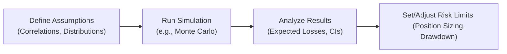

## Introduction and Overview

Scenario testing and performance simulation are at the heart of modern risk management. If you’ve ever wondered how portfolios might hold up under a market meltdown, or how they’d behave if inflation spikes faster than we expect, you’re already thinking in these terms. The idea is pretty simple: create hypothetical “what-if” scenarios, run the portfolio through them, and see where the chips fall. Then again, you know, it often ends up being more detailed and sophisticated than it sounds at first glance.

For alternative investments—where performance can be highly nonlinear, relying on less liquid assets, or on strategies such as distressed debt, private equity, or complex hedge fund trades—scenario testing becomes extra important. Collecting robust data, making realistic assumptions, and examining potential structural breaks all factor into building a reliable forecast. This helps not just in seeing potential returns but also in understanding the risk profile and how to shape it via portfolio construction.

Below, we’ll deep-dive into the techniques and best practices you need for scenario testing, from the basics of predefining market conditions to advanced Monte Carlo simulations. We’ll wrap it up with a few words on interpreting results (confidence intervals), mitigating potential pitfalls, and harnessing these insights in your day-to-day risk management. Let’s jump in.

## Scenario Analysis: A Forward-Looking Perspective

Scenario analysis is a straightforward (yet powerful) tool where you conjure up specific market conditions—like a bond market spike in yields, or a 20% market drawdown—and ask: “If this market environment materializes, how would my portfolio respond?” Some people break this down into a couple of flavors:

• Baseline Scenario: A “most likely” scenario based on current macro assumptions.  
• Bullish/Upside Scenario: A best-case environment. Maybe interest rates decline and equity markets rally.  
• Bearish/Downside Scenario: Something a bit gloomier—like a severe recession or a credit crunch.  
• Tail or Extreme Scenarios: Rare but high-impact events, often focusing on systemic market stresses.

In analyzing alternatives, you might spice these up further with conditions unique to private equity or credit—say, a drop in M&A deals or a wave of restructurings. One personal experience I had was working with a real estate fund during a property glut. Let me tell you, setting up a scenario with a sudden freeze in property transactions (where deals simply dried up) brought out so many hidden assumptions in the model—things like holding costs, the time to exit, and revaluation haircuts. Seeing everything laid out in hypothetical meltdown mode was, well, humbling and eye-opening. But that’s exactly the point: scenario testing surfaces vulnerabilities so you can address them before they become real.

## Monte Carlo Simulations: Capturing Distributional Complexity

Now, scenario analysis is great for discrete what-if events, but markets rarely play out so neatly. So we bring in Monte Carlo simulations: random sampling across thousands (or even millions) of potential outcomes.

### Why Monte Carlo?

Well, real-world returns often exhibit nonlinearities—especially in alternatives. Think of an options-based hedge fund: the payoff is not a straight line. Traditional scenario analysis might require you to guess the exact path of the underlying prices. Monte Carlo simulations, on the other hand, let you define a probability distribution of returns or price changes, and then they run thousands of hypothetical paths. This allows for complex and often non-normal return distributions.

### Basic Steps

1. Define Input Distributions  
   Choose appropriate probability distributions for each asset or factor. Are returns normally distributed, or do we see fat tails (leptokurtic distributions)? For commodities or cryptos, for instance, you might consider heavier-tailed distributions.

2. Calibrate Correlations  
   Model correlation between assets (e.g., equity funds vs. credit strategies). Remember, these correlations can shift dramatically under stress, so be mindful of potential structural breaks.

3. Run Random Draws  
   Simulate random draws from these distributions and correlation matrices. Each iteration yields one potential “future” for the portfolio.

4. Aggregate Results  
   Aggregate payoffs or net asset values over all simulated paths. You can analyze the mean return, volatility, worst-case outcomes, Value at Risk (VaR), or drawdown severity.

5. Evaluate Nonlinear Exposures  
   If you have instruments like convertible debt or options, incorporate the necessary pricing models. The payoff might be, say, zero for a large portion of the distribution but jump significantly above certain price thresholds.

Now, I’ve had times where people ran Monte Carlo simulations with distribution assumptions that were, well, let’s call them “overly generous.” The results looked so stable that it was suspicious. Turned out they’d used historical data from only two calm years, ignoring major swings and structural changes—like a sudden regulatory shift in the financial markets. The lesson? Always question your inputs!

## Historical Stress Testing: Learning from the Past

Although we can’t replicate exact future conditions, a look at real historical crises is one of the best ways to sense-check your portfolio’s vulnerabilities. Historical stress tests let us ask: “If the Dot-Com bubble or 2008 meltdown replayed itself, how would my portfolio stand?”

• 2008 Global Financial Crisis: Evaluate meltdown-level correlations, liquidity spirals, and overall re-pricing of risk.  
• Dot-Com Crash: Perfect for analyzing tech exposure and scenarios of overvalued assets losing 70%–80% in a short span.  
• COVID-19 Panic of 2020: Wildlife scenario for a black-swan type concurrency of economic freeze, supply chain disruptions, and revaluation of real assets.

Applying historical returns or factor shocks to your current portfolio is revealing. Some advanced practitioners go so far as to “overlay” multiple crisis events to further stress, but you have to be realistic. Over-lapping the 2008 meltdown with the Dot-Com crash at the same time might be instructive, but it’s also a bit unrealistic. The real world rarely piles crises so neatly—but it’s still a good eye-opener.

## Structural Breaks and Changing Market Dynamics

A crucial point in scenario testing is the recognition that correlations, volatilities, and even betas can morph when markets get rocky. In normal times, you might see a correlation of 0.2 between, say, a real estate fund and a hedge fund strategy. Then, under stress, they rocket up to 0.8 or 0.9. This phenomenon is sometimes called “correlation breakdown” but ironically, it’s more of a correlation “lockstep” in crises.

### Incorporating Structural Breaks

• **Regime-Shifting Models:** Use Markov-switching frameworks or threshold models that flip correlations and volatilities based on environment triggers (e.g., high volatility regime vs. normal regime).  
• **Adjusting for Time Varying Correlations:** Update your correlation matrix to reflect crisis states if you’re running a stress scenario.  
• **Sensitivity Testing:** If you’re not using a fancy regime model, at least vary the correlation assumptions systematically to see how sensitive your results are to correlation changes.

Trust me, ignoring structural breaks can lead to severely underestimating risk. And that’s the last thing you want when you’re building or defending an alternative investment portfolio strategy.

## Presenting Results with Confidence Intervals

After you run the analysis—whether it’s scenario-based or Monte Carlo-based—you’ll generate a new distribution of possible outcomes. Often, we talk about the final performance in terms of confidence intervals. For instance, you might say, “The expected return is 8%, but with a 95% confidence interval of ±3%.” Or for risk, “There’s a 5% chance of a drawdown exceeding 20%.” That’s basically your Value at Risk measure from a slightly different angle.

Confidence intervals highlight uncertainty. They say: “We’re pretty sure your result will land somewhere in here—but not 100% sure.” This is where the art meets science. Because if your distribution assumptions were off (maybe they’re more fat-tailed than you thought?), your real future outcome might lie outside that range. That’s not a fault of the math. It’s just the reality that all models are approximations.

## Translating Simulation Insights into Risk Limits

Okay, so you’ve done your fancy analyses. Now what?

• **Set Drawdown Thresholds:** For instance, if you find that in the worst 5% of Monte Carlo runs, you lose 15% or more, you might implement a risk limit that triggers portfolio rebalancing or hedging if your actual drawdown hits 10%.  
• **Refine Position Sizing:** If scenario tests show a certain convertible bond might blow up in a rising-rate environment, you reduce your exposure.  
• **Align with Liquidity Management:** Let’s say your scenario analysis indicates a need for immediate liquidity under stress. You might keep some portion of the portfolio in more liquid instruments (or credit lines) for a quick exit or to meet margin calls.

In my experience, scenario test results can become the backbone of a risk policy, outlining these automated triggers. It’s one thing to see “Oh, we might lose 20% in a meltdown,” but it’s another to say, “If we slip below that 20% line, we de-risk by 50% in that portion of the portfolio.”

## Quick Mermaid Diagram of the Simulation Process

Below is a simple flowchart showing how scenario testing or simulations typically feed into the overall portfolio management process:



When you actually do it, you might iterate multiple times, adjusting assumptions and re-running until you feel the scenario is realistic. But in its simplest form, that’s how the pipeline flows.

## A Tiny Python Example

Let’s say you want to simulate returns for a hedge fund that invests in a credit strategy and an options strategy. Below is a short sketch in Python:

```python
import numpy as np

np.random.seed(42)

correlation = 0.5
cov_matrix = [[1.0, correlation],
              [correlation, 1.0]]
L = np.linalg.cholesky(cov_matrix)

n_sims = 100000
credit_shocks = np.random.normal(0.05, 0.10, n_sims)  # mean 5%, stdev 10%
option_shocks = np.random.normal(0.02, 0.15, n_sims)  # mean 2%, stdev 15%

raw = np.vstack([credit_shocks, option_shocks])
corr_sims = L @ raw

portfolio_returns = 0.5 * corr_sims[0] + 0.5 * corr_sims[1]
mean_return = np.mean(portfolio_returns)
worst_5p = np.percentile(portfolio_returns, 5)

print(f"Estimated mean return: {mean_return*100:.2f}%")
print(f"Worst 5% scenario: {worst_5p*100:.2f}%")
```

This simplistic snippet randomizes returns for two strategies, imposes correlation, and invests 50% in each. Then it calculates the average return (which might be around your expected 3–4% range, given those assumptions) and the worst 5% outcome. Of course, in real life, you’d refine your distribution assumptions, correlation structures, and possibly incorporate more complex payoffs.

## Common Pitfalls and Best Practices

• **Over-Reliance on Historical Correlations:** As we’ve discussed, correlations can transform in crisis.  
• **Labelling Bias Scenarios as “Unlikely”**: Sometimes people dismiss extreme events as “that’ll never happen.” But tail events do happen—just not very often.  
• **Ignoring Nonlinearities**: In alternative investments, if you have derivatives or complex capital structures, linear approximations can be dangerously misleading.  
• **Poor Data Quality**: Garbage in, garbage out. If your input data is incomplete or incorrectly measured, your results won’t be worth much.

### Best Practices

• **Use Mixed Approaches**: Combine scenario analysis, Monte Carlo, and historical stress testing. Each offers a unique angle.  
• **Validate Models Regularly**: Back-test with real data or use alternative data sets to confirm your approach.  
• **Communicate Clearly**: Senior management or clients need to understand not just the results but also the assumptions and limitations.  
• **Iterate Frequently**: The market is dynamic; your scenario analysis shouldn’t be a “set it and forget it” exercise.

## Exam Tips and Practical Guidance

– **Link to Risk Management**: On exams, scenario testing often links directly to risk management solutions. Show how to tie your scenario analysis results back to real-life action, like hedging or rebalancing.  

– **Quantify and Compare**: If you’re asked about scenario analysis, apply numerical examples. For instance, illustrate how returns shift and identify which scenario leads to the highest risk.  

– **Address Data Limitations**: The exam might test your understanding of correlation changes or tail risk. Be prepared to talk about structural breaks and how you might handle them.  

– **Time Management**: In scenario-based exam questions, you might be given lots of detail about crisis conditions. Summarize effectively and highlight the biggest moves or correlations first.  

Ultimately, whether you’re on the exam or in real practice, scenario testing is about bridging the gap between theoretical risk/return assumptions and the messy real-life market. Embrace that nuance, and you’ll go far.

## References

- GARP (Global Association of Risk Professionals): Value at Risk and Stress Testing Resources. Visit: https://www.garp.org/  
- Şahin, J., & Jobst, R. (Eds.). (2021). Handbook of Financial Stress Testing.  
- Pfaff, B. (2019). Financial Risk Modelling and Portfolio Optimization with R. Wiley Finance Series.  

----------------------------------------

## Test Your Knowledge: Performance Simulation and Scenario Testing



### Which of the following best describes a primary advantage of scenario analysis for alternative investment portfolios?

- [x] It allows investors to explore how portfolio values could change under specific market conditions.
- [ ] It guarantees an exact prediction of future outcomes based on past market trends.
- [ ] It completely replaces the need for historical return data.
- [ ] It cannot incorporate rising rate or recession scenarios due to data limitations.

> **Explanation:** Scenario analysis is a flexible tool for investigating how portfolios might behave under predefined conditions, although it does not guarantee outcomes.

---

### When conducting a Monte Carlo simulation, which step is most critical in modeling correlation shifts during stressful market periods?

- [ ] Using a fixed correlation matrix based on the previous two years of data.
- [x] Employing regime-switching models or adjusting correlations to reflect potential structural breaks.
- [ ] Relying on a constant correlation across all simulations to simplify.
- [ ] Ignoring correlation shifts because stressed markets are rarer than normal markets.

> **Explanation:** In times of crisis, correlations often increase significantly. Accounting for regime shifts ensures a more realistic simulation.

---

### Which statement about historical stress testing is most accurate?

- [ ] It only uses hypothetical data to create potential crisis scenarios.
- [x] It replays actual past market crises onto a current portfolio to estimate potential results.
- [ ] It requires advanced Monte Carlo techniques to simulate new correlations.
- [ ] It is less reliable than scenario analysis because crises never repeat.

> **Explanation:** Historical stress tests use real crisis data (e.g., the 2008 meltdown) and apply that environment to today’s portfolio. This helps reveal vulnerabilities to similarly severe market conditions.

---

### In a performance simulation context, confidence intervals:

- [x] Provide a range of possible outcomes along with their estimated probability.
- [ ] Guarantee that actual performance will always fall within the calculated bounds.
- [ ] Are less relevant for alternative investments than for traditional stock portfolios.
- [ ] Cannot be applied to non-normally distributed results.

> **Explanation:** Confidence intervals illustrate the uncertainty around estimated values. While not guaranteed, they are crucial for understanding possible performance outcomes in any asset class.

---

### Suppose you’ve run a scenario test for a real estate fund under extreme liquidity stress, and the results show a 25% drawdown in a “worst-case scenario.” How might you directly use this outcome to mitigate risk?

- [x] Set a risk limit that triggers partial liquidation once the fund experiences a 15% drawdown in real time.
- [ ] Dismiss the scenario as improbable and leave exposures as they are.
- [ ] Double the fund’s concentration in the riskiest assets to recover losses quickly.
- [ ] Ignore it, because drawdowns of that magnitude are never repeated historically.

> **Explanation:** Scenario test insights are often used to establish risk limits so that corrective measures (like partial liquidation) can be triggered if the portfolio drawdown nears an extreme level.

---

### When performing Monte Carlo simulations, why is it essential to validate input data?

- [x] The accuracy of distributions, correlations, and assumptions directly affects the realism of simulated outcomes.
- [ ] Because simulations can run without any data.
- [ ] Validation is optional if the model is advanced.
- [ ] Validation only matters for equities, not alternatives.

> **Explanation:** “Garbage in, garbage out” is a key principle. If your input data is poor or unrealistic, your simulated performance results will be unreliable.

---

### What is the best rationale for mixing scenario analysis, Monte Carlo simulations, and historical stress testing?

- [x] Each approach sheds light on a different aspect of potential risk and return, ensuring a more comprehensive assessment.
- [ ] It is mandated by regulation in most jurisdictions.
- [ ] Combining them instantly eliminates all portfolio tail risks.
- [ ] The more methods, the more complicated the results, which always yields better insights.

> **Explanation:** No single approach can capture every market nuance. A blended method offers a more robust perspective on potential outcomes.

---

### A structural break in the context of performance simulation refers to:

- [ ] An intentional policy change by the central bank to lower rates.
- [x] A sudden shift in the relationships or correlations between market variables.
- [ ] The meltdown of hardware during high-volume trading.
- [ ] A bug in the Monte Carlo simulation code.

> **Explanation:** Structural breaks happen when historical relationships (like correlations) no longer hold, often triggered by major market changes or crises.

---

### Which of the following is an example of a “tail or extreme event” scenario?

- [ ] Slightly higher-than-expected GDP growth.
- [ ] A neutral scenario where the market follows average past returns.
- [ ] A minimal interest rate move of 5 basis points.
- [x] A sudden, severe equity crash of more than 30% within a week.

> **Explanation:** Tail events are highly unlikely but potentially catastrophic, such as a sudden and significant market drop that is outside normal volatility.

---

### True or False: Scenario testing can help in setting drawdown thresholds and adjusting portfolio allocations accordingly.

- [x] True
- [ ] False

> **Explanation:** Scenario testing reveals which conditions might trigger large losses, providing insights that inform the definition of drawdown thresholds and any proactive portfolio changes.


