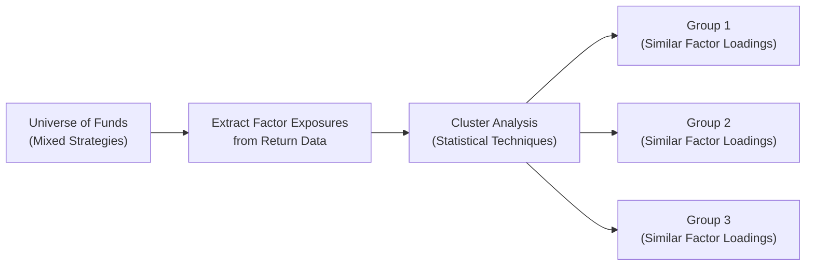

Introduction  
Peer group analysis, for many of us, starts off as a pretty standard exercise: we gather returns from a set of funds or investment managers, slice and dice them by strategies, and then examine how a focal fund stacks up. But as we expand our horizons within alternative investments—ranging from hedge funds and private equity to real assets and digital token strategies—things can get quite complicated. Suddenly, the conventional approach of grouping managers by label alone (e.g., “Long/Short Equity” or “Buyout”) isn’t nuanced enough. Maybe you’ve seen a private equity firm with a mid-market buyout strategy that invests exclusively in green energy deals, while another “mid-market buyout” firm dabbles in tech turnarounds. In practice, they’re worlds apart.  

That’s why we must move beyond simple return-based clustering and adopt advanced peer group analysis. In this segment, we’ll dive into factor-based clustering, explore how vintage year comparisons add clarity (especially in private equity), use advanced risk metrics, and highlight the intangible but important qualitative measures like operational due diligence and team structure. Along the way, we’ll talk about some real examples I’ve encountered (without naming names, of course) and highlight best practices for building robust peer groups.

The Concept of Advanced Peer Group Analysis  
Peer group analysis is fundamentally about establishing a fair and constructive comparison set. Suppose you have 100 managers labeled “global macro.” The label itself might lump them together, but we know that within global macro strategies, differences in discretionary vs. systematic approaches, leverage usage, liquidity terms, exposure to emerging markets, and the like can push you toward apples-to-oranges comparisons.

Advanced peer group analysis acknowledges these subtleties and uses robust techniques to cluster managers who genuinely share a similar profile of risk, factor exposures, vintage year, geographies, or investment philosophies. It also merges the quantitative side (annualized returns, Sharpe ratios, alpha, drawdowns) with the qualitative aspects (such as operational due diligence outcomes, team tenure, or even manager reputation).  

Segmentation by Strategy, Leverage, and Liquidity  
In practice, the first layer of advanced segmentation often revolves around strategy type, leverage usage, and liquidity terms.

• Strategy Type: We no longer settle for a broad catch-all label. We refine definitions, such as “Long/Short Equity—Tech Focus” or “Global Macro—Systematic Commodity Bias.” This approach helps us align the actual universe of managers with the relevant strategy.  

• Leverage Usage: We might examine funds that typically hold net leverage exceeding a certain threshold (e.g., 2:1) vs. those with minimal or no leverage. Honestly, it’s unfair to compare a no-leverage, long-biased strategy with a high-leverage, neutral investment approach.  

• Liquidity Terms: Some funds offer monthly liquidity, others require multi-year lock-ups, and private equity vehicles have capital commitments drawn down over three to five years. Because liquidity risk is so central to investor decisions, advanced analyses group funds with (broadly) comparable lock-up structures.  

Factor-Based Clustering  
Factor-based clustering is a technique that uses statistical methods (like principal component analysis or cluster analysis) to identify groupings of managers based on the factors driving their returns, rather than on superficial categories. In other words, we look under the hood.

For instance, two “Global Macro” funds might share an obsession with interest rate momentum trades. If we regress their returns against a small set of identified factors—like global interest rate movements, equity volatility, and commodity price shifts—we might find both funds load heavily on interest rate slope factors. They end up in the same cluster, even if they market themselves differently.

Here’s a simple conceptual diagram in Mermaid format showing how multiple strategies might be clustered into peer groups based on factor exposures:



Each group here represents a factor-based cluster. This approach helps us weed out superficial category labels and unify managers who actually move in sync with each other.

Integrating Qualitative and Quantitative Elements  
“Okay,” you say, “but what about the team behind these returns? And the manager’s operational infrastructure?” Great point. Advanced peer group analysis doesn’t stop with fancy factor models. It also incorporates:

• Manager Tenure and Team Structure: A stable, experienced team with a decade of continuity might be less risky (operationally) than a fresh team assembled only 12 months ago.  

• Operational Due Diligence (ODD) Scores: Some large investors and consultants assign an ODD grade (e.g., Low, Medium, High risk) to each fund after carefully reviewing compliance, trading operations, internal controls, business continuity, and so on. Two managers who appear similar from a performance perspective might differ drastically in ODD.  

• Track Record Consistency and Governance: Have they consistently applied the same strategy over time, or pivoted drastically during shifting markets? And how robust is the fund’s governance structure? Oddly enough, these intangible elements can heavily influence peer group definitions.

Vintage Year Comparisons (Especially in Private Equity)  
If you’ve spent time in private equity, you’ve probably heard of “vintage year distortions.” For example, a buyout fund launched in 2009 might catch a wave of post-crisis undervaluation, while a 2007 vintage fund invests at peak market valuations just before the downturn. By grouping private equity funds (and other closed-end structures) according to their vintage year, we can better isolate performance differences that arise from broader macroeconomic conditions at inception, rather than the fund’s skill alone.

So yes, comparing a 2007 vintage fund to a 2009 vintage fund has some value—but so does comparing all 2007 vintage funds to each other, to see who navigated the global financial crisis best. This is typically how advanced peer group analysis in private markets proceeds.  

Differences in Geographic Focus and Stage  
Even within a single vintage year, differences in geographic focus (e.g., Asia vs. North America) or stage in the business cycle matter. For instance, if you’re looking at venture capital, an early-stage technology fund in the U.S. may behave quite differently from a growth-stage fund in Europe. Typically, advanced peer group analysis accounts for geography and stage focus:

• Emerging vs. Developed Markets: Some funds concentrate on rapidly expanding, less efficient capital markets. Others remain in well-established, highly competitive regions.  

• Stage Focus: A vintage 2015 buyout fund that invests in established mid-market companies is hardly comparable to a 2015 early-stage venture capital fund in cybersecurity.  

Evaluating Advanced Metrics  
Once we’ve formed a refined peer group—one that’s truly “fair”—we apply advanced metrics:

• Risk-Adjusted Alpha: A measure that strips out factor exposures and shows how the manager performed relative to a relevant factor benchmark or a combination of standard risk factors.  

• Drawdown Risk: That painful measure of how much the fund declined from a peak to a trough. If a manager’s strategy is designed for capital preservation, maybe we weigh drawdown risk more heavily than if it’s a high-octane approach.  

• Implied Liquidity Costs: For private or less-liquid funds, we can estimate the cost or friction of trying to sell the position in a secondary market.  

Case Study Example:  
Imagine a hypothetical scenario with three private equity funds, all labeled “mid-market buyout,” each with a 2018 vintage:

1. Fund A invests in healthcare deals in Latin America, has moderate leverage usage, and a 10-year lock-up. The team has a proven track record in South American emerging markets.  
2. Fund B invests in tech-enabled manufacturing in Western Europe, has slightly higher leverage than peer norms, and operates with an 8-year lock-up but allows limited partner extensions.  
3. Fund C invests in a diverse global portfolio but heavily focuses on real estate–based operating companies, with about half the deals in Asia.  

If we just compare their IRRs side by side, we get a partial story. Once we factor in their specific geographic risks, different lock-up terms, and leverage usage, we might refine their “common ground” or realize that Fund C doesn’t belong in the same peer group at all.  

Tracking Peer Group Membership Over Time  
An interesting twist is that peer group membership itself can evolve. Some funds close or merge, while new ones pop up each year. When you’re analyzing performance data over a long span, you need to keep track of changes in the underlying membership to avoid survivorship bias or artificially skewed results (because poorly performing funds tend to drop out).  

One technique is to create a “rolling peer group” that keeps monthly or quarterly tabs on who’s in the sample. For private managers, we might track partial liquidation or spin-offs that effectively shift the approach.  

Multifaceted Perspective: Combining Peer Group with Style and Attribution  
Peer group analysis is one dimension. But for a truly holistic perspective, you might incorporate style analysis (are they truly value-biased or growth-biased? Are they momentum-driven?), factor-based returns decomposition, and risk attribution to see precisely why a manager outperforms or underperforms peers. 

When you present results to an investment committee, combining these elements is critical. For instance, a manager might be outperforming the peer group because of persistent factor tilts—this might suggest the manager isn’t adding true alpha, but just taking on systematic exposures that are paying off. Conversely, a manager might show an incredible Sharpe ratio relative to peers, but if an ODD review warns of operational weaknesses, your committee might pass on that manager.

Practical Example with Python Pseudocode  
Although each investment firm’s approach will differ, here’s some pseudocode that outlines how one might do factor-based clustering:

```python
import pandas as pd
import numpy as np
from sklearn.cluster import KMeans

# We also have identified risk factors "df_factors" which might include equity, credit, interest rate, etc.

factor_loadings = []
for fund in df_returns.columns:
    # Simple linear regression to find loadings (very simplified approach)
    # In reality, you'd want a rolling window or a more robust factor model
    X = df_factors.values
    y = df_returns[fund].values
    # Solve for loadings using OLS: Betas = (X'X)^(-1) X'y 
    betas = np.linalg.inv(X.T @ X) @ X.T @ y
    factor_loadings.append(betas)
    
loadings_array = np.vstack(factor_loadings)

kmeans = KMeans(n_clusters=3, random_state=42).fit(loadings_array)
labels = kmeans.labels_

fund_clusters = pd.DataFrame({
    'Fund': df_returns.columns,
    'Cluster': labels
})

print(fund_clusters)
```

This basic snippet highlights how you might segment a set of managers into three factor-driven clusters. In practice, you’d refine the factor model, add robust standard errors, possibly incorporate a dynamic factor approach, and combine the final clusters with those essential qualitative pieces we discussed earlier.

Common Pitfalls and Challenges  
• Overreliance on Labels: Using “hedge fund style boxes” or “PE categories” at face value can obscure real differences.  
• Survivor Bias: If your advanced peer group excludes funds that have closed poorly, your results can inflate real returns.  
• Too Many Factors: Overfitting can occur when your factor model tries to incorporate too many variables, leading to spurious clusters.  
• Not Factoring in ODD: Two managers with identical net returns might differ dramatically in operational quality, which is a crucial differentiator.  
• Ignoring Vintage Year: For private equity or closed-end funds, ignoring the macro environment at inception can paint an inaccurate picture of performance.  

Practical Exam Tips  
• Carefully interpret performance in the context of each fund’s cluster. On a CFA exam question, you might be asked to identify the “most appropriate” peer group for a given scenario.  
• Expect to combine knowledge of factor exposures with operational due diligence or real estate/infrastructure specifics. The exam often includes multi-part item sets that test your ability to handle layered data.  
• If you see a question on vintage years, remember that comparing funds solely on IRR across vintages might be incomplete without acknowledging underlying macro conditions.  
• Watch out for hidden biases: e.g., a question might illustrate how manager turnover or a change in redemption frequency justifies removing a manager from an existing peer group.  

Conclusion  
Advanced peer group analysis offers a multi-layered, rigorous approach to manager evaluation in alternative investments. It’s about delving beyond superficial labels like “private equity” or “hedge fund” and understanding a fund’s real factor exposures, risk metrics, operational posture, liquidity parameters, vintage year, and more. This type of analysis helps you form a robust vantage point on manager performance, ultimately leading to better allocation decisions and risk management.  

References and Further Reading  
• “Private Equity at Work: When Wall Street Manages Main Street” by Eileen Appelbaum and Rosemary Batt  
• Data providers such as Burgiss, Preqin, Cambridge Associates for advanced peer group analytics  
• “Advanced Portfolio Analysis and Modeling” by Giuseppe A. Paleologo  

--------------------------------------------------------------------------------

## Test Your Knowledge: Advanced Peer Group Analysis Quiz



### Which of the following statements best captures the essence of factor-based clustering in peer group analysis?

- [ ] It relies solely on labeling managers by broad strategy categories like “Long/Short Equity.”
- [ ] It involves sorting managers by total returns without considering risk.
- [x] It groups managers based on shared underlying exposures to risk factors.
- [ ] It groups managers by their vintage year and geographic focus exclusively.

> **Explanation:** Factor-based clustering identifies managers with similar factor exposures (e.g., equity beta, credit spreads), moving beyond simple strategy labels.

### When performing advanced peer group analysis in private equity, why is the concept of the “vintage year” so critical?

- [x] It helps account for macroeconomic conditions at the time the fund began investing.
- [ ] It determines the legal structure of the fund’s partnership agreements.
- [ ] It ensures that managers have identical lock-up periods.
- [ ] It automatically adjusts for leverage usage.

> **Explanation:** The vintage year is crucial because funds launched during different economic cycles can face drastically different valuation environments. Comparing funds within the same vintage year makes performance benchmarking more accurate.

### Which of the following best illustrates the role of operational due diligence (ODD) in advanced peer group analysis?

- [ ] ODD strictly deals with legal structures and compliance.
- [ ] ODD measures only the ROI potential of a fund.
- [ ] ODD is unnecessary for well-known funds.
- [x] ODD provides qualitative insight on a fund’s operational risk and infrastructure, enhancing the comparison process.

> **Explanation:** ODD evaluates a fund’s operational risks, controls, and infrastructure—important qualitative factors that often set seemingly similar funds apart.

### What is the primary benefit of segmenting peer groups by liquidity terms?

- [ ] To exclude hedge funds entirely from the analysis.
- [ ] To guarantee higher returns across the group.
- [x] To compare funds under similar redemption and lock-up structures.
- [ ] To measure each fund’s operational costs more accurately.

> **Explanation:** By grouping funds with similar liquidity terms, analysts ensure that the comparison is truly fair in terms of redemption frequency, lock-up periods, and overall liquidity risk.

### How might “drawdown risk” be used to refine a peer group analysis for a set of hedge funds?

- [x] Highlighting funds prone to large peak-to-trough losses during stressed markets.
- [ ] Eliminating all funds with a negative track record.
- [x] Grouping funds that experience similar drawdown characteristics.
- [ ] Ignoring differences in strategy exposures.

> **Explanation:** Drawdown risk is a metric that can indicate how severely a manager fares during market downturns, refining comparisons among funds with similar volatility profiles.

### Which of these statements is true regarding factor-based clustering?

- [x] It can reveal that two funds marketing different strategies actually share common factor exposures.
- [ ] It only applies to private equity funds.
- [ ] It relies purely on qualitative assessments.
- [ ] It focuses exclusively on manager tenure.

> **Explanation:** Factor-based clustering is a quantitative process that groups funds according to similar factor loadings, which sometimes reveals similarities that are not apparent by strategy label.

### In tracking changes to peer group membership over time, which bias becomes especially relevant?

- [ ] Recency bias
- [x] Survivorship bias
- [ ] Measurement bias
- [ ] Reverse data-snooping bias

> **Explanation:** As funds drop out of the universe—often due to poor performance—survivorship bias can skew observed performance results for the remaining peer group.

### Why might advanced peer group analysis incorporate style analysis and attribution?

- [x] To gain a multi-dimensional view of why a manager outperforms or underperforms peers.
- [ ] To eliminate factor exposures from the data set.
- [ ] To standardize returns to zero over time.
- [ ] To remove the vintage year from the data.

> **Explanation:** Style analysis and attribution show which factors or strategy tilts drive returns, offering a clearer understanding of each manager's skill and risk-taking behavior in relation to peers.

### What is one potential pitfall of overreliance on labels such as “Long/Short Equity” when forming peer groups?

- [ ] They never accurately describe actual holdings.
- [x] Labels may be too broad and hide significant underlying strategy or factor differences.
- [ ] Regulators discourage using cluster analysis.
- [ ] It generates perfect peer group matching automatically.

> **Explanation:** Simple manager labels can mask meaningful differences in factor exposures, leverage, or market focus, leading to misleading comparisons.

### True or False: In advanced peer group analysis, comparing a global macro fund to a high-leverage long/short fund is automatically considered valid if they both operate under the same lock-up period.

- [ ] True
- [x] False

> **Explanation:** Funds can share the same lock-up period but still have drastically different factor exposures and risk profiles, making direct comparisons misleading.


