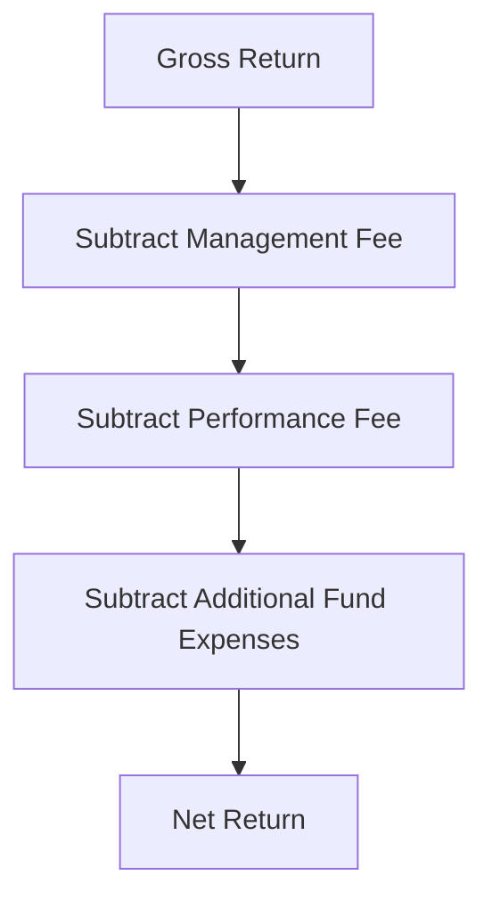

## Overview and Importance

One of the most important (and often underappreciated) parts of evaluating any investment—especially in alternative assets—is determining the difference between gross returns and net returns. You might hear folks brag about a 15% annual performance, but when you dig into the real numbers (like management and performance fees, and those sneaky administrative costs), you realize their take-home net return was quite a bit lower. And, hey, if you’re an investor, net return is ultimately what hits your pocketbook—gross returns are fine for measuring a manager’s pre-fee performance, but net returns tell you the real story of profits after everything is paid out.

In this section, we’ll walk through what gross and net returns really are, explore how fees and expenses are calculated, discuss some common pitfalls in fee reporting, and provide a few pointers on verifying calculations to be sure the displayed performance truly reflects what you, as an investor, actually receive.

## Distinguishing Gross vs. Net Returns

Before we get too deep, let’s nail down the difference between gross and net returns:

• Gross Return: The return on an investment before you deduct any fees, performance-based compensation, or other expenses.  
• Net Return: The return that remains in your hands after all fees, expenses, and performance-based compensation are subtracted.  

It’s that second one—net return—that actually matters to investors. Picture it like your take-home pay from a job. The “gross salary” might look impressive on paper, but you can’t buy your groceries with the portion that goes to taxes and benefit contributions. Similarly, you can’t spend the chunk that goes to sub-advisors, custodians, fund administrators, or the portfolio manager.

## How Fees Affect the Investor Experience

When it comes to alternative investments, fees can significantly shape the actual value you get. You might recall from Chapter 2.1 that alternative strategies often come with more complex fee structures compared to plain-vanilla mutual funds. Let’s break down the key types:

### Management Fees

Typically a fixed percentage of assets under management (AUM)—say, 1% to 2% per year—charged by the investment manager. Management fees might be billed monthly or quarterly, and the frequency of billing can introduce subtle but important compounding effects.

### Performance Fees (Carried Interest / “Carry”)

This is where it gets interesting (and sometimes a bit controversial). Performance fees, or carry, represent a share of the fund’s profits that the manager takes if they exceed certain hurdles or performance targets. Hedge funds might say, “2 and 20,” meaning 2% management fee plus 20% of any gains. Meanwhile, private equity and venture capital managers often refer to “carried interest” of around 20% as well, though the structure might involve a preferred return or high-water mark.

### Transaction Costs and Administrative Expenses

These costs can include brokerage commissions, custodial fees, accounting fees, auditing fees, and so forth. Although these might look minor, they add up. For instance, if you’re an investor in a private equity fund, that fund might also charge partnership administrative costs, legal fees, and more. Everything eventually funnels down to the net performance number.

## Traditional Calculation Methods: Monthly vs. Annual Fees

Let’s compare a simplified scenario: two funds, each with a 2% management fee on an annual basis. Fund A charges this fee just once at year-end, while Fund B charges 1/12 of this 2% each month. The difference might seem minimal at first, but the monthly deduction reduces the asset base more frequently, which can lead to a slightly lower overall return. That’s because each monthly fee is effectively “compounding” in its own subtle way:

• Fund A: Calculates management fee at the end of the year on the total year-end AUM.  
• Fund B: Calculates 1/12 of the 2% each month, decreasing the principal monthly, which might reduce compounding potential (since you have a bit less capital compounding each month).  

If you’re expecting a certain gross return, that difference in fee timing can shave off an extra fraction of a percent each year compared to a single annual deduction. It’s small on a short horizon, but over five or ten years it can become meaningful.

## Compounding Impact of Fees

Now, let’s illustrate a hypothetical scenario to drive home the impact of fee compounding. Suppose you invest $1,000,000, and the portfolio earns a gross return of 10% per year for five years. Let’s call this “Scenario X.” We’ll assume a 2% annual management fee, with two possible fee-charging schedules:

1. Single annual deduction.  
2. Monthly deduction.

We won't run through a giant table here, but trust me: after five years, the difference in net accumulation—just from the frequency of fee deductions—can be a few percentage points on your final portfolio value. In the grand scheme of things, that might be tens of thousands of dollars or more. So next time you see a “2% management fee,” be sure to check how and when it’s applied. You’ll be surprised how subtle differences add up.

## Expense Items Beyond Performance and Management Fees

It’s not just the management fee or performance fee you must worry about. Many limited partnership agreements (LPAs) in private equity or hedge funds contain an entire breakdown of “Partnership Expenses.” These often include:

• Administrative Costs (like fund administration or bookkeeping).  
• Custody Fees.  
• Legal / Regulatory Fees.  
• Audit and Tax Preparation.  
• Organizational Expenses.

All or some of these might be charged to the investor. Sometimes it goes under the heading “Expense Ratio.” In some cases, each share class in a hedge fund or each group of investors in a private equity fund might be allocated a slightly different portion of these costs, leading to various net returns across share classes (even in the same fund).

## Potential Conflicts of Interest 

You know, not everyone is fully transparent about fees. I once had a friend invest in a private equity fund that proudly touted a 15% IRR, but it turned out they were reporting figure after “management fees” but before a big chunk of performance fees. So the “real” net IRR was actually closer to 12%. Depending on how a manager chooses to report, the difference between gross returns and net returns may be “forgotten” or buried in footnotes.

• Managers can be tempted to highlight a higher gross figure to attract investors.  
• Sometimes, expense reimbursements or offsets can mask the real net return.  
• Marketing materials might emphasize one measure, while official statements focus on another.

This is why reading the fine print and verifying how fees are calculated is crucial. If you are a fiduciary, it’s part of your responsibility to ensure transparency for your stakeholders.

## Verifying Calculations for Different Share Classes

Many funds come in multiple share classes, each with distinct fee schedules. For instance:

• Class A: 2% management fee, 20% carry, high-water mark.  
• Class B: 1.5% management fee, 25% carry, and a 6% preferred return.  

Each share class might produce a different net return. This scenario is often found in larger hedge funds or private equity structures that want to offer lower management fees but a higher performance fee for institutional clients. Or they introduce a hurdle rate, meaning the fund must earn above, say, 5%, before a performance fee is taken. All of these variations make net return calculations more complicated—and more crucial to get right.

If you’re looking at a fund’s data, you want to confirm that the net return corresponds to the share class you’re being offered. Sometimes a marketing pitch or pitch deck displays the performance of the “founder share class,” which might have near-ideal fee arrangements that you, as a new investor, can’t actually get.

## Standardizing Gross and Net Performance Disclosure

Given these challenges, many professional organizations (including the CFA Institute) recommend standardized disclosures. Under such guidelines, you might see both gross returns and net returns right there in a table, along with the fees and expenses that differentiate the two. This is extremely valuable. You can confidently compare a manager’s performance to your other holdings or to industry benchmarks. If a manager resists providing net returns or doesn’t provide a thorough breakdown of the fees, that should raise a red flag.

## Role of Performance-Based Fees in Net Return Variability

Performance fees add complexity to net returns—and can lead to modest or very large swings in manager compensation, depending on market conditions. In a strong year, the manager might earn a hefty chunk of profits. However, if the fund has a “high-water mark” provision, the manager may only earn a performance fee if the portfolio’s net asset value (NAV) surpasses a previous peak. This performance-based compensation model is meant to align investment manager incentives with investor outcomes, but it can also create year-to-year volatility in reported net returns.

### Example: Carried Interest in Private Equity

Let’s say you commit $1 million to a private equity fund that charges a 2% annual management fee on committed capital (during the investment period) and 20% carried interest (performance fee) on realized profits—provided the fund’s total return exceeds a hurdle of 8% IRR. Suppose the investment does quite well, hitting a 15% IRR at the end of the fund’s life. That extra 7% above the hurdle might subject you to a 20% performance fee. Your net returns, therefore, might dip by a few percentage points due to that carry. While you’re still making a healthy profit, you absolutely want to confirm how that carry is calculated. Are there catch-up provisions or clawbacks? Is it distributed deal by deal, or on the entire fund’s performance at wind-up?

## Practical Example of Gross vs. Net Return Calculation

Let’s walk through a simplified numeric scenario:

1. Gross performance on the portfolio: 12% in one year.  
2. Management fee: 2% of year-beginning AUM.  
3. Performance fee: 20% of profits over a 5% hurdle.  

Step 1: Start with $1,000,000.  
Step 2: End-of-year gross return = $1,000,000 × (1 + 12%) = $1,120,000.  
Step 3: Management fee = 2% × $1,000,000 = $20,000.  

So net of management fee only, your portfolio is $1,100,000.

Step 4: Calculate performance fee eligibility. The profit over the 5% hurdle is 7%. So, the “excess profit” on your starting principal is 0.07 × $1,000,000 = $70,000.  
Step 5: Performance fee = 20% × $70,000 = $14,000.  

So net, after performance fee, the portfolio is $1,100,000 – $14,000 = $1,086,000. That’s your net value at year-end, equating to an 8.6% net return (instead of 12%).

Again, this is a bare-bones example, ignoring monthly/quarterly fee nuances or additional fund-related expenses. Real scenarios can be more involved, but the principle stands: net return is the final figure once fees do their work on the gross performance.

## Diagram: Gross Return to Net Return

Below is a simple flow diagram illustrating how we move from gross return to net return. While you won’t pick up every single detail of monthly vs. annual fees or management vs. admin costs, it gives a quick snapshot.

Each deduction step might be subdivided based on the specifics of the fund’s operating agreement, monthly vs. annual charges, or a performance-based threshold.

## Common Pitfalls and Best Practices

• Overlooking Transaction Costs: Brokers and custodians can chip away at returns. Even small transaction fees can compound.  
• Not Reading the Fine Print: If you skip the footnotes in a private placement memorandum or LPA, you might miss hidden fees.  
• Confusing Gross Returns with Net Returns in Marketing Materials: Some managers highlight gross returns, burying the net returns in less conspicuous areas.  
• Ignoring Different Fee Structures in Various Classes: One share class’s net return can look better or worse than another’s. Always check which track record you’re examining.  
• Not Verifying Performance Fee Terms: Incentive fees can reset, or a manager may have a high-water mark arrangement. Understand how these structures can shift net results.

**Best Practices**  
• Demand Transparent Reporting: Request breakdowns for each fee category.  
• Align Frequencies: Use consistent monthly or quarterly statements that match the manager’s accounting frequency.  
• Cross-Check with Benchmarks: Compare net returns to an appropriate benchmark net of fees.  
• GIPS or Standardized Reports: Look for GIPS-compliant (or similar) performance presentations that show both gross and net returns.  
• Independent Verification: Third parties can validate performance calculations and help ensure that the reported net returns are accurate.  

## Conclusion

Calculating gross vs. net returns may sound simple, but it quickly grows complicated when layered with management fees, performance fees, administrative expenses, and the finer points of share-class structures. Ultimately, net return is what really matters for investors. To make well-informed decisions, you need to dig beneath any flashy gross performance metrics and understand exactly what portion of the gains actually arrives in your account.

If you’re evaluating alternative investment vehicles—be it hedge funds, private equity, real estate partnerships, or even structured products—never hesitate to ask for net return histories and thorough fee disclosures. Doing so helps ensure that the performance figures you see reflect the outcome you’d truly get.

## Glossary

• Gross Return: Return on an investment before deducting fees and expenses.  
• Net Return: Return on an investment after deducting all fees, expenses, and performance-based compensation.  
• Management Fee: A fixed fee, typically a percentage of assets under management, charged by the fund manager.  
• Performance Fee (Carry): Variable fee based on the fund’s profits that may include hurdles or high-water marks.  
• Share Class: Different categories of shares offering varying fee structures or privileges within the same fund.  
• Carried Interest: The portion of the profits paid to the manager in private equity or hedge fund structures, often 20% of the upside.  
• Expense Ratio: The annual operating expenses of a fund expressed as a percentage of average net assets.  
• High-Water Mark: The highest peak in value that a fund has previously achieved, used for future performance fee calculations.

## References for Further Study

• CFA Institute “Asset Manager Code” – Provides broad standards and best practices for fee transparency and ethical conduct:  
  https://www.cfainstitute.org/en/ethics-standards/codes/asset-manager-code  

• “Handbook of Hedge Funds” by François-Serge L’habitant – Delves deeper into hedge fund structures, including fee mechanisms and performance calculation.  

• “Private Equity Demystified” by John Gilligan and Mike Wright – Explores fee structures, carried interest, and net return mechanics in private equity.  

If you want real-life practice dissecting fee schedules, check out actual private placement memorandums. Although many are confidential, you can sometimes find heavily redacted versions posted by institutional state pension funds. They’re a goldmine for seeing how fees are spelled out in the real world.

## Test Your Knowledge: Gross vs. Net Returns in Alternative Investments



### Which statement best describes gross return?

- [x] It is the return before fees, expenses, and performance compensation.
- [ ] It is the return that an investor actually receives after all deductions.
- [ ] It always includes administrative fees but excludes performance fees.
- [ ] It is always higher than the reported net asset value (NAV).

> **Explanation:** Gross return focuses purely on the performance of the underlying investment before costs are extracted. It does not incorporate management fees, performance fees, or other expenses.

### What is the primary impact of fees charged monthly instead of annually?

- [x] They slightly reduce the return due to more frequent deductions of principal.
- [ ] They have no difference at all because the annual fee percentage remains the same.
- [ ] They yield a higher net return to investors due to compounding.
- [ ] They only affect retail investors, not institutional ones.

> **Explanation:** Because monthly fees reduce the amount of money invested earlier, they effectively lower the amount that compounding can work on compared to a single deduction at year-end.

### In a private equity structure with a “2 and 20” fee, what does the “20” represent?

- [ ] Twenty basis points of management fees on total capital commitments.
- [ ] A 20% charge on all committed capital.
- [x] A 20% performance fee on profits, often above a hurdle rate.
- [ ] The annual admin fee for the partnership, typically on net profits.

> **Explanation:** In a “2 and 20” model, the “20” refers to the carried interest (performance fee) that the manager receives from the profits.

### Which type of fee might be triggered only if the investment surpasses a designated threshold?

- [ ] Management fee
- [ ] Custody fee
- [x] Performance fee with a hurdle
- [ ] Transaction fee

> **Explanation:** A performance fee with a hurdle rate activates only when performance exceeds that threshold, aligning the manager’s compensation with superior investment results.

### Which item typically appears in an “Expense Ratio” but does not generally appear in a “Carried Interest” calculation?

- [ ] High-water mark
- [ ] Hurdle rate
- [x] Administrative costs
- [ ] Profit-sharing agreement

> **Explanation:** Administrative costs (e.g., fund administration, auditing) usually factor into the total expense ratio and are not included in the manager’s share of profits under carried interest structures.

### In hedge funds, how can different share classes impact net returns?

- [ ][ All share classes within a hedge fund must charge identical fees by law.  
- [x] Different share classes often have different management/performance fee arrangements.  
- [ ] The existence of multiple share classes does not affect net returns.  
- [ ] Share classes only matter for marketing materials but not actual investment outcomes.

> **Explanation:** Hedge funds can create multiple share classes to appeal to different investor bases, each with fees and features that produce different final net returns.

### What is the function of a high-water mark in a performance fee schedule?

- [ ] It raises the stated total AUM by an extra adjustment factor.  
- [x] It ensures the manager does not earn a performance fee again until recovering previous declines.  
- [ ] It prevents the investor from paying any administrative fees.  
- [ ] It caps the amount of management fee the manager can receive annually.

> **Explanation:** A high-water mark protects investors by requiring the fund to recoup losses before the manager can start collecting performance fees again.

### Which example best illustrates the compounding effect of fees?

- [ ] Charging a single annual management fee at calendar year-end leads to lower net returns than monthly deductions.  
- [x] Deducting monthly fees reduces the principal sooner and can lower total returns over time compared to a single annual fee.  
- [ ] Waiving fees during a negative performance year always yields a net return above the gross return.  
- [ ] Performance fees do not compound because they are charged only once a year.

> **Explanation:** By taking fees each month, the investable base shrinks incrementally, reducing the benefit of compounding returns over the course of the year.

### Why is net return generally more important to an investor than gross return?

- [ ] Because gross return sometimes includes inflation adjustments.
- [ ] Because gross return mostly reflects the manager’s skill level.
- [x] Because net return shows what the investor actually keeps after fees and expenses.
- [ ] Because regulators only allow marketing materials to show net returns.

> **Explanation:** Net return is the actual bottom line for investors—what they receive after the manager’s compensation and other fund expenses are deducted.

### True or False: A 2% management fee on an annual basis is guaranteed to result in the same net return impact whether charged monthly or annually.

- [ ] True
- [x] False

> **Explanation:** Charging the fee monthly means more frequent principal erosion, causing compound growth to work on a smaller base each subsequent month.


